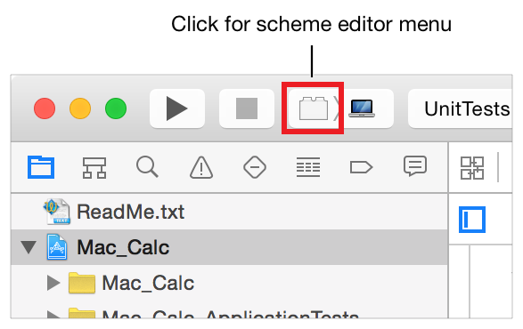
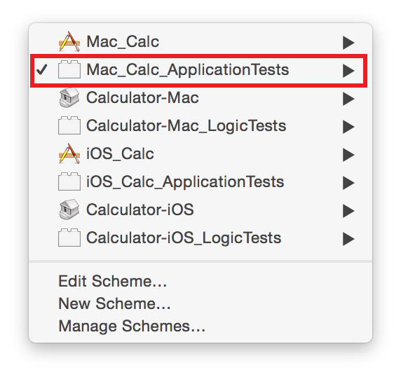
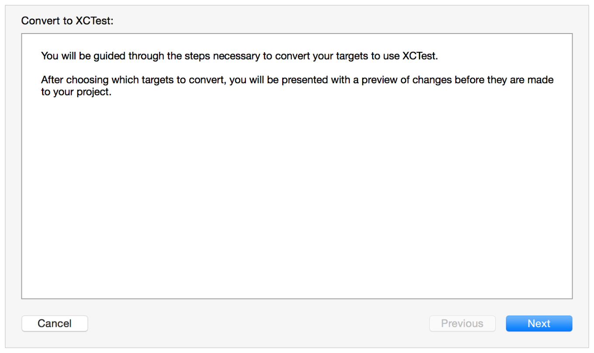
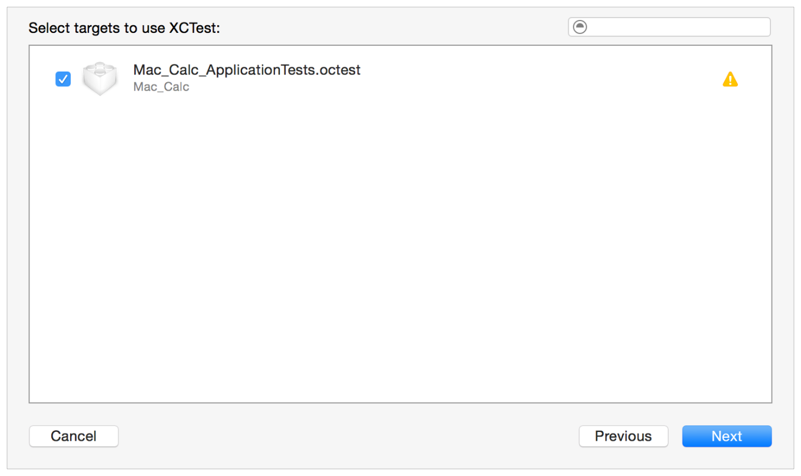
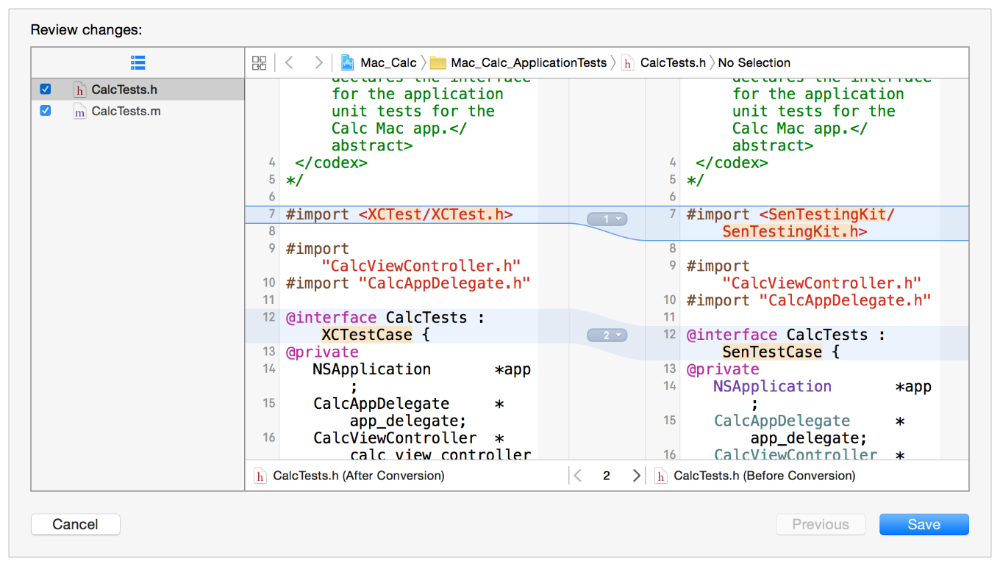

> 导航：[总目录](../../../README.md) · [documentation](../../../_indexes/documentation.md) · [Testing with Xcode](About%20Testing%20with%20Xcode.md)

[Next](Document%20Revision%20History.md)[Previous](Appendix%20A-%20Writing%20Testable%20Code.md)

# Appendix B: Transitioning from OCUnit to XCTest

XCTest is the testing framework introduced with Xcode 5. Some older projects may still be using OCUnit, the previous-generation testing framework. Updating your projects to use XCTest enables you to take advantage of all the new features and capabilities that XCTest provides.

Converting from OCUnit to XCTest is a complex operation that includes updating source files that include test classes and revising project settings. Xcode includes a migrator to implement these changes for you, found by choosing Edit > Convert > To XCTest.

The Convert OCUnit to XCTest migrator works on the targets in the current scheme. The migrator examines the selected targets and suggests a set of source changes for the automatic conversion.

To update a project from OCUnit to XCTest:

1. Select a scheme that builds a test target using the scheme menu.

   For example, in this older workspace there are calculator projects for both macOS and iOS, and tests based on OCUnit. Using the scheme editor menu on the toolbar:

   

   In the menu that appears, pick the scheme that builds the `Mac_Calc_ApplicationTests` target in order to make it the active scheme.

   
2. Choose Edit > Convert > To XCTest

   
3. Click Next to move to the next sheet.
4. In the sheet that appears, select the test targets to convert.

   

   To see whether or not a particular target will build with XCTest after conversion, click its name.
5. Click the Next button.

   The assistant presents a FileMerge interface where you can evaluate the source changes on a file-by-file basis.

   

   The updated source file is on the left, and the original is on the right. You can scan through all the potential changes and discard the ones you feel are questionable.
6. After you’re satisfied that all the changes are valid, click the Save button.

   Xcode writes the changes to the files.

When the conversion has been completed, run the test target and check its outputs to be sure that the tests behave as expected. If any problems arise, see the [Debugging Tests](Debugging%20Tests.md#apple-f4xwc4dqnrsv64tfmyxwi33df52wszbpkridimbqge2dcmzsfvbuqnrnknltc) chapter to determine what to do.

If the OCUnit to XCTest migrator fails to convert your project, or if you are working with Xcode 8 or later, you can still migrate your project manually with the following procedure:

1. Add a new XCTest test target to the project.
2. Add the implementation files for your test classes and methods to the new test target.
3. Edit your test classes to `#import <XCTest/XCTest.h>` and use XCTest assertions in your test methods.

Using this methodology ensures that the project settings are properly configured for the XCTest test target. As when using the migrator, run the test target and check its outputs when you’ve completed the conversion to be sure that the tests behave as expected. If any problems arise, see the [Debugging Tests](Debugging%20Tests.md#apple-f4xwc4dqnrsv64tfmyxwi33df52wszbpkridimbqge2dcmzsfvbuqnrnknltc) chapter to determine what to do.

[Next](Document%20Revision%20History.md)[Previous](Appendix%20A-%20Writing%20Testable%20Code.md)

