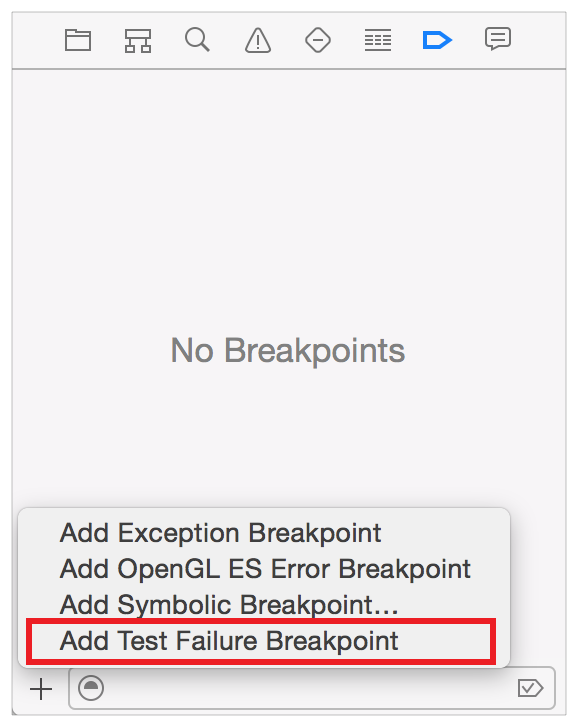
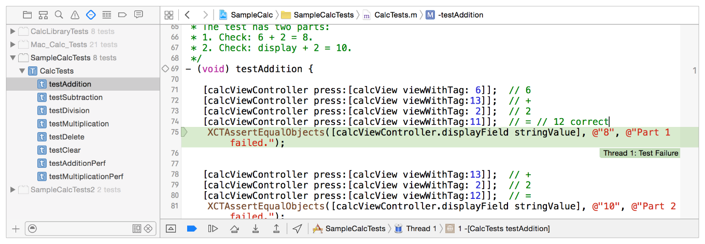
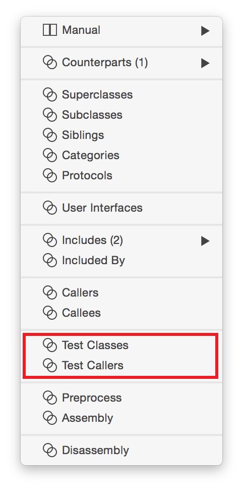

> 导航：[总目录](../../../README.md) · [documentation](../../../_indexes/documentation.md) · [Testing with Xcode](About%20Testing%20with%20Xcode.md)

[Next](https://developer.apple.com/library/archive/documentation/DeveloperTools/Conceptual/testing_with_xcode/chapters/07-code_coverage.html)[Previous](Running%20Tests%20and%20Viewing%20Results.md)

# Debugging Tests

All of the standard Xcode debugging tools can be used when executing tests.

The first thing to determine is whether the problem causing the failure is a bug in the code that you are testing or a bug in the test method that is executing. Test failures could point to several different kinds of issues—with either your assumptions, the requirements for the code that is being tested, or the test code itself—so debugging tests can span several different workflows. However, your test methods are typically relatively small and straightforward, so it’s probably best to examine first what the test is intended to do and how it is implemented.

Here are some common issues to keep in mind:

- Is the logic of the test correct? Is the implementation correct?

  It’s always a good idea to check for typos and incorrect literal values that you might be using as the reference standard that the test method is using as a basis of comparison.
- What are the assumptions?

  For example, you might be using the wrong data type in the test method, creating a range error for the code you’re testing.
- Are you using the correct assertion to report the pass/fail status?

  For example, perhaps the condition of the test needs `XTCAssertTrue` rather than `XCTAssertFalse`. It’s sometimes easy to make this error.

Presuming that your test assumptions are correct and the test method is correctly formed, the problem then has to be in the code being tested. It’s time to locate and fix it.

Xcode has a few special tools designed specifically to aid you in locating and debugging code when using tests.

In the breakpoint navigator, click the Add button (+) and choose Add Test Failure Breakpoint to set a special breakpoint before starting a test run.

This breakpoint stops the test run when a test method posts a failure assertion. This gives you the opportunity to find the location where a problem exists quickly by stopping execution right after the point of failure in the test code. You can see in this view of the `testAddition` test method that the comparison string has been forced to assert a failure by setting the reference standard for comparison to the wrong string. The test failure breakpoint detected the failure assertion and stopped test execution at this point.

When a test run stops like this, you stop execution of the test. Then set a regular breakpoint before the assertion, run the test again (for convenience and time savings, you can use the Run button in the source editor gutter to run just this test), and carry on with debugging operations to fix the problem.

Debugging test methods is a good time to remember the menu commands Project > Perform Action > Test Again and Project > Perform Action > Test. They provide a convenient way to rerun the last test method if you are editing code that is being fixed after a failure or to run the current test method you are working on. For details, see [Using the Product Menu](Running%20Tests%20and%20Viewing%20Results.md#apple-f4xwc4dqnrsv64tfmyxwi33df52wszbpkridimbqge2dcmzsfvbuqnjnknltq). Of course, you can always run tests by using the Run button in the test navigator or in the source editor gutter, whichever you find more convenient.

Two specialized categories have been added to the assistant editor categories to work specifically with tests.

- __Test Callers category.__ If you’ve just fixed a method in your app that caused a test failure, you might want to check to see whether the method is called in any other tests and whether they continue to run successfully. With the method in question in the source editor, open the assistant editor and choose the Test Classes category from the menu. A pop-up menu will allow you to navigate to any test methods that call it so you can run them and be sure that no regressions have been created by your fix.
- __Test Classes category.__ This assistant editor category is similar to Test Callers but shows a list of classes which have test methods in them that refer to the class you are editing in the primary source editor. It’s a good way to identify opportunities for adding tests, for example, to new methods you haven’t yet incorporated into test methods that call them just yet.

Typically, an exception will stop test execution when caught by an exception breakpoint, so tests are normally run with exception breakpoints disabled in order that you locate inappropriately thrown breakpoints when they’re triggered. You enable exception breakpoints when you’re homing in a specific problem and want to stop tests to correct it.

[Next](https://developer.apple.com/library/archive/documentation/DeveloperTools/Conceptual/testing_with_xcode/chapters/07-code_coverage.html)[Previous](Running%20Tests%20and%20Viewing%20Results.md)

