> 导航：[总目录](../../../README.md) · [documentation](../../../_indexes/documentation.md) · [Testing with Xcode](About%20Testing%20with%20Xcode.md)


[Next](Testing%20Basics.md)[Previous](About%20Testing%20with%20Xcode.md)

# Quick Start

The intent of this quick start is to show that you can make testing an integral part of your software development, and that testing is convenient and easy to work with.

You’ll use the Xcode test navigator often when you are working with tests.

The test navigator is the part of the workspace designed to ease your ability to create, manage, run, and review tests. You access it by clicking its icon in the navigator selector bar, located between the issue navigator and the debug navigator. When you have a project with a suite of tests defined, you see a navigator view similar to the one shown here.

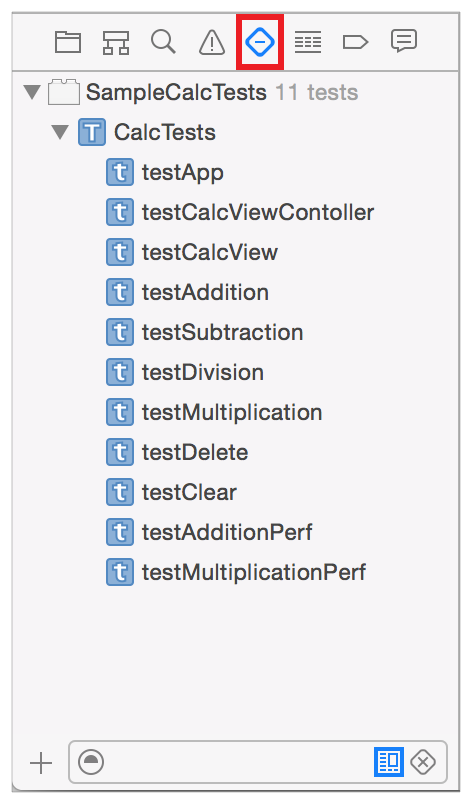

The test navigator shown above displays a hierarchical list of the test bundles, classes, and methods included in a sample project. This particular project is a sample calculator app. The calculator engine is implemented as a framework. You can see at the top level of the hierarchy the `SampleCalcTests` test bundle, for testing the code in the application.

The active test bundle in this view is `SampleCalcTests`. `SampleCalcTests` includes one test class, which in turn contains nine test methods. The Run button () appears to the right of the item name when you hold the pointer over any item in the list. This is a quick way to run all the tests in a bundle, all the tests in the class, or any individual test. Tests return pass or fail results to Xcode. As tests are being executed, these indicators update to show you the results, a green checkmark for pass or a red x for fail. In the test navigator shown here, two of the tests have asserted a failure.

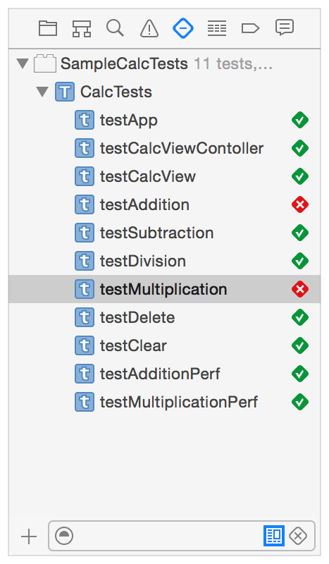

Clicking any test class or test method in the list opens the test class in the source editor. Test classes and test methods are marked in the source editor gutter with indicators as well, which work in the same way that they do in the test navigator. Test failures display the result string at the associated assertions in the source editor.

At the bottom of the test navigator is the Add button (+) as well as filtering controls. You can narrow the view to just tests in the active scheme or just failed tests, and you can also filter by name.

New app, framework, and library projects created in Xcode 5 or later are preconfigured with a test target. When you start with a new project and open the test navigator, you see a test bundle, a test class, and a template test method. But you might be opening a preexisting project from an earlier version of Xcode that has no test targets defined yet. The workflow presented here assumes a preexisting project with no tests incorporated.

With the test navigator open, click the Add button (+) in the bottom-left corner and choose New Unit Test Target from the menu.

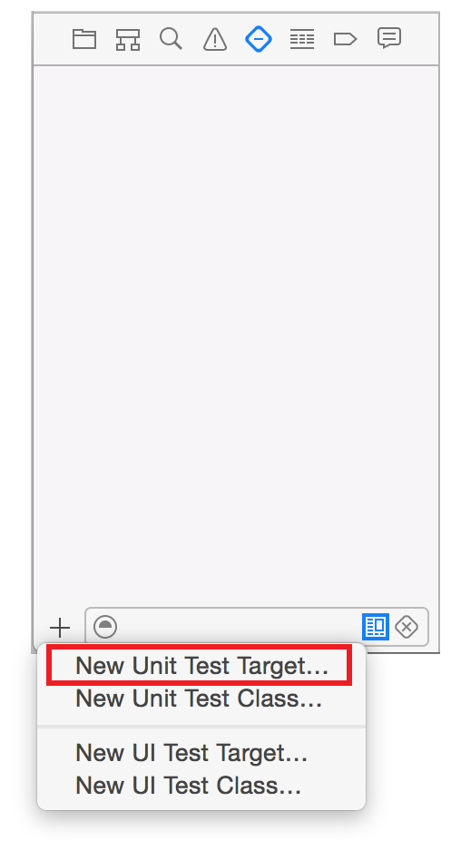

Pick the macOS or iOS Unit Testing Bundle from the next dialog and click Next. In the new target setup assistant that appears, edit the Product Name and other parameters to your preferences and needs.

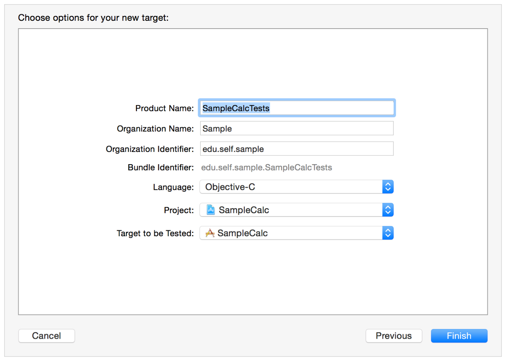

Click Finish to add your target, which contains a template test class and two test method templates, to the test navigator view.

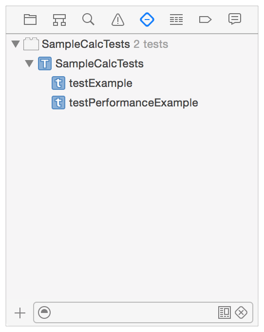

Now that you’ve added testing to your project, you want to develop the tests to do something useful. But first, hold the pointer over the `SampleCalcTests` test class in the test navigator and click the Run button to run all the test methods in the class. The results are indicated by the green checkmarks next to the function names and in the source editor gutter.

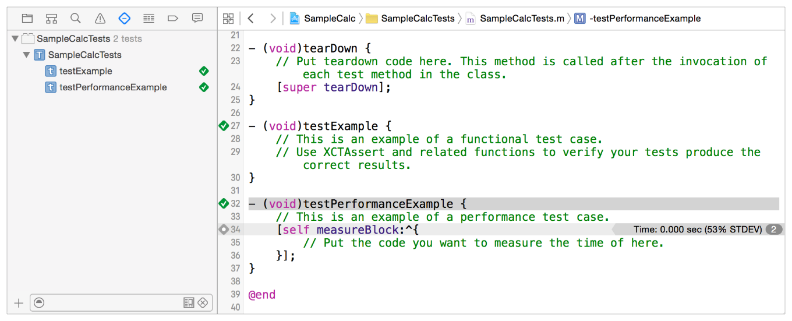

The template unit and performance tests are both empty, which is why they post success indications; no failure was asserted. Notice the gray diamond on line 34 in the figure at the `measureBlock:` method. Clicking this diamond displays the Performance Result panel.

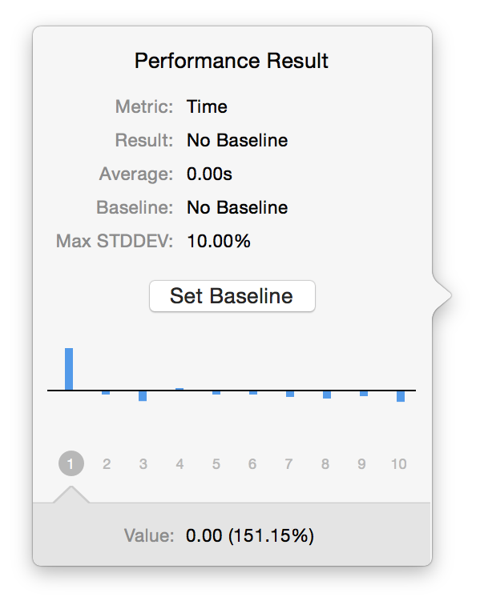

This panel allows you to set a performance baseline as well as edit the baseline and Max STDDEV parameters. These features will be discussed later.

Because this sample project is a calculator app, you want to check whether it performs the operations of addition, subtraction, multiplication, and division correctly, as well as test other calculator functions. Because tests are built in the app project, you can add all the context and other information needed to perform tests at whatever level of complexity makes sense for your needs. Creating tests is a matter of adding methods to the unit tests implementation file.

For example, you insert the following `#import` and instance variable declarations into the `SampleCalcTests.m` file.

```objc
#import <XCTest/XCTest.h>
//
// Import the application specific header files
#import "CalcViewController.h"
#import "CalcAppDelegate.h"

@interface CalcTests : XCTestCase {
// add instance variables to the CalcTests class
@private
    NSApplication       *app;
    CalcAppDelegate     *appDelegate;
    CalcViewController  *calcViewController;
    NSView              *calcView;
}
@end
```

Then give the test method a descriptive name, such as `testAddition`, and add the implementation source for the method.

```objc
- (void) testAddition
{
   // obtain the app variables for test access
   app                  = [NSApplication sharedApplication];
   calcViewController   = (CalcViewController*)[[NSApplication sharedApplication] delegate];
   calcView             = calcViewController.view;

   // perform two addition tests
   [calcViewController press:[calcView viewWithTag: 6]];  // 6
   [calcViewController press:[calcView viewWithTag:13]];  // +
   [calcViewController press:[calcView viewWithTag: 2]];  // 2
   [calcViewController press:[calcView viewWithTag:12]];  // =
    XCTAssertEqualObjects([calcViewController.displayField stringValue], @"8", @"Part 1 failed.");

   [calcViewController press:[calcView viewWithTag:13]];  // +
   [calcViewController press:[calcView viewWithTag: 2]];  // 2
   [calcViewController press:[calcView viewWithTag:12]];  // =
    XCTAssertEqualObjects([calcViewController.displayField stringValue], @"10", @"Part 2 failed.");
}
```

Notice that the list in the test navigator changed to reflect that the sample test method, `testExample`, has been replaced by `testAddition`.

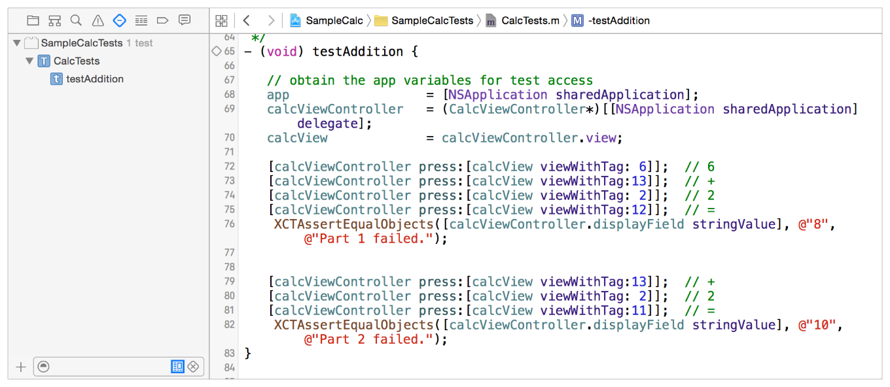

Now use the Run button in the test navigator (or the indicator in the source editor) to run the `testAddition` method.

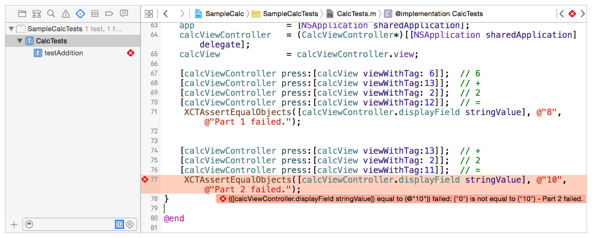

As you can see, an assertion failed and is highlighted in the test navigator and the source editor. Looking at the source, Part 1 succeeded—it is Part 2 that has a problem. On closer examination, the error is obvious: In line 76, `[calcView viewWithTag:11]` is off by one, it should be `[calcView viewWithTag:12]`. Correcting this error fixes the problem and the test succeeds.

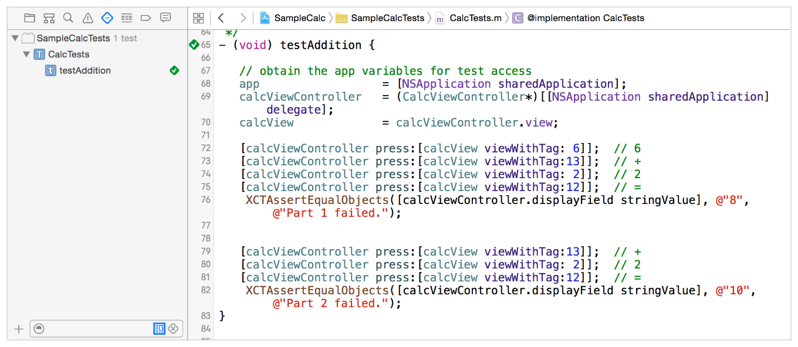

Xcode runs test methods one at a time for all the test classes in the active test bundle. In this small example only the one test method was implemented in the test class, and it needed access to three of the calculator app variable objects to function. If you wrote four or five test methods in this same class, you might find yourself repeating the same code in every test method to obtain access to the app object state. The XCTest framework provides you with instance methods for test classes, `setUp` and `tearDown`, which you can use to put such common code called before and after runs each test method runs.

Using `setUp` and `tearDown` is simple. From the `testAddition` source in `Mac_Calc_Tests.m`, cut the four lines starting with `// obtain the app variable for test access` and paste them into the default `setUp` instance method provided by the template.

```objc
- (void)setUp
{
    [super setUp];
    // Put setup code here. This method is called before the invocation of each test method in the class.

   // obtain the app variables for test access
   app                  = [NSApplication sharedApplication];
   calcViewController   = (CalcViewController*)[[NSApplication sharedApplication] delegate];
   calcView             = calcViewController.view;
}
```

Now add more test methods—`testSubtraction` and others—with minimal duplicated code.

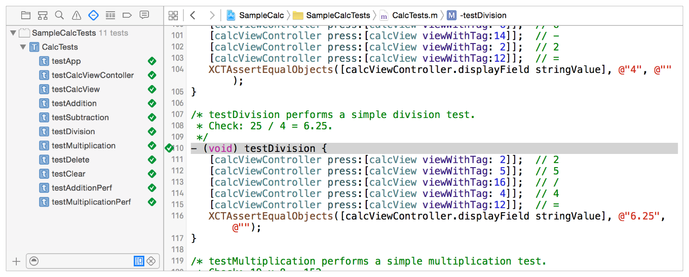

As you can see from this short Quick Start, it is simple to add testing to a project. Here are some things to notice:

- Xcode sets up most of the basic testing configuration. When you add a new test target to a project, Xcode automatically adds it to the scheme for its associated product target. An initial test class with a single test method is added with the target, and can be found in the test navigator.
- The test navigator lets you locate and edit test methods easily. You can run tests immediately using the indicator buttons in the test navigator or directly from the source editor when a test class implementation is open. When a test fails, indicators in the test navigator are paired with failure markers in the source editor.
- A single test method can include multiple assertions, resulting in a single pass or fail result. This approach enables you to create simple or very complex tests depending on your project’s needs.
- The `setup` and `tearDown` instance methods provide you with a way to factor common code used in many test methods for greater consistency and easier debugging.

[Next](Testing%20Basics.md)[Previous](About%20Testing%20with%20Xcode.md)

