> 导航：[总目录](../../../README.md) · [documentation](../../../_indexes/documentation.md) · [Testing with Xcode](About%20Testing%20with%20Xcode.md)

[Next](Debugging%20Tests.md)[Previous](Writing%20Test%20Classes%20and%20Methods.md)

# Running Tests and Viewing Results

Running tests and viewing the results is easy to do using the Xcode test navigator, as you saw in [Quick Start](Quick%20Start.md#apple-f4xwc4dqnrsv64tfmyxwi33df52wszbpkridimbqge2dcmzsfvbuqmrnknltc). There are several additional interactive ways to run tests. Xcode runs tests based on what test targets are included and enabled in a scheme. The test navigator allows you to directly control which test targets, classes, and methods are included, enabled, or disabled in a scheme without having to use the scheme editor.

The test navigator provides you an easy way to run tests as part of your programming workflow. Tests can also be run either directly from the source editor or using the Product menu.

When you hold the pointer over a bundle, class, or method name in the test navigator, a Run button appears. You can run one test, all the tests in a class, or all the tests in a bundle depending on where you hold the pointer in the test navigator list.

- To run all tests in a bundle, hold the pointer over the test bundle name and click the Run button that appears on the right.

  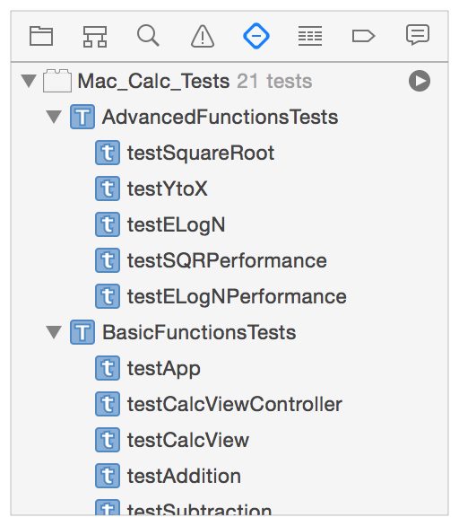
- To run all tests in a class, hold the pointer over the class name and click the Run button that appears on the right.

  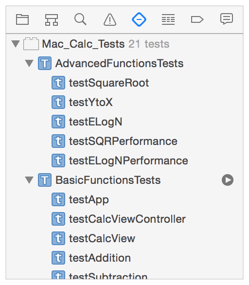
- To run a single test, hold the pointer over the test name and click the Run button that appears on the right.

  

When you have a test class open in the source editor, a clear indicator appears in the gutter next to each test method name. Holding the pointer over the indicator displays a Run button. Clicking the Run button runs the test method, and the indicator then displays the pass or fail status of a test. Holding the pointer over the indicator will again display the Run button to repeat the test. This mechanism always runs just the one test at a time.

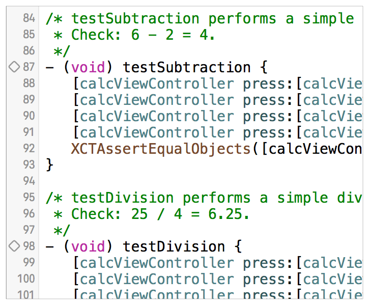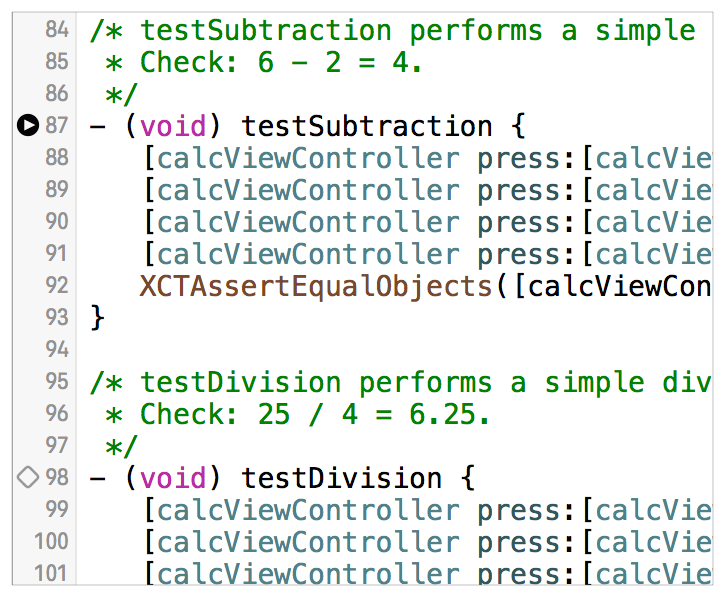

The Product menu includes quickly accessible commands to run tests directly from the keyboard.

- __Product > Test.__ Runs the currently active scheme. The keyboard shortcut is Command-U.
- __Product > Build for > Testing__ and __Product > Perform Action > Test without Building.__ These two commands can be used to build the test bundle products and run the tests independent of one another. These are convenience commands to shortcut the build and test processes. They’re most useful when changing code to check for warnings and errors in the build process, and for speeding up testing when you know the build is up to date. The keyboard shortcuts are Shift-Command-U and Control-Command-U, respectively.
- __Product > Perform Action > Test <testName>.__ This dynamic menu item senses the current test method in which the editing insertion point is positioned when you’re editing a test method and allows you to run that test with a keyboard shortcut. The command’s name adapts to show the test it will run, for instance, Product > Perform Action > Test _testAddition._ The keyboard shortcut is Control-Option-Command-U.
- __Product > Perform Action > Test Again <testName>.__ Reruns the last test method executed, most useful when debugging/editing code in which a test method exposed a problem. Like the Product > Perform Action > Test command, the name of the test that is run appears in the command, for example, Product > Perform Action > Test Again _testAddition._ The keyboard shortcut is Control-Option-Command-G.

The XCTest framework displays the pass or fail results of a test method to Xcode in several ways. The following screenshots show where you can see the results.

- In the test navigator, you can view pass/fail indicators after a test or group of tests is run.

  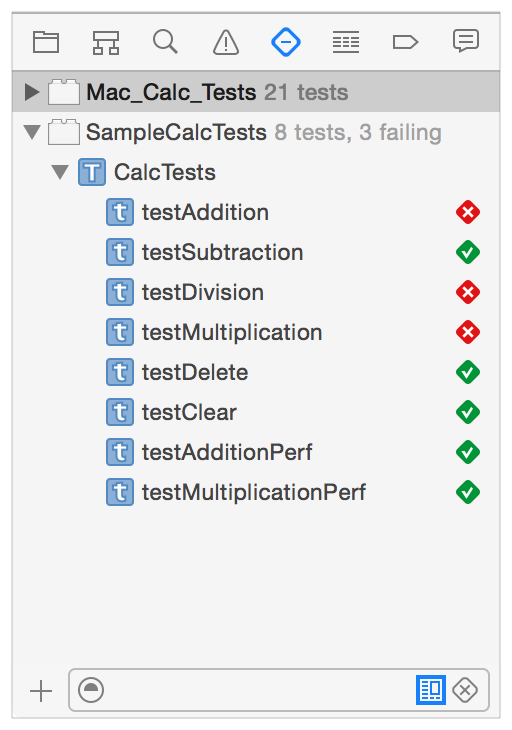

  If test methods are collapsed into their respective class, or test classes into the test bundles, the indicator reflects the aggregate status of the enclosed tests. In this example, at least one of the tests in the `BasicFunctionsTests` class has signaled a failure.

  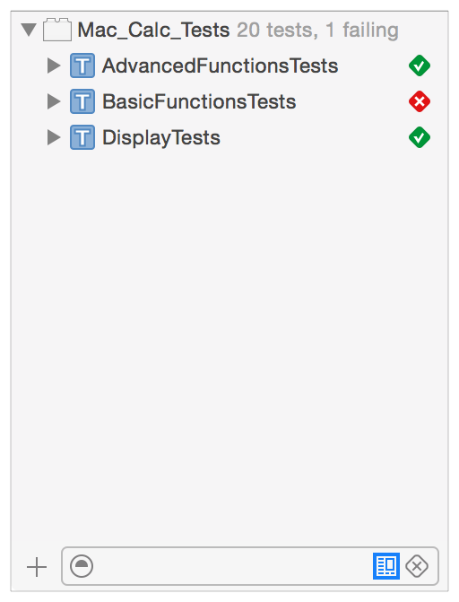
- In the source editor, you can view pass/fail indicators and debugging information.

  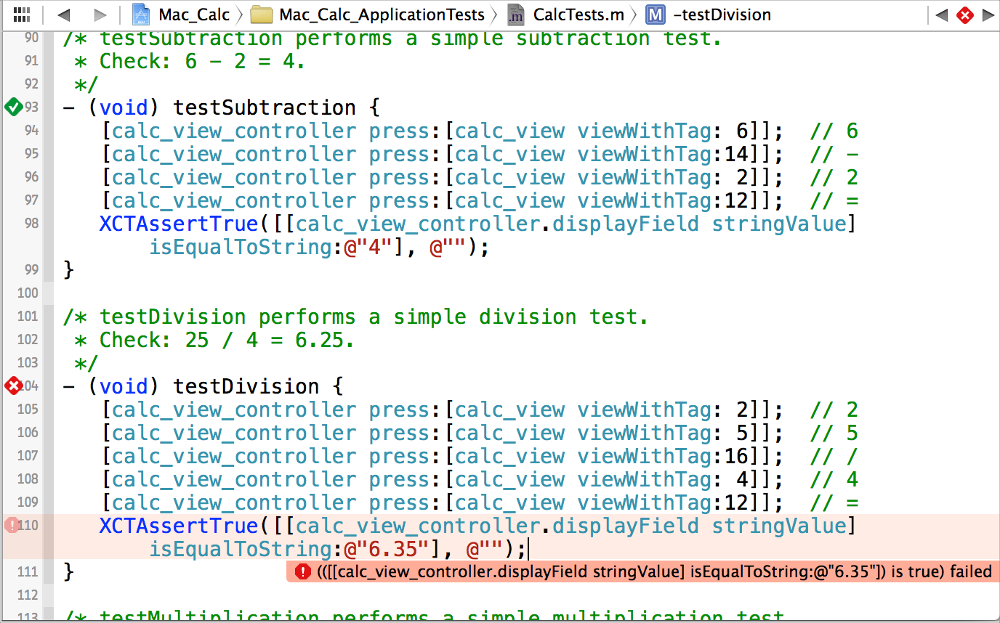
- In the reports navigator, you can view results output by test runs. With the Tests panel active, select the test run you wish to inspect in the left hand panel. .

  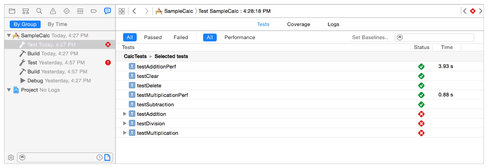

  For a performance test, click the value in the Time column to obtain a detailed report on the performance result. You can see the aggregate performance of the test as well as values for each of the ten runs by clicking the individual test run buttons. The Edit button enables you to set or modify the test baseline and the max standard deviation allowed in the indication of pass or fail.

  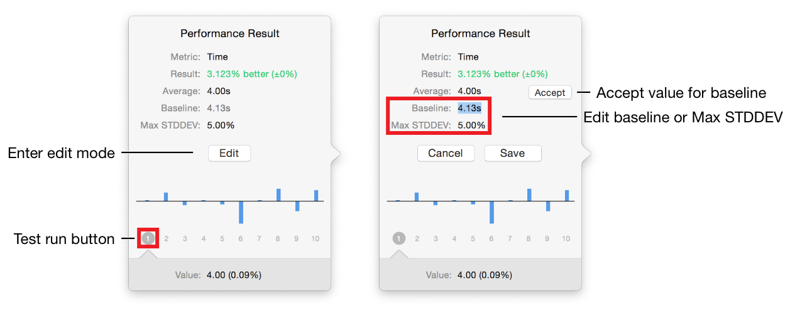

  Using the Logs panel, you can view the associated failure description string and other summary output. By opening the disclosure triangles, you can drill down to all the details of the test run.

  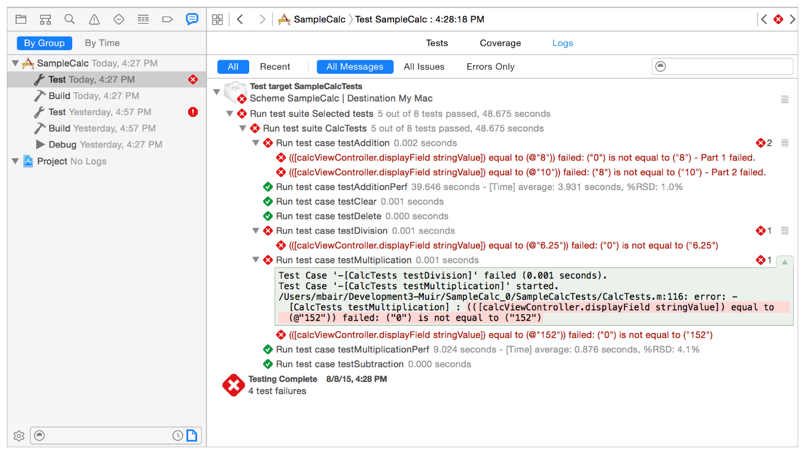
- The debug console displays comprehensive information about the test run in a textual format. It’s the same information as shown by the log navigator, but if you have been actively engaged in debugging, any output from the debugging session also appears there.

  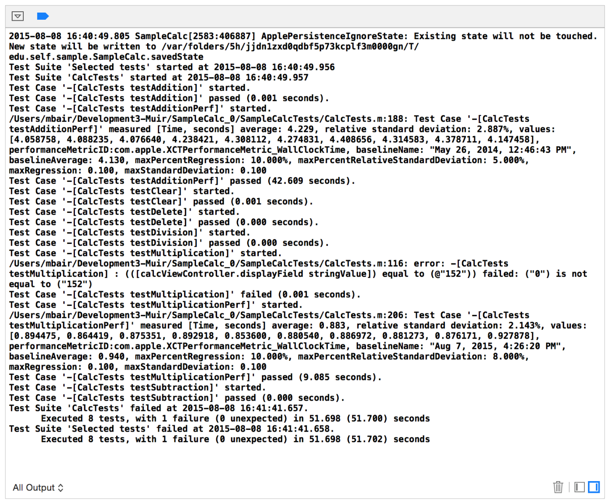

Xcode schemes control what the Build, Run, Test, and Debug menu commands do. Xcode manages the scheme configuration for you when you create test targets and perform other test system manipulations with the test navigator—for example, when you enable or disable a test method, test class, or test bundle. Using Xcode Server and continuous integration requires a scheme to be set to Shared using the checkbox in the Manage Schemes sheet, and checked into a source repository along with your project and source code.

To see the scheme configuration for your tests:

1. Choose the Scheme menu > Manage Schemes in the toolbar to present the scheme management sheet.

   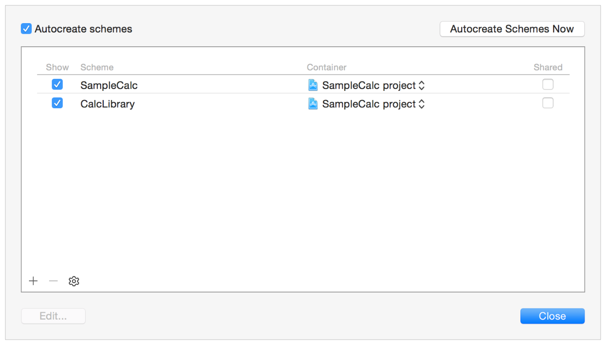

   In this project there are two schemes, one to build the app and the other to build the library/framework. The checkboxes labeled Shared on the right configure a scheme as shared and available for use by bots with Xcode Server.
2. In the management sheet, double-click a scheme to display the scheme editor. A scheme’s Test action identifies the tests Xcode performs when you execute the Test command.

   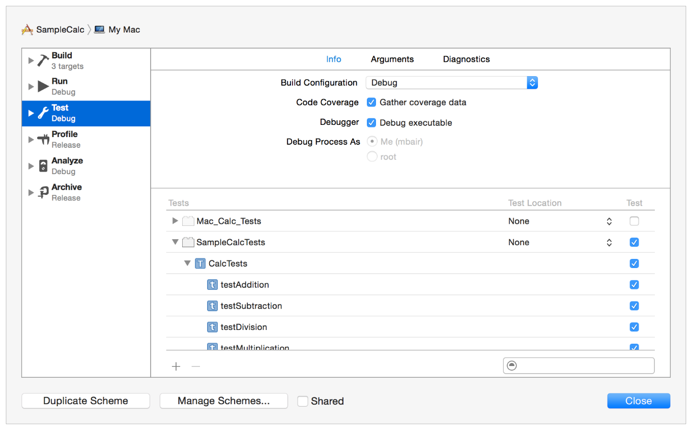

Extensive information about using, configuring, and editing schemes is available in the video presentation [WWDC 2012: Working with Schemes and Projects in Xcode (408)](https://developer.apple.com/videos/wwdc/2012/?id=408).

App tests run in the context of your app, allowing you to create tests which combine behavior that comes from the different classes, libraries/frameworks, and functional aspects of your app. Library tests exercise the classes and methods within a library or framework, independent of your app, to validate that they behave as the library’s specification requires.

Different build settings are required for these two types of test bundles. Configuring the build settings is performed for you when you create test targets by choosing the target parameter in the new target assistant. The target assistant is shown with the Target pop-up menu open. The app, `SampleCalc`, and the library/framework, `CalcLibrary`, are the available choices.

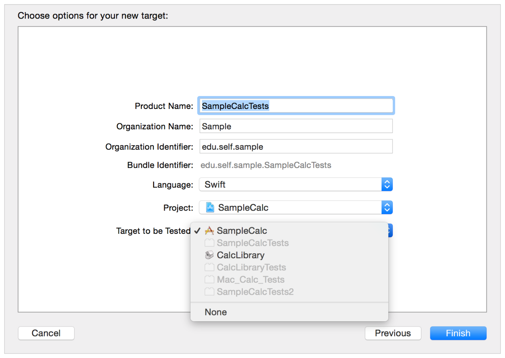

Choosing `SampleCalc` as the associated build product for this test target configures the build settings to be for an app test. The app process hosts the execution of your tests; tests are executed after receiving the `applicationDidFinishLaunching` notification. The default Product Name, “SampleCalc Tests,” for the test target is derived from the `SampleCalc` target name in this case; you can change that to suit your preferences.

If you choose `CalcLibrary` as the associated build product instead, the target assistant configures the build settings for a library test. Xcode bootstraps the testing runtime context, the library or framework, and your test code is hosted by a process managed by Xcode. The default Product Name for this case is derived from the library target (“CalcLibrary Tests”). You can change it to suit your preferences just as with the app test case.

For most situations, choosing the correct test target to build product association is all you need to do to configure build settings for app and library tests. Xcode takes care of managing the build settings for you automatically. Because you might have a project that requires some complex build settings, it is useful to understand the standard build settings that Xcode sets up for app tests and library tests.

The `SampleCalc` project serves as an example to illustrate the correct default settings.

1. Enter the project editor by clicking the `SampleCalc` project in the project navigator, then select the `SampleCalcTests` app test target.

   In the General pane in the editor, a Target pop-up menu is displayed. The pop-up menu should show the `SampleCalc` app as target.

   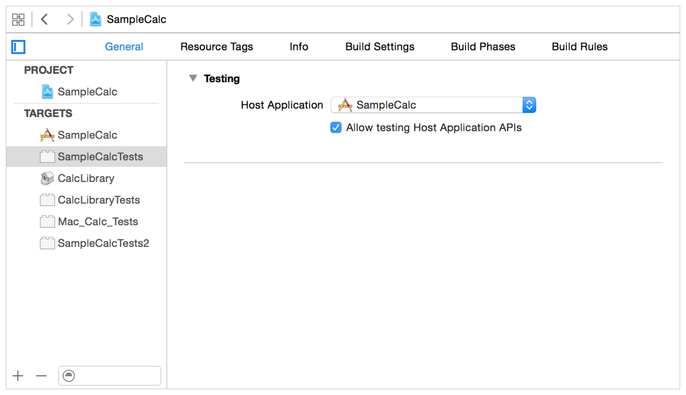

   You can check that the build settings are correct for the `SampleCalcTests` target.
2. Click Build Settings, then type `Bundle Loader` in the search field. The app tests for `SampleCalc` are loaded by the the `SampleCalc` app. You’ll see the path to the executable as customized parameters for both Debug and Release builds.

   The same paths appear if you search for `Test Host`, as shown.

   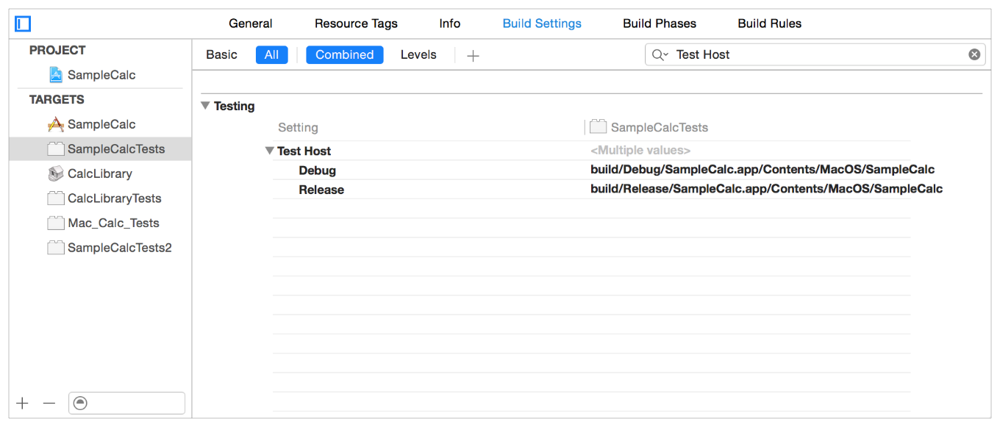

   The calculator library target of this project is named `CalcLibrary` and has an associated test target named `CalcLibraryTests`.
3. Select the `CalcLibraryTests` target and the General pane.

   The target is set to `None`. Similarly checking for `Bundle Loader` and `Test Host` in the Build Settings panel have no associated parameters. This indicates that Xcode has configured them with its defaults, which is the correct configuration.

[Next](Debugging%20Tests.md)[Previous](Writing%20Test%20Classes%20and%20Methods.md)

