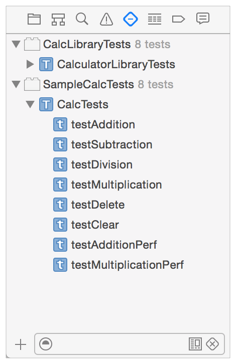
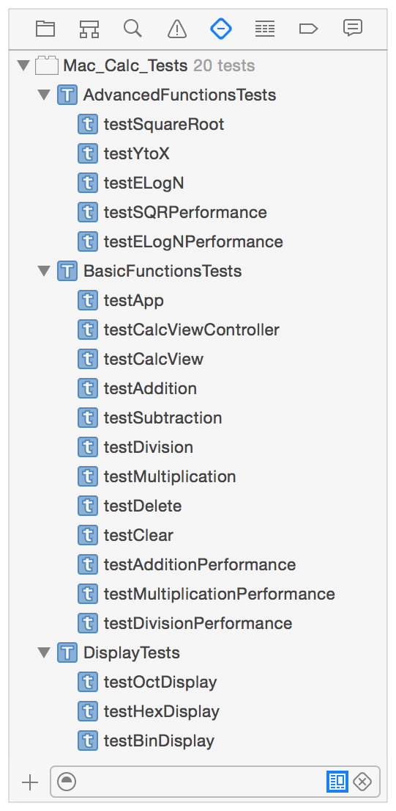
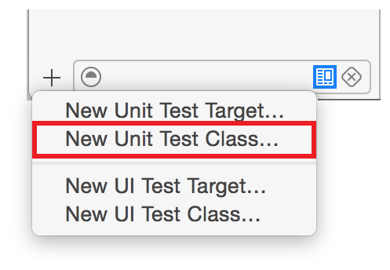
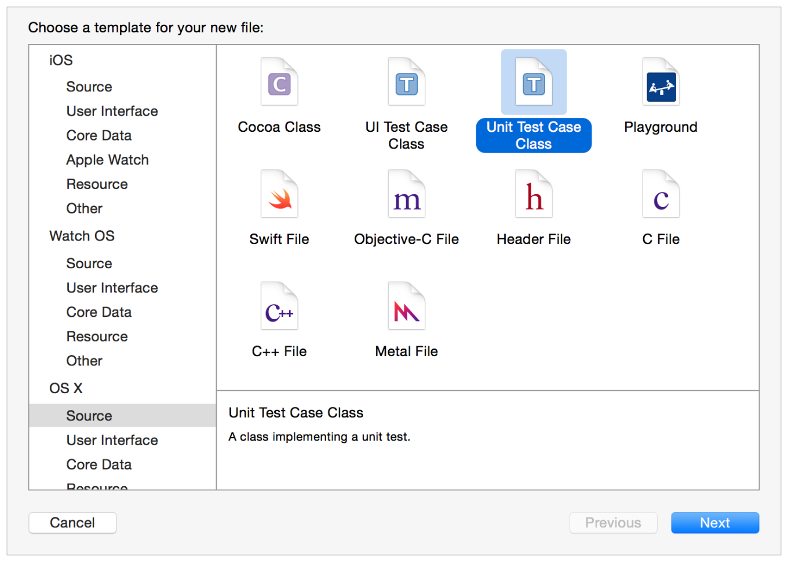
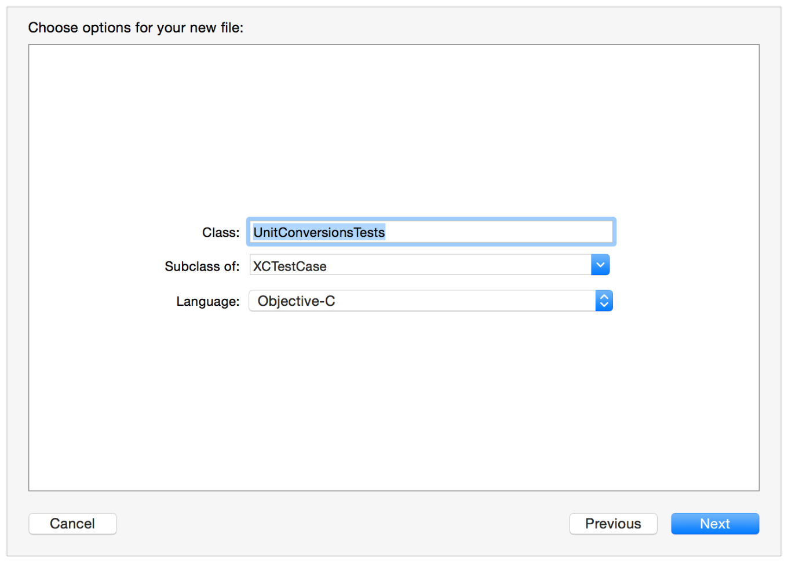
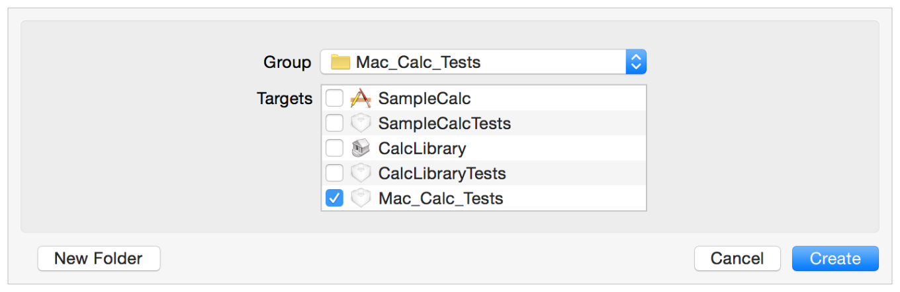
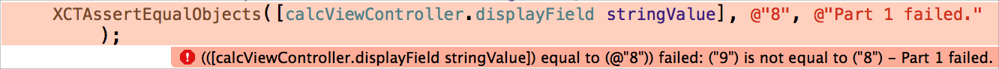

> 导航：[总目录](../../../README.md) · [documentation](../../../_indexes/documentation.md) · [Testing with Xcode](About%20Testing%20with%20Xcode.md)


[Next](Running%20Tests%20and%20Viewing%20Results.md)[Previous](Testing%20Basics.md)

# Writing Test Classes and Methods

When you add a test target to a project with the test navigator, Xcode displays the test classes and methods from that target in the test navigator. In the test target are the test classes containing test methods. This chapter explains how you create test classes and write test methods.

Before looking at creating test classes, it is worth taking another look at the test navigator. Using it is central to creating and working with tests.

Adding a test target to a project creates a test bundle. The test navigator lays out the source code components of all test bundles in the project, displaying the test classes and test methods in a hierarchical list. Here’s a test navigator view for a project that has two test targets, showing the nested hierarchy of test bundles, test classes, and test methods.



Test bundles can contain multiple test classes. You can use test classes to segregate tests into related groups, either for functional or organizational purposes. For example, for the calculator example project you might create `BasicFunctionsTests`, `AdvancedFunctionsTests`, and `DisplayTests` classes, all part of the `Mac_Calc_Tests` test bundle.



Some types of tests might share certain types of setup and teardown requirements, making it sensible to gather those tests together into classes, where a single set of setup and teardown methods can minimize how much code you have to write for each test method.

You use the Add button (+) in the test navigator to create new test classes.



You can choose to add either a Unit Test Class or a UI Test Class. After choosing one of these, Xcode displays a file type selector that has the chosen type of file template selected. A “New Unit Test Class” template is highlighted in the illustration below. Click Next to proceed with your selection.



Each test class you add results in a file named _TestClassName_.m being added to the project, based on the test class name you enter in the configuration sheet.



Although by default Xcode organizes test class implementation files into the group it created for your project’s test targets, you can organize the files in your project however you choose. The standard Xcode Add Files sheet follows this configuration when you press the Next button.



You use the Add Files sheet the same way as when adding new files to the project in the project navigator. For details on how to use the Add Files sheet, see Adding an Existing File or Folder.

Test classes have this basic structure:

```objc
#import <XCTest/XCTest.h>

@interface SampleCalcTests : XCTestCase
@end

@implementation SampleCalcTests

- (void)setUp {
    [super setUp];
    // Put setup code here. This method is called before the invocation of each test method in the class.
}

- (void)tearDown {
    // Put teardown code here. This method is called after the invocation of each test method in the class.
    [super tearDown];
}

- (void)testExample {
    // This is an example of a functional test case.
    // Use XCTAssert and related functions to verify your tests produce the correct results.
}

- (void)testPerformanceExample {
    // This is an example of a performance test case.
    [self measureBlock:^{
        // Put the code you want to measure the time of here.
    }];
}
@end
```

The test class is implemented in Objective-C in this example, but can also be implemented in Swift.

Notice that the implementation contains methods for instance setup and teardown with a basic implementation; these methods are not required. If all of the test methods in a class require the same code, you can customize `setUp` and `tearDown` to include it. The code you add runs before and after each test method runs. You can optionally add customized methods for class setup (`+ (void)setUp`) and teardown (`+ (void)tearDown`) as well, which run before and after all of the test methods in the class.

In the default case when run tests, XCTest finds all the test classes and, for each class, runs all of its test methods. (All test classes inherit from [XCTestCase](https://developer.apple.com/documentation/xctest/xctestcase).)

For each class, testing starts by running the class setup method. For each test method, a new instance of the class is allocated and its instance setup method executed. After that it runs the test method, and after that the instance teardown method. This sequence repeats for all the test methods in the class. After the last test method teardown in the class has been run, Xcode executes the class teardown method and moves on to the next class. This sequence repeats until all the test methods in all test classes have been run.

You add tests to a test class by writing test methods. A test method is an instance method of a test class that begins with the prefix _test_, takes no parameters, and returns `void`, for example, `(void)testColorIsRed()`. A test method exercises code in your project and, if that code does not produce the expected result, reports failures using a set of assertion APIs. For example, a function’s return value might be compared against an expected value or your test might assert that improper use of a method in one of your classes throws an exception. [XCTest Assertions](#apple-f4xwc4dqnrsv64tfmyxwi33df52wszbpkridimbqge2dcmzsfvbuqnbnknltgna) describes these assertions.

For a test method to access the code to be tested, import the corresponding header files into your test class.

When Xcode runs tests, it invokes each test method independently. Therefore, each method must prepare and clean up any auxiliary variables, structures, and objects it needs to interact with the subject API. If this code is common to all test methods in the class, you can add it to the required `setUp` and `tearDown` instance methods described in [Test Class Structure](#apple-f4xwc4dqnrsv64tfmyxwi33df52wszbpkridimbqge2dcmzsfvbuqnbnknlte).

Here is the model of a unit test method:

```objc
- (void)testColorIsRed {
   // Set up, call test subject API. (Code could be shared in setUp method.)
   // Test logic and values, assertions report pass/fail to testing framework.
   // Tear down. (Code could be shared in tearDown method.
}
```

And here is a simple test method example that checks to see whether the `CalcView` instance was successfully created for SampleCalc, the app shown in the [Quick Start](Quick%20Start.md#apple-f4xwc4dqnrsv64tfmyxwi33df52wszbpkridimbqge2dcmzsfvbuqmrnknltc) chapter:

```objc
- (void) testCalcView {
   // setup
   app = [NSApplication sharedApplication];
   calcViewController = (CalcViewController*)[NSApplication sharedApplication] delegate];
   calcView             = calcViewController.view;

   XCTAssertNotNil(calcView, @"Cannot find CalcView instance");
   // no teardown needed
}
```


Tests execute synchronously because each test is invoked independently one after another. But more and more code executes asynchronously. To handle testing components which call asynchronously executing methods and functions, XCTest has been enhanced in Xcode 6 to include the ability to serialize asynchronous execution in the test method, by waiting for the completion of an asynchronous callback or timeout.

A source example:

```objc
// Test that the document is opened. Because opening is asynchronous,
// use XCTestCase's asynchronous APIs to wait until the document has
// finished opening.
- (void)testDocumentOpening
{
    // Create an expectation object.
    // This test only has one, but it's possible to wait on multiple expectations.
    XCTestExpectation *documentOpenExpectation = [self expectationWithDescription:@"document open"];

    NSURL *URL = [[NSBundle bundleForClass:[self class]]
                              URLForResource:@"TestDocument" withExtension:@"mydoc"];
    UIDocument *doc = [[UIDocument alloc] initWithFileURL:URL];
    [doc openWithCompletionHandler:^(BOOL success) {
        XCTAssert(success);
        // Possibly assert other things here about the document after it has opened...

        // Fulfill the expectation-this will cause -waitForExpectation
        // to invoke its completion handler and then return.
        [documentOpenExpectation fulfill];
    }];

    // The test will pause here, running the run loop, until the timeout is hit
    // or all expectations are fulfilled.
    [self waitForExpectationsWithTimeout:1 handler:^(NSError *error) {
        [doc closeWithCompletionHandler:nil];
    }];
}
```

For more details on writing methods for asynchronous operations, see the [XCTestExpectation](https://developer.apple.com/documentation/xctest/xctestexpectation) reference documentation.

A performance test takes a block of code that you want to evaluate and runs it ten times, collecting the average execution time and the standard deviation for the runs. The averaging of these individual measurements form a value for the test run that can then be compared against a baseline to evaluate success or failure.

To implement performance measuring tests, you write methods using new API from XCTest in Xcode 6 and later.

```objc
- (void)testPerformanceExample {
    // This is an example of a performance test case.
    [self measureBlock:^{
        // Put the code you want to measure the time of here.
    }];
}
```

The following simple example shows a performance test written to test addition speed with the calculator sample app. A `measureBlock:` is added along with an iteration for XCTest to time.

```objc
- (void) testAdditionPerformance {
    [self measureBlock:^{
        // set the initial state
        [calcViewController press:[calcView viewWithTag: 6]];  // 6
        // iterate for 100000 cycles of adding 2
        for (int i=0; i<100000; i++) {
           [calcViewController press:[calcView viewWithTag:13]];  // +
           [calcViewController press:[calcView viewWithTag: 2]];  // 2
           [calcViewController press:[calcView viewWithTag:12]];  // =
        }
    }];
}
```

Performance tests, once run, provide information in the source editor when viewing the implementation file, in the test navigator, and in the reports navigator. Clicking on the information presents individual run values. The results display includes controls to set the results as the baseline for future runs of the tests. Baselines are stored per-device-configuration, so you can have the same test executing on several different devices and have each maintain a different baseline dependent upon the specific configuration’s processor speed, memory, and so forth.

For more details on writing methods for performance measuring tests, see the [XCTestCase](https://developer.apple.com/documentation/xctest/xctestcase) reference documentation.

Creating UI tests with XCTest is an extension of the same programming model as creating unit tests. Similar operations and programming methodology is used overall. The differences in workflow and implementation are focused around using UI recording and the XCTest UI testing APIs, described in [User Interface Testing](User%20Interface%20Testing.md#apple-f4xwc4dqnrsv64tfmyxwi33df52wszbpkridimbqge2dcmzsfvbuqmjtfvjvomi).

The Swift access control model, as described in the Access Control section of _The Swift Programming Language (Swift 3.0.1)_, prevents an external entity from accessing anything declared as internal in an app or framework. By default, to be able to access these items from your test code, you would need to elevate their access level to at least public, reducing the benefits of Swift’s type safety.

Xcode provides a two-part solution to this problem:

1. When you set the `Enable Testability` build setting to `Yes`, which is true by default for test builds in new projects, Xcode includes the `-enable-testing` flag during compilation. This makes the Swift entities declared in the compiled module eligible for a higher level of access.
2. When you add the `@testable` attribute to an import statement for a module compiled with testing enabled, you activate the elevated access for that module in that scope. Classes and class members marked as internal or public behave as if they were marked open. Other entities marked as internal act as if they were declared public.

Notice that you don’t change your source code in any way. You modify only the compilation (by throwing a flag) and the test code (by modifying an import statement). For example, consider a Swift module like this `AppDelegate` implementation for an app named “MySwiftApp.”

```swift
import Cocoa
@NSApplicationMain
class AppDelegate: NSObject, NSApplicationDelegate {
    @IBOutlet weak var window: NSWindow!
    func foo() {
        println("Hello, World!")
    }
}
```

To write a test class that allows access to the `AppDelegate` class, you modify the `import` statement in your test code with the `@testable` attribute, as follows:

```swift
// Importing XCTest because of XCTestCase
import XCTest

// Importing AppKit because of NSApplication
import AppKit

// Importing MySwiftApp because of AppDelegate
@testable import MySwiftApp

class MySwiftAppTests: XCTestCase {
    func testExample() {
        let appDelegate = NSApplication.sharedApplication().delegate as! AppDelegate
        appDelegate.foo()
    }
}
```

With this solution in place, your Swift app code’s internal functions are fully accessible to your test classes and methods. The access granted for `@testable` imports ensures that other, non-testing clients do not violate Swift’s access control rules even when compiling for testing. Further, because your release build does not enable testability, regular consumers of your module (for example if you distribute a framework) can’t gain access to internal entities this way.

Your test methods use assertions provided by the XCTest framework to present test results that Xcode displays. All assertions have a similar form: items to compare or a logical expression, a failure result string format, and the parameters to insert into the string format.

For example, look at this assertion in the `testAddition` method presented in [Quick Start](Quick%20Start.md#apple-f4xwc4dqnrsv64tfmyxwi33df52wszbpkridimbqge2dcmzsfvbuqmrnknltc):

`XCTAssertEqualObjects([calcViewController.displayField stringValue], @"8", @"Part 1 failed.");`

Reading this as plain language, it says _“Indicate a failure when a string created from the value of the controller’s display field is not the same as the reference string ‘8’.”_ Xcode signals with a fail indicator in the test navigator if the assertion fails, and Xcode also displays a failure with the description string in the issues navigator, source editor, and other places. A typical result in the source editor looks like this:



A test method can include multiple assertions. Xcode signals a test method failure if any of the assertions it contains reports a failure.

Assertions fall into five categories:

- __Unconditional Fail.__ Use this when simply reaching a particular branch of code indicates a failure. The only assertion in this category is [XCTFail](https://developer.apple.com/documentation/xctest/xctfail).
- __Equality Tests.__ Use these to assert a relationship between two items. For example, [XCTAssertEqual](https://developer.apple.com/documentation/xctest/xctassertequal) asserts that two expressions have the same value, while [XCTAssertEqualWithAccuracy](https://developer.apple.com/documentation/xctest/xctassertequalwithaccuracy) asserts that two expressions have the same value within a certain accuracy. This category also includes tests for inequality, such as [XCTAssertNotEqual](https://developer.apple.com/documentation/xctest/xctassertnotequal) and [XCTAssertGreaterThan](https://developer.apple.com/documentation/xctest/xctassertgreaterthan).
- __Boolean Tests.__ Use these to assert that a Boolean expression evaluates a certain way, for example using [XCTAssertTrue](https://developer.apple.com/documentation/xctest/xctasserttrue) or [XCTAssertFalse](https://developer.apple.com/documentation/xctest/xctassertfalse).
- __Nil Tests.__ Use these to assert that an item is or is not `nil`, for example using [XCTAssertNil](https://developer.apple.com/documentation/xctest/xctassertnil) or [XCTAssertNotNil](https://developer.apple.com/documentation/xctest/xctassertnotnil).
- __Exception Tests.__ Use these to assert that evaluating an expression generates an exception or not. You look for any exception to be thrown with [XCTAssertThrows](https://developer.apple.com/documentation/xctest/xctassertthrows), or you can look for a specific exception with an assertion like [XCTAssertThrowsSpecific](https://developer.apple.com/documentation/xctest/xctassertthrowsspecific). You can also assert the inverse, that no exception is thrown when evaluating an expression, using a function like [XCTAssertNoThrow](https://developer.apple.com/documentation/xctest/xctassertnothrow).

The [XCTest Framework Reference](https://developer.apple.com/reference/xctest) contains a complete enumeration of all the available assertion functions.

When using XCTest assertions, you should know the fundamental differences in the assertions’ compatibility and behavior when writing Objective-C (and other C-based languages) code and when writing Swift code. Understanding these differences makes writing and debugging your tests easier.

XCTest assertions that perform equality tests are divided between those that compare objects and those that compare nonobjects. For example, [XCTAssertEqualObjects](https://developer.apple.com/documentation/xctest/xctassertequalobjects) tests equality between two expressions that resolve to an object type while [XCTAssertEqual](https://developer.apple.com/documentation/xctest/xctassertequal) tests equality between two expressions that resolve to the value of a scalar type. This difference is marked in the XCTest assertions listing by including “this test is for scalars” in the description. Marking assertions with “scalar” this way informs you of the basic distinction, but it is not an exact description of which expression types are compatible.

- For Objective-C, assertions marked for scalar types can be used with the types that can be used with the equality comparison operators: `==`, `!=`, `<=`, `<`, `>=`, and `>`. If the expression resolves to any C type, struct, or array comparison that works with these operators, it is considered a scalar.
- For Swift, assertions marked for scalars can be used to compare any expression type that conforms to the [Equatable](https://developer.apple.com/documentation/swift/equatable) protocol (for all of the “equal” and “not equal” assertions) and [Comparable](https://developer.apple.com/documentation/swift/comparable) protocol (for the “greater than” and “less than” assertions). In addition, assertions marked for scalars have overrides for `[T]` and for `[K:V]`, where `T`, `K`, and `V` conform to [Equatable](https://developer.apple.com/documentation/swift/equatable) or [Comparable](https://developer.apple.com/documentation/swift/comparable) protocols. For example, arrays of an equatable type are compatible with `XCTAssertEqual(_:_:_:file:line:)`, and dictionaries whose keys and values are both comparable types are compatible with [XCTAssertLessThan(_:_:_:file:line:)](https://developer.apple.com/documentation/xctest/1500384-xctassertlessthan).

Using XCTest assertions in your tests also differs between Objective-C and Swift because of how the languages differ in treating data types and implicit conversions.

- For Objective-C, the use of implicit conversions in the XCTest implementation allows the comparisons to operate independent of the expressions’ data types, and no check is made of the input data types.
- For Swift, implicit conversions are not allowed because Swift is stricter about type safety; both parameters to a comparison must be of the same type. Type mismatches are flagged at compile time and in the source editor.

[Next](Running%20Tests%20and%20Viewing%20Results.md)[Previous](Testing%20Basics.md)

