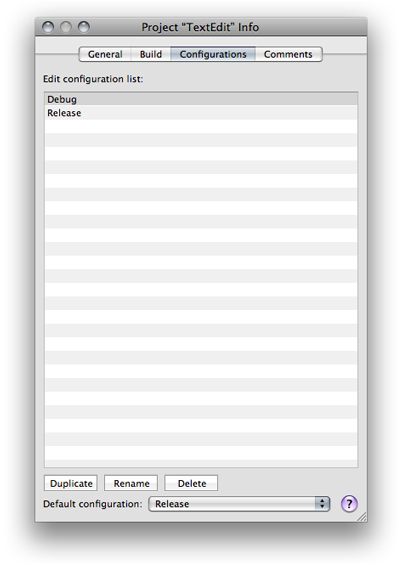
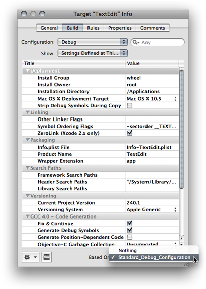
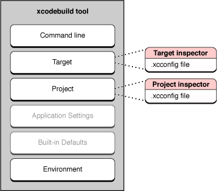
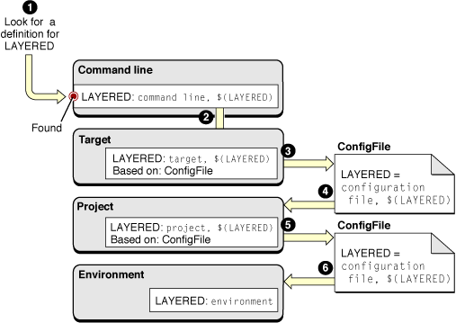
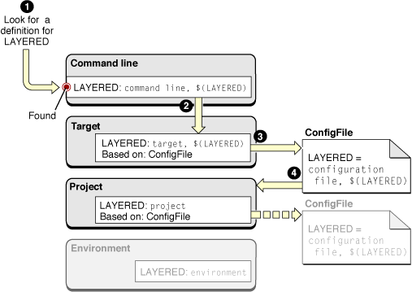

> 导航：[总目录](../../../README.md) · [documentation](../../../_indexes/documentation.md) · [Xcode Build System Guide](Introduction.md)


[Next](Linking.md)[Previous](Build%20Settings.md)

# Build Configurations

Build configurations are named collections of build settings that allow you to build one or more products in a project in different ways for different situations. For example, you can define separate debug and release build configurations. You can then use these build configurations to build debug and release versions of your product, without creating separate targets. Build configurations are a flexible tool for quickly “tweaking” your product or for saving different groups of build settings to apply to a target depending on the current circumstances.

This chapter provides a general explanation of build configurations, describes the predefined build configurations you get when you create a target or project in Xcode, and explains how to modify and define your own build configurations.

Build configurations allow you to build two or more “flavors” of a product without having to create separate targets for each product flavor. When you build a target, Xcode uses the build settings defined by that target for the current build configuration.

A common use of build configurations is to build a given target differently to create debug and release versions of a product. There are a handful of build settings—for example, optimization settings for the compiler—whose values are different, depending upon whether you are building a product for debugging purposes or to release to customers. In each situation, the target you build is identical in every other way—files, build phases, and build rules—because the product you want to generate for each is essentially the same. The only difference is in how the source files of the target are processed to build that product.

If you were to create two targets—one for debugging and one for the final build—you would have to remember to keep both targets in sync. When you added a file to one target, you would have to remember to add it to the other, and so forth. With a build configuration, you can build using a different group of build settings without changing the target’s build phases or build rules. It is much simpler to create build configurations containing the build settings whose values you want to change, and then build based on the appropriate configuration.

The project defines the list of build configurations; all targets in a project share the same namespace for build configurations. The actual definition of any given build configuration—the particular build setting definitions in that configuration—is specific to each target. You can also define project-level configurations. As described in [Build Setting Evaluation](Build%20Settings.md#apple-f4xwc4dqnrsv64tfmyxwi33df52wszbpkridimbqgazdmojrfvjvoni), build settings defined at the target level take precedence over any values assigned to those build settings at the project level. This gives you a great deal of flexibility. For example, you can use project-level build configurations to define build settings that apply to all or most targets in the project. You can then modify or override these build settings for individual targets at the target layer.

The _active build configuration_ is the build configuration Xcode uses when building the active target and any targets it depends upon. When you initiate a build, Xcode builds the active target and any targets it depends upon. For each target, Xcode applies the build settings defined by that target for the active build configuration, as well as any build settings defined for the active build configuration at the project level. See Setting the Active Target and Build Configuration for a description of how to change the active build configuration.

For each target, Xcode evaluates the build settings defined by that target for the active build configuration, as well as any build settings defined for the active build configuration at the project level. As described in [Managing Build Configurations](#apple-f4xwc4dqnrsv64tfmyxwi33df52wszbpkridimbqgazdmojsfvbuuqshivaucry), the list of build configurations is the same for all targets within a project. When building targets in a referenced project, Xcode uses the build settings defined in the corresponding build configuration of that project.

If your project includes cross-project references, it is possible that the referenced project defines a different set of build configurations from those of the current project; the active build configuration may not exist in the referenced project. In this case, Xcode falls back on the default configuration for the referenced project and its targets.

For each target and project involved in a build, here is how the build configuration is selected when building from the Xcode application.

1. Xcode checks for a build configuration with the same name as the active build configuration. If this configuration is found, Xcode uses it.
2. If no matching build configuration is found, Xcode then uses the default build configuration.

The process of selecting build configurations is similar when building from the command line with `xcodebuild`:

1. If a specific build configuration is passed as a command-line argument to `xcodebuild` , `xcodebuild` first looks for a build configuration with that name in the project. If that configuration is found, Xcode uses it.
2. If no build configuration is specified on the command line or if the project does not define the specified build configuration, `xcodebuild` uses the default configuration.

New Xcode projects contain two predefined build configurations, Debug and Release. You can edit those build configurations or define new build configurations of your own.

In addition to the predefined Debug and Release build configurations, you may need to define a special build configuration to satisfy particular needs, such as configuring an environment to measure the performance of your application. In such a build configuration you may define build settings that add a library or framework that gathers and logs performance-related information. You may also need to target your application to specific Mac OS X versions. In that case, you may need to build your product slightly differently for each version. For example, you can have build configurations named Mac OS X 10.3 and Mac OS X 10.4 that build a product tailored for Mac OS X v10.3 and Mac OS X v10.4, respectively, by setting Mac OS X Deployment target (`MACOSX_DEPLOYMENT_TARGET`), and any other build settings necessary, to the appropriate values.

A debug build of a product may include debugging information to assist you in fixing bugs. However, this extra information can consume valuable space in a user’s system. A debug build should contain only the code necessary to run the application.

Some build settings tell Xcode to add debugging information to an executable or specify whether to optimize its execution speed. Other build settings turn on features such as Fix and Continue, which are useful only during debugging.

All Xcode project and target templates include two build configurations, the Debug build configuration and the Release build configuration. By default, the Debug build configuration turns on Fix and Continue, and debug-symbol generation, among others, while turning off code optimization. The Release build configuration turns off Fix and Continue. The code-optimization level is set to its highest by default, through the Optimization Level (`GCC_OPTIMIZATION_LEVEL`) build setting. Note that the Release build configuration doesn’t turn on Deployment Location (`DEPLOYMENT_LOCATION`); therefore, the product is not copied to the location where it would be installed on a user’s system. It also doesn’t turn on Deployment Postprocessing (`DEPLOYMENT_POSTPROCESSING`), which specifies whether to strip binaries and whether to set their permissions to standard values.

Generally, the predefined build configurations described in [Predefined Build Configurations](#apple-f4xwc4dqnrsv64tfmyxwi33df52wszbpkridimbqgazdmojsfvbeeq2gijbuuqi) are enough for most people. You can use them as they are or add additional build settings to them. For example, you can specify that the Debug build configuration for a target or project display more compiler warnings.

If you’re thinking about creating a target, consider whether it might be best to create a build configuration instead. In general, create a target to create a product, and create a build configuration to modify how that product is built. If you’re creating targets that differ only in their build settings, consider creating one target with several build configurations. If you need to create targets that differ in other ways—such as build phases—you need to create separate targets.

To see the list of build configurations defined for a project, open the project editor, and display the Configurations pane, shown in Figure 4-1. The configuration list displays all of the build configurations defined in the current project. You can edit the list of configurations as described in [Managing Build Configurations](#apple-f4xwc4dqnrsv64tfmyxwi33df52wszbpkridimbqgazdmojsfvbuuqshivaucry).

__Figure 4-1__  Project editor: Configurations pane



These are the components of the Configuration pane of the project editor:

- __Configuration list.__ List of the project’s build configurations.
- __Duplicate button.__ Duplicates the selected build configuration throughout the project. In this way, if you have a number of build settings common to all configurations in a target, you do not have to set them all up again.
- __Rename button.__ Renames the selected build configuration name. throughout the project.
- __Delete button.__ Deletes the selected build configuration from the project.
- __Default configuration pop-up menu.__ Specifies which of the build configuration is the default build configuration.

  the _default build configuration_ is used when the project being built does not have a definition for the active build configuration, as described in [Build Configuration Overview](#apple-f4xwc4dqnrsv64tfmyxwi33df52wszbpkridimbqgazdmojsfvjvomi).

As you've seen, you often want to vary the value of a build setting depending on the circumstances of the build. Xcode lets you edit individual build configurations to define build settings specific to that particular build variation. You typically also have some build settings that remain the same regardless of the current build configuration. Rather than editing each build configuration in the target or project separately, you can define the same build setting for all build configurations by editing all of a target or project's build configurations at once. Both approaches are described next.

- To edit a particular build configuration, choose that build configuration from the Configuration pop-up menu in the project or target build settings editor, and make your changes. See Editing Build Settings to learn how to use the build settings editor.
- To edit build settings for the active build configuration, choose Active Configuration from the Configuration pop-up menu.
- To edit build settings for all build configurations in a target or project, choose All Configurations from the Configuration pop-up menu. Build settings that have the same value for all configurations in the target or project display that value. Build settings that have different values for different build configurations display the string “Multiple values” or a checkbox with a dash. You can still edit the value for these build settings; doing so changes the definition of the build setting across all of the available build configurations to have the same value. To edit the definition of a build configuration in multiple targets at once, select those targets and open the target editor.

When you work on large software endeavors with several projects and targets, many of which sharing a number of common build setting definitions, it can be time-consuming and repetitive to define the same build settings over and over again. For this reason, Xcode allows you to base a build configuration on _build configuration file_. A _build configuration file_ (or _configuration file_ for short) contains a list of build setting definitions. Using build configuration files, you can easily share a set of build setting definitions among all the individuals working on your team, or quickly configure targets and projects with common build setting definitions.

When you base a target or project’s build configuration on a build configuration file, that build configuration automatically inherits the build setting definitions in that configuration file (and the configuration files it includes), as well as any subsequent changes to the configuration file (or the configuration files it includes). If you then modify the value of any of those build settings in the target or project, the new value is used instead of the value in the configuration file.

For example, if you have a standard list of debugging build settings that you use to build debug versions of all your products, you can define a configuration file—say `MyDebugSettings.xcconfig` —that contains these build settings. You can then base the Debug build configurations for all your targets on this file. Each Debug configuration inherits the build settings in the `MyDebugSettings.xcconfig` file. You can then modify any of these build settings for individual targets or projects, as necessary.

A configuration file is simply a plain text file with a list of build setting names and assignments, one per line. (You may also add comments using the `//` comment marker.) You can use build settings recognized by the Xcode build system or define your own custom build settings in a configuration file. For example, to specify that profiling code be generated for all build configurations based on a particular file, add the following to the file:

```
GENERATE_PROFILING_CODE = YES               // Turn on profiling code
```

Note that you must use the name of the build setting, not the build setting title. If the build setting can contain a list of values—such as `OTHER_CFLAGS`—separate each value with a space.

This format is the same format that Xcode copies to the clipboard when you copy and paste build settings from the build setting list. You can quickly create a configuration file by selecting the build settings you want to include, copying them, and pasting them into a new text file. You can then make any necessary modifications to the build setting definitions. Xcode also includes a configuration file template, which you can use to create a configuration file.

To create a configuration file:

1. Choose File > New File.
2. In the New File Assistant, select Xcode > Configuration Settings File.

Configuration files must have the extension `.xcconfig` to be recognized by Xcode.

A configuration file may refer to one or more additional configuration files using the `#include` directive, as shown in Listing 4-1. You can use relative or absolute paths to specify the location of the configuration file to include. The group of configuration files joined together by `#include` directives is known as a _configuration unit_. A single configuration file that doesn’t include other configuration files is also a configuration unit.

__Listing 4-1__  Referring to other configuration files

```c
// File: MyConfig.xcconfig
#include "/Network/ProductDevelopmentSpecs/TeamConfig"
ARCHS = ppc i386
#include "/Network/ProductPackagingSpecs/ProductConfig"
```

Xcode analyses build setting definitions in the order specified in the configuration unit. For example, the MyConfig configuration file in Listing 4-1 includes two other configuration files: TeamConfig and ProductConfig. Xcode processes the build setting assignments in the configuration unit in this order:

- Build setting definitions in TeamConfig
- Build setting definitions in MyConfig
- Build setting definitions in ProductConfig

When a configuration unit contains more than one definition for a particular build setting, Xcode uses the last definition in the unit. Keep in mind that configuration files do not have access to build setting definitions made in configuration files they include. That is, you cannot modify the definition made in an included configuration file; you can only replace it.

To base a build configuration on a configuration file:

1. Add the configuration file to your project, as described in Managing Files and Folders in a Project.
2. In the build settings editor, choose the build configuration you want to modify from the Configuration menu.
3. Choose the configuration file from the Based On pop-up menu, below the build settings table, as shown in Figure 4-2. This menu displays all the build configuration files in the project.

   __Figure 4-2__  Build settings editor: Choosing a configuration file

   

Your project can contain any number of configuration files; however, each individual build configuration can be based on only one configuration file.

Build settings are defined in a number of different layers, with definitions in higher layers overriding definitions in lower layers.

Of course, build settings at the target and project layers can be defined in the Xcode user interface or inherited from build configuration files. Figure 4-3 shows the build setting layers and their relationship to the build settings defined in configuration files.

__Figure 4-3__  Build setting layers and configuration files



When you use configuration files, the target and project layers themselves are each divided into two separate build setting layers. These are:

1. Build setting definitions listed in the build settings editor. Build settings configured in the Xcode user interface override build settings defined in the configuration file for the same build configuration of the target or project. This lets you customize the build for one or more targets or projects that otherwise share a common set of build settings.
2. Build setting definitions in the configuration file on which the active build configuration for the target or project is based. You can use configuration files to share build setting definitions across one or more build configurations in multiple targets or projects.

To understand how to use configuration files effectively, you must understand how configuration files affect the evaluation of build settings. The following example builds on the example used in [Multilayer Build Setting Definitions](Build%20Settings.md#apple-f4xwc4dqnrsv64tfmyxwi33df52wszbpkridimbqgazdmojrfvjvomq) to show how Xcode evaluates build settings in a project that uses configuration files. Figure 4-4 shows how the build system would evaluate the `LAYERED` build setting when using `xcodebuild`.

__Figure 4-4__  Evaluation of the `LAYERED` build setting using configuration files



To evaluate the `LAYERED` build setting, Xcode does the following:

1. Looks for a definition for `LAYERED` in the command-line layer (the highest available to `xcodebuild`). It finds the specification `command line, $(LAYERED)`.
2. Resolves `$(LAYERED)` starting at the next layer down, the target layer. At this layer, it obtains the specification `target, $(LAYERED)`; this is the specification defined in the Xcode application for the active build configuration of the target. Because the specification also references the value of the `LAYERED` build setting, the build system continues to look for the build setting specification. In this case, the build configuration is based on a configuration file, so the build system continues its search there.
3. Looks in the `ConfigFile.xcconfig` file on which the active build configuration of the active target is based. In the configuration file, it obtains the specification `configuration file, $(LAYERED)`. Because this specification also references the value of the `LAYERED` build setting, the build system continues to look in lower layers for the build setting specification.
4. Resolves `$(LAYERED)` starting at the project layer, obtaining `project, $(LAYERED)`.
5. Looks in the `ConfigFile.xcconfig` file on which the active build configuration of the project is based, again obtaining the specification `configuration file, $(LAYERED)`. In this example, the project-level build configuration is based on the same configuration file as the target-level build configuration; however, they could just as easily be based on different configuration files.
6. Resolves `$(LAYERED)` starting at the environment layer, obtaining `environment`.

   The evaluation of `LAYERED` stops here because there are no build setting layers below the environment layer. When all the references are resolved, the final value of the build setting is computed as `command line, target, configuration file, project, configuration file, environment`.

Knowing how the build system evaluates build settings in configuration files lets you easily determine where to configure build settings. For example, say you have a configuration file that contains settings common to most of your Xcode projects. Imagine that, for a particular project, you want to override the value of a single setting in the configuration file. Rather than creating a separate configuration file that defines this one build setting differently, you can simply define that build setting in the project inspector for that project. Figure 4-5 shows how the build system evaluates the `LAYERED` build setting when that build setting is overridden in the project inspector of the Xcode application.

__Figure 4-5__  The `LAYERED` build setting overridden in the project inspector



These are the steps the build system takes to evaluate the LAYERED build setting:

1. Looks for a definition for `LAYERED` in the command-line layer (the highest available to `xcodebuild`). It finds the specification `command line, $(LAYERED)`.
2. Resolves `$(LAYERED)` starting at the next layer down, the target layer. At this layer, it obtains the specification `target, $(LAYERED)`.
3. Looks in the `ConfigFile.xcconfig` file on which the active build configuration of the active target is based. In the configuration file, it obtains the specification `configuration file, $(LAYERED)`.
4. Resolves `$(LAYERED)` starting at the project layer, obtaining `project`.

   The evaluation of `LAYERED` stops here because there are no references to other build settings in its specification. Even though `LAYERED` is configured in the project layer, that specification has been overridden in the target layer; therefore, it’s ignored. The final value of `LAYERED` in this example is `command line, target, configuration file, project`.

[Next](Linking.md)[Previous](Build%20Settings.md)

