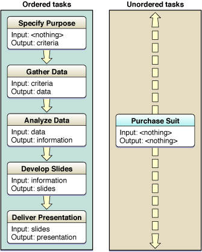
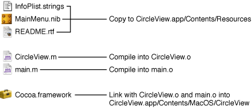
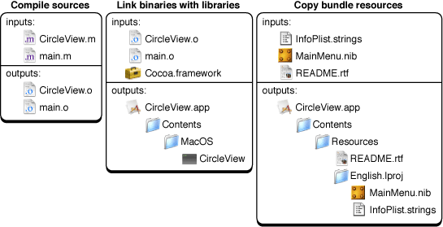
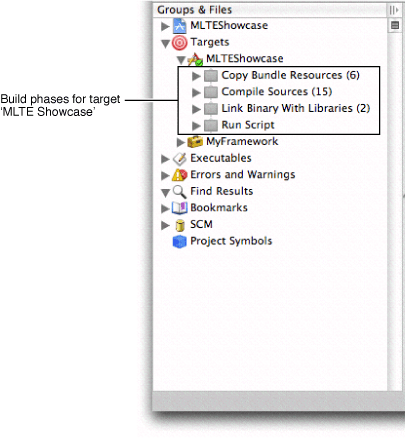
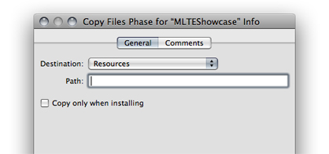
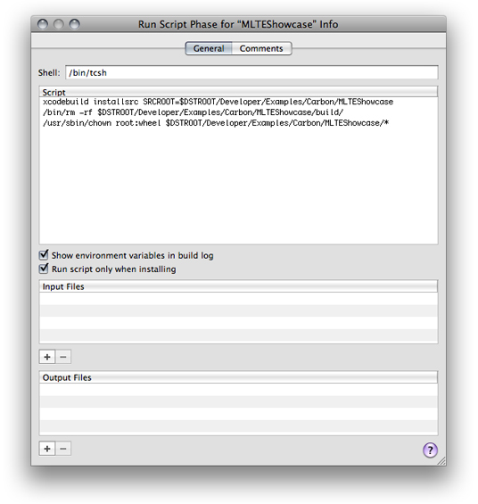
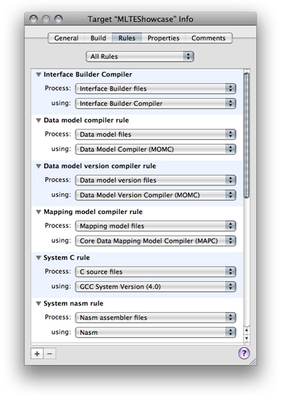

> 导航：[总目录](../../../README.md) · [documentation](../../../_indexes/documentation.md) · [Xcode Build System Guide](Introduction.md)


[Next](Build%20Settings.md)[Previous](Targets.md)

# Build Phases

A _build phase_ represents a task to be performed on a set of files. Each build phase specializes in a specific kind of file, such as header files, source files, resource files, and frameworks and libraries. Each build phase also performs specific operations on the files associated with it. That way, changes in the way files of the same kind are processed can be made by customizing the operations that the build phase performs.

This chapter provides an overview of build phases, explains how Xcode determines the order in which build phases are processed to build a product, describes in detail some of the build phases available, and explains how build rules allow you to customize the Compile Sources build phase and the Build ResourceManager Resources build phase in a target.

A build phase performs a set of operations on a group of files as part of building a product. To illustrate this process, think of the tasks you would perform to prepare for and deliver a presentation; many of the required tasks contain a set of inputs and outputs:

1. Specify the purpose of the presentation and identify the audience.

   This task has no prerequisites but produces a set of criteria that serve as the guiding principles for the presentation.
2. Gather the appropriate data, such as articles, reports, and surveys.

   Information gathering requires a set of criteria that specify what to look for and where to look for it. The outcome is a set of documents containing the data gathered.
3. Purchase a business suit.

   This task has no inputs or outputs that directly relate to the presentation.
4. Analyze the data by collating facts, extrapolating trends, and summarizing representative opinions.

   This task uses the data gathered in task 2 and produces one document containing the information on which the presentation is based.
5. Develop a set of slides, including compelling illustrations, from the information produced by your analysis.

   This task requires the information produced in task 4 and produces a set of slides and illustrations, which could be presented using Keynote.
6. Deliver the presentation by showing the slides and illustrations in sequence and by engaging the audience with a loud, clear voice while maintaining eye contact with them.

The order in which build phases are executed in a target depends on their inputs and outputs. Most of the tasks shown earlier contain a set of inputs and outputs that associate them with each other in an anterior/posterior relationship. Tasks that contain inputs that are the outputs of other tasks or outputs that are the inputs of other tasks are _ordered tasks_. These are tasks that are executed in the order determined by their inputs and outputs. _Unordered tasks_, on the other hand, are tasks with no inputs and outputs, or tasks whose inputs are not the outputs of other tasks and whose outputs are not the inputs of other tasks. In Figure 2-1 the presentation tasks shown earlier are categorized as ordered and unordered.

__Figure 2-1__  Presentation tasks



Most of the tasks illustrated depend on another task’s outputs. The Specify Purpose task is the only task among the ordered tasks that doesn’t depend on the output of any other task; therefore, it’s performed first. The Purchase Suit task is the only unordered task; that is, it’s neither the anterior nor the posterior of other tasks. Therefore, it can be executed at any time during the preparation of the presentation.

To build an application, you typically compile source files and link them to system frameworks and libraries. Figure 2-2 shows some of the operations needed to build the CircleView example application.

__Figure 2-2__  Building an application



This simple project shows that there are many things to take into account when building a product. You have to copy resource files to the appropriate places, compile implementation files into object files, and link object files with the appropriate frameworks to produce a binary file. If you modify an implementation file, you must compile it, and link the generated object file with the other object files and the necessary frameworks.

If you analyze the files and the operations illustrated in [Figure 2-2](#apple-f4xwc4dqnrsv64tfmyxwi33df52wszbpkridimbqgazdmojqfvbeeq2iijcekqy), you notice that the project contains three types of files: Files that are copied or installed, files that are processed or compiled to produce intermediate files (such as object files), and frameworks that are linked with the object files to produce a binary file. To build a product, appropriate operations are performed on the files, depending on their type.

Build phases associate groups of files with operations to be performed on them in order to build a product; for example, installing header files within frameworks, compiling source files, linking object files with system libraries or frameworks, and so on. As you add files to a project, Xcode associates them with the appropriate build phase, based on the files’ type (specified by each file’s extension). If you want to compile implementation files with a different compiler, you make the change once, at the build phase level (see [Compile Sources Build Phase](#apple-f4xwc4dqnrsv64tfmyxwi33df52wszbpkridimbqgazdmojqfvbeeq2fjfdesrq) and [Build Rules](#apple-f4xwc4dqnrsv64tfmyxwi33df52wszbpkridimbqgazdmojqfvbeeq2dizcuisq) for details). Build phases help make the process of building an application, plug-in, library, or framework, understandable and easy to customize, as illustrated in Figure 2-3.

__Figure 2-3__  Building an application using build phases



A build phase operates both on its inputs, which are the files associated with it (either by you or intrinsically by Xcode), and on its outputs, which are the files produced after the build phase is executed. Each build phase executes its task by invoking tools to perform the operations needed to accomplish the task.

Xcode offers several build phases, which are shown in Table 2-1. The name of the build phase reflects the task performed by that build phase.

__Table 2-1__  Build phases available in Xcode

| Build phase | Description |
| Copy Headers | Installs header files with `public` or `private` roles in the appropriate locations in the product. See [Setting the Role of Header Files](Targets.md#apple-f4xwc4dqnrsv64tfmyxwi33df52wszbpkridimbqgazdmobzfvjvomjq) for details. |
| Copy Bundle Resources, Build Java Resources | Installs files by copying the associated files from the project to the `Resources` directory in the product. |
| Copy Files | Installs files by copying the associated files from the project to a location in the product or to a specific location in the target file system, such as `/Library/Frameworks` or `/Library/Application Support`. |
| Compile Sources | Compiles source files into object files using a predefined tool, a tool you specify, or a build-rule script. |
| Run Script | Executes a shell script. You can use any scripting language whose scripts you can execute from the command line, such as AppleScript, Perl, Python, Ruby, and so on. |
| Link Binary With Libraries | Links object files with frameworks and libraries to produce a binary file. |
| Build ResourceManager Resources | Compiles `.r` files into resources that go into a separate resource file or into the executable's resource fork. |
| Compile AppleScripts | Compiles `.applescript` files and places the resulting `.scpt` files in the product’s `Resources/Scripts` directory. |

Table 2-2 lists the build phases and their possible inputs and outputs.

__Table 2-2__  Input files and output files of build phases

| Build phase | Inputs | Outputs |
| Copy Headers | `.h` files | Copies in appropriate locations in the product. |
| Compile Sources | `.c`, `.m`, `.y`, `.l`, among other types of source files | `.o` files in target’s `build` directory. |
| Link Binary With Libraries | `.framework`, `.dylib`, and the`.o` files in the target’s build directory | Binary file, framework, or library in product destination directory. |
| Copy Bundle Resources | `.nib` files, `.strings` files, image files, and others | Copies in the product’s `Resources` directory. |
| Build ResourceManager Resources | `.r`, and `.rsrc` files | Resource (`.rsrc`) files in the product’s `Resources` directory. |
| Compile AppleScripts | `.applescript` files | AppleScript script (`.scpt`) files in the product’s `Resources/Scripts` directory. |

Each target has a set of build phases, separate from the build phases in other targets in your project. To view the build phases in a target, click the disclosure triangle next to the target in the Groups & Files list.

__Figure 2-4__  Viewing build phases



The order in which the build system executes build phases is important because some build phases produce files that are part of the inputs of other build phases. Therefore, the former must be executed before the latter. In native targets, dependencies between build phases determine the order of execution. In Jam-based targets, you must ensure that the build phases within a target are ordered appropriately.

In some cases, a build phase inherently includes the outputs of other build phases as its inputs. For example, the outputs (`.o` files) of the Compile Sources build phase are part of the inputs of the Link Binary With Libraries build phase. This makes the Compile Sources build phase an antecedent of the Link Binary With Libraries build phase. Therefore, the order in which build phases are executed in a target depends on their inputs and outputs.

Most build phases have their inputs and outputs defined implicitly. However, Run Script build phases may have neither. Here, the build system tries to run the associated script in the order specified within the target, but the actual point in the build process at which the script is run is undetermined. If you assign either input or output files to a Run Script build phase, the script’s point of execution in the build process is determined by other targets having the build phase’s outputs as their inputs, or the inputs of the build phase being the outputs of other build phases.

[Figure 2-3](#apple-f4xwc4dqnrsv64tfmyxwi33df52wszbpkridimbqgazdmojqfvbeeq2eijbuori) illustrates this. Regardless of the order of the Compile Sources and the Link Binary With Libraries build phases in the target, the Compile Sources build phase is executed before the Link Binary With Libraries build phase. This is because the inputs to the Link Binary With Libraries build phase rely on output from the Compile Sources build phase.

In the Compile Sources build phase, the build system determines the order in which files are processed through the inputs and outputs of the target’s build rules, in a similar way in which the order of build phases is determined.

The order in which the build system executes the build phases in Jam-based targets is determined by the order of the build phases within a target. The order of the input files within the build phase determines the order in which the build system processes each file in that build phase.

You must make sure that build phases that produce files required by other build phases are listed first within the target. For example, the Compile Sources build phase must always be listed before the Link Binary With Libraries build phase.

Within the Compile Sources build phase, you must ensure that source files that generate derived files are placed above dependent files. For example, if a target has Yacc (`.y`) and Lex files (`.l`) files and processing the Lex files requires the C (`.c`) files generated from the Yacc files, within the build phase the Yacc files must be listed before the Lex files.

Typically, there is no need to change the order of build phases in a target; the default arrangement works for the majority of cases. If, however, you find that you need to change the position of a build phase—for example, when adding custom build phases to a Jam-based target—you can reorder a build phase by dragging the icon for the build phase to its new location in the target.

New targets—whether created through the New Target Assistant or as part of creating a project—already include a set of predefined build phases. The predefined build phases for a target vary, depending on the type of product created by the target. For example, a target that builds an application typically includes a Copy Bundle Resources build phase to copy resources into the application bundle; however, a target that builds a shell tool does not include this build phase. The predefined build phases work for most simple targets; however, you can accommodate more complex products and build steps by adding your own build phases.

To add a build phase:

1. (Optional) Select the target to which you want to add the build phase. Otherwise, Xcode adds the build phase to the active target.
2. Choose a build phase from:

   - Project > New Build Phase

   [Table 2-1](#apple-f4xwc4dqnrsv64tfmyxwi33df52wszbpkridimbqgazdmojqfvbeeq2ejfdemqy) shows the available build phases.

Xcode adds the new build phase after the currently selected build phase, or, if no build phase is selected, adds it as the last build phase in the target. Several types of build phases can appear only once in a target; for example, there can be only one Compile Sources build phase. However, a target can contain multiple instances of the Copy Files and Run Script build phases.

To delete a build phase, select it in the Groups & Files list and press Delete, or choose Edit > Delete. Deleting a build phase does not delete the files in the build phase from the project or from the file system.

When you add a file to a project, Xcode lets you choose whether to also add the file to any targets in the project. When you add files to a target this way, Xcode automatically assigns the files to build phases, based on each file’s type.

To view the inputs to a particular build phase, you can:

- Select the build phase in the Groups & Files list. The files assigned to the build phase are displayed in the detail view.
- Open the build phase in the Groups & Files list.

Intermediate files—files generated by Xcode in other build phases—are not listed. Xcode handles these intermediate files automatically.

If the default file placement is not sufficient for your needs, you can drag the file or files from their current build phase to the new build phase. You can also drag existing files from the project group to the appropriate build phase in the Groups & Files list. To remove a file from a build phase, select the file and press Delete.

The Compile Sources build phase is one of the most easily customized build phases (the other one being the Run Script build phase). The reason is that this build phase must handle a wide variety of file types. Xcode is preconfigured to process several types of source files, but you may have to compile source files that Xcode doesn’t know about.

The feature that makes the Compile Sources build phase so flexible is its support of _build rules_. They specify the tool or script the build system invokes to process files in Compile Sources and Build ResourceManager Resources build phases when building a product. For details on build rules, see [Build Rules](#apple-f4xwc4dqnrsv64tfmyxwi33df52wszbpkridimbqgazdmojqfvbeeq2dizcuisq).

A Copy Files build phase allows you to copy files and resources of any type to specific locations as part of the build process. It complements the build phases that copy specific types of files. An example is the Copy Headers build phase, which deals only with header files. You can have as many Copy Files build phases as you need in a target.

For example, using a Copy Files build phase, you can copy fonts to`/Library/Fonts`. Or, if you’re developing a plug-in, a Copy Files build phase can copy the generated plug-in to the appropriate location. You can have as many Copy Files build phases in a target as you need.

To create a Copy Files build phase:

1. In the project window, open the target to which you want to add the build phase, and select the build phase after which to add the new build phase.
2. Choose Project > New Build Phase > New Copy Files Build Phase. Xcode adds the new Copy Files build phase after the build phase selected in the Groups & Files list.
3. Drag the files you want to copy from the Groups & Files list to the Copy Files build phase.

To configure the new Copy Files build phase, select it and open the Copy Files build phase editor, shown in Figure 2-5.

__Figure 2-5__  Copy Files build phase editor



Together, the Destination pop-up menu and the Path field specify the location to which Xcode copies the files in the Copy Files build phase. The Destination pop-up menu lets you choose from a number of standard locations. Table 2-3 shows the destination-location names you can choose in a Copy Files build phase for an application called MyApp and the resulting destination path. All the options, except Absolute Path and Products Directory, specify paths inside the generated bundle.

__Table 2-3__  Destination names and example destination paths of the Copy Files build phase

| Destination name | Destination path |
| Absolute Path | Anywhere. |
| Wrapper | `MyApp.app` |
| Executables | `MyApp.app/Contents/MacOS` |
| Resources | `MyApp.app/Contents/Resources` |
| Java Resources | `MyApp.app/Contents/Resources/Java` |
| Frameworks | `MyApp.app/Contents/Frameworks` |
| Shared Frameworks | `MyApp.app/Contents/SharedFrameworks` |
| Shared Support | `MyApp.app/Contents/SharedSupport` |
| Plug-ins | `MyApp.app/Contents/PlugIns` |
| Products Directory | The directory in which Xcode places the project’s built products. See Build Locations. |

The Path field specifies the path, relative to the location specified in the Destination pop-up menu, to the target directory. If you choose Absolute Path from the menu, the Path field must contain the complete path to the destination directory for the files.

The “Copy only when installing” option lets you specify whether the build phase copies the files only in _install builds_ of the product. That is, when using the `install` option of `xcodebuild` or when the Deployment Location (DEPLOYMENT_LOCATION) build setting is turned on. For more on `xcodebuild`, see Building with xcodebuild.

A Run Script build phase lets you execute any commands you need to perform a task. You can archive files using `tar`, send mail, write messages to a log file, execute AppleScript scripts, and so on. You can use any of the shell languages available in your system. And you can have any number of Run Script build phases in a target.

Before executing your script, Xcode assigns the values of most build settings to environment variables. In particular, it sets the environment variables listed in [Table 2-4](#apple-f4xwc4dqnrsv64tfmyxwi33df52wszbpkridimbqgazdmojqfvbeeq2ijbeemsi), as well as any build settings that are defined for the active target. This includes build settings defined at the target layer, as well as any build settings inherited from lower layers. If you are building using `xcodebuild`, Xcode also passes any build settings defined on the command line to the environment.

Listing 2-1 shows how to print the value of a build setting by printing the value of the corresponding environment variable.

__Listing 2-1__  Example Run Script–build-phase script

```
echo "Building ${PRODUCT_NAME}"
```

This is the corresponding entry in the build transcript in the build results window:

```
Building Sketch
```


To perform operations on intermediate files, you can use several build settings, whose value—which Xcode sets before executing your script—you access through environment variables. A few of these build settings are listed in Table 2-4; the complete list of build settings that Xcode sets is much larger; see _[Xcode Build System Guide](../Xcode%20Build%20System%20Guide%20%282016%29.md#apple-f4xwc4dqnrsv64tfmyxwi33df52wszbpkridimbqgaztsmzr)_ for the complete list of build settings.

__Table 2-4__  Environment variables accessible from a Run Script build phase

| Environment variable | Description |
| `ACTION` | The action being performed on the current target, such as `build` or `clean`. |
| `BUILD_VARIANTS` | The variations—`debug`, `profile` or `normal`—that Xcode is creating for the product being built. |
| `PROJECT_NAME` | The name of the project containing the target that is being built. |
| `PRODUCT_NAME` | The name of the product being built, without any extension or suffix. |
| `TARGET_NAME` | The name of the target being built. |
| `TARGET_BUILD_DIR` | The location of the target being built. |
| `BUILT_PRODUCTS_DIR` | The directory that holds the products created by building the targets in a project. |
| `TEMP_FILES_DIR` | The directory that holds intermediate files for a specific target. |
| `DERIVED_FILES_DIR` | The directory that holds intermediate source files generated by the Compile Sources build phase. |
| `INSTALL_DIR` | The location of the installed product. |

The script executes using the permissions of the logged-in user. Xcode runs the script with the initial working directory set to the project directory.

To create a Run Script build phase:

1. In the Groups & Files list, open the target to which you want to add the build phase, and select an existing build phase.
2. Choose Project > New Build Phase > New Shell Script Build Phase.

To configure the new Run Script build phase, open the Run Script build phase Info window, shown in Figure 2-6.

__Figure 2-6__  Run Script build phase Info window



The Run Script build phase editor contains these fields:

- __Shell.__ Specifies the path to the appropriate shell.
- __Script.__ Specifies the script itself as shown in [Figure 2-6](#apple-f4xwc4dqnrsv64tfmyxwi33df52wszbpkridimbqgazdmojqfvjvona). You can also enter a script that invokes a script stored elsewhere to, for example, avoid storing an often-changed script in the project file.

  A Run Script build phase with the following entries for Shell and Script executes a script called `MyScript.sh` stored in a directory called `Build_Scripts` in the project directory.

|  |  |
| --- | --- |
| __Shell:__ | `/bin/sh` |
| __Script:__ | `$(SRCROOT)/Build_Scripts/MyScript.sh` |
- __Run script only when installing.__ Runs the script only during install builds, that is, when using the `install` option of `xcodebuild` or when the build settings Deployment Location (DEPLOYMENT_LOCATION) and Deployment Postprocessing (DEPLOYMENT_POSTPROCESSING) are on.
- __Show environment variables in build log.__ Lists the build system’s environment variables in the build log.
- __Input Files.__ Specifies the names of the input files the script operates on.
- __Output Files.__ Specifies the files that the script produces.

  In these two tables, file paths are interpreted relative to the project directory.

Xcode uses the input and output files to determine whether to run the script and to determine the order in which the script is executed. Specifying input and output files ensures that Xcode runs the script only when the modification date of any of the input files is later than the modification date of any of the output files (reducing the time it takes to build your product), and that the files the script produces are included in the dependency analysis the build system performs before building your product. If you provide no outputs, Xcode runs the script every time you build the target.

After the script terminates, Xcode uses the script’s exit value to determine whether to continue the build. When the script exits with a nonzero exit value, Xcode stops the build. If you want to perform other actions—such as writing to a log file—in the event of a build failure, you must perform the appropriate action in the script.

As Xcode constructs the command-line invocations for the various tools it uses to build a product, it accesses the build settings available at the target level. Also, when it sets the environment variables for shell scripts in Run Script build phases, it resolves most build settings and sets environment variables with their values.

Build rules specify how particular types of files are processed in Compile Sources build phases and specify which tool is used to process files in Build ResourceManager Resources build phases. For example, a build rule may indicate that all C source files be processed with the GCC compiler. Each build rule consists of a condition and an action. The condition determines whether a source file is processed with the associated action. Usually, the condition specifies a file type.

Xcode provides default build rules that process C-based files, assembly files, Rez files, and so on. You can add rules to process other types of file to each target. You can see the build rules in effect for a target in the Rules pane of the Target Info window, shown in Figure 2-7. Build rules are processed in the order they appear in the Rules pane.

__Figure 2-7__  Target editor: Rules pane



There are two types of build rules:

- __System build rules.__ System build rules are predefined and unmodifiable, although you can override them. They include rules for processing C-based, Assembler, and Rez source files. See [System Build Rules](#apple-f4xwc4dqnrsv64tfmyxwi33df52wszbpkridimbqgazdmojqfvbeeq2iizdemri) for details. System rules are the same for all targets in a project.
- __Target-specific build rules.__ Target-specific build rules are custom rules that you have defined for a particular target.

Target-specific build rules can specify files that the system build rules do not directly address, and can override the existing system build rules. For example, there’s a system build rule for the processing of C-based source files, which means that `.c` and `.m` files are processed by the same build rule. You can, however, add a target-specific build rule indicating that `.m` files be processed by a different compiler. In addition, instead of specifying a particular type of file, you can set the build rule’s condition to a pattern that matches a set of files. See [Creating a Build Rule](#apple-f4xwc4dqnrsv64tfmyxwi33df52wszbpkridimbqgazdmojqfvbuuqkdjfeuqry).

You can view all build rules for a target, including available system build rules, by choosing All Rules from the pop-up menu at the top of the Rules pane in the target editor. To see only those build rules defined for the target, choose Rules Specific to Target.

A build rule’s action typically specifies the tool or compiler to use when processing files that meet the given condition. But you can also specify a build-rule script. The default interpreter is `/bin/sh`. However, you can specify any script interpreter by entering `#!<interpreter_path>` as the first line of the script. When you use a build-rule script, you must specify the files the script produces as the build rule’s output files. See [Creating a Build Rule Script](#apple-f4xwc4dqnrsv64tfmyxwi33df52wszbpkridimbqgazdmojqfvbuuqkfifbucra).

When processing a source file, Xcode evaluates the build rules from top to bottom and chooses the first one whose condition matches the source file being processed. Because custom build rules appear above the built-in system rules, the custom build rules can override the system build rules.

After a file is processed by a build rule, the output produced may be processed by another build rule when the second build rule takes as input files of the type the first build rule produces. For example, say you have a command-line tool that generates a Rez (`.r`) file from another type of file. You create a custom build rule that takes the specialized file as input an processes it using your command-line tool. Because the product of your custom build rule is a Rez file, the Rez file is then processed by the Rez system rule, which produces a `.rsrc` file.

System build rules are predefined rules in all targets and are used to process several well-known file types. Table 2-5 lists the system build rules that Xcode provides.

__Table 2-5__  System build rules

| Rule | Inputs | Outputs |
| Data Model Compiler | `.xcdatamodel` | `.mom` |
| C | `.c`, `.m`, `.cpp`, `.mm` | `.o` |
| Assembler | `.s` | `.o` |
| Yacc | `.y` | `.h`, `.c` |
| Lex | `.l` | `.c` |
| Rez | `.r` | `.rsrc` |
| MiG | `.defs` | `.c` |

In addition to having system build rules, Xcode lets you define custom build rules on a per-target basis. Custom build rules allow you to change the way files of a particular type are processed or add support for types of files not directly addressed by the system rules.

To define a build rule’s condition, choose a file type from the Process pop-up menu. You can also define rules that match arbitrary file names by choosing “Source files with names matching:” from the Process pop-up menu, and specifying a filename pattern in the text field that appears. This field accepts file name substitution (or globbing), accepting the same kinds of file patterns that you can use in a command shell editor. For example, to match all files whose names start with a capital letter and end with a `.def` suffix, you specify `[A-Z]*.def` as the pattern.

You define the build rule’s action by choosing one of the available compilers from the “using” pop-up menu. Xcode provides a number of built-in compilers to choose from. Alternatively, you can define a custom script for processing files that meet the build rule’s condition, as described in [Creating a Build Rule Script](#apple-f4xwc4dqnrsv64tfmyxwi33df52wszbpkridimbqgazdmojqfvbuuqkfifbucra).

When processing a source file in the target, Xcode evaluates the build rules from top to bottom and chooses the first one whose condition matches the source file being processed. For this reason, you should put the most specific build rules above the more general ones. For example, a rule that matches only C++ files should appear above a rule that matches all C-like files—that is, C, C++, Objective-C, and Objective-C++ files.

To reorder a custom rule, drag it from its background.

Instead of choosing one of Xcode’s built-in compilers to process the files specified by a build rule’s condition, you can create a custom script to process those files.

To create a custom script for a build rule, choose:

- “using” > “Custom script”

You can enter your script in the text field that appears, or you can store your script as a separate file in your project and invoke it from the text field using its project-relative path. In this case, you are actually defining a one-line build rule script that calls the script in your project.

In addition to defining the script, you also need to tell Xcode the paths of any output files that the script produces. Enter the path to each separate output file that is produced by the script in the “with output files” table below the script text field. For each file, create a row by clicking the plus (+) button. In this row, specify either the full (absolute) path or the project-relative path to the file. You can use any of the environment variables listed in [Table 2-6](#apple-f4xwc4dqnrsv64tfmyxwi33df52wszbpkridimbqgazdmojqfvbeeq2fjfeuqsa).

For example, suppose that you need to define a build rule to process files with the extension `.abcdef`. Also suppose that the build rule script produces a `.c` file for each `.abcdef` file and that the generated `.c` files are placed in the default directory for intermediate files. In this case, the output-files specification could look like this:

```
$(DERIVED_FILES_DIR)/$(INPUT_FILE_BASE).c
```

Note the use of parentheses in this example. The output-files specification uses the standard Xcode syntax for accessing build settings. Your custom script, however, must use standard shell syntax to access any environment variables corresponding to Xcode build settings, as described in [Execution Environment for Build Rule Scripts](#apple-f4xwc4dqnrsv64tfmyxwi33df52wszbpkridimbqgazdmojqfvbuuqkkinaugry).

The generated files are automatically fed back to the rule-processing engine. For example, continuing the `.abcdef` example rule, Xcode processes the `.c` files the script produces using the rule that processes `.c` files.

Before executing a build-rule script, Xcode sets environment variables to reflect the values of some build settings used to build the product. See [Using Build Settings in Run Script Build Phases](#apple-f4xwc4dqnrsv64tfmyxwi33df52wszbpkridimbqgazdmojqfvjvonq) for details. In addition, Xcode sets a few additional environment variables (shown in Table 2-6) to values the script may need to access.

__Table 2-6__  Environment variables for build rule scripts

| Variable | Description | Example |
| `DERIVED_FILES_DIR` | Path of the directory for derived (intermediate) files. | `/Users/me/project/build/Project.build/​Target.build/DerivedSources` |
| `INPUT_FILE_DIR` | Directory containing the source file. | `/Users/me/Project` |
| `INPUT_FILE_BASE` | Base filename of the source file being processed. | `source` |
| `INPUT_FILE_NAME` | Filename of the source file being processed, including its extension. | `source.cpp` |
| `INPUT_FILE_PATH` | Path to the source file being processed. | `/Users/me/Project/source.cpp` |
| `INPUT_FILE_REGION_PATH_COMPONENT` | Directory containing the source file being processed when it’s localized. Otherwise, an empty string `""`. | `en_US.lproj/` |
| `INPUT_FILE_SUFFIX` | Suffix of the source file being processed, including the leading period. | `.cpp` |
| `TARGET_BUILD_DIR` | Path to the directory into which the target’s products are being built. | `/Users/me/Project/build/Development` |

For example, you can use these environment variables to access the current input file, as in the following shell script:

```
cat ${INPUT_FILE_NAME} > ${DERIVED_FILES_DIR}/${INPUT_FILE_BASE}.c
```

Note that the build rule script uses standard shell syntax to access the environment variables, rather than the Xcode syntax for referencing build settings.

Xcode runs build rule scripts with the current working directory set to the project directory. This behavior lets you access specific source files by using their project-relative paths.

[Next](Build%20Settings.md)[Previous](Targets.md)

