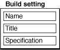
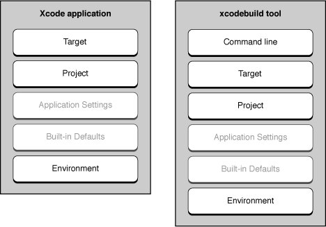
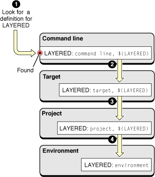
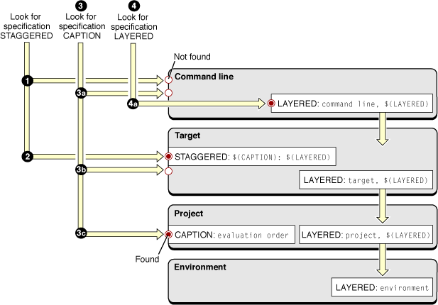
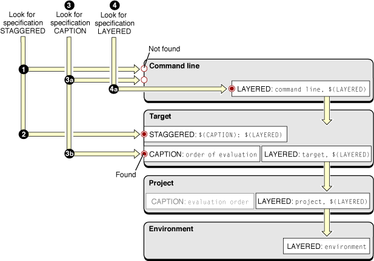
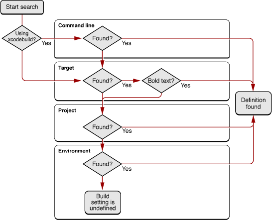

> 导航：[总目录](../../../README.md) · [documentation](../../../_indexes/documentation.md) · [Xcode Build System Guide](Introduction.md)


[Next](Build%20Configurations.md)[Previous](Build%20Phases.md)

# Build Settings

A _build setting_ is a variable that contains information used to build a product. For each operation performed in the build process—such as compiling Objective-C source files—build settings control how that operation is performed. For example, the information in a build setting can specify which options Xcode passes to the tool—in this case, the compiler—used to perform that operation.

Build settings constitute the main method of customizing the build process. They represent variable aspects of the build process that Xcode consults as it builds a product.

This chapter explains how build settings are implemented and how you can take advantage of them to communicate with the build system.

A build setting in Xcode has two parts: The name and the specification. The _build setting name_ identifies the build setting and can be used within other settings; in that sense, it is similar to the names of environment variables in a command shell. The _build setting specification_ is the information Xcode uses to determine the value of the build setting at build time. A build setting may also have a display name, or _build setting title_, which is used to display the build setting in the Xcode user interface.



The build system consults the value of build settings as it generates tool invocations. For example, to generate profiling code for all the source files compiled with GCC, you turn on the Generate Debug Symbols (`GCC_GENERATE_DEBUGGING_SYMBOLS`) build setting. When Xcode creates the `gcc` command-line invocation to compile a source file, it evaluates compiler build settings (such as Generate Debug Symbols) to construct the argument list.

Build setting values may come from a number of sources at build time. Xcode stores build setting specifications in dictionaries spread across several layers. Typically, you are most interested in the _target layer_; however, it is important to understand the various layers from which build setting values can be derived. See [Build Setting Evaluation](#apple-f4xwc4dqnrsv64tfmyxwi33df52wszbpkridimbqgazdmojrfvjvoni) for details.

Xcode has many built-in build settings that you can use to customize the build process. Furthermore, you can define your own build settings, which you can use to configure standard build settings across several targets or access within scripts in Run Script build phases to perform special tasks. To learn how to use each build setting, see _[Xcode Build System Guide](../Xcode%20Build%20System%20Guide%20%282016%29.md#apple-f4xwc4dqnrsv64tfmyxwi33df52wszbpkridimbqgaztsmzr)_.

In addition to build settings, you can set _per-file compiler flags_ that the build system uses when creating tool invocations. With them you can change how a file is compiled without affecting any other files in the project. See Per-File Compiler Flags for details.

Build setting names start with a letter or underscore character; the remaining characters can be letters, underscore characters, or numbers. The Xcode application doesn’t allow you to define build settings whose names don’t follow this convention. Because build setting names are case sensitive, however, `project_name` is irrelevant to the build system and doesn’t override the value of the `PROJECT_NAME` build setting.

Xcode displays titles for most of its predefined build settings in the Build pane of project and target editors. For example, the title of the `PRODUCT_NAME` build setting is Product Name. The `xcodebuild` tool doesn’t use build setting titles.

The value of a build setting is determined by evaluating the build setting specification. A build setting specification can be a value such as a string, number, and so forth, or it can reference the value of other build settings.

To reference a build setting value in a build setting specification, use the name of the build setting surrounded by parentheses and prefixed by the dollar-sign character ($). For example, the specification of a build setting that refers to the value of the Product Name build setting could be similar to `The name of this target's product is $(PRODUCT_NAME)`.

In addition to the build settings provided by Xcode, you can add _user-defined build settings_ to a project. A user-defined build setting is one that is not defined by the build system. You can add them at the command-line, target, project and environment levels. You can reference user-defined build settings in build setting specifications, and scripts in Run Script build phases. User-defined build settings don’t have a title.

The following list describes some circumstances in which you may need to add user-defined build settings to a project:

- To modify the value of build settings that are not displayed in the Xcode application
- To specify a value that can be used by several build settings in different layers (see [Build Setting Evaluation](#apple-f4xwc4dqnrsv64tfmyxwi33df52wszbpkridimbqgazdmojrfvjvoni) for details)
- To define a build setting you want to use in Run Script build phase scripts or a build-rule script

In general, build setting specifications apply to a target regardless of the SDK used to build it or the architectures for which the product is built. There are occasions, however, when you may need to specify a build setting value that must apply only when the product is built using a particular SDK, or when Xcode is generating a executable code for a particular architecture or for a particular variant of the product. _Conditional build setting definitions_ allow you to add build setting values that apply only when one or more conditions are met (for example, the product is being built using the iOS Simulator SDK).

These are the conditions available in conditional build setting definitions:

- __Architecture__

  The architecture condition lets you create build setting definitions for particular architectures.

  This is the format of a build setting definition conditionalized on architecture:

```
<build_setting_name>[arch=<architecture_pattern>] = <build_setting_specification>
```

  These are examples of architecture patterns:

```
armv6                  // ARM v6
i386                   // 32-bit Intel
x86_64                 // 64-bit Intel
*                      // Any architecture
```

  For example, to specify Other C Flags as `-dM` for the i386 architecture, you would use:

```
OTHER_CFLAGS[arch=i386] = -dM
```
- __SDK__

  The SDK condition lets you create build setting definitions for particular SDKs.

  This is the format of a build setting definition conditionalized on SDK:

```
<build_setting_name>[sdk=<sdk_pattern>] = <build_setting_specification>
```

  You can set the SDK condition to match one or any release of an SDK. These are examples of SDK patterns:

```
iphoneos4.0           // The iPhone Device SDK 4.0
iphoneos*             // Any release of the iOS SDK
iphonesimulator4.0    // The iOS Simulator SDK 4.0
iphonesimulator*      // Any release of the iOS Simulator SDK
macosx*               // Any release of the Mac OS X SDK
*                     // Any SDK
```
- __Variant__

  Build variants specify the purpose of a product. These are the available build variants:

  - `normal`: The normal build variant produces a binaries that can be released to end users.
  - `profile`: The profile variant produces binaries to be used to profile program execution.
  - `debug`: The debug variant produces binaries you can use to debug your programs.

  You can use build setting variants in build setting definitions to tailor build aspects to particular binary variants.

  This is the format of a build setting definition conditionalized on variant:

```
<build_setting_name>[variant=<variant_name>] = <build_setting_specification>
```

You can specify one or more conditions in a conditional build setting definition by concatenating the conditions enclosing each condition with square brackets or by separating the conditions with commas:

```
<build_setting_name>[sdk=<sdk_pattern>][arch=<arch_pattern>] = <build_setting_specification>
<build_setting_name>[sdk=<sdk_pattern>,arch=<arch_pattern>] = <build_setting_specification>
```

To define conditional build settings at the command line on in shell scripts, surround the definition with single or double quotation marks:

```
"OTHER_CFLAGS[arch=i386]=-dM"
```

The conditional build setting syntax provides a way to define build settings, not to access the conditions or values of the build settings at built time. At build time, referencing a build setting that has been conditionalized provides the conditional value of the build setting. For example, setting `OTHER_CFLAGS[arch=i386]` to `-dM`, results in `$(OTHER_CFLAGS)` returning `-dM` at build time when the active architecture is i386. You cannot use the condition patterns at build time to access the build setting conditions.

This section describes the literal syntax of conditional build setting definitions, used in build configuration files, environment variables, shell scripts, or `xcodebuild` invocations. To learn how to use the build settings editor to define conditional build setting definitions, see Editing Build Settings.

To take advantage of build settings in your project, you must understand how they are evaluated when Xcode builds your product. By defining build settings at several build setting layers you can, for example, quickly change an aspect of a product when building from the command line, configure a product aspect only in one of a product’s alternate “flavors” but not in all of them, or specify an aspect for all the projects that you work on.

At build time, Xcode evaluates each build setting individually. Figure 3-1 shows the layers in which build settings can be defined; the specifications of build settings defined in higher layers override the specifications of the same build settings at lower layers. Using this layered approach, you can define a build setting in terms of itself, in multiple layers. That is, you can include the value of a build setting as part of the specification of the build setting in more than one layer. The value of the build setting at build time is a composite of the specifications of that build setting in all the layers where it’s defined. For an example of how this process works, see [Multilayer Build Setting Definitions](#apple-f4xwc4dqnrsv64tfmyxwi33df52wszbpkridimbqgazdmojrfvjvomq).

__Figure 3-1__  Build setting layers



When the build system needs the value of a build setting, it starts at the highest build setting layer available to it and works down in the order shown in the following list:

1. __Command-line layer__ (`xcodebuild` only). The command-line layer includes build settings defined in the `xcodebuild` invocation.

   The `xcodebuild` tool’s command invocation represents the highest layer in which you can define build settings when building a product. The build settings defined in this layer are accessible only to `xcodebuild`.

   This layer gives you a way to customize builds performed from the command line without requiring access to the Xcode application.
2. __Target layer.__ The target layer contains build settings defined in the active build configuration of the target being built.

   This is the main layer for specifying how a product is built. The build setting specifications in this layer override the ones defined at lower layers; this applies to both user-defined build settings and built-in build settings that have titles.

   Each target can define several named collections of build settings, called _build configurations_. This lets you produce different “flavors” of a target’s product without having to create separate targets. When you build, you build a specific configuration of the target.

   Xcode evaluates build settings for a target independently from the build settings defined in other targets. This is true even for dependent and aggregate targets.

   For more information on targets, see [Targets](Targets.md#apple-f4xwc4dqnrsv64tfmyxwi33df52wszbpkridimbqgazdmobzfvbusscfjbcugry).
3. __Project layer.__ The project layer contains build settings defined in the active build configuration of the current project—the project in which the current target is defined.

   Xcode and `xcodebuild` use the project layer to specify projectwide aspects, such as the location of the project itself. You can define build settings that you want all targets in the project to share at this layer. These build settings can be overridden by individual targets (at the target layer). When you have multiple targets with build settings that should be synchronized, the project layer can be a convenient way to do so.

   Projects, like targets, also define build configurations; for more information, see [Build Configurations](Build%20Configurations.md#apple-f4xwc4dqnrsv64tfmyxwi33df52wszbpkridimbqgazdmojsfvjvony).
4. __Application settings layer.__ The application build settings layer contains application-wide build settings defined for the current user.

   The application settings layer contains per-user settings, such as any source trees defined by the current user. In [Figure 3-1](#apple-f4xwc4dqnrsv64tfmyxwi33df52wszbpkridimbqgazdmojrfvbuuqsgivducra), this layer appears dimmed because Xcode provides limited access to build settings at this layer. Xcode Preferences > Building provides an interface for changing the `OBJROOT` and `SYMROOT` build settings at this layer.
5. __Built-in defaults.__ The built-in defaults layer contains a number of default values for build settings that are built into Xcode. Most of the build settings defined at this layer are build settings that specify required attributes of Mac OS X products.
6. __Environment layer.__ Build settings defined in the Xcode application environment or the shell from which `xcodebuild` is launched.

   The environment layer is composed of environment variables that correspond to build setting names. You can use it to configure build settings that must apply to more than one project. This layer, however, cannot access build settings configured in any other layer. For example, defining an environment variable named `MY_PRODUCT_NAME` as `My Company $(PRODUCT_NAME)` results in an undefined-variable error, unless you also define an environment variable named `PRODUCT_NAME`.

   You must follow the syntax described in [Build Setting Syntax](#apple-f4xwc4dqnrsv64tfmyxwi33df52wszbpkridimbqgazdmojrfvbuuqsei5dukqi) when defining the environment variables in your session.

As soon as the build system finds a definition for the build setting it’s looking for, it stops traversing the build setting layers. However, if the build setting specification found includes references to other build settings, it resolves them. This starts the traversing process again, as many times as necessary to compute the value of the original build setting.

If a build setting refers to itself (that is, the build setting specification includes a reference to the build setting being evaluated), the build system resolves the reference starting at the subsequent build setting layer. The following sections provide examples of this process.

Imagine that, to build a product, you need to define a single build setting at every build setting layer. This is a very unlikely case to be sure, but one that illustrates how the process works. Table 3-1 shows an example configuration for the `LAYERED` build setting throughout the build setting layers. This example assumes that the product is built from the command-line using `xcodebuild`:

__Table 3-1__  Configuration of the `LAYERED` build setting

| Build setting layer | Build setting specification |
| Command line | `command line, $(LAYERED)` |
| Target | `target, $(LAYERED)` |
| Project | `project, $(LAYERED)` |
| Environment | `environment` |

Figure 3-2 shows how the build system would evaluate the `LAYERED` build setting when building using `xcodebuild`.

__Figure 3-2__  Evaluation of the LAYERED build setting



To evaluate the `LAYERED` build setting, the build system does the following:

1. Looks for a definition for `LAYERED` in the command-line layer (the highest available to `xcodebuild`). It finds the specification `command line, $(LAYERED)`.
2. Resolves `$(LAYERED)` starting at the next layer down, the target layer. At this layer, it obtains the specification `target, $(LAYERED)`. Because this specification also references the value of the `LAYERED` build setting, the build system continues to look in lower layers for the build setting specification.
3. Resolves `$(LAYERED)` starting at the project layer, obtaining `project, $(LAYERED)`.
4. Resolves `$(LAYERED)` starting at the environment layer, obtaining `environment`.

   The evaluation of `LAYERED` stops here because there are no build setting layers below the environment layer. When all the references are resolved, the final value of the build setting is computed as `command line, target, project, environment`.

This example uses `$(LAYERED)` to access the value of the same build setting at a lower layer. However, you can get the same result in the example by replacing `$(LAYERED)` with `$(value)` in any of the build setting specifications at the command-line, target, or project layers.

The process of evaluating a build setting specification that references itself repeats recursively until the build system reaches the environment layer or until the build system finds a build setting specification that does not reference its own value.

The build system gives you a great deal of flexibility when defining build settings. The following example illustrates how the build system evaluates the `STAGGERED` build setting, which is defined in the target layer and references the values of several other build settings.

The value of the `STAGGERED` build setting is composed of data and a caption for the data, with the caption shown first and both elements separated by a colon (:) and a space. The specification for `STAGGERED` contains references to two other build settings: `LAYERED` (the data, explained in [Multilayer Build Setting Definitions](#apple-f4xwc4dqnrsv64tfmyxwi33df52wszbpkridimbqgazdmojrfvjvomq)) and `CAPTION` (the caption for the data). It also contains static elements (the colon and space characters).

Figure 3-3 shows how the build system evaluates the `STAGGERED` build setting.

__Figure 3-3__  Evaluation of the `STAGGERED` build setting



These are the steps the build system takes to evaluate the `STAGGERED` build setting:

1. Look for a definition of `STAGGERED` in the command-line layer. None is found.
2. Look for a definition of `STAGGERED` in the target layer.

   The build system finds a definition of `STAGGERED`: `STAGGERED = $(CAPTION): $(LAYERED)`. Here is where the evaluation of the `STAGGERED` build setting begins.
3. Resolve `$(CAPTION)` starting at the command-line layer:

   1. Look for a definition of `CAPTION` in the command-line layer. None is found.
   2. Look for a definition of `CAPTION` in the target layer. None is found.
   3. Look for a definition of `CAPTION` in the project layer. The build system finds the specification `evaluation order`.

      The evaluation of `CAPTION` stops here because there are no references to other build settings. The final value of the `CAPTION` build setting is `evaluation order`.
4. Resolve `$(LAYERED)` starting at the command-line layer.

   1. Look for a definition of `LAYERED` in the command-line layer. The build system finds the specification `command line, $(LAYERED)`. The build system resolves the specification for `LAYERED` at this build setting layer as described in the previous section. The final value of the `LAYERED` build setting is `command line, target, project, environment`.
5. Get the final value for the `STAGGERED` build setting by replacing the two references in the build setting’s specification with their values: `evaluation order: command line, target, project, environment`.

Knowing the precedence that the build system uses when evaluating build settings makes it easy to determine where to configure build settings to tailor the build process for special situations. Following the `STAGGERED` example, imagine you want to override the value of the `CAPTION` build setting for a particular target. All you would have to do is configure the `CAPTION` build setting in that target with the appropriate value.

Figure 3-4 shows the effects of overriding CAPTION in the target layer.

__Figure 3-4__  Evaluation of the `STAGGERED` build setting with `CAPTION` overridden in the target layer



These are the steps the build system takes to evaluate the `STAGGERED` build setting after overriding `CAPTION` in the target build setting layer:

1. Look for a definition of `STAGGERED` in the command-line layer. None is found.
2. Look for a definition of `STAGGERED` in the target layer. The build system finds `STAGGERED = $(CAPTION): $(LAYERED)`.
3. Resolve `$(CAPTION)` starting at the command-line layer:

   1. Look for a definition of `CAPTION` in the command-line layer. None is found.
   2. Look for a definition of `CAPTION` in the target layer. The build system finds `order of evaluation`.

      The evaluation of `CAPTION` stops here because there are no references to other build settings in its specification. Even though `CAPTION` is configured in the project layer, that specification has been overridden in the target layer; therefore, it’s ignored. The final value of `CAPTION` in this example is `order of evaluation`.
4. Look for a definition of `LAYERED` in the command-line layer. The build system finds `LAYERED = command line, $(LAYERED)`.

   1. Resolve the specification for `LAYERED` at this build setting layer as described earlier in this section, obtaining `command line, target, project, environment`.
5. Get the final value for the `STAGGERED` build setting by replacing the two references in the build setting’s specification with their values: `order of evaluation: command line, target, project, environment`.

As you work on a project, you may need to determine where and how a build setting is defined. Because build settings can be identified by their name and their title (see [Build Setting Syntax](#apple-f4xwc4dqnrsv64tfmyxwi33df52wszbpkridimbqgazdmojrfvbuuqsei5dukqi) for details). Depending on where a build setting is defined—in the `xcodebuild` invocation, in an environment variable, or in the Xcode application’s user interface—you may need to map between a build setting name and its corresponding build setting title.

This section provides tips on how to troubleshoot build setting problems you may encounter.

During the development process you may need to find the top definition of a build setting in order to change its value during a build. That is, you want to find the specification that overrides all other specifications throughout the build setting layers (see [Build Setting Evaluation](#apple-f4xwc4dqnrsv64tfmyxwi33df52wszbpkridimbqgazdmojrfvjvoni) for details). This section showcases a technique you can use to quickly locate the top definition of a build setting.

Look for the top definition of a build setting in these places:

- The `xcodebuild` invocation (when building using `xcodebuild`)
- The active configuration of the target you’re interested in
- The active configuration of the project
- The output of the `env` command

Figure 3-5 shows the steps you would take to find the definition of a build setting when you know the build setting’s name, title, or its specification.

__Figure 3-5__  Finding build setting definitions



1. If you’re building using `xcodebuild`, look for the build setting name (or its specification) in the tool’s invocation. If the build setting is part of the invocation, you found the definition.
2. Look for the build setting in the target you’re interested in. You can locate a particular build setting by choosing All Settings from the Show pop-up menu of the build settings editor and entering the name, the title, or the specification (shown in the Value column) of the build setting you’re looking for. You can look in all configurations of the target at once by choosing All Configurations from the Configuration pop-up menu:

   1. If the build setting is displayed in bold text, it means that it’s defined in the target. This is the top definition of the build setting. If the build setting's definition is displayed as “Multiple values,” the build setting has a different definition in the various configurations of the target. Select a specific configuration from the Configuration pop-up menu to see its definition of the build setting. Choose Active Configuration to see the definition in the active build configuration.
   2. If the build setting is displayed in nonbold text, the build setting is defined in the project layer or the environment layer (see [Build Setting Evaluation](#apple-f4xwc4dqnrsv64tfmyxwi33df52wszbpkridimbqgazdmojrfvjvoni) for details).
3. Look for the build setting in the active configuration at the project level.
4. Look for the build setting in the build environment (the definitions of all the environment variables the Xcode application or `xcodebuild` have access to during the build process).

   1. Add a Run Script build phase to the target you’re interested in and make it the first build phase to make it easier to locate the script’s output.
   2. Add an invocation to the `env` command to the build phase’s shell script.
   3. If you’re building using the Xcode application, open the Build Results window, reveal the build log pane, and build the product. If you’re building using `xcodebuild`, invoke the tool from your shell as you normally would. See Building Products for information on how to build in Xcode.
   4. Look at the build log (the detailed log in the Build Results window if using the Xcode application). The build environment is listed after the group of `setenv` invocations that set environment variables that reflect most of the build setting values for the current build. Search that group for the name of the build setting you’re interested in. If the build setting is not in that group, the build setting is not defined for the target you are investigating.

      If the build setting is defined in the `setenv` group and the `env` group, you can override its value only in the target layer or above. If the build setting is defined only in the `env` group, look for the build setting definition among the environment variables defined in the user-configuration files for the logged-in user. If you find the build setting there, change its specification, log out, and log in.

[Next](Build%20Configurations.md)[Previous](Build%20Phases.md)

