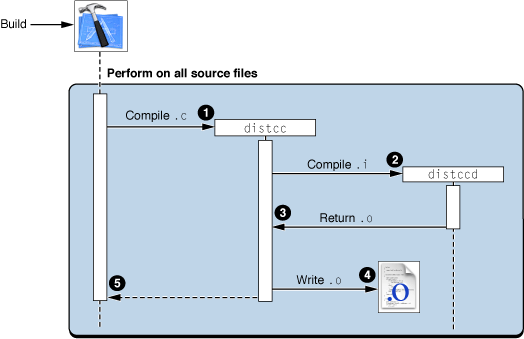
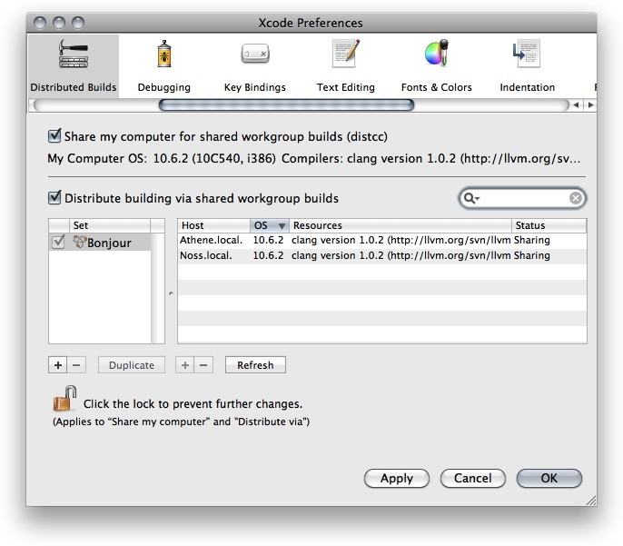

> 导航：[总目录](../../../README.md) · [documentation](../../../_indexes/documentation.md) · [Xcode Build System Guide](Introduction.md)


[Next](Document%20Revision%20History.md)[Previous](Linking.md)

# Reducing Build Times

Xcode offers a number of features you can take advantage of to decrease build time for your project. For example, you can use distributed builds to shorten the time it takes to build your whole project or multiple projects. ZeroLink and predictive compilation, on the other hand, improve turnaround time for single file changes, thereby speeding up the edit–build–debug cycle. All of these features reduce the amount of time you spend idle while waiting for your project to build.

This chapter describes the following features:

- Precompiled prefix headers let you decrease the amount of time spent building compiling each source file in a target by specifying a single header file that includes all of the headers commonly used by the target’s files and compiling this header a single time.
- Predictive compilation reduces the time required to compile single file changes by beginning to compile a file while you are still editing it.
- Distributed builds can dramatically reduce build time for large projects by distributing compiles to available machines on the network.

Fix and Continue, described in [Modifying Running Code](https://developer.apple.com/library/archive/documentation/DeveloperTools/Conceptual/XcodeDebugging/230-Modifying_Running_Code/modifying_running_code.html#//apple_ref/doc/uid/TP40007057-CH10), improves your debugging efficiency by allowing you to make changes to your application and see the results of your modifications without stopping your debugging session.

A precompiled header is a file in the intermediate form used by the compiler to compile a source file. Using precompiled headers, you can significantly reduce the amount of time spent building your product. Often, many of the source code files in a target include a subset of common system and project headers. For example, each source file in a Cocoa application typically includes the `Cocoa.h` system header, which in turn includes a number of other headers. When you build a target, the compiler spends a great deal of time repeatedly processing the same headers.

You can significantly reduce build time by providing a prefix header that includes the set of common headers used by all or most of the source code files in your target and by having Xcode precompile that prefix header.

If you have indicated that Xcode should do so, Xcode precompiles the prefix header when you build the target. Xcode then includes that precompiled header file for each of the target's source files. The contents of the prefix header are compiled only once, resulting in faster compilation of each source file. Furthermore, subsequent builds of the target can use that same precompiled header, provided that nothing in the prefix header or any of the files on which it depends has changed. Each target can have only one prefix header.

When Xcode compiles your prefix header, it generates a variant for each C language dialect used by your source files; it stores these in the folder specified by the `SHARED_PRECOMPS_DIR` (Precompiled Headers Cache Path) build setting. It also generates—as needed—a variant for each combination of source header and compiler flags. For example, you may have per-file compiler flags set for some of the files in the target you are building. Xcode will create a variant of the precompiled header by precompiling the prefix header with the set of compiler flags derived from the target and the individual source file. As Xcode invokes the compiler to process each source file in your target, the compiler searches the precompiled header directory for a precompiled header variant matching the language and compiler flags for the current compile. Xcode uses the first precompiled header variant that is valid for the compilation.

Precompiled headers can be reused across targets and projects. Targets that share the same prefix header and common compiler settings will automatically share the same precompiled header.

Xcode automatically regenerates the precompiled header whenever the prefix header, or any of the files it depends on are changed, so you don't need to manually maintain the precompiled header.

To take advantage of precompiled headers in Xcode, you must first create a prefix header. Create a header file containing any common `#include` and `#define` statements used by the files in your target.

Do not include in the prefix header anything that changes frequently. Xcode recompiles your precompiled header file when the prefix header, or any of the headers it includes, change. Each time the precompiled header changes, all of the files in the target must be recompiled. This can be an expensive operation for large projects.

Because the compiler includes the prefix header file before compiling each source file in the target, the contents of the prefix header must be compatible with each of the C language dialects used in the target. For example, if your target uses Cocoa and contains both Objective-C and C source files, the prefix header needs to include the appropriate guard macros to make it compatible with both language dialects, similar to the example shown here:

```objc
    #ifdef __OBJC__
    #import <Cocoa/Cocoa.h>
    #endif
    #define MY_CUSTOM_MACRO 1
    #include "MyCommonHeaderContainingPlainC.h"
```


Once you have created the prefix header, you need to set up your target to precompile that header. To do this, you must provide values for the two build settings described here. You can edit these build settings in the Build pane of the target inspector or Info window. The settings you need to change are:

- `GCC_PREFIX_HEADER` (Prefix Header). Change the value of this build setting to the project-relative path of the prefix header file. If you have a precompiled header file from an existing project, set the prefix header path to the path to that file.
- `GCC_PRECOMPILE_PREFIX_HEADER` (Precompile Prefix Header). Make sure that this option is turned on. A checkmark is present in the Value column if this option is enabled.

You must provide values for these settings in each target that uses a precompiled prefix header, even if those targets use the same prefix header.

By default, Xcode precompiles a version of the header for each C-like language used by the target (C, C++, Objective-C, or Objective-C++). The `GCC_PFE_FILE_C_DIALECTS` (C Dialects to Precompile) build setting lets you explicitly specify the C dialects for which Xcode should produce versions of the precompiled header.

It is possible to share a precompiled header binary across multiple targets in multiple projects, provided that those targets use the same prefix header and compiler options. In order to share a precompiled header binary, each individual target must have the same prefix header specified. To use the same prefix header for multiple targets, for each target set the value of the Prefix Header build setting to the path to the header.

Each target must also specify a common directory as the destination for the precompiled header generated by Xcode. The `SHARED_PRECOMPS_DIR` (Precompiled Headers Cache Path) build setting specifies the location of the directory to which Xcode writes the precompiled header binary. By default, this is defined as `<Xcode_Persistent_Cache>/com.apple.Xcode.$(UID)/SharedPrecompiledHeaders` for all newly created or upgraded projects. When Xcode invokes GCC to compile each source file in a target, GCC searches this common directory for the appropriate header binary. For any targets that use the same prefix header and compiler options, GCC uses the same precompiled header binary when it builds those targets.

Xcode also defines the build setting `PRECOMPS_INCLUDE_HEADERS_FROM_BUILT_PRODUCTS_DIR` (Precompiled Header Uses Files From Build Directory). This build setting is a hint to the build system; it indicates whether a target's prefix header includes headers files from the target's build directory. If your prefix header includes header files from the build directory, set this build setting to `YES` by selecting the checkbox next to the build setting in the Build pane. If your targets share a common build directory outside of the project directory, Xcode still shares precompiled headers across compatible targets. If, however, you use the default build directory location within the project directory, Xcode shares precompiled headers across compatible targets only within the same project.

If your target's prefix header does not include headers from its build directory, set the `PRECOMPS_INCLUDE_HEADERS_FROM_BUILT_PRODUCTS_DIR` build setting to `NO`, to increase the chances that Xcode will be able to use a shared precompiled header when building the target.

If you specify the same prefix header for multiple targets but do not specify a common location for the precompiled binary, Xcode precompiles the prefix header once for each target as it is built.

Xcode compiles your prefix header whenever it fails to find a matching precompiled header binary in the shared precompiled header location. As described earlier in this chapter, Xcode automatically rebuilds your precompiled prefix header if you make changes to the prefix file or to any files it includes. Xcode also recompiles your prefix header if you make changes to your target's build settings that affect the compiler options used to build the target's files.

You can also force Xcode to rebuild your precompiled header by:

- Touching the prefix file.
- Cleaning the target. By default, cleaning a target removes all of the intermediate and product files generated for that target by the build system, including any precompiled headers. The next time you build the target, Xcode rebuilds the target's precompiled header files, along with all other files in the target. See Removing Build Products and Intermediate Build Files.

By default, cleaning a target removes the precompiled header for that target—whether or not Xcode initially generated the precompiled header binary as part of building that target. Because rebuilding precompiled headers can be time consuming, you may want to clean an individual target without discarding the precompiled header binaries for that target if you are sharing precompiled headers across many targets in multiple projects. When you initiate a clean, Xcode displays a dialog that lets you choose whether to preserve precompiled headers. To keep precompiled headers, deselect the Also Remove Precompiled Headers option. By default, this option is enabled.

Xcode caches the precompiled header files that it generates. To control the size of the cache devoted to storing those files, use the `BuildSystemCacheSizeInMegabytes` user default. In the Terminal application, type:

`defaults write com.apple.xcode BuildSystemCacheSizeInMegabytes` _defaultCacheSize_

Specifying 0 for the cache size gives you an unlimited cache. The default cache size set by Xcode is 1024 MB. If the cache increases beyond the default size, Xcode removes as many precompiled headers as is necessary to reduce the cache to its default size when Xcode is next launched. Xcode removes the oldest files first.

To take advantage of Xcode’s automatic support for precompiled headers you must:

- Use GCC 3.3 or later.
- Use a native target. Automatic support by Xcode for precompiled prefix headers using PCH is available only for targets that use the Xcode native build system. Xcode automatically handles many of the restrictions upon using precompiled headers with GCC. If you are using an external target to work with another build system—such as `make`—you can still use precompiled headers, but you must create and maintain them yourself. For more information on using precompiled headers with GCC, see _GNU C/C++/Objective-C 3.3 Compiler_. Jam-based targets can also use precompiled prefix headers, but they are limited to the PFE (persistent front end) mechanism introduced with GCC 3.1. PFE is no longer recommended.
- Use one and only one prefix header per target.
- Set the Prefix Header and Precompile Prefix Header build settings for every target that uses precompiled headers.

Predictive compilation is a feature introduced to reduce the time required to compile single file changes and speed up the edit–compile–debug cycle of software development. If you have predictive compilation enabled for your project, Xcode begins compiling the files required to build the current target even before you tell Xcode to build.

Predictive compilation uses the information that Xcode maintains about the build state of targets that use the native build system. Xcode keeps the graph of all files involved in the build and their dependencies, as well as a list of files that require updating. At any point in time, Xcode knows which of the files used in building a target’s product are out of date and what actions are required to bring those files up to date. A file can be updated when all of the other files on which it depends are up to date. As files become available for processing, Xcode begins to update them in the background, even as you edit your project.

Xcode will even begin compiling a source code file while you are editing it. Xcode begins reading in and parsing headers, making progress compiling the file even before you initiate a build. When you do choose to save and build the file, much of the work has already been done.

Until you explicitly initiate a build, Xcode does not commit any of the output files to their standard location in the file system. When you indicate that you are done editing, by invoking one of the build commands, Xcode decides whether to keep or discard the output files that it has generated in the background. If none of the changes made subsequent to its generation affect the content of a file, Xcode commits the file to its intended location in the file system. Otherwise, Xcode discards its results and regenerates the output file.

You can turn on predictive compilation by selecting “Use Predictive Compilation” option in the Building pane of the Xcode Preferences window.

Predictive compilation works only with GCC 4.0 or later and native targets. All predictive compilation is done locally on your computer, regardless of whether you have distributed builds enabled. On slower machines, enabling predictive compilation may interfere with Xcode performance during editing.

When developing Mac OS X applications, you normally use a _system SDK_, such as the Mac OS X v10.4 SDK or the Mac OS X v10.5 SDK. In this document, an SDK (software development kit) is a set of frameworks or libraries that provide particular functionality to your product. A system SDK is one included in Xcode to provide an interface to core Mac OS X functionality. System SDKs reside in `<Xcode>/SDKs`.

There may be times when, in addition to a system SDK, you need link against _sparse SDKs_. A _sparse SDK_ is an SDK that is not a system SDK. Sparse SDKs may be provided by third parties, or you may build them yourself.

To specify additional SDKs to link against, use the `ADDITIONAL_SDKS` (Additional SDKs) build setting. You can specify the paths to sparse SDKs in this build setting.

At build time, the build system groups the target’s additional SDKs into a single SDK, known as a _composite SDK_. Composite SDKs are cached in the `<Xcode_Persistent_Cache>` directory (see Overview of Xcode Projects for details on the Xcode persistent-cache location). Therefore, targets (from any of your projects) that list the same set of additional SDKs, share the composite SDK the build system generates, which improves compilation times.

Building a product involves several tasks. Some tasks, such as compiling precompiled headers and linking a binary, can be performed effectively only by the computer that hosts a build. However, the main task performed in a build—compiling source files—can be carried out in parallel by several computers. Builds that use several computers to compile source files are known as _distributed builds_. When you use distributed builds, Xcode distributes as many compilation tasks among the computers available for this purpose within a network.

Distributed builds use two types of computers: build clients and build servers.

- A _build client_ is the computer that performs the build. This is the computer that runs the Xcode or xcodebuild instance that carries out the build command.
- A _build server_ is a computer that a build host can use to perform compilation tasks. Build servers do not need to run Xcode or xcodebuild to aid a build host. But they must at least be running the same version of the Mac OS as the build server.
- A _build set_ is made up of the host names of build servers to which a build client distributes compilation tasks. To distribute a build, you must define at least one build set on the build client, or use the Bonjour set when available.

Xcode distributes builds among computers using a technology known as shared workgroup builds.

To specify whether builds started by a particular user on a computer are to be distributed to other computers (that is, whether the computer acts as a build client for that user), use the “Distribute via shared workgroup builds” option and pop-up menu in the Distributed Builds preferences while logged in as that user (see [Distributed Builds Preferences](#apple-f4xwc4dqnrsv64tfmyxwi33df52wszbpkridimbqgazdmojvfvjvomru) for details). You may also specify build servers in `xcodebuild` invocations.

The following sections describe distributed workgroup builds in more detail and provide guidelines for deciding which type of distributed build to use for a particular project.

Shared workgroup builds work best when building small to medium projects using up to ten build servers. Their main advantage is easy set up (including Bonjour support). Their main disadvantage is the requirements it imposes on the computers to be used as build servers by a build client.

To perform a shared workgroup build, build clients distribute compilation tasks to the build servers specified in the host list in Xcode Preferences > Distributed Builds or in the build-server list given to `xcodebuild`. The build client performs the build set-up, such as compiling precompiled headers, and linking. (Precompiled headers are compiled by the build client to ensure that all build servers use the same precompiled header in a build.)

To distribute the compilation task of a build, Xcode and `xcodebuild` invoke the `distcc` tool instead of `gcc`. The `distcc` tool is the client-side process that distributes compilation tasks among build servers.

Build servers run the `distccd` daemon, which responds to compilation requests sent by `distcc` in the build client. When a build server receives a compilation request, it obtains the preprocessed implementation files from the build client, invokes `gcc` to compile the files into an object file, and sends the object file to the build client. Figure 6-1 illustrates this process.

__Figure 6-1__  Shared workgroup build process



This list explains the process shown in Figure 6-1:

1. Xcode (or `xcodebuild`) invokes `distcc` in the build client to compile a source file.
2. Process `distcc` preprocesses the source file using the compiler specified by the target, finds a compatible build server, and sends the preprocessed source file to the `distccd` process running on that computer. See [Requirements for Using Shared Workgroup Builds](#apple-f4xwc4dqnrsv64tfmyxwi33df52wszbpkridimbqgazdmojvfvjvona) for information on how compatible build servers are identified.
3. The `distccd` process in the build server invokes `gcc` with the file provided by `distcc` as input and returns the output `gcc` generates.
4. The `distcc` process in the build client places the output from `distccd` in the project’s build directory.
5. The `distcc` process tells Xcode (or `xcodebuild` whether the compilation task was successful.

If a build client’s compilation request fails—for example, if communication with the build server is lost or the build server cannot execute the compilation request—Xcode (or `xcodebuild`) performs the compilation on the build client.

Build servers respond to compilation requests as they are able. That is, a build server that is processing a compilation request, may not respond to another compilation request from a build client until it’s done. Xcode and `xcodebuild` distribute compilation operations to the most capable build servers first. But, when there are enough compilation operations to distribute among the available build servers, Xcode uses all of them, regardless of their processing power. For example, when a build client has three build servers available, two fast ones and one slow one, and a build requires three compilation tasks, all the servers receive a compilation request, even it the two fast servers would complete the tasks faster by themselves than when the slower server is used.

Build servers cache precompiled headers to speed-up subsequent build requests that require the same precompiled header. Before compiling a preprocessed file, the build server determines whether it needs to get a new copy of the precompiled header from the build client. Therefore, modifying precompiled headers (as for in non–distributed builds) adversely affects the performance of shared workgroup builds.

Use of distributed builds is subject to the following constraints:

- You must use GCC 3.3 or later.
- Computers that compilation tasks are distributed to must be running the same version of the compiler specified by the target and the same operating system as the build client. These computers must also have the same architecture as the build client. For example, an Intel-based Macintosh can distribute builds only among other Intel-based Macintosh computers. A PowerPC-based Macintosh can distribute builds only among other PowerPC-based Macintosh computers.
- Shared workgroup builds are available only to native targets. Jam-based targets or targets using another external build system are not compatible with shared workgroup builds.
- Shared workgroup builds support C, C++, Objective-C, and Objective-C++.
- Shared workgroup builds are enabled on a per-user basis for all projects and targets built by that user.

To advertise a computer as a shared workgroup build server, select the appropriate option in Xcode Preferences > Distributed Builds. As an alternative, you may execute the following command:

```
sudo /bin/launchctl load -w /System/Library/LaunchDaemons/distccd.plist
```

You should not share your computer if you are using it to host distributed builds. That is, you should not have both “Share my computer for building” and “Distribute builds” selected in the Distributed Builds preference pane. Because precompilation and the distribution of build tasks are done on your local computer, allowing others to distribute build tasks to your computer can significantly slow down your own builds.

Using Xcode to distribute builds across multiple computers will reduce the time it takes to build your product. However, the degree of improvement in build times you get depends on many factors. These are a few of them:

- __Networking speed.__ In shared workgroup builds Xcode sends files to be built on other computers; those computers, in turn, send back the resulting object files. To see a significant reduction in build time, your network must be fast enough that the cost of transferring files between computers is minimal. Very busy or slow networks may have a detrimental effect on distributed build performance.
- __Network accessibility.__ Build clients that have different network interface (for example, Ethernet and AirPort) may see different sets of build servers if the networks are not completely bridged.

  For example, consider a workgroup in which the Ethernet network is protected by a firewall but the AirPort network is public. In such a workgroup, a build client that uses AirPort exclusively cannot access any of the Ethernet-based build servers.
- __Number of available computers.__ The more processors you have at your disposal, the more compilation tasks can be performed in parallel and the more significant the reduction in build time that you see. If you have a limited number of build servers available—especially if those computers do not have significant processing capacity—you may not see any noticeable improvements in build performance. The overhead of managing the distribution of compilation tasks may overcome the benefit you get from compiling on additional machines. You may find that you get better build performance from utilizing other optimizations, such as precompiled headers or parallel builds, on your local computer.
- __Avoid using the host computer as a build server.__ Xcode automatically performs compilation operations locally when there’s a shortage of available build servers or when a build server is unable to carry it out a request within a certain period.

Xcode must completely finish building one target before starting to build another, which means that all the source files for a given target must complete compiling before any files from dependent targets can start compiling. Therefore, to maximize the potential for parallel compilation, instead of many targets with few source files per target, you should have fewer targets with more source files per target. A target with a single file will effectively stall all the build servers.

For shared workgroup builds, Xcode provides the default preference `XCMaxNumberOfDistributedTasks` to control the maximum number of parallel compilation tasks allowed during a build. Use this preference only if you want to reduce the number of compilation tasks Xcode creates to complete a build. For more information on these preferences, and on how to set them, see _Xcode User Default Reference_.

The Distributed Builds pane in Xcode preferences contains options for distributing build tasks to other computers in your network. Figure 6-2 shows the Distributed Builds pane.

__Figure 6-2__  Distributed Builds preferences pane



Here is what the pane contains:

- __Share my computer for shared workgroup builds.__ Turning on this option makes your computer available to shared workgroup build clients.

  When you select this option, the pop-up menu specifies the priority assigned to compilation tasks that are distributed to your computer. This setting determines the amount of processing time allocated for a compilation task in relation to other tasks the computer is performing during a compilation task. You can choose high, low, or medium priority. The default value is “medium priority.” This value is appropriate for most situations. When you want build tasks to take precedence over any other tasks, choose “high priority.” When you want tasks other than build tasks to use the most processing power, choose “low priority.”
- __My Computer OS.__ This text field indicates the operating system the local host is running.
- __Compilers.__ This text field indicates the compilers available on the local host.
- __Distribute building via shared workgroup builds.__ This option specifies whether to use distributed workgroup builds. When this option is selected, Xcode distributes builds to the sets selected in the build set list, explained next. Otherwise, all compilation tasks are performed on your computer.
- __Set list.__ This list contains the names of build server sets to which builds can be distributed to. When “Distribute via shared workgroup builds” is selected, Xcode (or `xcodebuild`) distributes builds to the build servers that are members of the selected sets. A set’s members are displayed in the host list when the set is highlighted in the build set list.

  The Bonjour set appears in the build set list only when you’re distributing builds using shared workgroup builds. The build servers in this set are dynamically added or removed as they become available or unavailable for shared workgroup builds in your local network. See _[Xcode Build System Guide](https://developer.apple.com/library/archive/documentation/DeveloperTools/Conceptual/XcodeBuildSystem/index.html)_ for more information.

  You can add, remove, and duplicate build sets using the buttons below the list. You can add host names to a set by dragging or copying names from another set or from a text file. (Note that you cannot modify the Bonjour build set.) Conversely, you can create host-list file containing the hosts in a build set by dragging or pasting a set to a text file. For example, you can create a host-list file identifying hosts you want members of your team to use for their distributed builds, and send it to them in an email message. Your colleagues can then create an empty build set and drag the host-list file onto it.
- __Host list.__ This list contains the names of the hosts that are members of the sets highlighted in the build set list. The host list contains these columns:

  - __Host:__ The name or IP address that identifies a build server. Note that once you add a host name or IP address to a build set, if the name or IP address of that host subsequently changes, Xcode (and `xcodebuild`) won’t be able to locate it. You must update the name or IP address in the host list in order to distribute builds to that host.
  - __OS:__ The operating system the host is running. When the host is not available, “Unavailable” appears in this column.
  - __Resources:__ The compilers and other resources available in the host. Compilers that are incompatible with the corresponding compilers in the build client are shown in red. Xcode doesn’t distribute a compilation task to a build server when the compiler required by the task is shown in red.
  - __Status:__ The sharing state of the host. This column can have these values:

    - __Sharing:__ The host is available as a build server. The host has been advertised as a build server. See [How Shared Workgroup Builds Work](#apple-f4xwc4dqnrsv64tfmyxwi33df52wszbpkridimbqgazdmojvfvjvoni) for details.
    - __Not Sharing:__ The host is not available as a build server because it hasn’t been advertised as such.
    - __Incompatible Service:__ The host is not available as a build server because the version of the distributed build tool in the host is not compatible with the version in the build client. Make sure both computers have the same version of Xcode installed.
    - __Unreachable:__ The host is not available as a build server because the local host cannot access it.

  When you place the pointer over a host in the host list, a tooltip indicates the number of processors and speed of that host.

  You can add and remove hosts from highlighted sets by using the buttons below the host list. You can also add hosts in the host list to a build set by dragging or pasting the hosts to the build set you want to add them to. You can create a host-list file with the host names of one or more hosts by selecting hosts in the host list and dragging or copying them to a text file. Then you can drag the host-list file into a build set to add the hosts identified in the file to the build set.
- __Search field.__ This search field allows you to narrow the hosts shown in the host list.

[Next](Document%20Revision%20History.md)[Previous](Linking.md)

