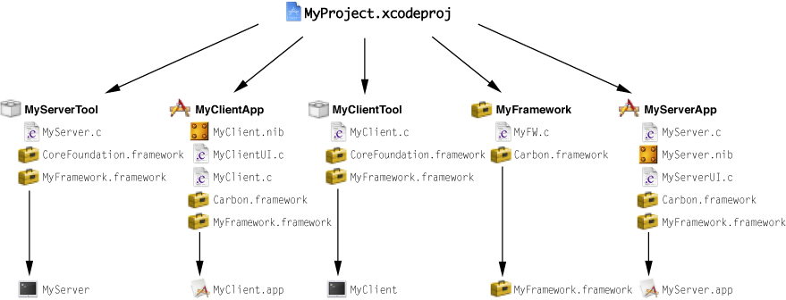
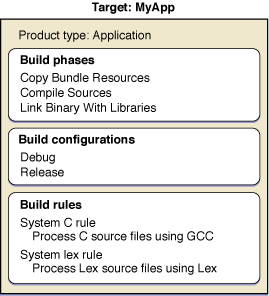
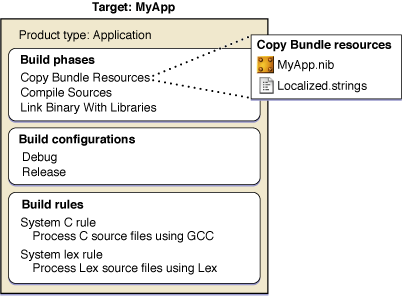
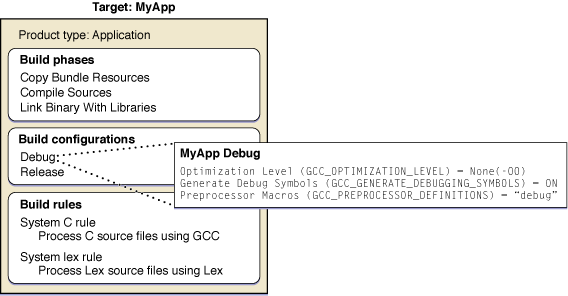
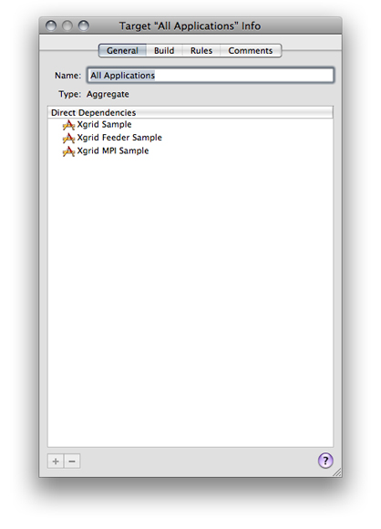
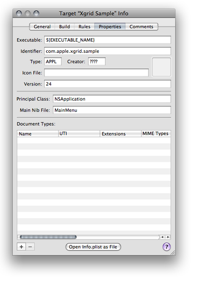
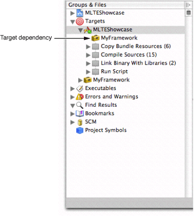
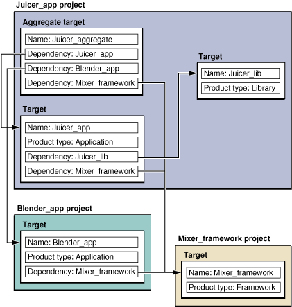
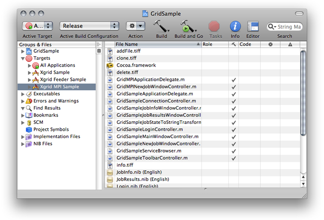
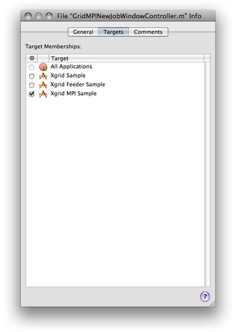

> 导航：[总目录](../../../README.md) · [documentation](../../../_indexes/documentation.md) · [Xcode Build System Guide](Introduction.md)

[Next](Build%20Phases.md)[Previous](Introduction.md)

# Targets

The organizing principle of the Xcode build system is the _target_. A _target_ contains the instructions for building a finished product from a set of files in your project—for example, a framework, library, application, or command-line tool. Each target builds a single product. A simple Xcode project has just one target, which produces one product from the project’s files. A larger development effort with multiple products may require a more complex project containing several related targets. For example, a project for a client-server software package may contain targets that create a client application, a server application, command-line tool versions of the client and server functionality, and a private framework that all the other targets use.

Figure 1-1 shows the targets you may have in a project such as the one described earlier, and the products that those targets create. The following list shows the project’s main components.

__Figure 1-1__  Targets and products

- __Project__

  `MyProject.xcodeproj`: The file package containing the information about the project and its targets.
- __Targets__

  - MyServerTool: Builds a server-side command-line tool.
  - MyClientApp: Builds a client-side application.
  - MyClientTool: Builds a client-side command-line tool.
  - MyFramework: Builds a framework.
  - MyServerApp: Builds a server-side application.
- __Products__

  - `MyServer`: A server-side command-line tool
  - `MyClient.app`: A client-side application.
  - `MyClient`: A client-side command-line tool.
  - `MyFramework.framework`: A framework.
  - `MyServer.app`: A server-side application.

When you initiate a build, Xcode builds the product specified by the _active target_ and any targets on which the active target _depends_ (see [Defining Target Dependencies](#apple-f4xwc4dqnrsv64tfmyxwi33df52wszbpkridimbqgazdmobzfvjvomjr) to learn about dependent targets). In the Groups & Files list, the _active target_ is marked by a checkmark in a green circle. You can also see which target is active, as well as change the active target, in the Active Target pop-up menu in the project and Build Results windows. When you execute the Build command, Xcode builds the product of the active target.

This chapter describes Xcode targets and how to manage them.

A _target_ is a blueprint for creating a product. To build a product, the build system takes a set of inputs—source files and the instructions for processing them—and produces an output (such as an application or a framework). The inputs to the build system are:

- __Build settings.__ A build setting contains information on how to perform the operations required to build a product. For example, a build setting can specify command-line options for Xcode to pass to the compiler. Build settings can contain tool-specific options, paths to build files and product directories, and other information used by Xcode to determine how to perform build operations.

  Because build settings represent variable aspects of the build process, they are the most flexible means of customizing the build process. See [Build Settings](Build%20Settings.md#apple-f4xwc4dqnrsv64tfmyxwi33df52wszbpkridimbqgazdmojrfvbecq2jizauiry) for more information on using build settings.
- __Files.__ For each product, the build system takes a set of files as inputs and performs various operations on them—such as compiling, linking, copying, and so forth—to arrive at the final output. Examples of source files are header files, implementation files, resource files, and so forth.
- __Per-file compiler flags.__ Per-file compiler flags are additional options Xcode passes to the compiler as it compiles each source file. See Per-File Compiler Flags to learn more.

A target, illustrated in Figure 1-2, organizes the inputs required to create a single product.

__Figure 1-2__  A target

A target contains:

- __Build phases.__ Build phases organize the build files of a target according to the operations required to build the target’s product. Each build phase consists of a list of input files and a task to be performed on each of those files. Common build phases include compiling files, linking object files, and copying resource files. Figure 1-3 shows the files that may be in a typical build phase.

  __Figure 1-3__  Files in a Copy Bundle Resources build phase

  

  Xcode populates each new target with a predetermined set of build phases. You can add or remove build phases to change the operations Xcode performs when it builds the target. For further details on build phases, see [Build Phases](Build%20Phases.md#apple-f4xwc4dqnrsv64tfmyxwi33df52wszbpkridimbqgazdmojqfvbuuqkhirceqsi).
- __Build configurations.__ Each target contains one or more named collections of build settings, called build configurations. A build configuration specifies a set of build settings that are used to build a target's product in a particular way. By defining multiple configurations for a target, you can quickly build different variations on the target's product. You can also modify all of a target's build configurations at once to define build settings that are shared by all configurations. Figure 1-4 shows some of the build settings that might be defined by one build configuration of a target.

  __Figure 1-4__  Build settings in a build configuration

  
- __Build rules.__ A target’s build rules determine how each source file in the target is processed. Each build rule consists of a _condition_—such as files matching the type `.c`—and an _action_. Typically, this action specifies the tool Xcode invokes to process files that meet the condition; this is how Xcode determines the compiler to use for compiling source files, for example. Xcode maintains a list of build rules for targets that use the native build system. For targets that use an external build tool, you maintain the instructions for processing the build files with a makefile or other method.

  Xcode defines a default set of build rules, but you can define custom build rules for a target. For more information on using build rules, see [Build Rules](Build%20Phases.md#apple-f4xwc4dqnrsv64tfmyxwi33df52wszbpkridimbqgazdmojqfvbeeq2dizcuisq).

A target and the product that it creates are closely related; every target has an associated _product type_. When you create a target from a target or project template, you choose the target’s product type, as described in [Creating Targets](#apple-f4xwc4dqnrsv64tfmyxwi33df52wszbpkridimbqgazdmobzfvbusscdirfeiqq).

Based on the product type, Xcode specifies initial values for certain product-specific build settings. For example, when you create a target that builds an application, Xcode assigns it the build setting specification `INSTALL_PATH = "/Applications"` based on the product type. Any subsequent changes you make to the target after creating it may override these default values. Note that the project and target templates contain additional configuration information that Xcode uses when it creates targets.

When you need to work on a software package with multiple products—for example, an application, a command-line tool, and a framework—an easy way to group all the pieces into one project is to use multiple targets. This section describes the tasks you may need to perform on a project that requires multiple targets, including creating, editing, duplicating, and removing targets. It also teaches how to create target dependencies so that, for example, Xcode builds your framework before building the application that uses it.

When you create a project from one of the Xcode project templates, Xcode automatically creates a target for you. If, however, your project needs to contain more than one target—usually because you are creating more than one product—you can also add targets to an existing project.

If you are adding targets to your project, chances are you’ve already made a number of decisions about product type, programming language, and framework. Xcode provides a number of _target templates_ to support your choices. The selection of target templates is similar to the selection of project templates. The target specifies the target’s product type, a list of default build phases, and default definitions for some build settings. A target template typically includes all build settings and build phases required to build an instance of the specified product. Unlike the project templates provided by Xcode, the target templates do not specify any default files; you must add files to the target yourself, as described in [Managing Target Files](#apple-f4xwc4dqnrsv64tfmyxwi33df52wszbpkridimbqgazdmobzfvbusscji5ducry).

To create a target and add it to an existing project:

1. Choose __Project > New Target__.

   Xcode displays the New Target assistant, which lets you choose from a number of possible target templates. Each target template corresponds to a particular type of product, such as an application or loadable bundle.
2. Select one of the templates and click Next.
3. Enter the name of the target.

   If more than one project is open, you can choose which project to add the target to from the Add to Project pop-up menu.
4. Click Finish.

   Xcode creates a target configured for the specified product type. Xcode also creates a reference to the target’s product and places it in your project, although the product does not exist on the file system until you build the target.

Table 1-2 lists templates that create targets using the native build system. Because it performs all target and file-level dependency analysis for targets using the native build system, Xcode can offer detailed feedback about the build process and integration with the user interface for these targets.

__Table 1-1__  iOS target templates

| Target template | Creates |
| __Cocoa Touch__ |  |
| Application | An application based on the Cocoa Touch framework. |
| Static Library | A static library. |
| Unit Test Bundle | A target that compiles test code into a bundle, links it with the Unit Test framework and an executable to be tested, and runs a series of unit tests. |

__Table 1-2__  Mac OS X target templates

| Target template | Creates |
| _Cocoa_ |  |
| Application | An application, written in Objective-C or Objective-C++, that links against the Cocoa framework. |
| Dynamic Library | A dynamic library that links against the Cocoa framework. |
| Framework | A framework based on the Cocoa framework. |
| Loadable Bundle | A bundle, such as a plug-in, that can be loaded into a running program. |
| Shell Tool | A command-line utility based on the Cocoa framework. |
| Static Library | A static library, written in Objective-C or Objective-C++, based on the Cocoa framework. |
| Unit Test Bundle | A target that compiles test code into a bundle, links it with the Unit Test framework and an executable to be tested, and runs a series of unit tests. |
| _Application Plug-in_ |  |
| Automator Action | A target that builds an Automator action. |
| _BSD_ |  |
| Dynamic Library | A dynamic library, written in C, that makes use of BSD. |
| Object File | A single-module object file using BSD API. |
| Shell Tool | A command-line utility, written in C. |
| Static Library | A static library, written in C, that makes use of BSD. |
| _System Plug-in_ |  |
| Generic Kernel Extension | A kernel extension |
| IOKit Driver | A device driver that uses the I/O Kit. |

In addition to these target templates, Xcode defines a handful of target templates that do not necessarily correspond to a particular product type. These targets are known as _special targets_ and can be used to:

- Build a group of targets together
- Copy files to a specific file system location
- Build a product using an external build system
- Run a shell script

These are the special target types:

- __Aggregate Target__

  Xcode defines a special type of target that lets you build a group of targets at once, even if those targets do not depend on each other. An aggregate target has no associated product and no build rules. Instead, an aggregate target depends on each of the targets you want to build together. For example, you may have a group of products that you want to build together. You would create an aggregate target and make it depend on each of the product targets. To build all the products, just build the aggregate target.

  An aggregate target may contain a custom Run Script build phase or a Copy Files build phase, but it cannot contain any other build phases. Any build settings that the aggregate target contains are not interpreted but are passed to the build phases that the target contains. For more information on aggregate targets, see [Defining Target Dependencies](#apple-f4xwc4dqnrsv64tfmyxwi33df52wszbpkridimbqgazdmobzfvjvomjr).
- __Copy Files Target__

  A Copy Files target is an aggregate target that contains only one build phase, a Copy Files build phase. Building a Copy Files target simply copies the associated files to the specified destination in the file system. Copy Files targets are useful if you have custom build steps that require files that are not specific to any other targets to be copied. While Copy Files build phases allow you to add a step to the build process for a single target that copies files in that target, a Copy Files target lets you copy files that are not specific to any one target. For example, if your project has several targets that require the same files to be installed at a particular location, you can use a Copy Files target to copy the files, and make each of the other targets depend upon the Copy Files target. For more information on the Copy Files build phase, see [Copy Files Build Phase](https://developer.apple.com/library/archive/documentation/DeveloperTools/Conceptual/XcodeBuildSystem/200-Build_Phases/bs_build_phases.html#//apple_ref/doc/uid/TP40002690-SW2).
- __External Target__

  Xcode allows you to create targets that do not use the native Xcode build system but instead use an external build tool that you specify. For example, if you have an existing project with a makefile, you can use an external target to run `make` and build the product.

  An external target creates a product but does not contain build phases. Instead, it calls a build tool in a directory. With an external target, you can take full advantage of the Xcode text editor, class browser, and source-level debugger. However, many Xcode features—such as Fix and Continue—rely on the build information maintained by Xcode for targets using the native build system. As a result, these are not available to an external target. Furthermore, you must maintain your custom build system yourself. For instance, if you need to add files to an external target built using `make`, you must edit the makefile yourself. To learn how to work with non–Xcode-based projects in a more straightforward way, see [Using the Organizer](https://developer.apple.com/library/archive/documentation/DeveloperTools/Conceptual/XcodeProjectManagement/140-Using_the_Organizer/using_the_organizer.html#//apple_ref/doc/uid/TP40006917-CH279).
- __Shell Script Target__

  A Shell Script target is an aggregate target that contains only one build phase, a Run Script build phase. Building a Shell Script target simply runs the associated shell script. Shell Script targets are useful if you need to perform custom build steps. While Run Script build phases allow you to add custom steps to the build process for a single target, a Shell Script target lets you define a custom build operation that you can use with many targets. For example, if your project has several targets that use the files generated by a Shell Script target, you can make each of those targets depend upon the Shell Script target. For more information on using shell scripts as part of the build process, see [Run Script Build Phase](https://developer.apple.com/library/archive/documentation/DeveloperTools/Conceptual/XcodeBuildSystem/200-Build_Phases/bs_build_phases.html#//apple_ref/doc/uid/TP40002690-SW1).

To edit a target you use the _target editor_, which allows you to view and modify target settings. As described in [Target Overview](#apple-f4xwc4dqnrsv64tfmyxwi33df52wszbpkridimbqgazdmobzfvbusscdindecqq), a target defines the instructions necessary to create a product. Each target has an associated set of files, tasks, and settings that together constitute these instructions. You can edit and view many of these settings in the target editor.

The information available in the target editor varies, depending on the type of target. The target editor for native targets lets you view and edit all target settings and build information associated with that target. The target editor for external targets contains only general information. To edit build information for either of these types of targets, you must use the target editor.

To learn how to modify the files and build phases associated with a target, see [Managing Target Files](#apple-f4xwc4dqnrsv64tfmyxwi33df52wszbpkridimbqgazdmobzfvbusscji5ducry) and [Build Phases](Build%20Phases.md#apple-f4xwc4dqnrsv64tfmyxwi33df52wszbpkridimbqgazdmojqfvbuuqkhirceqsi), respectively.

The Target Info window is the primary mechanism for viewing and editing target information. Figure 1-5 shows the target editor.

__Figure 1-5__  General pane in the Target Info window

The target editor contains the following panes:

- __General.__ The General pane contains global information about a target, such as its name, the name of the associated product, and target dependencies. To learn more, see [Editing General Target Settings](#apple-f4xwc4dqnrsv64tfmyxwi33df52wszbpkridimbqgazdmobzfvbeeq2eifbeuri).
- __Build.__ The Build pane lets you view and edit build settings for the target. It is described in Editing Build Settings.
- __Rules.__ The Rules pane displays the current system build rules, as well as any custom build rules defined for the current target. For more information, see [Build Rules](Build%20Phases.md#apple-f4xwc4dqnrsv64tfmyxwi33df52wszbpkridimbqgazdmojqfvbeeq2dizcuisq).
- __Properties.__ The Properties pane lets you edit information property list entries for targets that create products requiring `Info.plist` files, such as applications and other bundles.
- __Comments.__ The Comments pane lets you associate notes or other documentation with the target. See Adding Comments to Project Items for more information.

In the General pane of the target editor, you can edit basic target settings for any target in an Xcode project. The General pane contains the following settings:

- __Name.__ The name Xcode uses to refer to the target. It may also specify the product name (see _[Xcode Build System Guide](../Xcode%20Build%20System%20Guide%20%282016%29.md#apple-f4xwc4dqnrsv64tfmyxwi33df52wszbpkridimbqgaztsmzr)_ for more information).
- __Type.__ The type of product created by the target. The product type is determined when you create the target; you cannot change it.
- __Direct Dependencies list.__ The Direct Dependencies list identifies the targets upon which the current target depends. See [Adding Target Dependencies](#apple-f4xwc4dqnrsv64tfmyxwi33df52wszbpkridimbqgazdmobzfvbuuqsji5feqra) to learn more about target dependencies.

Information property list entries contain information used by the Finder and other system software. This information ends up in a file, called `Info.plist` that is contained within the product bundle. If a product does not come in the form of a bundle, it has no `Info.plist` file.

The `Info.plist` file defines for the Finder such things as the bundle’s icon, the documents it can open, the URLs it can handle, and so on. Unlike build settings, property list entries do not affect the build process; they are copied into the bundle’s `Info.plist` file at the end of the build process. Note, however, that Xcode evaluates build settings referenced in the `Info.plist` file, and you can have Xcode preprocess the `Info.plist` file with the GCC preprocessor. For a list of entries used by the system, see _[Runtime Configuration Guidelines](../../Mac%20OSX/Runtime%20Configuration%20Guidelines/Introduction.md#apple-f4xwc4dqnrsv64tfmyxwi33df52wszbpgeydambqge3ta2i)_.

The Properties pane of the target editor, shown in Figure 1-6, allows you to edit information property list entries for native targets. This pane is visible only for targets that create products with `Info.plist` files.

__Figure 1-6__  Target editor: Properties pane

The top section of the Properties pane allows you to edit essential information about the product, such as the name of the associated executable, bundle identifier, type and creator, version information, and the icon to associate with the finished product. Note that the name of the icon here must match the name of an icon file that is copied into the `Resources` directory of the product bundle.

The Principal Class and Main Nib File settings are specific to Cocoa applications and bundles, and Automator actions. Principal Class corresponds to the `NSPrincipalClass` property list key. Main Nib File specifies the nib file that’s automatically loaded when the application launches. It corresponds to the information property list key `NSMainNibFile`.

The Document Types list allows you to specify which documents your finished product can handle. These are the aspects each entry in the list specifies:

- __Name.__ The name of the document type. For example, “Apple Sketch Document.”
- __UTI.__ A list of Uniform Type Identifiers (UTIs) for the document. UTIs are strings that uniquely identify abstract types. They can be used to describe a file format or data type but can also be used to describe type information for other sorts of entities, such as directories, volumes, or packages. For more information on UTIs, see _[Uniform Type Identifiers Overview](../../File%20Management/Uniform%20Type%20Identifiers%20Overview/Introduction%20to%20Uniform%20Type%20Identifiers%20Overview.md#apple-f4xwc4dqnrsv64tfmyxwi33df52wszbpkridimbqgaytgmjz)_.
- __Extensions.__ A list of the filename extensions for this document type. Don’t include the period in the extension. For example, `sketch` and `draw2`.
- __MIME Types.__ A list of the MIME types for the document.
- __OS Types.__ A list of four-letter codes for the document. These codes are stored in the documents’ resource or information property list files. For example, `sktc`.
- __Class.__ The subclass of `NSDocument` that this document uses. Use this field only if you’re writing a document-based Cocoa application.
- __Icon File.__ The name of the file that contains the document type’s icon.
- __Store Type.__ The store type is the type of backing store to use to serialize the document. For more information on store types, see _[Core Data Programming Guide](https://developer.apple.com/library/archive/documentation/Cocoa/Conceptual/CoreData/index.html#//apple_ref/doc/uid/TP40001075)_.
- __Role.__ A description of how the application uses the documents of this type. You can choose from three values:

  - Editor. The application can display, edit, and save documents of this type.
  - Viewer. The application can display, but not edit, documents of this type.
  - None. The application can neither display nor edit documents of this type but instead uses them in some other way. For example, the Finder could declare an icon for font documents.
- __Package.__ Specifies whether the document is a single file or a file package.

You may have additional keys that you need to include in your `Info.plist` file; for example, applications that include Apple Help help books need two additional `Info.plist` entries. To add these additional keys, you can edit the `Info.plist` file directly by clicking the Open Info.plist as File button at the bottom of the Properties pane. Note that you can refer to build settings in the `Info.plist` file. For example, `$(PRODUCT_NAME)` expands to become the base name of the product built by the target.

You can set properties on multiple targets; simply select the targets in the project window and open the target editor. In the Properties pane, you can edit the values of properties that apply to more than one target.

You can specify that Xcode process the `Info.plist` file using the GCC preprocessor. This allows you to include headers, use `#if`-style conditional statements, and take advantage of macro expansion in the `Info.plist` file.

To preprocess the `Info.plist` file in a target, turn on the Preprocess Info.plist File (INFOPLIST_PREPROCESS) build setting.

You can also use the following build settings to control preprocessing of `Info.plist` files:

- Info.plist Preprocessor Definitions (INFOPLIST_PREPROCESSOR_DEFINITIONS). A list of preprocessor macros to define when preprocessing the `Info.plist` file. For example, `DEBUG=1`.
- Info.plist Preprocessor Prefix File (INFOPLIST_PREFIX_HEADER). The path to a prefix file to include when preprocessing the `Info.plist` file. Use a project-relative or an absolute path.
- Info.plist Other Preprocessor Flags (INFOPLIST_OTHER_PREPROCESSOR_FLAGS). A list of additional flags to pass to GCC when preprocessing the `Info.plist` file. For more on the flags you can pass here, see _GNU C 4.0 Preprocessor User Guide_.

There are two main reasons you might need to duplicate a target: You require two targets that are very similar but contain slight differences in the files or build phases that they include, or you have a complicated set of options that you build with and would prefer to simply start with a copy of a target that already contains those build settings.

Xcode allows you to duplicate a target, creating a copy that contains the same files, build phases, dependencies and build configuration definitions of the original.

To create a copy of a target:

1. Select the target you want to copy in the Groups & Files list.
2. Choose one of these:

   - Edit > Duplicate
   - Groups & Files list shortcut menu > Duplicate

When your project contains targets that are no longer in use, you may want to remove them to reduce clutter.

To remove a target from a project:

1. Select the target to delete in the Groups & Files list.
2. Press the Delete key or choose:

   - Edit > Delete.

When you delete a target, Xcode also deletes the product reference for the product created by that target and removes any dependencies on the deleted target.

In a complex project, you may have several targets that create a number of related products. Frequently, these targets need to be built in a specific order. Returning to the example of the client-server software package created by the project shown in [Figure 1-1](#apple-f4xwc4dqnrsv64tfmyxwi33df52wszbpkridimbqgazdmobzfvbuuqkdivdegry), you see that the client application, server application, and command-line tool targets each link to the private framework created by another target in the same project.

Before the application and command-line tool targets can be built, the framework target must be built. Because they require the private framework in order to build, each of the application and command-line tool targets is said to depend upon the target that creates the framework. You can use a _target dependency_ to ensure that Xcode builds targets in the proper order; in this example, you would add a dependency upon the framework target to each of the application and command-line tool targets.

However, the applications and command-line tool in the client-server package must still be built individually. None of these targets requires the product created by any target other than the framework target. Xcode provides another mechanism for grouping targets that you want to build together but that are otherwise unrelated; this is an _aggregate target_ (see [Creating Targets](#apple-f4xwc4dqnrsv64tfmyxwi33df52wszbpkridimbqgazdmobzfvbusscdirfeiqq) for details). This section shows how to add a target dependency and create an aggregate target, and gives an example of how you can use these tools to organize a software development effort with multiple products and projects.

To build several targets together, even if they aren’t dependent on each other, create an _aggregate target_. As described in [Creating Targets](#apple-f4xwc4dqnrsv64tfmyxwi33df52wszbpkridimbqgazdmobzfvbusscdirfeiqq), an _aggregate target_ does not produce a product itself and it does not contain build rules or information property list entries. Instead it exists so that you can make it dependent on other targets. When you build the aggregate target, the build system builds the targets it depends on sequentially or in parallel. To learn about building targets concurrently, see Building in Parallel.

To create an aggregate target:

1. Choose Project > New Target.
2. Select Aggregate from the New Target Assistant.

For each target you want to build with this aggregate target, add a target dependency to the aggregate target, as described in the [Adding Target Dependencies](#apple-f4xwc4dqnrsv64tfmyxwi33df52wszbpkridimbqgazdmobzfvbuuqsji5feqra).

Note that, although it does not contain any other build phases, an aggregate target can include a Run Script or Copy Files build phase. Any build setting defined for the aggregate target will not be interpreted, but will be passed to any build phases that the target contains.

When you build a target (target A) with a dependency upon another target (target B), Xcode makes sure that target B is built and up to date before building target A. That way, you can be sure that when target A needs the product created by target B, target B is built before target A. In addition, if there are errors building target B, Xcode doesn’t build target A.

You can view and modify a target’s dependencies in two ways:

- In the General pane of the target editor. The Direct Dependencies list shows the targets upon which the current target depends.

  To add a target dependency, click the plus-sign button. (For the plus sign button to be available, the project must contain or reference more than one target.) The list of targets shown includes all the other targets in the current project, as well as the targets in any referenced projects. Targets in referenced projects are grouped according to the project to which they belong. For more information on referencing other projects, see Referencing Other Projects. You may also drag a target from the Targets group to the Direct Dependencies list.

  To remove a target dependency, select it in the list and click the minus button.
- In the Groups & Files list. Open the Targets group; the targets that the current target depends on are listed before the build phases in the target. You can make the current target depend on another target by dragging that target to the current target in the Groups & Files list.

  Figure 1-7 shows a target dependency in the Groups & Files list.

__Figure 1-7__  Groups & Files list: Target dependency

To remove a target dependency:

1. Select the target to modify in the Groups & Files list.
2. Open the target editor and display the General pane.
3. In the Direct Dependencies list, select the target dependency to delete.
4. Click the minus (-) button.

Suppose that your organization has two teams working on separate applications, that one application includes an internal library, and that each application relies on a framework supplied by a third team. Figure 1-8 shows one way to set up your software development with three Xcode projects, using project references, target dependencies, and aggregate targets to relate the various products.

__Figure 1-8__  Three projects with dependencies

In Figure 1-8, the `Juicer_app` project contains the `Juicer_app` target for building the Juicer application, and the `Juicer_lib` target for building an internal library. The application target depends on the library target, and also has a cross-project dependency on the `Mixer_framework` target in the `Mixer_framework` project. Finally, the `Juicer_app` project contains the `Juicer_aggregate` target as a convenience for building the entire suite of projects.

In Figure 1-8, the `Blender_app` project contains a target for building the Blender application. The Blender target also has a cross-project dependency on the Mixer framework.

Finally, the `Mixer_framework` project contains a target for building the Mixer framework, used by both the Juicer and Blender applications.

Given this combination of projects, targets, and dependencies, the following statements are true:

- Building the Juicer target builds the Juicer library if it needs updating, and also builds the Mixer framework, if it needs updating.
- Building the Juicer aggregate target builds the Juicer application, which builds the Juicer library if it needs updating. The aggregate target also builds the Blender application and the Mixer framework.
- Building the Juicer library does not cause any other targets to be built.
- Building the Blender target builds the Mixer framework if it needs updating.

When you add files to a project, you can have Xcode also add those files to one or more targets. This is the easiest way to add files to a target. However, you may have existing files in your project that you wish to add to a target, or find that you no longer need a target file. This section describes how to view the files in a target and shows you how to add and remove target files.

To view all of the files included in a target, select the target in the Groups & Files list; all targets are grouped under the Targets group. The detail view shows all the files and folders in the target, similar to what you see in Figure 1-9. If one is not already open in the current window, open a detail view by choosing:

- View > Detail

__Figure 1-9__  Target files in the project window

You can also see a target’s files grouped according to the operation performed on those files during the build process. If you open a target in the Groups & Files list (by clicking the disclosure triangle next to it), you see the _build phases_ for that target. Build phases, described in further detail in [Build Phases](Build%20Phases.md#apple-f4xwc4dqnrsv64tfmyxwi33df52wszbpkridimbqgazdmojqfvbuuqkhirceqsi), represent a task performed when the target is built. To see the files in a particular build phase, do one of the following in the Groups & Files list:

- Select the build phase. The build phase files appear in the detail view.
- Open the build phase. The build phase files appears under the build phase name.

Xcode provides several ways to modify a set of target files. In the project window, you can see all the files in a target and you can add files to, or remove files from, the target. You can also use file-info editors to see which targets include them and change their target membership.

To add files to a target, you can:

- Drag the file reference or references to the appropriate build phase of the given target in the Groups & Files list. For native targets, Xcode does not let you drag a file to a build phase that does not accept that type of file as an input. For example, you cannot drag a nib file to the Compile Sources build phase. See [Build Phases](Build%20Phases.md#apple-f4xwc4dqnrsv64tfmyxwi33df52wszbpkridimbqgazdmojqfvbuuqkhirceqsi) for more information on the available build phases and their files.
- Specify that a file be included in a target when you add that file to your project, as described in Managing Files and Folders in a Project.
- Add a file to the active target. Find the file in the detail view or in the Groups & Files list and select the checkbox in the Target column for that file. If the Target column is not visible, select either these:

  - Groups & Files list header shortcut menu > Target Membership
  - Detail view header shortcut menu > Target

To remove a file from a target, in the Groups & Files list:

1. Open the target to reveal its build phases.
2. Open the build phase to which the file belongs.
3. Select the file to remove from the target, and either:

   - Choose Delete from the shortcut menu
   - Choose Edit > Delete

To remove a file from the active target, find the file in the detail view or in the Groups & Files list and deselect the checkbox in the Target column for that file. Xcode removes the file from the target but does not remove the file reference from the project.

To see which targets a file belongs to and modify the file’s target membership, select the file reference in the project window, open the file-info editor, and display the Targets pane, shown in Figure 1-10.

__Figure 1-10__  File-info editor: Targets pane

The _Targets Membership table_ shows all the targets in the current project. The checkbox next to each target indicates whether the file is included in that target.

If you have multiple files selected, the Targets pane may show a dash in the checkbox next to a target. This indicates that some of the selected files are included in that target, while others are not. If the checkbox next to a target is dimmed, that target does not contain a build phase appropriate for processing the selected file or files.

Header files have a special purpose in a target: They publish the programming interface to symbols defined or implemented in the target’s implementation files. Implementation files in a target use header files to gain access to symbols defined in other implementation files. But implementation files may also require access to the programming interface to frameworks, libraries, or plug-ins that are not part of the project.

When you define a target, you may implement symbols you want to make public to clients of the target’s product. But, to make your product easy to use (and to keep implementation details hidden), you may want to keep many of its symbols inaccessible to clients of your product. Also, if you develop products to be used both by the development team and by end users, you may need to publish interfaces to symbols that must be used only by other team members but that end users must not use. You use a header file’s _role_ within its target to specify the purpose of the header file.

To set the role of header files in a target:

1. Select the target containing the header files whose role you want to set.
2. Select the target’s Copy Headers build phase.
3. Choose the desired role for each header file from the Role column in the detail view.

There are three roles available: `public`, `private`, and `project`. Table 1-3 describes these roles.

__Table 1-3__  Header file roles

| Role | Header file disposition |
| `public` | The header file is included as part of the build product. Its location is specified by the Public Headers Folder Path (PUBLIC_HEADERS_FOLDER_PATH) build setting. You should publish as `public` only interfaces that are finalized and meant to be used by your product’s end users. |
| `private` | The header file is included as part of the build product. Its location is specified by the Private Headers Folder Path (PRIVATE_HEADERS_FOLDER_PATH) build setting. You should publish as `private` interfaces that you don’t intend to be used by end users or that are in early stages of development. |
| `project` | The header file is available only for use by implementation files in the current project. This header file is not included as part of the built product. |

[Next](Build%20Phases.md)[Previous](Introduction.md)

