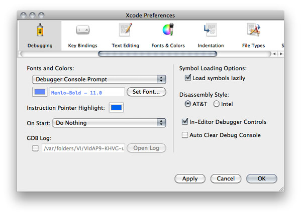

> 导航：[总目录](../../../README.md) · [documentation](../../../_indexes/documentation.md) · [Xcode Debugging Guide](Introduction.md)

[Next](Managing%20Program%20Execution.md)[Previous](Debugging%20in%20the%20Console.md)

# Debugging Preferences

The Debugging pane of Xcode preferences contains options for customizing the debugger console, the text editor debugging experience, and other debugging aspects. Figure 6-1 shows the Debugging preferences pane.

__Figure 6-1__  Debugging preferences pane

Here’s what the pane contains:

- __Fonts and Colors:__ Specifies the color and font used for text in the console.
- __Instruction Pointer Highlight:__ Specifies the color used to highlight the location of the instruction pointer in the debugger window when execution of the current program is stopped.
- __On Start:__ Specifies actions to perform when you launch a program from Xcode. The actions include showing the console, the debugger, or the mini debugger.
- __GDB Log:__ Specifies a file into which GDB logs its activities.
- __Symbol Loading Options:__ Specifies symbol loading behavior.

  - __Load symbols lazily:__ When selected, the debugger defers loading symbols until they are needed. Otherwise, Xcode loads all symbols for the executable and its libraries when you launch it in the debugger. You can further customize which symbols are loaded in the Shared Libraries window. See [Viewing Shared Libraries](Viewing%20Variables%20and%20Memory.md#apple-f4xwc4dqnrsv64tfmyxwi33df52wszbpkridimbqga3tanjxfvbuqojnknltgni) for more information.
- __Disassembly Style:__ Specifies the disassembly format used in the text editor and the debugger. See [Viewing Disassembly Code and Processor Registers](Debugging%20in%20the%20Debugger.md#apple-f4xwc4dqnrsv64tfmyxwi33df52wszbpkridimbqga3tanjxfvbuqnrnknltcni) for more information.
- __In-Editor Debugger Controls:__ Specifies whether the debugger strip appears in the text editor. See [Debugger Strip](Debugging%20in%20the%20Text%20Editor.md#apple-f4xwc4dqnrsv64tfmyxwi33df52wszbpkridimbqga3tanjxfvbuqnbnknltenq) to learn about the debugger strip.
- __Auto Clear Debug Console.__ Specifies whether to clear the debugging console at the start of a debugging session.

[Next](Managing%20Program%20Execution.md)[Previous](Debugging%20in%20the%20Console.md)

