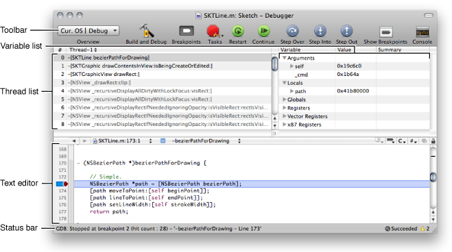
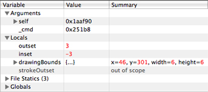
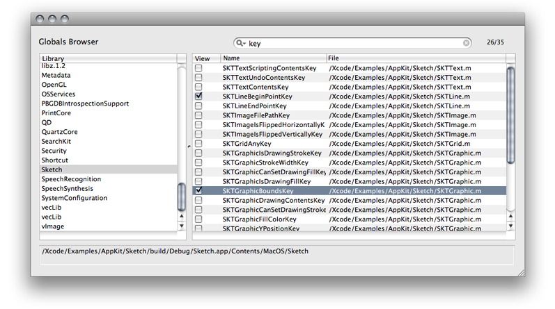
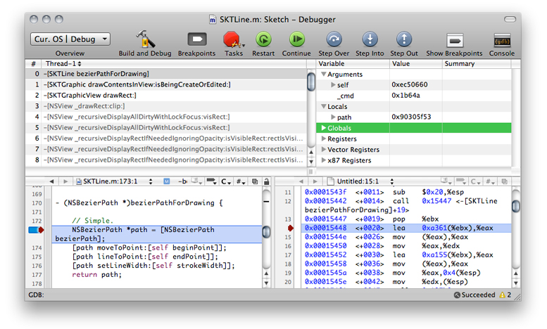

> 导航：[总目录](../../../README.md) · [documentation](../../../_indexes/documentation.md) · [Xcode Debugging Guide](Introduction.md)

[Next](Debugging%20in%20the%20Text%20Editor.md)[Previous](Debugging%20Essentials.md)

# Debugging in the Debugger

The Xcode Debugger window offers a traditional but rich debugging experience. This chapter describes the debugger and explains how to use its features to debug your program.

Figure 2-1 shows the Debugger window.

__Figure 2-1__  The Debugger window

Here are the contains:

- __Toolbar__

  Contains items used to manage your project and to control your program’s execution.
- __Thread list__

  Displays the call stack of the current thread. The pop-up menu above this view lets you select different threads to view when debugging a multi-threaded application.
- __Variable list__

  Shows the variables defined in the current scope and their values. This section also shows the current state of all processor registers when the disassembly view is enabled (see [Viewing Disassembly Code and Processor Registers](#apple-f4xwc4dqnrsv64tfmyxwi33df52wszbpkridimbqga3tanjxfvbuqnrnknltcni) for more information).
- __Text editor__

  This pane displays the source code you are debugging. When execution of your program is paused, the debugger indicates the line at which execution is paused by displaying the PC indicator, which appears as a red arrow. The line of code is also highlighted. You can change the color used to highlight the currently executing statement with the Instruction Pointer Highlight color well in Xcode > Preferences > Debugging.

  The text editor pane offers alternate ways to execute debugging commands. See [Gutter Shortcut Menu](Debugging%20in%20the%20Text%20Editor.md#apple-f4xwc4dqnrsv64tfmyxwi33df52wszbpkridimbqga3tanjxfvbuqnbnknltcma) and [Debugger Datatips](Debugging%20in%20the%20Text%20Editor.md#apple-f4xwc4dqnrsv64tfmyxwi33df52wszbpkridimbqga3tanjxfvbuqnbnknltcmi) for details.
- __Status bar__

  Displays the current status of the debugging session. For example, in the window shown above, Xcode indicates that GDB has just finished loading symbols for a single shared library.

You can change the layout of the Debugger window by choosing one of the following options:

- Run > Debugger Display > Horizontal Layout
- Run > Debugger Display > Vertical Layout

The Debugger Display menu also lets you specify whether to show source code and/or disassembly code. See [Viewing Disassembly Code and Processor Registers](#apple-f4xwc4dqnrsv64tfmyxwi33df52wszbpkridimbqga3tanjxfvbuqnrnknltcni) to learn more about viewing disassembly code.

If the debugger does not display source code, try the following:

- Make sure you have the source. Apple’s frameworks and many third-party libraries don’t include source code
- Make sure the product contains debugging information. See [Building for Debugging](../Xcode%20Project%20Management%20Guide/Building%20Products.md#apple-f4xwc4dqnrsv64tfmyxwi33df52wszbpkridimbqgazdmojtfvbecqsjindemry) and [Executable-Environment Debugging Information](../Xcode%20Project%20Management%20Guide/Defining%20Executable%20Environments.md#apple-f4xwc4dqnrsv64tfmyxwi33df52wszbpkridimbqgazdmojyfvbuuqsjinduusi).
- If the file is in the Groups & Files list, make sure its name is not in red (red means Xcode can’t find the file).
- If the file is not in the Groups & Files list and your target may need to process it, add the file to the project. See [Files in Projects](https://developer.apple.com/library/archive/documentation/DeveloperTools/Conceptual/XcodeProjectManagement/130-Files_in_Projects/project_files.html#//apple_ref/doc/uid/TP40002666).
- If the file is for a library or framework that was built for you, do one of the following:

  - Place the source file in the same location used by the person who built the library or framework. When someone builds a debuggable binary, the compiler stores the paths of its source files in the binary.
  - Add the directory that contains the file to the source directories list:

    1. Open the executable environment Info window.
    2. Display the Debugger pane.
    3. Enter the directory’s pathname in the “Additional directories to find source files in” list.

For each function or method call that your program makes, the debugger stores information about it in a stack frame. These stack frames are stored in the call stack. When execution of your program is paused in the debugger, Xcode displays the call stack for the currently running process in the Thread list and puts the most recent call at the top.

In multithreaded programs, you can switch between the call stack of each thread using the Thread pop-up menu described in [The Debugger](#apple-f4xwc4dqnrsv64tfmyxwi33df52wszbpkridimbqga3tanjxfvbuqnrnknlte) or with these commands:

- Run > Next Thread
- Run > Previous Thread

Selecting any function call in the call stack displays the stack frame for that function. The stack frame includes information on the arguments to the function, variables defined in the function, and the location of the function call. Xcode displays the frame’s variables in the Variable list and displays its currently executing statement in the text editor with the process counter (PC)—a red arrow. If a stack frame is dimmed, no source code is available for it.

To learn about viewing the stack frame in the text editor, see [Debugger Strip](Debugging%20in%20the%20Text%20Editor.md#apple-f4xwc4dqnrsv64tfmyxwi33df52wszbpkridimbqga3tanjxfvbuqnbnknltenq).

The variables view (Figure 2-2) shows information—such as name, type and value—about the variables in your program. Variables are displayed for the stack frame that is currently selected in the Debugger window.

__Figure 2-2__  Variable list

The variables view can have up to four columns:

1. The Variable column shows the variable’s name.
2. The Type column displays the type of the variable. This column is optional. To display it, choose Debug > Variables View > Show Types.
3. The Value column shows the contents of the variable. If a variable’s value is in red, it changed when the application was last active. You can edit the value of any variable; the changed value is used when you resume execution of your program.
4. The Summary column gives more information on the contents of a variable. It can be a description of the variable or an English language summary of the variable’s value. For example, if a variable represents a point, its summary could read “(x = _x value_, y = _y value_).” You can edit the summary of a variable by double-clicking the Summary column or choosing Debug > Variables View > Edit Summary Format. For a description of how you can format variable summaries, see [Using Data Formatters](Viewing%20Variables%20and%20Memory.md#apple-f4xwc4dqnrsv64tfmyxwi33df52wszbpkridimbqga3tanjxfvbuqojnknltena).

   Xcode provides predefined data formatters for several data types, including `unichar`, `wchar_t`, and any UTF-16 type.

You can choose which columns the debugger shows in the Variable view; Xcode remembers these columns across debugging sessions.

Variables in the Variable view are grouped by category, as shown in Figure 2-2. To view variables in any of these groups, click the disclosure triangle next to that group. These groups are:

- The Arguments group contains the arguments to the function that is currently selected in the call stack.
- The Locals group contains the local variables declared in the function that is currently selected in the call stack.
- The Globals group shows global variables and their values. By default, there are no global variables in this section; you must select those variables you want to track in the Globals Browser, described in [Viewing Global Variables](#apple-f4xwc4dqnrsv64tfmyxwi33df52wszbpkridimbqga3tanjxfvbuqnrnijauerkhijdec).
- The File Statics group shows file statics, if any. This group is not shown if none are present.

To view or inspect the contents of a structured variable (including arrays and vectors) or an object, click the disclosure triangle beside the variable’s name. You can also use a data formatter to display a variable’s contents in the Summary column, as described in [Using Data Formatters](Viewing%20Variables%20and%20Memory.md#apple-f4xwc4dqnrsv64tfmyxwi33df52wszbpkridimbqga3tanjxfvbuqojnknltena), or you can view a variable in its own window. Viewing a variable in its own window is particularly useful for viewing the contents of complex structured variables. To open a variable in its own window, double-click the variable’s name or select it and choose Debug > Variables View > View Variable in Window.

To learn how to view variables in the text editor, see [Debugger Datatips](Debugging%20in%20the%20Text%20Editor.md#apple-f4xwc4dqnrsv64tfmyxwi33df52wszbpkridimbqga3tanjxfvbuqnbnknltcmi).

The Variable list contains a Globals group, which is initially empty. You can choose which global variables to display in the Globals group using the Globals Browser, shown in Figure 2-3. The Globals Browser lets you search for global variables by library.

__Figure 2-3__  Globals Browser

To open the Globals Browser, choose Run > Show > Global Variables.

The debugger must be running and execution of the program being debugged must be paused for this item to be available. If you attempt to open of the Globals group when it’s empty, Xcode automatically opens the Globals Browser.

The Library list, on the left side of the Globals Browser, lists the available libraries, including system libraries and your own libraries.

To see a library’s global variables, select that library in the list; the global variables defined by that library are shown in the table to the right. In the globals table, you can see:

- The name of the global variable
- The file in which the global variable is defined

You can use the search field at the top of the Globals Browser window to filter the contents of the global variables table. To the right of the search field, Xcode displays the number of global variables currently visible, as a fraction of the total number of global variables in the currently selected library.

To add a global variable to the Globals list in the Debugger window variable view, select the checkbox in the View column next to the global variable.

When you select a library in the Library list, the full path to that library is displayed below the list.

When you choose to display disassembly code or when no source code is available for the function or method selected in the Thread list, Xcode displays a pane with disassembled code in the debugger. Figure 2-4 shows disassembled code in the debugger after choosing to view source and disassembly code using the Run > Debugger Display menu.

__Figure 2-4__  Disassembled code in the Debugger window

When the disassembly pane is shown, the Variable list contains a Registers group containing all the processor registers.

[Next](Debugging%20in%20the%20Text%20Editor.md)[Previous](Debugging%20Essentials.md)

