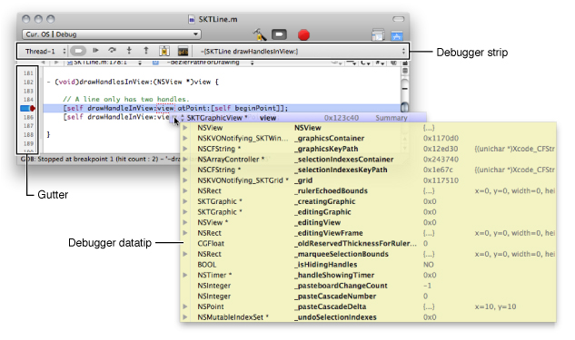
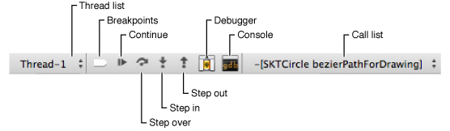
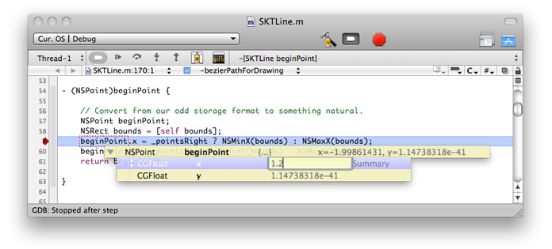

> 导航：[总目录](../../../README.md) · [documentation](../../../_indexes/documentation.md) · [Xcode Debugging Guide](Introduction.md)

[Next](Debugging%20in%20the%20Mini%20Debugger.md)[Previous](Debugging%20in%20the%20Debugger.md)

# Debugging in the Text Editor

You can perform many debugging tasks in the text editor, including controlling program flow, managing breakpoints and watchpoints, and viewing program memory. See [The Text Editor](https://developer.apple.com/library/archive/documentation/DeveloperTools/Conceptual/XcodeWorkspace/100-The_Text_Editor/text_editor.html#//apple_ref/doc/uid/TP40002679) to learn more about the text editor’s capabilities.

This chapter describes how to debug your program from the text editor.

Text Editor Debugger Controls shows the text editor and the debugging controls it provides.

__Figure 3-1__  Debugging in the text editor

These are the controls identified in the figure:

- __Debugger strip.__ Compresses several debugger controls into a small space.
- __Gutter.__ Gives you access to a few debugging commands through its shortcut menu.
- __Debugger datatip.__ Shows the value of a variable when the pointer hovers over it, and lets you modify that value.

The _debugger strip_ (Figure 3-2) is a small control strip that appears above the content pane. It lets you perform several debugging tasks.

__Figure 3-2__  Debugger strip

These are the items in the debugger strip:

- __Thread list.__ List of the threads in the program being debugged.
- __Breakpoints.__ Activates/deactivates breakpoints.
- __Continue.__ Continues execution of a paused process.
- __Step Over.__ Steps over the current code line. The process counter (PC), identified by the red arrow in the gutter, moves to the next code line to be executed in the current file.
- __Step Into.__ Steps into a function or method in the current code line. If possible, the editor shows the source file containing the called routine an the process counter appears in the code line to be executed next.
- __Step Out.__ Steps out of the current function or method. The editor shows the source file containing the caller.
- __Debugger.__ Opens the debugger.
- __Console.__ Opens the console
- __Call list.__ List of the called functions or methods in the current call stack.

The text editor gutter includes several shortcuts to debugging facilities. The code line indicated by the pointer at the time you choose the shortcut is the _action line_. These include:

- __Continue to Here:__ Continues program execution up to the action line.
- __Add Breakpoint:__ Adds a breakpoint to the action line.
- __Add & Edit Breakpoint:__ Adds a breakpoint to the action line and opens the breakpoints window.
- __Built-in Breakpoints:__ Adds a predefined breakpoint to the action line.
- __Enable Breakpoints:__ Activates breakpoints for the current debugging session.
- __Disable Breakpoints:__ Deactivates breakpoints for the current debugging session.
- __Reveal in Breakpoints:__ Opens the action line’s breakpoint in the breakpoints window.

As you debug your program in the text editor, you may need to analyze the contents of the program’s variables as you step through code lines. You can view your program’s variables using a _debugger datatip_. When the pointer hovers over a variable, its contents are progressively disclosed using disclosure triangles. You can also modify the contents of mutable variables.

Figure 3-3 shows a debugger datatip showing the contents of the `bounds` variable. In addition to viewing the variable’s value, you can also modify that value. After double-clicking the value of the `height` field of the `size` structure, you can change it to another value before executing the code line that uses the `bounds` variable.

__Figure 3-3__  Changing variables with debugger datatips in the text editor

As you move the pointer over a disclosure triangle in a datatip row, the contents of the field the row represents are disclosed below that row. (You can turn off this behavior, as explained later.) When the pointer hovers to the right of the disclosure triangle, a control with two small triangles appears. Clicking that control shows the datatip menu. The datatip menu provides the following commands.

- __Print Description:__ Prints the description of the current datatip field in the console.
- __Open in Window:__ Opens a window containing the data of the current datatip field.
- __View as Memory:__ Shows the contents of the current datatip field in the memory viewer window. See [Browsing Memory](Viewing%20Variables%20and%20Memory.md#apple-f4xwc4dqnrsv64tfmyxwi33df52wszbpkridimbqga3tanjxfvbuqojnineeiqscijbek) for more information.
- __Jump to Definition:__ Opens the file that declares the data type of the current datatip field.
- __Jump to Documentation:__ Opens the reference for the data type of the current datatip field.
- __Show Types:__ Toggles the display of the data type of the datatip fields.
- __Show Data Formatters:__ Toggles the display of data formatters for the datatip fields.
- __Sort by Name:__ Sorts datatip fields by field name.
- __Sort by Type:__ Sorts datatip fields by field data type.
- __No Sort:__ Applies no sorting to datatip fields.
- __Auto Expand:__ Toggles the autoexpansion of datatip fields that represent structures when the pointer hovers over the corresponding disclosure triangle.

Debugger datatips also provide program-flow–control controls called _step controls_. These controls allow you to perform Continue, Step Into, and Step Over commands from the content pane of the text editor. To turn on step controls, chose Run > Debugger Display > Datatips > Step Controls.

These are the commands step controls provide:

- __Continue to Here__

  To perform this command, let the pointer hover over the gutter identifying the action line. The Continue to Here icon appears on the left margin of the line (Figure 3-4). Clicking this icon continues program execution up to the action line.

  __Figure 3-4__  Continuing execution to a particular code line

  !!
- _Step In_ and _Step Over_

  To perform these commands, let the pointer hover over the action line in the gutter or the content pane until the Step In or the Step Over icon appears on the left margin of the line (Figure 3-5). Click the icon to perform the command.

  __Figure 3-5__  Stepping into a call

  !!

[Next](Debugging%20in%20the%20Mini%20Debugger.md)[Previous](Debugging%20in%20the%20Debugger.md)

