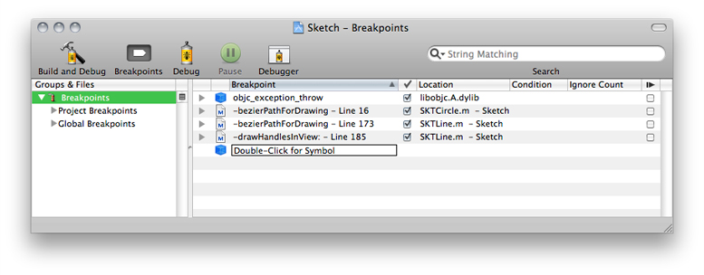
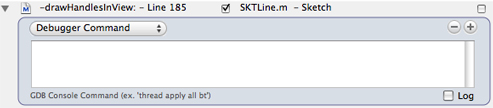
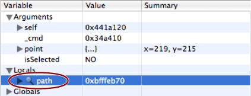

> 导航：[总目录](../../../README.md) · [documentation](../../../_indexes/documentation.md) · [Xcode Debugging Guide](Introduction.md)

[Next](Viewing%20Variables%20and%20Memory.md)[Previous](Debugging%20Preferences.md)

# Managing Program Execution

Xcode provides several mechanisms to control and monitor the execution of an inferior (a program being debugged). While debugging a program you can:

- Pause execution as a result of an event; you may also perform actions such as logging and emitting sounds
- Monitor the value of variables or data items
- Pause execution through special Core Services debugging functions

This section describes the facilities Xcode provides to let you control and monitor the execution of your program.

Breakpoints let you perform actions on certain events, such as when program execution reaches a certain point in the code. Table 7-1 lists the three types of breakpoints.

__Table 7-1__  Breakpoint types

| Breakpoint type | Trigger |
| File line | Execution reaches a specific code line. |
| Symbolic | A specific routine is called. |
| Objective-C exception | An Objective-C exception is thrown. |
| C++ exception | A particular C++ exception is thrown. |

You can add one or more breakpoint actions to a breakpoint. A _breakpoint action_ is an operation that Xcode performs when the breakpoint is triggered. The default action (when the breakpoint has no breakpoint action associated to it) is to pause program execution. However, Xcode also supports:

The following sections show how to view, add, activate/deactivate, customize, and remove breakpoints.

The breakpoints window lets you view and modify breakpoints set in the current project, as well as any defined for the current user. To open the breakpoints window, choose Run > Show > Breakpoints.

Figure 7-1 shows the breakpoints window.

__Figure 7-1__  Breakpoints window

Breakpoints are collected in the Breakpoints smart group. This smart group contains two subgroups: the Project Breakpoints group, which contains breakpoints specific to the current project, and the Global Breakpoints group, which contains breakpoints defined for the current user. Project breakpoints are stored in the project’s user file; that is, they are saved for the current user and the current project. Global breakpoints are available to you in any project that you open.

You can select the Project Breakpoints group or the Global Breakpoints group to see only those breakpoints in the detail view; you can also open the group to see its contents in the outline view. Selecting the Breakpoints smart group displays all available breakpoints in the detail view.

Here is what the detail view for breakpoints contains:

- The disclosure triangle shows and hides any actions associated with the breakpoint.
- The icon indicates the type of the breakpoint. A file icon indicates that it is a file-line or C++ exception breakpoint. A blue cube indicates that it is a symbolic breakpoint.
- The Breakpoint column displays the title of the breakpoint. For file-line breakpoints, it displays the line number and surrounding context of the location at which the breakpoint is set. For symbolic breakpoints, it displays the name of the function or method on which the breakpoint is set.
- The column with the checkmark indicates whether the breakpoint is turned on (selected) or off (unselected). When a breakpoint is turned on (and breakpoints are active), program execution stops when it reaches the specified line or routine call. Otherwise, program execution does not stop on it.

  A dash in this checkbox indicates that, while the breakpoint is turned on, the debugger has not yet resolved it. When you start debugging, these dashes change to checkmarks as the debugger resolves each breakpoint.
- The Location column shows the file in which file line breakpoints are located. For symbolic breakpoints, this column displays “Symbol.”
- The Condition column lets you specify an execute condition for the breakpoint. When you specify a condition, the breakpoint is triggered only if the condition (for example, `i == 24`) is true. You can use any variables that are in the current scope for that breakpoint. Note that you must cast any function calls to the appropriate return type.
- The Ignore Count column specifies the number of times program execution goes through the breakpoint before the the breakpoint is triggered. For example, setting the ignore count for a breakpoint to 5 makes your program stop the sixth time the breakpoint is hit.
- The column with the Continue symbol indicates whether to automatically continue execution of your program after hitting the breakpoint. If the checkbox in this column is selected, program execution stops on the breakpoint, Xcode performs any breakpoint actions and then automatically resumes execution of the program. Otherwise, program execution stops on the breakpoint, Xcode performs any breakpoint actions, and your program does not resume until you give Xcode the command to continue.

You can delete, and turn off or on any existing breakpoint in your project in the breakpoints window. You can also create symbolic breakpoints. However, you can add a breakpoint to a specific line of code only from the editor or the console.

To view the source code for a breakpoint, double-click the breakpoint in the breakpoints window. The source file in which the breakpoint is set (or the function is defined) opens in a separate editor window.

To add a file-line breakpoint, perform one of the following actions:

- Select the line at which you want the breakpoint to be triggered and choose Run > Manage Breakpoints > Add Breakpoint at Current Line.
- Use the gutter shortcut (contextual) menu. See [Gutter Shortcut Menu](Debugging%20in%20the%20Text%20Editor.md#apple-f4xwc4dqnrsv64tfmyxwi33df52wszbpkridimbqga3tanjxfvbuqnbnknltcma) for details.

You can easily move a file-line breakpoint from one code line to another line by dragging the breakpoint arrow to the new line within the code editor.

To add a symbolic breakpoint, perform one of the following tasks:

- Select the trigger code line and choose Run > Manage Breakpoints > Add Symbolic Breakpoint. In the dialog that appears, enter the name of the method or function at which you want the breakpoint to be triggered.
- Open the breakpoints window, double-click on “Double-Click for Symbol,” and enter the trigger routine name.

The `@synthesize` directive instructs the compiler to create accessor methods for a property declared with the `@property` directive. During a debugging session, you may need to set breakpoints on a class’s accessor methods; for example, to find out the places in the program that modify a particular variable. To do that, you can use symbolic breakpoints, as described in [Adding Symbolic Breakpoints](#apple-f4xwc4dqnrsv64tfmyxwi33df52wszbpkridimbqga3tanjxfvbuqobnknltc).

A more convenient way of setting breakpoints on synthesized accessors is to set the breakpoint on the code line with the `@synthesize` directive. If the program is being debugged, (or the next time you start a debugging session on it), Xcode asks you to identify the methods to which you want to add a breakpoint, as shown in Figure 7-2. Xcode remembers your selections in subsequent debugging sessions.

__Figure 7-2__  Setting a breakpoint on an `@synthesize` directive

!!

To learn more about properties, see [Declared Properties](https://developer.apple.com/library/archive/documentation/Cocoa/Conceptual/ObjectiveC/Chapters/ocProperties.html#//apple_ref/doc/uid/TP30001163-CH17).

To add an Objective-C exception breakpoint, select Stop on Objective-C Exceptions under the Run > Activate/Deactivate menu, as shown in Figure 7-3.

__Figure 7-3__  Breaking on Objective-C exceptions

!

To add a C++ exception breakpoint, select the trigger code line and choose Run > Manage Breakpoints > Add C++ Exception Breakpoint. In the dialog that appears, enter the name of the trigger exception.

To stop on all C++ exceptions, select All Exceptions.

Xcode allows you to import and export breakpoints. This feature lets you share sets of breakpoints with other developers working on the same project, or across projects.

To export breakpoints, select the breakpoints you want to export from the Breakpoints smart group in the Groups & Files list and choose Run > Manage Breakpoints > Export Breakpoints.

To import breakpoints into a project, open the Breakpoints smart group and select the group to which you want to add the breakpoints—either Project Breakpoints or Global Breakpoints and choose, Run > Manage Breakpoints > Import Breakpoints.

Xcode adds a new subgroup containing the imported breakpoints to the selected breakpoints group.

To group existing breakpoints, select them in the Breakpoints smart group and choose Group from the Groups & Files shortcut menu.

You can create your own groups within the Breakpoints smart group to organize breakpoints. To add a breakpoints group:

1. Select either the Project Breakpoints or the Global Breakpoints group, depending on which breakpoint realm you want to operate on.
2. Choose Project > New Group.

To rename an existing group, Control-click the group and choose Rename.

To delete a group, select it and press Delete.

You can remove breakpoints using the text editor of the breakpoints window.

To remove a fine-line breakpoint, open the breakpoint’s file in the text editor and drag the breakpoint indicator out of the gutter. You may also select the code line with the breakpoint and choose Run > Manage Breakpoints > Remove Breakpoint at Current Line.

To remove symbolic and C++ exception breakpoints, open the breakpoints window, select the breakpoint, and press Delete.

In the course of debugging a program, you may find that you don’t currently want the debugger to use a particular breakpoint that you have set, but you don’t want to delete it entirely, either, in case you want to use it again at a later time. Instead of deleting the breakpoint from your project, you can simply turn it off. Breakpoints that are turned off are not triggered during program execution.

You can turn any breakpoint in your project on or off. Simply open the breakpoints window and click the checkbox beside the breakpoint you want to modify. A breakpoint is turned on when this checkbox is selected.

You can also turn file-line breakpoints on or off from the text editor by clicking the breakpoint in the gutter. Breakpoints that are turned off appear as a light-gray arrow in the gutter.

You can turn more than one breakpoint on or off—or even groups of breakpoints—at once. To do so:

1. Select the breakpoints you want to turn on or off in the Breakpoints smart group in the Groups & Files list. You can select the individual breakpoints or a breakpoint group.
2. Choose Enable Breakpoints or Disable Breakpoints from the gutter shortcut menu.

To quickly turn on a set of breakpoints, disabling any other breakpoints for the project, select the breakpoints you want to turn on and choose Enable Only These Breakpoints from the gutter Option shortcut menu (Control-Option-click). Turning a breakpoints group on or off affects all breakpoints in that group and in all its subgroups.

Xcode provides a number of breakpoint templates that you can use to insert file-line breakpoints that are preconfigured with various breakpoint actions. To add a breakpoint based on one of these templates, in the text editor’s gutter, choose Built in Breakpoints from the shortcut menu.

These are the breakpoint templates:

- __Log breakpoint with arguments and auto-continue.__ Creates a breakpoint that prints the arguments of the currently executing function or method to the console and automatically continues.
- __Log breakpoint and hit count and auto-continue.__ Creates a breakpoint that prints the number of times the breakpoint has been hit during the current debugging session to the console and automatically continues.
- __Log stack trace and auto-continue.__ Creates a breakpoint that prints a backtrace of the entire stack for the current thread and automatically continues. The Debugger Command action uses the GDB command `bt` to generate the backtrace.
- __Sound out and auto-continue.__ Creates a breakpoint that uses the Sound action to play an alert and automatically continues.
- __Print self and auto-continue.__ Creates a breakpoint that prints a description of an Objective-C object and automatically continues.
- __Speak breakpoint and hit count and auto-continue.__ This creates a breakpoint that uses the Log action to speak the breakpoint name and the number of times it has been encountered during the current debugging session and then automatically continues.

When you choose one of these templates, Xcode inserts a breakpoint at the current line of code and configures it with the appropriate action. You can edit the breakpoint action in the breakpoints window.

You can create your own breakpoint templates from any breakpoints that you have configured by placing them in a group called Template Breakpoints. Any breakpoints that you add to this group appear in the Built-in Breakpoints gutter shortcut menu.

To have the debugger execute breakpoint actions only under certain circumstances, you can associate an execute or ignore condition with a file-line or symbolic breakpoint. See [Viewing Breakpoints](#apple-f4xwc4dqnrsv64tfmyxwi33df52wszbpkridimbqga3tanjxfvbuqobnknltcnq) to learn more about these conditions.

Each time it encounters the breakpoint, the debugger evaluates the expression. If the expression is true—that is, if it evaluates to a nonzero value—the debugger stops at the breakpoint and Xcode performs any breakpoint actions. Breakpoint conditions are currently supported only when using GDB.

As described in [Using Breakpoints](#apple-f4xwc4dqnrsv64tfmyxwi33df52wszbpkridimbqga3tanjxfvbuqobnknltcmy), by default, breakpoints pause the execution of your program. However, you can have breakpoints perform other actions when they are triggered. For example, you can have a breakpoint log additional information to the console, execute a debugger or shell command, or alert you by playing a sound.

To associate a breakpoint action with a breakpoint, open the breakpoint in the breakpoints window. This displays the interface for specifying breakpoint actions, as shown in Figure 7-4.

__Figure 7-4__  Breakpoint action editor

To add an action, click the plus (+) button. Choose the type of action you want Xcode to perform from the actions pop-up menu. Each action has a different interface for specifying the message to log, the sound to play, and so forth.

You can choose any of the following actions:

- __Debugger Command.__ Xcode sends a command to the debugger. Type the command in the text field below the action menu. For example, if you are using GDB, you could specify a command such as `backtrace`.

  Do not use the GDB commands `jump` or `continue` in a breakpoint action if you have set that breakpoint to automatically continue. If the first action associated with a breakpoint is a Debugger Command action, Xcode sets the command on the breakpoint using the GDB command `commands` instead of pausing execution and then sending the command to GDB.
- __Log.__ Xcode logs a message when it encounters the breakpoint. You can choose to have Xcode print a message to the console, speak the message using Text-to-Speech, or do both. Choose either Log or Speak to specify how Xcode logs the message.

  To specify the message that Xcode logs, type it into the text field below the action menu. You can include information about the current breakpoint in the message using the following formatters:

  - `%B`. The name of the breakpoint, as shown in the Breakpoint column of the Breakpoints window. By default, this is the name of the function or method in which the breakpoint is set, including the line number for file-line breakpoints. You can also specify your own name for the breakpoint, as described in [Viewing Breakpoints](#apple-f4xwc4dqnrsv64tfmyxwi33df52wszbpkridimbqga3tanjxfvbuqobnknltcnq).
  - `%H`. The number of times the debugger has encountered the breakpoint in the current debugging session.
  - `%C`. Any comment associated with the breakpoint, as shown in the Comments column of the Breakpoints window.

  For example, if you specify the message `Stopped at %B again. We've been here %H times. Don't you want to stop somewhere else instead?`, you would see a message similar to the following in the console:

  `Stopped at TDialView::Draw() - Line 305 again. We've been here 5 times. Don't you want to stop somewhere else instead?`
- __Sound.__ Xcode plays a sound when it encounters the breakpoint. Use the second pop-up menu to specify which sound to play. You can choose any of the built-in system sounds.
- __Shell Command.__ Xcode executes a command in your default shell when it encounters the breakpoint. Enter the name of the command or shell script file in the first text field. You can also click Choose to navigate to it in the Open dialog. Type any arguments to pass to the command in the second text field. Xcode displays a warning in the project window status bar when it cannot find the command or shell script file entered in the first text field.

  If you have set the breakpoint to automatically continue, Xcode does not, by default, wait until the shell command has finished executing before resuming execution of the program being debugged. To ensure that Xcode does not continue until the specified command has finished executing, select the “Wait until done” option.

  Xcode prints the exit value the command or shell script in the debugger console, whether “Wait until done” is selected.
- __AppleScript.__ Xcode executes an AppleScript script when the breakpoint is encountered. Enter the script in the text field below the action menu. To compile your script, click the Compile button.

  You can use the same format specifiers in your AppleScript script to access information about the current breakpoint as for the Log action, described above.

Xcode supports these breakpoint actions for GDB, the Java debugger, and the AppleScript debugger. Note, however, that the debugger commands that you can pass to the Java and AppleScript debuggers using a debugger command action are limited.

You can use the value of GDB expressions in some breakpoint actions. These expressions can return the value of a local variable or the result of a function call. The breakpoint actions on which you can use GDB expressions are Log, Shell Command, and AppleScript. To execute a GDB expression in a breakpoint action, surround the expression with `@` characters. For example, to print the value of the local variable `i`, use a Log action with the text `i = @i@`. To print the name of the running program, use a Log action with the text `Program name is @(char*)getprogname()@`.

To monitor changes to the value of variables or data items, you can set watchpoints. A _watchpoint_ pauses execution of the program whenever the value of the watched item changes. You can set a watchpoint on a variable only when execution of the program is halted. To set a watchpoint on a variable:

1. With execution of the program paused at a breakpoint, select the variable in the Variable list in the Debugger window. See [Debugging in the Debugger](Debugging%20in%20the%20Debugger.md#apple-f4xwc4dqnrsv64tfmyxwi33df52wszbpkridimbqga3tanjxfvbuqnrnknltc) to learn more about the Variable list.
2. Choose one of the following:

   - Run > Variables View > Watch Variable
   - Watch Variable from the variable list shortcut menu

   Xcode displays a magnifying glass next to the variable to indicate that the variable is being watched, as shown in Figure 7-5.

__Figure 7-5__  Watched variable in the Variable list

When the value of the variable changes, Xcode pauses execution of the program and displays a dialog showing the location of the program counter and the new value of the variable. If execution of the program moves beyond the scope of the current variable, Xcode deletes the watchpoint and pauses execution of the program.

The Core Services framework includes functions, such as `Debugger` and `DebugStr`, that break into the debugger with a message. If your code contains calls to these functions, you can tell the Xcode debugger to stop when it encounters them.

You can turn on this feature for an individual executable, as described in [Executable-Environment Debugging Information](../Xcode%20Project%20Management%20Guide/Defining%20Executable%20Environments.md#apple-f4xwc4dqnrsv64tfmyxwi33df52wszbpkridimbqgazdmojyfvbuuqsjinduusi), or for all executables in the current project. To toggle this feature on or off, choose Run > Stop on Debugger()/DebugStr().

[Next](Viewing%20Variables%20and%20Memory.md)[Previous](Debugging%20Preferences.md)

