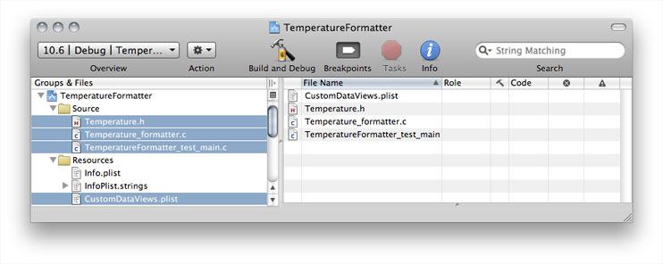
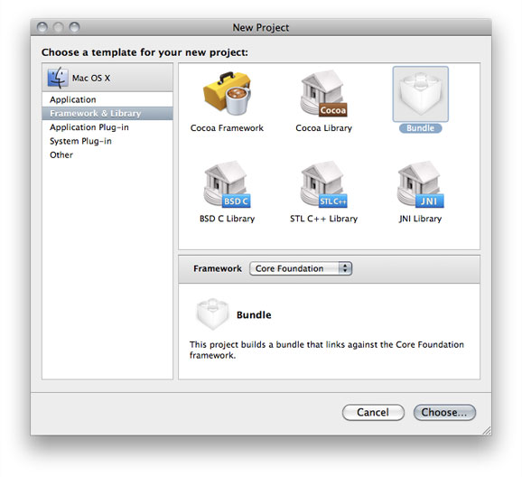
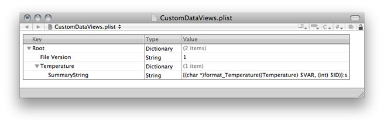
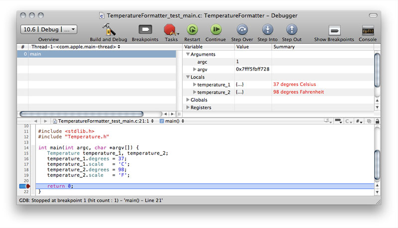
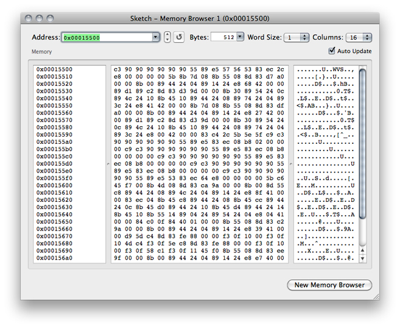
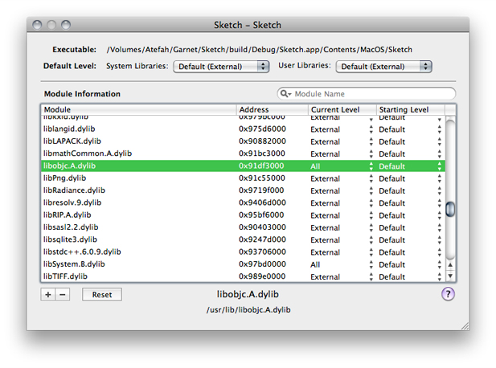

> 导航：[总目录](../../../README.md) · [documentation](../../../_indexes/documentation.md) · [Xcode Debugging Guide](Introduction.md)


[Next](Modifying%20Running%20Code.md)[Previous](Managing%20Program%20Execution.md)

# Viewing Variables and Memory

This chapter describes the various ways in which you can view the values of variables as you debug your programs.

You can view the value of a variable in a variety of formats, including hexadecimal, octal, and unsigned decimal. To display the value of a variable in a different numeric format:

1. Open the Debugger window and select the variable in the Variable list.
2. From Run > Variables View choose one of these options:

   - Natural
   - Hexadecimal
   - OSType
   - Decimal
   - Unsigned Decimal
   - Octal
   - Binary

You can also cast a variable to a type that’s not included in the menu. For example, a variable may be declared as `void *`, yet you know it contains a `char *` value. To cast a variable to a type, select the variable, choose Run > Variables View > View Value As.

Xcode allows you to customize how variables are displayed in debugger datatips and the Variable list in the debugger by specifying your own format strings for the Value or Summary columns. In this way, you can display program data in a readable format. Xcode includes a number of built-in data formatters for data types defined by various Mac OS X system frameworks. You can edit these format strings or create your own data formatters.

To turn data formatters on or off, choose Run > Variables View > Enable Data Formatters.

You can provide your own data formatters to display data types defined by your program. To edit the formatter associated with a variable value or variable summary, select the variable in the Variable list in the debugger and double-click in the appropriate column of the Variable list in the debugger. You can also choose Run > Variables View > Edit Summary Format.

Data formatters can contain literal text and references to certain values and expressions.

- __Literal text.__ You can add explanatory text or labels to identify the data presented by the format string.
- __References to values within a structured data type.__ You can access any member of a structured variable from the format string for that variable. The syntax for doing so is `%<pathToValue>%`, where `<pathToValue>` is the period-delimited path to the value you want to access in the current data structure.

  In C++, to access a member defined in the superclass of an object, the path to the member must include the name of the superclass. For example, `%Superclass.x%`. You don’t need to include the `public`, `protected`, and `private`, keywords in the path.
- __Expressions, including function or method calls.__ The syntax for an expression is `{<expression>}`. To reference the variable itself in `<expression>`, use `$VAR`. For example, to display the name of a notification—of type `NSNotification`—you can use `{(NSString *)[$VAR name]}:s`. See [Data Formatter Macros](#apple-f4xwc4dqnrsv64tfmyxwi33df52wszbpkridimbqga3tanjxfvbuqojnknltm) to learn how to access dynamic structures in data formatters.
- __References to columns in the Variable list.__ When Xcode resolves a data formatter, it replaces the member reference or expression with the value that was obtained by evaluating the reference or expression. This value is the same value found in the Value column of the Variable list. You can, however, specify that Xcode use the contents of any column in the Variable list—Variable name, Type, Value, or Summary. To do so, add `:<referencedColumn>` after the expression or member reference, where `<referencedColumn>` is a letter indicating which Variable-list column to access. So, the syntax for accessing a value in a structured data type becomes `%<pathToValue>%:<referencedColumn>`. Table 8-1 shows the possible values for referencing variable display columns.

  __Table 8-1__  Characters for referencing variable display columns

  | Reference | Variable view column |
  | `n` | Variable (shows the variable name) |
  | `v` | Value |
  | `t` | Type |
  | `s` | Summary |

These are the macros through which you can access dynamic structures in data formatters:

- `$VAR`: The value of the target variable.
- `$ID`: The identifier of the target variable.
- `$PARENT`: The structure containing the target variable.

  This macro is useful only when values of a particular type are always contained in a structure of a specific type, and information contained in this structure is required to successfully evaluate the target variable.

These are some tips and important concepts to keep in mind when using data formatters in your projects:

- __Threaded code.__ If you are debugging heavily threaded code and more than one thread is executing the same code, data formatters may cause threads to run at the wrong time and miss breakpoints. To avoid this problem, disable data formatters.
- __Double-quotation marks.__ Double quotation-mark characters in data formatters must be escaped, as in the following example:

  `{(NSString *)[$VAR valueForKey:@\"name\"]}:s`
- __Memory management.__ Xcode automatically allocates and deallocates the memory data formatters use. But if a data formatter returns a reference to data that resides elsewhere, the formatter is responsible for managing that memory.

  Because there’s no mechanism to notify data formatters when they are no longer used, data formatters should not return dynamically allocated memory. They can, however, return static strings; for example, `"invalid value"`.
- __C++ data.__ Your data formatters may take C++ pointers but not C++ references. With references, copies of the referenced objects are generated, which may cause undesired side effects.

The following example uses the `CGRect` data type to illustrate how you can build format strings using member references and expressions. (Note that because Apple provides format strings for the `CGRect` data type, Xcode already knows how to display the contents of variables of that type). The `CGRect` data type is defined as follows:

```
struct CGRect { CGPoint origin; CGSize size; }; typedef struct CGRect CGRect;
```

Assuming that the goal is to create a format string that displays the origin and size of variables of type `CGRect`, there are many ways you can write such a format string. For example, you can reference members of the `origin` and `size` fields directly. Of course, each of these two fields also contains data structures, so simply referencing the values of those fields isn’t very interesting; the values you want are in the data structures themselves. One way you can access those values is to include the full path to the desired field from the `CGRect` type. For example, to access the height and width of the rectangle, in the `height` and `width` fields of the `CGSize` structure in the `size` field you could use the references `%size.height%` and `%size.width%`. A sample format string using these references might be similar to the following:

```
height = %size.height%, width = %size.width%
```

You could write a similar reference to access the x and y coordinates of the origin. Or, if you already have a data formatter for values of type `CGPoint` that displays the x and y coordinates of the point in the Summary column of the Variable list—such as `(%x%, %y%)`—you can leverage that format string to display the contents of the `origin` field in the data formatter for the `CGRect` type. You can do so by referencing the Summary column for `CGPoint`, as in the following format string:

`origin: %origin%:s`

When Xcode evaluates this format string, it accesses the `origin` field and retrieves the contents of the Summary column for the `CGPoint` data type, substituting it for the reference to the `origin` field. The end result is equivalent to writing the format string origin: `(%origin.x%, %origin.y%)`.

You can combine this format string with the format string for the `size` field and create a data format string for the `CGRect` type similar to the following:

```
origin: %origin%:s, height = %size.height%, width = %size.width%
```

For example, a rectangle with the origin (1,2 ), a width of 3, and a height of 4 results in the following display:

```
origin: (1, 2), width=3, height=4.
```

You can also write a data formatter to display the same information using an expression such as the following:

```
origin: {$VAR.origin}:s, height = {$VAR.size.height}, width = {$VAR.size.width}
```

When Xcode evaluates this expression for a variable, it replaces `$VAR` with a reference to the variable itself. Of course, using an expression to perform a simple value reference is not necessary. Another example of an expression in a format string is `{(NSString *)[$VAR name]}:s` to display the name of a notification, of type `NSNotification`.

When you specify a custom data formatter for a variable of a given type, that format string is also used for all other variables of the same type. Note, however, that you cannot specify a custom format for string types, such as `NSString`, `char*`, and so on. Custom data formatters that you enter in the debugger are stored at:


```
~/
   Library/
      Application Support/
         Developer/
            Shared/
               Xcode/
                  CustomDataViews/
                     CustomDataViews.plist
```


A _data-formatter bundle_ is a plug-in that contains functions you can invoke from the data formatters described in [Using Data Formatters](#apple-f4xwc4dqnrsv64tfmyxwi33df52wszbpkridimbqga3tanjxfvbuqojnknltena). You use data-formatter bundles when you need more power to create a textual representation of a variable than data-formatter expressions provide.

A data-formatter bundle must contain these items:

- `CustomDataViews.plist` file. Defines the front-end (the text representation) of the data formatter.
- `_pbxgdb_plugin_function_list *_pbxgdb_plugin_functions` global symbol. Contains a list of pointers to the functions a plug-in exposes. The source file containing the data-formatter functions defines this symbol.

Data-formatter bundles and the data-formatter function they define must meet these requirements:

- Data-formatter functions must return `char *` for their output to be displayed in the Summary column of the debugger Variables list.
- Data-formatter bundles must be installed in the `<Xcode>` directory.

The following steps create a data-formatter bundle that formats a structure containing temperature data into its Celsius or Fahrenheit representation. Figure 8-1 shows the structure of the finished project and highlights the files that need to be added the project.



1. Create a Mac OS X Bundle project based on the Core Foundation framework.

   
2. Name the project TemperatureFormatter.
3. Delete the External Frameworks and Libraries group from the TemperatureFormatter group in the Groups & Files list.

The following steps create the data-formatter bundle.

1. Add the `Temperature.h` header file, which defines the `Temperature` data type.

   __Listing 8-1__  `Temperature.h`

```
// Temperature.h

typedef struct {
   int  degrees;
   char scale;
} Temperature;
```

   Save the file
2. Add the `Temperature_formatter.c` file, which implements the Temperature data formatter. (This implementation file doesn’t require a corresponding header file.)

   __Listing 8-2__  `Temperature_formatter.c`

```objc
// Temperature_formatter.c

// Change /Developer with the path to your <Xcode> directory if you've placed it elsewhere.
#import "/Developer/Applications/Xcode.app/Contents/PlugIns/GDBMIDebugging.xcplugin/Contents/Headers/DataFormatterPlugin.h"

#include <stdlib.h>
#include <string.h>
#include "Temperature.h"

// Plug-in function list (required symbol).
_pbxgdb_plugin_function_list *_pbxgdb_plugin_functions;

// Error message.
static char *nullPluginFunctions = "CFDataFormatter plugin error: _pbxgdb_plugin_functions not set!";

// Formats Temperature data.
char *format_Temperature(Temperature temperature, int identifier) {
   char *formatter_buff;
   if (_pbxgdb_plugin_functions) {
      formatter_buff = (char *)(_pbxgdb_plugin_functions->allocate(identifier, 255));
      formatter_buff[0] = 0;
      //strcpy(formatter_buff, "Hello");
      sprintf(formatter_buff, "%i degrees %s", temperature.degrees, temperature.scale == 'C'? "Celsius":"Fahrenheit");
   }
   else {
      formatter_buff = nullPluginFunctions;
   }

   // Debugging aid.
   printf("format_Temperature(identifier: %i)\n", identifier);

   return formatter_buff;
}
```

   Save the file.
3. Add a property list file named `CustomDataViews.plist`. Enter the following properties to the file:

```
File Version (String): 1
Temperature (Dictionary):
   SummmaryString (String): {(char *)format_Temperature((Temperature) $VAR, (int) $ID)}:s
```

   

   Save the file.
4. Set the Installation Build Products Location target build setting for all configurations to:

```
$(DEVELOPER_DIR)
```
5. Set the Installation Directory target build setting for all configurations to:

```
/Library/Xcode/CustomDataViews
```
6. Delete the Fix & Continue target build setting for all configurations.
7. Build the bundle, and ensure that there are no build errors.
8. Build the bundle from the command line to install it.

   Launch Terminal and perform these commands:

```
> cd <TemperatureFormatter_project_directory>
> /Developer/usr/bin/xcodebuild install -target TemperatureFormatter
```

   The Temperature data-formatter plug-in is installed in `/Developer/Library/Xcode/CustomDataViews`.
9. Restart Xcode.

The following steps test the bundle created in [Create the TemperatureFormatter Data-Formatter Bundle](#apple-f4xwc4dqnrsv64tfmyxwi33df52wszbpkridimbqga3tanjxfvbuqojnknlts).

1. Add a Shell Tool target named TemperatureFormatterTesting to the TemperatureFormatter project.
2. Delete the Fix & Continue (GCC_ENABLE_FIX_AND_CONTINUE) TemperatureFormatterTesting target build setting in all configurations.
3. Set the active target to TemperatureFormatterTesting.
4. Add the `TemperatureFormatter_test_main.c` file to the TemperatureFormatterTesting target. (This implementation file doesn’t require a header file.)

   __Listing 8-3__  `TemperatureFormatter_test_main.c`

```c
// TemperatureFormatter_test_main.c

#include <stdlib.h>
#include "Temperature.h"


int main(int argc, char *argv[]) {
   Temperature temperature_1, temperature_2;
   temperature_1.degrees = 35;
   temperature_1.scale   = 'C';
   temperature_2.degrees = 98;
   temperature_2.scale = 'F';
   return 0;
}
```
5. Add a breakpoint to the `return 0` statement of the main function.
6. Build and debug the TemperatureFormatterTesting target.
7. Verify that the Variable list in the debugger displays the formatted data, as shown in Figure 8-1.

   __Figure 8-1__  Testing the TemperatureFormatter data-formatter bundle

   

Using the Expressions window, you can view and track the value of an expression. For example, you can track a global value or a function result over the course of a debugging session.

To open the Expressions window, choose Run > Show > Expressions.

Type the expression you want to track in the Expression field. Xcode adds the expression, evaluates it, and displays the value and summary for that expression. The display format of the value and summary information is determined by any data formatters in effect.

The expression can include any variables that are in scope at the current statement and can use any function in your project. To view processor registers, enter an expression such as `'$r0', '$r1'`.

In the debugger you can add a variable to the Expressions window by selecting the variable in the Variable list and choosing Run > Variables View > View Variable As Expression.

To remove an expression from the Expressions window, select it and press Delete.

For best results, follow these tips when using the Expressions window:

- The expression is evaluated in the current frame. As the frame changes, the expression may go in and out of scope. When an expression goes out of scope, Xcode notes this in the Summary column.
- Always cast a function to its proper return type. The debugger doesn’t know the return type for many functions. For example, use `(int)getpid()` instead of `getpid()`.
- Expressions and functions can have side effects. For example, `i++` increments `i` each time it’s evaluated. If you step though 10 lines of code, `i` is incremented 10 times.

When execution of the current program is paused, you can browse the contents of memory using a memory browser.

To open a memory browser, like the one shown in Figure 8-2, choose Run > Show > Memory Browsers.

__Figure 8-2__  A memory browser



You can also open a memory browser to the location of a particular variable:

1. In the debugger, select the variable.
2. Choose Run > Variables View > View in Memory Browser.

In memory browsers, you can see:

- A contiguous block of memory addresses.
- The contents of memory at those addresses, represented in hexadecimal.
- The contents of memory at those addresses, represented in ASCII.
- The Address field, which controls the starting address of the memory displayed in the table below. You can enter an address, a variable name or expression. Hexadecimal values must be preceded by `0x`.
- The arrows next to the Address field, which “step” through memory; clicking the up arrow shows the previous page of memory, and clicking the down arrow returns the next page of memory.
- The Bytes field, which controls the number of bytes displayed in the memory browser. You can choose one of the options from the pop-up menu in the Bytes field or type a number directly into the field. However, the number of bytes will be rounded up to the next full row of memory fetched.
- The Word Size pop-up menu specifies the size of the memory chunks you want to view. For example, to analyze memory you know contains 32-bit integers, you would choose 4 from the menu.
- The Columns pop-up menu specifies the number of columns the browser uses to display the identified memory.
- The New Memory Browser button opens another memory browser. You can use multiple memory browser to compare the contents of different sections of memory.

You can see which libraries have been loaded by the program using the Shared Libraries window, shown in Figure 8-3. To open this window, choose Run > Show > Shared Libraries.

__Figure 8-3__  Shared Libraries window



The Module Information table lists all the individual libraries the executable links against. In this table, you can see the name and address of each shared library, as well as the symbols the debugger has loaded for that library. The Starting Level column shows which symbols the debugger loads by default for a given library when the current executable is running. The Current Level column shows which symbols the debugger has loaded for the library during the current debugging session. When an entry has a value in the Address and Current Level columns, the library has been loaded in the debugging session.

The path at the bottom of the window shows where the currently selected library is located in the file system. You can quickly locate a particular library by using the search field to filter the list of libraries by name.

Using the Shared Libraries window you can also choose which symbols the debugger loads for a shared library. This can help the debugger load your project faster. You can specify a default symbol level for all system and user libraries; you can also change which symbols the debugger loads for individual libraries.

For any shared library, you can choose one of three levels of debugging information:

- __All:__ Loads all debugging information, including all symbol names and the line numbers for your source code.
- __External:__ Loads only the names of the symbols declared external.
- __None:__ Loads no information.

You can specify a different symbol level for system libraries and user libraries. User libraries are any libraries produced by a target in the current project. System libraries are all other libraries.

By default, the debugger loads only external symbols for system and user libraries, and automatically loads additional symbols as needed. Turning off the “Load symbols lazily” option, described in [Debugging Preferences](Debugging%20Preferences.md#apple-f4xwc4dqnrsv64tfmyxwi33df52wszbpkridimbqga3tanjxfvbuqmjtfvjvomi), changes the default symbol level for User Libraries to All. This is a per-user setting and affects all executables you define. You can also customize the default symbol level settings for system and user libraries on a per-executable basis, using the Default Level pop-up menus in the Shared Libraries window.

For some special cases—applications with a large number of symbols—you may want to customize the default symbol level for individual libraries when running with a particular executable. To set the initial symbol level to a value other than the default, make a selection in the Starting Level column. While debugging, you can increase the symbol level using the Current Level column. This can be useful if you need more symbol information while using GDB commands in the console. Clicking Reset sets all the starting symbol levels for the libraries in the Module Information table to the default value.

[Next](Modifying%20Running%20Code.md)[Previous](Managing%20Program%20Execution.md)

