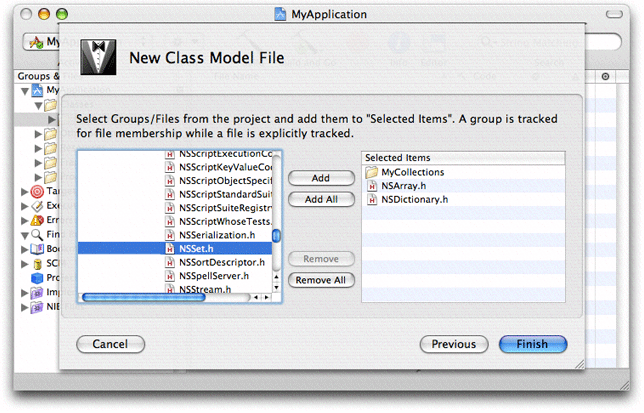

> 导航：[总目录](../../../README.md) · [documentation](../../../_indexes/documentation.md) · [Xcode Design Tools for Class Modeling](Introduction%20to%20Xcode%20Design%20Tools%20for%20Class%20Modeling.md)

[Next](Workflow.md)[Previous](Class%20Modeling%20With%20Xcode%20Design%20Tools.md)

# Creating Models

Xcode allows you to create models in two ways, as quick models and as project class model files (that is, model files you create with the New File Assistant). At first glance it may appear that the two sorts of class model are somehow different. It is important to realize that they are functionally the same but created in different ways and usually with a different immediate purpose in mind.

To create a class model file, choose File > New File and select Class Model from the Other group. You then name the file, and click Next. From the subsequent panel, shown in Figure 1, you select the files and containers that you want to contribute to the model.

__Figure 1__  Selecting groups and files to be in the model

When you click Finish, Xcode creates the model file, adds it to the project, and displays the class browser and diagram.

To create a Quick Model, select in the Groups & Files list the files and containers that you want to contribute to the model. Then choose Design > Class Model > Quick Model. Xcode displays the class browser and diagram.

A quick model is untitled and ephemeral. It does not appear in the project file browser, and if unchanged, it is closed without warning. If you make changes, however, you are prompted to save when you close the project. You can also save the model at any point using Save or Save As if you decide you want to keep the model.

[Next](Workflow.md)[Previous](Class%20Modeling%20With%20Xcode%20Design%20Tools.md)

