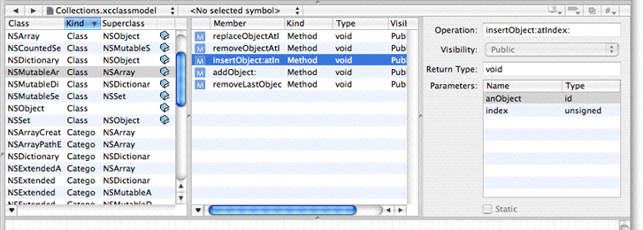
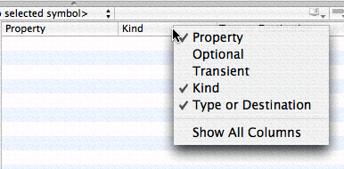
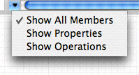
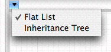

> 导航：[总目录](../../../README.md) · [documentation](../../../_indexes/documentation.md) · [Xcode Design Tools for Class Modeling](Introduction%20to%20Xcode%20Design%20Tools%20for%20Class%20Modeling.md)

[Next](The%20Diagram%20View.md)[Previous](The%20Info%20Window.md)

# The Browser View

The browser view gives you a different perspective on the whole of your model (all classes are shown in the browser view even if they are hidden in the diagram view). Note that the design tools browser view is distinct from the Class Browser.

The browser view is by default always present in the model’s editor view. You can hide it by choosing Design > Hide Browser View (and show it again by choosing Design > Show Browser View). The view has three separate parts: two table view panes—the class pane and the properties pane—and the detail pane. You can resize a pane by dragging the vertical divider. You can also hide a pane by resizing its width to zero—to hide the detail pane you must drag the divider on its left side most of the way to the right, past its minimum size.

__Figure 1__  The Browser View

The table view in the leftmost pane lists the classes, categories, and protocols in the model. The columns in the class list show the element name, the element type (class, category, or protocol), the hidden status, and a link to documentation if there is any associated with the element.

The table view in the properties pane shows summary information about the properties and methods associated with the current selection in the classes table, including the name, type, and visibility, and a link to documentation if there is any associated with the element. If you make a multiple selection in the class table, the properties table shows the union of all properties of the selection.

As with most table views, you can rearrange and re-sort the columns. You rearrange the columns simply by dragging a header cell; you can change the sort order by clicking in header cells.

You can choose which columns to see by Control clicking table header cells to display a pop-up list that you can use to toggle the display of columns (see Figure 2). If you have a multiple selection, Show All Columns means that only the set of columns common to all members of the selection may be displayed, otherwise you get a specific set (dependent upon what you have selected).

__Figure 2__  Browser column options

You can also choose which properties are shown by viewing the command pop-down menu in the property table. Each command, shown in Figure 3, acts as a toggle to change the visibility of properties and operations in the table view.

__Figure 3__  Property list view options

Finally, you can display the class list either as a flat list or as an inheritance hierarchy. Select the view option you want in the pop-down menu of the leftmost pane, as shown in Figure 4.

__Figure 4__  Class view options

The detail pane shows information about the most recently selected element in the classes or properties table. You use the detail panel to set the hidden status of individual class elements. This setting determines how much is displayed in the diagram view, as described in [Hiding](The%20Diagram%20View.md#apple-f4xwc4dqnrsv64tfmyxwi33df52wszbpkridimbqga3dqnjzfvjvomjs). If you make a multiple selection, the editor shows the best representation it can of the union of the selected items.

[Next](The%20Diagram%20View.md)[Previous](The%20Info%20Window.md)

