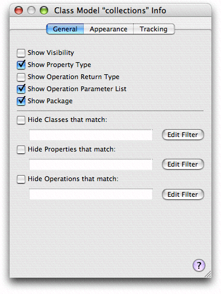
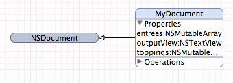
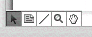
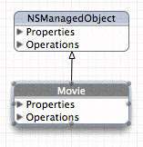
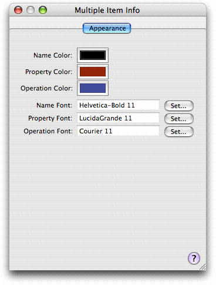
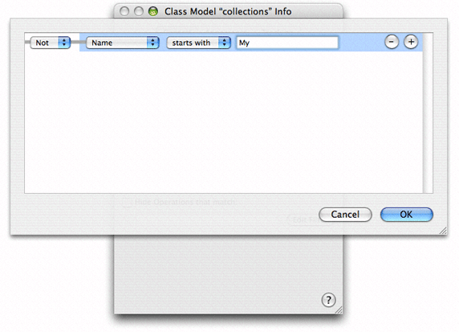
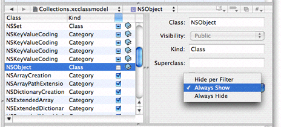

> 导航：[总目录](../../../README.md) · [documentation](../../../_indexes/documentation.md) · [Xcode Design Tools for Class Modeling](Introduction%20to%20Xcode%20Design%20Tools%20for%20Class%20Modeling.md)

[Next](Document%20Revision%20History.md)[Previous](The%20Browser%20View.md)

# The Diagram View

The diagram contains two important shapes, rounded rectangular nodes and lines. It may also contain annotations. Although you can change the layout and visual appearance of the nodes and lines (and optionally hide classes, properties and so forth), you can modify classes, the relationships between them, their properties, and so forth only by editing source files. For editing annotations, see [Annotations](#apple-f4xwc4dqnrsv64tfmyxwi33df52wszbpkridimbqga3dqnjzfvjvony).

The diagram view contains two main elements, rounded rectangles—which represent nodes—and lines. Diagrams may also contain annotations.

Nodes can be classes, categories, or protocols (interfaces). The name is given in the title bar, and for C++/Java, includes the namespace or package. Nodes are color coded to help you readily identify different types; different text styles help to further differentiate element and method types. Compartments within a node represent features of the class—properties for instance variables, and operations for methods.

A node may be split into three sections: The title bar containing the name of the element (including the namespace or package for C++/Java), and two compartments. The compartments show properties (instance variables) and operations (methods or member functions)—see [Figure 2](#apple-f4xwc4dqnrsv64tfmyxwi33df52wszbpkridimbqga3dqnjzfvjvomjw).

You can use the nodes for navigation. To go to your source files (or to the header file for system files), you can click the (>) symbol in a node's title bar; you can also choose Design -> Class Model or use the contextual menu to navigate to any declaration, definition, or documentation that is available.

The names of classes, categories, and protocols are represented differently: Class names appear unadorned, category names are surrounded by parentheses, and protocol names are surrounded by angle brackets. If an operation name is underlined, it is a class method.

By default, classes are represented in blue, categories in gray, and protocols (interfaces) in red. Project and framework classes are further differentiated by the saturation of the color (externals are dimmer). You can change both the default colors and the colors for individual nodes (see [Colors and Fonts](#apple-f4xwc4dqnrsv64tfmyxwi33df52wszbpkridimbqga3dqnjzfvjvomjv)).

Compartments within a node represent features of the class. The Properties compartment lists instance variables; the Operations compartment lists methods—class methods are underlined.

Within a node, you can display additional information. Using the General pane of the Info window (shown in Figure 1), you can choose whether or not to show:

- Visibility flag (public, private, and protected may be indicated by an icon in the compartment)
- Property types (for each property, shown after a colon in the compartment)
- Operation return types and parameter types
- Package information

__Figure 1__  Info window for a class model diagram

You have further control over what is displayed in the diagram—for an explanation, see [Filtering and Hiding](#apple-f4xwc4dqnrsv64tfmyxwi33df52wszbpkridimbqga3dqnjzfvjvooa).

You can display a node and the compartments within it in a variety of ways:

- Rolled up, so that just the name of the class is showing. This gives the most compact representation, with maximum information density in the diagram. (In Figure 2 the NSDocument node is rolled up.)
- Compartment titles showing. The titles are Properties and Operations. This gives a compact representation but with easy access to detail.
- Compartments expanded. All the information in a compartment is visible but at the cost of screen real estate. (In Figure 2 the properties compartment of MyDocument is expanded, but the operations compartment is not.)

__Figure 2__  A rolled-up node and a partially expanded rolled-down node

To roll up or roll down the node, choose, respectively, Design > Roll Up Compartments or Design > Roll Down Compartments. To hide or expose compartment information, you use the disclosure triangle within a compartment or choose Design > Expand Compartments (or Design > Collapse Compartments).

Lines indicate different things depending on whether they are solid or dashed, what sort of arrowhead is present, and what objects they connect.

A solid line with an open arrowhead:

- Denotes inheritance when it connects classes
- Specifies the class of which the category is a category when it connects a class and a category

A dashed line with an open arrowhead denotes implementation of a protocol (in Java, an interface).

You can edit only lines that go to or from annotations—other lines are created automatically based on the contents of your project.

You can add annotations to the diagram to provide explanatory text using the text tool. You have full access to text styling options from the Format menu. You can connect a comment to a class using the line tool.

The diagram view provides several tools, whose function should be familiar from other drawing packages. You select the tools from the palette in the bottom-left corner of the diagram view, shown in Figure 3.

__Figure 3__  Diagram tools

- _Arrow_. You use the arrow tool to make selections and to move and resize graphic elements.
- _Text_. You use the text tool to annotate diagrams in a class model. To edit text in the text area, simply double-click inside the element. You can use the Formatting menu, Font panel, Colors panel, and so on to format the text as you wish. You can use the line tool to connect a text area to a specific class.
- _Line_. You use the line tool to connect a comment to a specific class. To connect two elements, select the line tool, then drag from one end of the connection to the element at the other end.
- _Magnifying glass_. You use the magnifying tool to zoom into part of the diagram or, by holding down the Option key, to zoom out. See [Layout](#apple-f4xwc4dqnrsv64tfmyxwi33df52wszbpkridimbqga3dqnjzfvjvomjz) for other ways to zoom. To effect the zoom, you select the tool, then click inside the diagram.
- _Hand_. You use the hand tool to move the diagram if its bounds extend beyond the current view.

There are a number of options for moving and resizing elements; you can also constrain the way the elements can be moved and resized, and even prevent them from being moved and resized. Furthermore, you can zoom into and out of the diagram and arrange the page layout as you wish.

- _Moving and resizing shapes_. You can rearrange elements in a diagram to suit your needs—lines that join elements are updated appropriately. Use the arrow tool to select an element, and then simply drag it. You can move all the elements in the current selection (see [Multiple Selection](#apple-f4xwc4dqnrsv64tfmyxwi33df52wszbpkridimbqga3dqnjzfvjvomju)) in the same way.

  When you select a shape, “handles” appear around its edges (as shown in Figure 4). You can drag the handles to resize the shape.

  __Figure 4__  Diagram view showing element handles

  

  You can also automatically resize elements in several ways, by choosing the Design > Diagram > Size. In the Size submenu, Make Same Width and Make Same Height resize the selected elements appropriately; Size to Fit resizes the selected elements so that they fully enclose their contents with minimal padding.
- _Alignment and grid_. You can use a variety of options to automatically align selected elements and to help you keep elements aligned. By choosing Design > Diagram > Alignment menu, you can perform a number of operations—aligning specified edges or centers of a selection and aligning a selection in a row or column.

  You can also use a grid to help keep elements aligned. By default, the diagram view displays a background grid, and move and resize operations are snapped to it. By choosing Design > Diagram, you can turn the grid display on and off; you can also independently turn the snap-to-grid feature on and off.
- _Automatic layout_. The class modeler provides two ways to automatically lay out elements in a diagram, force-directed layout and hierarchical layout. To access them, choose Design > Automatic Layout.

  With hierarchical layout, parent elements are typically at the top of the diagram, children at the bottom. This gives a generally horizontal layout, and is typically better for deep hierarchies.

  The force-directed layout tends to produce circular arrangements, with commonly referenced classes in the middle. This is usually better for shallow hierarchies. Note that the force-directed layout can take unbounded time to calculate—and so is not recommended for very large collections.

  You can apply the automatic layout feature just to selected items or to the whole diagram. The layout respects the current size of elements in the selection. If you expand or contract a node and then perform automatic layout again, the layout differs from the one that existed before the change in size.
- _Locking_. You can lock individual graphic elements in place by choosing Design > Diagram > Lock, or the Lock contextual menu. If you subsequently apply automatic layout, locked elements are unaffected. To unlock an item, choose Design > Diagram > Unlock, or use the Unlock contextual menu.
- _Zoom_. You can zoom into and out of the diagram in three different ways:

  - Choose Design > Diagram to zoom in, out, and to fit.
  - Use the pop-up menu to select a percentage zoom.
  - Use the magnifying glass tool (click to zoom in; Option-click to zoom out).
- _Page layout_. If you move diagram elements outside the current diagram bounds (whether directly, or through applying automatic layout, or by unhiding elements), the page area automatically expands. Conversely, if you remove elements such that a page is left blank, the page area automatically contracts.

  To adjust the size of a page, choose File > Page Setup. The page layout adjusts automatically to accommodate a change in page size.

You can use multiple selection in the diagram view to move a collection of elements in a flotilla drag, or for roll-up, expand all, and so on. You can make multiple selection in several ways:

- You can select a single element, then hold down the Shift key and click additional elements. Unselected elements are added to the current selection; selected elements are removed from the current selection.
- You can drag the background of the diagram to create a selection rectangle. Elements whose boundaries intersect with this rectangle are selected.
- You can select classes in the browser—the browser selection and diagram selection are kept synchronized.

Choose Edit > Select All to select all elements in the diagram. Note that for items in the Diagram menu, clicking on the background (rather than on a drawn element) is the equivalent of selecting all but may be faster.

The diagram view provides default coloring for various elements. By default, all text is black, and the title bar and outline of drawing elements are colored. Classes, categories, and protocols each have distinct colors; moreover, the color of project resources is lighter than that of imported resources.

You change the background color of the title bar and color of the outline of elements by dropping a color swatch from the Color panel onto the element. You change the other color settings, and the font used for the title, property, and operations text, using the Appearance pane of the Info window (inspector). You can also select multiple elements and change their color and text settings simultaneously, as shown in Figure 5.

__Figure 5__  Appearance pane showing multiple selection

You can also change the default settings for the entire model using the Appearance pane—see [The Appearance Pane](The%20Info%20Window.md#apple-f4xwc4dqnrsv64tfmyxwi33df52wszbpkridimbqga3dsmjqfvjvomq).

Sometimes diagrams contain more information than you want to see, and it can be useful to reduce clutter. Removing irrelevant classes makes it easier to concentrate on important ones—for example, you might remove `NSObject` from a class diagram to make it easier to see other relationships; or it might be that a tracked file contains definitions of several classes and you are interested in only one of them. You might also want to hide other details, such as private variables, or instance variables whose name starts with an underscore.

You can use a predicate to filter what classes and methods are shown in the diagram. On a class level, you can choose to use or override the filter. You can show a class if a filter would normally hide it, and vice versa.

Filtering and hiding settings affect only the diagram. The browser view still lists all the contents (because you need a way to be able to select a class if it’s hidden!). Filtering and hiding are different from tracking. Tracking determines whether or not files contribute to the model at all.

Filters apply as changes are made to files that contribute to the model. If you choose, for example, to hide all classes whose names begin with “XYZ”, then in your header file you rename the class “XYZWidget” to “WXYWidget”, and a node for “WXYWidget” appears in your diagram. To set up filtering, you use the General pane of the Info window, shown in Figure 6.

__Figure 6__  General pane of the Info window

You can set up independent filters for classes, properties, and operations, based on options such as their name. You can also toggle filters on and off as required. If you click Edit Filter, a sheet in which you can edit the filter appears, as shown in Figure 7. You can either enter a predicate directly into the appropriate text field or use the predicate builder.

__Figure 7__  The filter editor

Note that string matches for all the filters are case-sensitive. For example, for a property type, "int" will match all integers, but "Int" will not. For some filter options, there are only a limited number of strings that are appropriate. For the class filter, such options are kind, where the strings are "Category", "Class", "Interface", and "Protocol", and language, where the strings are "C++", "Java", and "Objective-C". For the properties and operations filters, the only such option is visibility, where the strings are "Public", "Protected", "Package", and "Private".

Hiding allows you to override the filtered state of a class (or protocol or category). You can specify that an element follow the filtered setting or that it be either always shown or always hidden. You can set the hiding state using the browser view, in either the Hidden column in the property pane or using the pop-up menu in the detail pane, as shown in Figure 8.

__Figure 8__  Setting hiding in the detail pane

In the detail pane, you choose the setting from the pop-up menu. The browser has a three-state checkbox you can use to modify the hiding setting. The states correspond to the same states defined in the pop-up menu.

[Next](Document%20Revision%20History.md)[Previous](The%20Browser%20View.md)

