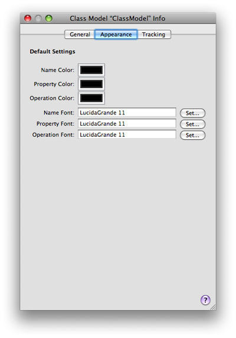
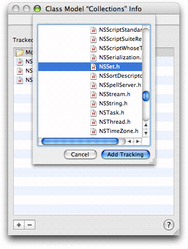

> 导航：[总目录](../../../README.md) · [documentation](../../../_indexes/documentation.md) · [Xcode Design Tools for Class Modeling](Introduction%20to%20Xcode%20Design%20Tools%20for%20Class%20Modeling.md)

[Next](The%20Browser%20View.md)[Previous](Workflow.md)

# The Info Window

The Info Window (inspector) contains three panes, for General settings, Appearance, and Tracking.

You use the general pane to. Figure 1 shows an Appearance pane with custom settings.

__Figure 1__  The General pane

!

You use the Appearance pane to set default colors and fonts for element names and properties. Figure 2 shows an Appearance pane with custom settings.

__Figure 2__  The Appearance pane

The tool uses the project indexer to track changes to your project. The class models always represent the actual classes in the files and groups in your project. Xcode automatically updates them as you change your source code—even if you add, remove, or refactor classes. To function properly, therefore, the class model requires that the project indexer be enabled.

If the project indexing is not complete, the model pane simply displays the word “Indexing” until indexing is complete. If indexing is disabled or you open a project on a read-only partition, you see an appropriate warning.

You use the Tracking pane of the Info window (inspector) as shown in Figure 3) to change the list of tracked items that belong to the model. Click the plus (+) or minus (−) button (in the lower left of the pane) to add or remove files and groups.

__Figure 3__  Adding a file in the Tracking pane

As you add and remove files from any project groups that make up a model, corresponding classes appear in and disappear from the browser and diagram as appropriate.

[Next](The%20Browser%20View.md)[Previous](Workflow.md)

