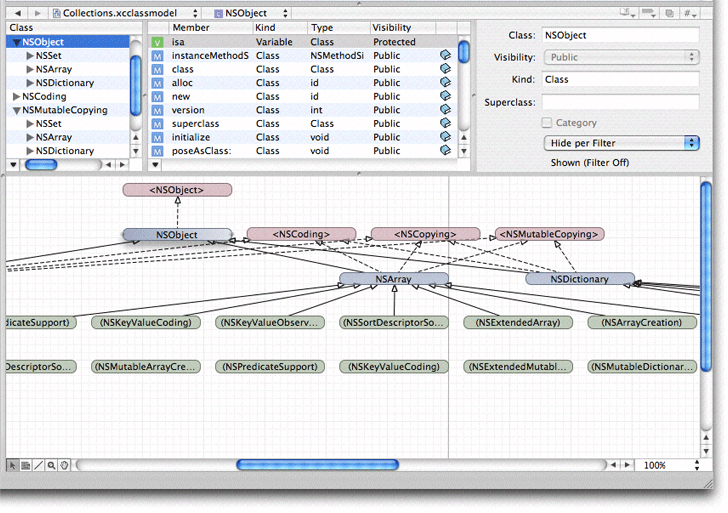
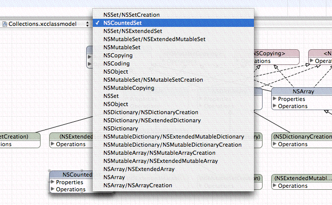

> 导航：[总目录](../../../README.md) · [documentation](../../../_indexes/documentation.md) · [Xcode Design Tools for Class Modeling](Introduction%20to%20Xcode%20Design%20Tools%20for%20Class%20Modeling.md)

[Next](The%20Info%20Window.md)[Previous](Creating%20Models.md)

# Workflow

The Xcode design tools offer a wide range of options and features to ease your workflow, from automatic page creation and deletion in the diagram view, to multiple selection editing in the browser. In addition, it is possible to add to the toolbar shortcuts for actions such as Quick Model.

When you create a model, you add the source or the header files (or both), or containers (such as groups, targets, or projects, but not smart-groups, build phases, find results, and so on) that you want to contribute to the model. A model is dynamic, though. It is continuously updated in response to changes in your source code and the organization of your project. For this reason, you might add both a file and a group containing that file to a model, so that if the file is moved out of group it remains in the model (this strategy may be particularly useful early in a project’s lifetime when groups are likely to change).

When you add a class to a model, its immediate superclass is implicitly added to the model (even if it’s not in the project).

Models are considered integral to the project, so you should typically add new model files (that you create using the New File menu item) to the project. Quick models, on the other hand, are initially considered temporary, so you don’t have to add them to the project immediately. If you decide to save a quick model, you can add it to the project later.

You might find it useful to create several different class models in your project. Each model may present subsets of the data in different ways. Each gives a its own perspective on the project, and so may be useful for different situations.

Because class model files depend on the project index, they can’t survive outside the project.

The model has two main views—the diagram and the browser. These views have different roles. The diagram view is typically best when you need a high-level overview of the project. The browser view gives you more detailed information. When you have large collections of classes, you can minimize the information shown in the diagram (for example, view just class names and inheritance relationship lines) and get the detailed information from browser. The diagram view offers a variety of different configurations, so you can tailor your view to any need. Figure 1 shows the class browser and a class hierarchy diagram.

__Figure 1__  Browser view and diagram view for a class model

You can adjust the relative sizes of the browser and diagram views—and hide the diagram view completely—by moving the split view divider that separates them. The browser view is by default always present in the model’s editor view—you cannot shrink it beyond a minimum height. You can hide the browser view by choosing Design > Hide Browser View (and show it again by choosing Design > Show Browser View).

You can use the browser and diagram views in conjunction for navigation—the selection in the two views is kept synchronized. As a result, if you make a selection in the browser, the same item is selected in the diagram, and vice versa.

If you want to see a large model in the diagram view, you can maximize the viewable area of a diagram in the main project window by hiding the toolbar, the navigation bar, the status bar, the Favorites bar, and the browser view.

If you have a large class diagram, there are two strategies you can use to aid navigation. First, you can begin typing the name of the class you want. As you type characters, Xcode selects the alphabetically “topmost” class whose name has the prefix you typed. Second, you can use the pop-up menu at the top of the document pane. The pop-up shows a list of elements . When you select an item from the pop-up menu (see Figure 2), the corresponding element is selected in the diagram and brought into view. This feature may be particularly useful if the browser is hidden.

__Figure 2__  The Elements pop-up menu

The browser view, however, is useful when you have a large class diagram with all compartments rolled up and you want to see more details about a given class but don’t want to make the diagram bigger. The browser also shows more information than is available in the diagram (parameters, return types, and so on).

Most menu-based commands are also available from contextual menus associated with the relevant user interface element. You can Control-click a node for immediate access to operations that apply to it or its context—for example, to expand compartments or navigate to documentation. You can Control-click the diagram background to perform operations related to the visual representation, for example, you can hide grid lines, zoom, and set the alignment of drawing elements.

[Next](The%20Info%20Window.md)[Previous](Creating%20Models.md)

