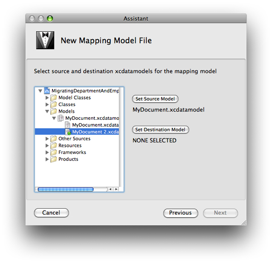

> 导航：[总目录](../../../README.md) · [documentation](../../../_indexes/documentation.md) · [Xcode Mapping Tool for Core Data](Introduction.md)

[Next](The%20Mapping%20Model%20Pane.md)[Previous](Introduction.md)

# Creating and Updating a Mapping Model

A mapping model is an instance of [NSMappingModel](https://developer.apple.com/documentation/coredata/nsmappingmodel) with a collection of [NSEntityMapping](https://developer.apple.com/documentation/coredata/nsentitymapping) and [NSPropertyMapping](https://developer.apple.com/documentation/coredata/nspropertymapping) objects, together with supporting objects such as instances of [NSEntityMigrationPolicy](https://developer.apple.com/documentation/coredata/nsentitymigrationpolicy) and [NSFetchRequest](https://developer.apple.com/documentation/coredata/nsfetchrequest). (For more about specific Core Data classes, see the relevant API reference documentation.) You can create a model directly in code at runtime; however, it is typically easier to do so graphically using the Mapping tool. (This is analogous to Interface Builder. With Interface Builder, you graphically create a collection of objects that are then saved in a file and re-created at runtime. Similarly, just as you can modify the user interface after it has been loaded, you can customize a mapping model after it has been loaded.)

To create a new mapping model, in Xcode you choose File > New File, then in the New File panel you select Design > Mapping Model and press Next. In the next pane, you give the model a name, and press Next to display the source and destination model selection pane:

The outline view displays the groups and files in your project. You navigate to an existing model file, then press Set Source Model or Set Destination Model as appropriate. When you have selected both a source and a destination model, you press Finish to create a default mapping model.

If the source or destination model changes, you can update the mapping model by choosing Design > Mapping Model > Update Source Model or Update Destination Model respectively. (Typically, however, the source and destination models should be finalized before you create the mapping model.)

[Next](The%20Mapping%20Model%20Pane.md)[Previous](Introduction.md)

