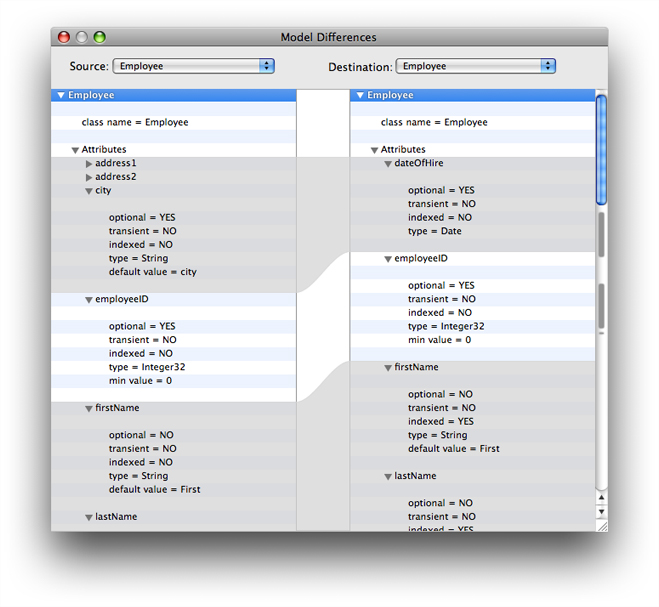

> 导航：[总目录](../../../README.md) · [documentation](../../../_indexes/documentation.md) · [Xcode Mapping Tool for Core Data](Introduction.md)

[Next](Document%20Revision%20History.md)[Previous](The%20Mapping%20Model%20Pane.md)

# Displaying Differences Between Models

In the main pane, you can press Show Differences to display the differences between the source and destination models. The popup menus allow you to select for the source and destination either all the entities or a single entity to display. In the main pane, the gray areas denote entities and properties that differ between source and destination. You can collapse and expand elements of the display by clicking the associated disclosure triangle.

[Next](Document%20Revision%20History.md)[Previous](The%20Mapping%20Model%20Pane.md)

