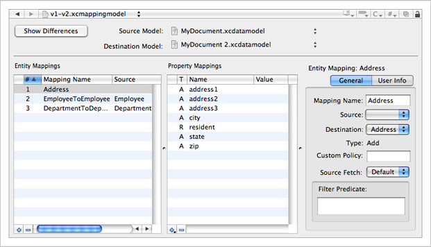

> 导航：[总目录](../../../README.md) · [documentation](../../../_indexes/documentation.md) · [Xcode Mapping Tool for Core Data](Introduction.md)

[Next](Displaying%20Differences%20Between%20Models.md)[Previous](Creating%20and%20Updating%20a%20Mapping%20Model.md)

# The Mapping Model Pane

This section describes the mapping model tool pane.

The mapping model pane consists of two main sections: the upper area that shows the names of the source and destination model files, and the lower area that displays information about the mappings.

You press the Show Differences button to display a panel that highlights the differences between the source and destination models. This is described further in [Displaying Differences Between Models](Displaying%20Differences%20Between%20Models.md#apple-f4xwc4dqnrsv64tfmyxwi33df52wszbpkridimbqga3dqnrwfvjvomi).

You use the source and destination popup menus to show the paths to the model files, or to select new source or destination model files.

You use the mappings panes to display and edit information about the mappings in the mapping model.

__Figure 1__  The entity mappings pane

!

The entity mappings pane lists the entity mappings in the model—each row corresponds to an instance of [NSEntityMapping](https://developer.apple.com/documentation/coredata/nsentitymapping) in the mapping model. The columns show the index, name, source entity, destination entity, and hash difference of each mapping. The “hash difference” (“H”) column indicates whether there are differences in the hash values of the source and destination (a “\*” indicates that there are, otherwise the cell is empty). The blank column is the error indicator column. If there is a problem with the mapping, the column displays an “X” in a red circle (shown in Figure 2).

You add and delete entity mappings using the plus (+) and minus (–) buttons at the left of the horizontal scroller. You cannot edit the mapping attributes directly in the mappings pane—instead you use the detail pane. The order of the entity mappings (as denoted by their indexes), however, may be important (see _[Core Data Model Versioning and Data Migration Programming Guide](../../Cocoa/Core%20Data%20Model%20Versioning%20and%20Data%20Migration%20Programming%20Guide/Core%20Data%20Model%20Versioning%20and%20Data%20Migration.md#apple-f4xwc4dqnrsv64tfmyxwi33df52wszbpkridimbqga2dgojz)_). You can rearrange the mappings by dragging the rows.

The property mappings pane shows the property mappings for the selected entity mapping. Each row corresponds to an instance of [NSPropertyMapping](https://developer.apple.com/documentation/coredata/nspropertymapping) in the model.

__Figure 2__  The property mappings pane

!

There are four columns showing: the name of the property in the destination entity, the property type (“A” denotes an attribute, “R” denotes a relationship), and the value expression (if any) for the mapping. The blank column is the error indicator column. If there is a problem with the mapping, the column displays an “X” in a red circle.

You add and delete property mappings using the plus (+) and minus (–) buttons respectively at the left of the horizontal scroller. When you add a mapping, you specify whether it is for an attribute or for a relationship. You cannot edit the mapping attributes directly in the mappings pane—instead you use the detail pane.

The detail pane shows the details for the most-recently selected entity or property mapping. There are two views in the detail pane, the general view and user info view. There are two forms of the general view, for an entity and for a property mapping; the user info view is the same for both mapping types.

The entity mapping detail view shows the name of the mapping, the source and destination entities (if any), the type of mapping (add, delete, transform, or copy), the name of the custom policy class for the mapping (the name of a subclass of [NSEntityMigrationPolicy](https://developer.apple.com/documentation/coredata/nsentitymigrationpolicy)), and details of the source expression.

__Figure 3__  The Entity mapping detail

!

You can edit most of the details directly by typing in the text fields or making an appropriate selection using the popup menu. The exception is the type description, which is a read-only text field that is updated automatically based on the selection of source and destination entities.

You specify the [sourceExpression](https://developer.apple.com/documentation/coredata/nsentitymapping/1443180-sourceexpression) for the mapping using a combination of the the source fetch popup menu and the text view beneath it. You can select either the default fetch—in which case you can optionally specify a filter predicate for the fetch—or a custom fetch, in which case you specify the source expression directly.

__Figure 4__  Source expression detail

!

The property mapping detail view is different for attributes and properties.

The attribute mapping view shows the name of the attribute in the destination entity in a popup menu and the value expression (if any) associated with the mapping.

__Figure 5__  The attribute mapping detail

!

To edit an attribute mapping, you select an attribute name from the popup menu and type directly in to the value expression text view.

The property mapping view shows the name of the relationship in the destination entity and the value expression for the mapping.

__Figure 6__  The relationship mapping detail

!

Using the radio buttons, you can select either an auto-generated expression based on the key path of the source relationship and the name of the entity mapping to use, or you can type a custom value expression directly into the value expression text field.

The user info view is the same for entity and property mappings. You can add any key-value pairs you want to the mapping by pressing the plus (+) button and editing the values directly in the table view. You remove key-value pairs by pressing the minus (–) key.

__Figure 7__  The user info view

!

[Next](Displaying%20Differences%20Between%20Models.md)[Previous](Creating%20and%20Updating%20a%20Mapping%20Model.md)

