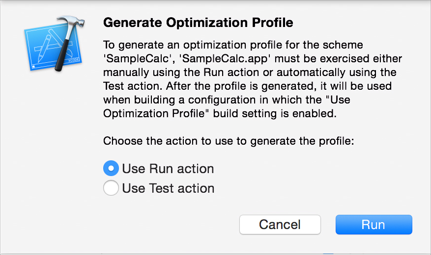
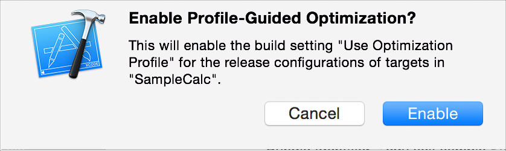
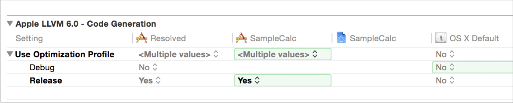
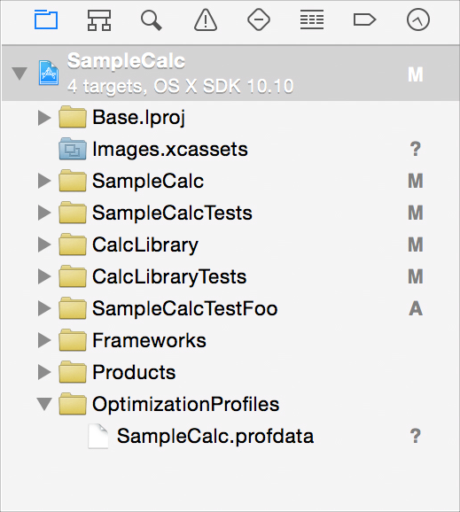

> 导航：[总目录](../../../README.md) · [documentation](../../../_indexes/documentation.md) · [Xcode Profile Guided Optimization](About%20Profile%20Guided%20Optimization.md)

[Next](Using%20Profile%20Guided%20Optimization.md)[Previous](About%20Profile%20Guided%20Optimization.md)

# Quick Start

Profile Guided Optimization (PGO) is a high-performance optimization tool that is easy to set up and use. In this chapter, you’ll see all the steps needed to use PGO.

To start using PGO, choose Product > Perform Action > Generate Optimization Profile. You are given the choice to run the app, exercising it manually, or to run your tests to exercise it.

When you click the Run button, Xcode confirms that you want to configure the app target.

After you click the Enable button, Xcode builds and runs the app according to the selection you made for running it.

If you chose to collect the optimization profile by running the app manually, be sure to exercise all the performance-sensitive operations when the app runs. When you are finished, click the Xcode Stop button in the workspace toolbar to write the profile.

If you chose to collect the profile by running your test suite, before you click the Enable button you should first edit the current scheme to select which tests to run. Tests for correctness often focus on checking the unusual conditions and error handling, and those are rarely the things that you want to optimize for best performance. Be sure that your tests, both functional and performance measurement tests, cover the full range of behavior that is important for the performance of your app.

Xcode configures the app target for you when you use the Generate Optimization Profile command. The target configuration settings can be seen in the project editor by selecting your app target and clicking Build Settings.

The PGO defaults are to set Use Optimization Profile to be Yes for Release builds and No for Debug builds.

The optimization profile is a file with extension `.profdata`. Xcode writes the `.profdata` file in the location specified by the Optimization Profile File build setting in your project, by default in a folder named `OptimizationProfiles` that is added to your project. The folder and file appears in the project navigator as shown in this example:

As you continue to develop and change code in your app project, the optimization profile becomes out of date. The LLVM compiler recognizes when the profile is no longer a good match to your app’s current state and provides you with a warning. When you receive this warning, you can use the Generate Optimization Profile command again to create an updated profile. Each time you regenerate the optimization profile, Xcode replaces the existing profile data.

[Next](Using%20Profile%20Guided%20Optimization.md)[Previous](About%20Profile%20Guided%20Optimization.md)

