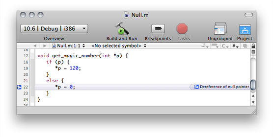
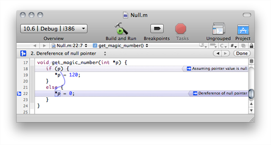
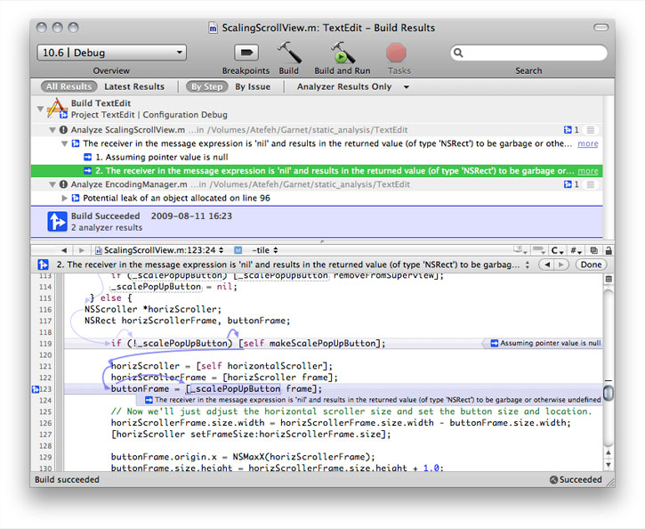
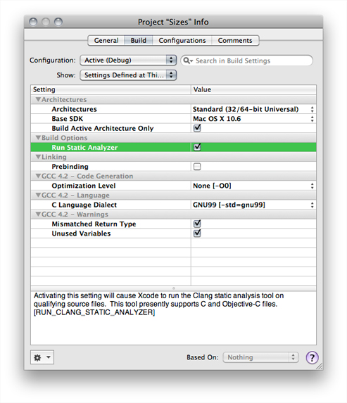
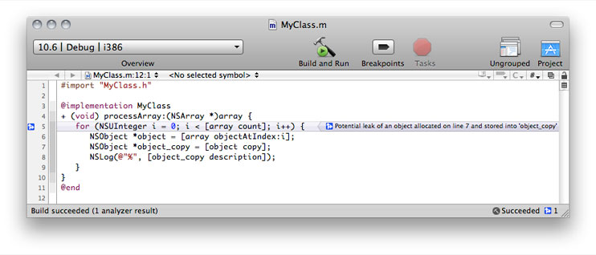
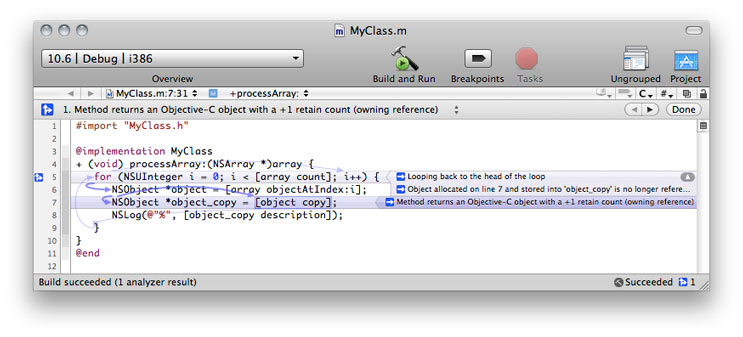

> 导航：[总目录](../../../README.md) · [documentation](../../../_indexes/documentation.md) · [Xcode Project Management Guide](Introduction.md)


[Next](Defining%20Executable%20Environments.md)[Previous](Building%20Products.md)

# Analyzing Code

As you write your code, you may inadvertently leave in flaws that, if not discovered early, may produce costly, hard-to-find bugs. A tool that helps you identify such problems early would not only save you time and effort, but would also help you become a better programmer. Such a tool exists in the Xcode static analyzer.

This chapter describes how to use the static analyzer to identify and fix code flaws.

The source code you write might contain flaws that may manifest themselves as bugs during testing or deployment of your product. Static analysis is a method for finding these potential bugs without running the corresponding executable; that is, before your product goes through testing and, more importantly, before it’s released to customers.

Compilers, such as GCC, perform static analysis as part of the compilation process. They are great at ensuring adherence to a programming language’s syntax and detecting some logic and data-type–usage errors. Many software bugs, however, occur only when a program takes a specific set of branches and loops. While compilers analyze the control flow of a program during compilation, they cannot find such problems because of practical limits on compilation time. Also, compilers typically lack domain-specific knowledge about correct API usage and the use of advanced memory-management techniques.

The source code you write must follow certain rules to ensure that your program runs correctly and uses resources appropriately. For example, in C-based languages you must initialize variables before using them; you must also deallocate the memory you allocate. Violations to these rules are known as “code flaws.” Static analysis tools detect flaws in source code and describe their causes.

The Xcode _static analyzer_ goes through your code to ensure that it follows logic and API-usage policies, including Cocoa memory-management rules. If the analyzer detects flaws in your code, it emits messages providing clear descriptions of their causes. In addition, the analyzer produces a diagnosis of the sequence of steps that would cause the bug to appear; these steps are known as bug’s “flow path.” Because you find these problems without having to run your binary, you get a chance at solving them at the time you’re writing your code, when the information you need to address them is fresh in your mind. Early discovery also reduces the effort of solving bugs in your product because most problems don’t reach the testing or deployment stage of your developing process, where it may require more effort to determine their cause.

The static analyzer checks for code flaws in these areas:

- __Logic.__ Logic flaws include accessing uninitialized variables and dereferencing null pointers.
- __Memory management.__ Memory management flaws include leaking allocated memory.
- __Dead stores.__ Dead stores identify unused variables.
- __API usage.__ API-usage flaws involve not following policies imposed by the frameworks and libraries your product uses.

For example, examine the following code listing:

```objc
#import <Foundation/Foundation.h>

void get_magic_number(int *p);

int main (int argc, const char * argv[]) {
    NSAutoreleasePool * pool = [[NSAutoreleasePool alloc] init];

    int *i = malloc(sizeof(int));
    get_magic_number(i);
    printf("Magic number: %i\n", *i);
    free(i);

    [pool drain];
    return 0;
}

void get_magic_number(int *p) {
    if (p) {
        *p = 120;
    }
    else {
        *p = 0;
    }
}
```

This program compiles without errors and runs cleanly when `p` is not null. However, when `p` is null, the program crashes when it dereferences a null pointer. Although the source code adheres to Objective-C syntax and correctness rules, it contains a logic error uncaught by the compiler. The static analyzer, however, detects the logic error and emits a descriptive message, as shown in Figure 9-1.

__Figure 9-1__  Dereferencing a null pointer



The Xcode static analyzer is a great complement to other techniques for finding bugs in software, such as unit testing. You should always use these in conjunction with the static analyzer to ensure your code contains as few bugs as possible before shipping the final product to your customers.

The following are three important issues with static analysis:

- __Static analysis doesn’t find every code flaw.__ Just like most software, static analysis tools go through constant improvement. Therefore, it may not find all flaws in your code. You shouldn’t rely on static analysis alone to ensure that your code is free of problems.
- __Static analysis produces false positives.__ False positives are unlikely problems in source code that the analyzer identifies as problems. Source-code annotations help reduce false positives.
- __Static analysis increases build time.__ Static analysis takes more time than compilation because of the deep code analyses and policy adherence checks performed. Using a build configuration tailored for static analysis lets you perform static analysis at times when fast build times are not critical.

The static analyzer is based on the Clang static analysis engine. For more information, visit [http://clang-analyzer.llvm.org](http://clang-analyzer.llvm.org/).

To perform static analysis on the current project, choose Build > Build and Analyze.

If you routinely analyze your code, each analysis should return very few errors, which you should be able to correct easily. When you perform static analysis for the first time on a large project, you may encounter many analyzer messages.

You should perform static analysis on your code frequently, for example after making a few changes to a source file. Xcode emits analyzer messages in the same window that contains your source file.



You can fix the code flaws without opening additional windows. After making the corrections, build and analyze your code again to confirm that you fixed the problem.

When you build and analyze a large project, the analyzer may emit several analyzer messages. To view all the analyzer messages for a project, use the Build Results window. In this window, you can navigate the analyzer messages by build step (source file) or by analyzer issue. This window also contains an editor pane in which you can fix each analyzer each.



In deciding how often to perform static analysis consider the size of your project, the scope and number of changes you’re making, and whether you work on a team. For example, if you are working on a team, you may want to analyze your code before committing your work to the team’s SCM repository.

You can also ensure that Xcode analyzes your code every time you build your product by turning on the Run Static Analyzer build setting.



Because code assertions are active in the Debug build configuration, you should analyze your code in this configuration or a configuration copied from it. Assertions indicate to the analyzer the assumptions you’ve made about your code. These assertions help suppress extraneous or undesired analyzer messages. For more information, see [Suppressing Static Analyzer Messages](#apple-f4xwc4dqnrsv64tfmyxwi33df52wszbpkridimbqga3dsmjxfvbuqnbnknltena).

When you make static analysis a regular part of your development process, you may consider creating a specialized Analyze build configuration for static analysis. Although you can turn on the Run Static Analyzer build setting in your Debug configuration, this can result in slower build times, which is contrary to the quick-turnaround goal for the Debug configuration. In the Analyze build configuration, in addition to turning on the Run Static Analyzer build setting, you should turn off the Build Active Architecture Only build setting so that the analyzer finds architecture-dependent problems (see [API-Usage Checks](#apple-f4xwc4dqnrsv64tfmyxwi33df52wszbpkridimbqga3dsmjxfvbuqnbnknltg) for more information). This model lets you easily switch between performing classic regular debugging tasks or static-analysis tasks.

To create the Analyze build configuration:

1. Open the Project Info window and click Configurations.
2. In the configuration list, select the Debug configuration.
3. Click Duplicate and name the new configuration “Analyze”.
4. In the Build pane, choose Analyze from the Configuration pop-up menu.

When you execute the Build and Analyze command, the static analyzer goes through your project source files in search of code flaws (violations of programming rules and policies). Xcode displays messages for each violation in the current source file in the text editor that contains it. You can also view code flaws for the entire build in the Build Results window (see [Viewing Static Analyzer Results](#apple-f4xwc4dqnrsv64tfmyxwi33df52wszbpkridimbqga3dsmjxfvbuqnbnknlti) for details.

At first, the static analyzer shows a single message per code flaw in the editor, as Figure 9-2 shows. The message appears in the line at which the analyzer determines that a violation occurs. In this case, the violation is a memory leak at the head of the loop.

__Figure 9-2__  Memory-management violation



When you click the message, Xcode identifies the flaw’s flow path using blue arrows, as Figure 9-3 shows. Clicking the flaw message also displays the _analyzer toolbar_ in the editor. This toolbar contains a pop-up menu with the analyzer messages for each step of the flow path. Choosing an item from this menu highlights the step in the editor. You can also move between steps using the analyzer toolbar’s Left and Right buttons. Clicking the Done button dismisses the toolbar.

__Figure 9-3__  Flow path of memory-management violation



For this code flaw, the analyzer took the flow path described in Table 9-1.

__Table 9-1__  The flow path of a code flaw

| Line # | Statement/expression | Analyzer message |
| 7 | `NSObject *object_copy = [object copy]` | 1. Method returns an Objective-C object with a +1 retain count (owning reference). |
| 5 | `for` | 2. Looping back to the head of the loop. |
| 5 | `i++` | 3. Object allocated on line 8 and stored into 'object_copy' is no longer referenced after this point and has a retain count of +1 (object leaked). |

The flow path and the analyzer messages at each step of the path provide a detailed description of the events that unearthed the problem. In this case, after allocating an object inside the loop owned by the current scope, the sole reference to the object is lost after going back to the head of the loop.

As you highlight each step of the flow path, Xcode displays arrows that identify the statements the analyzer performed before arriving at the step. For step 1 of the flow path (creating a copy of `object` in line 8), the analyzer first executed the `for` statement in line 6, and the assignment to `object_copy` in line 7.

To fix this violation all that’s needed is to add `[object_copy release];` to the bottom of the loop.

The static analyzer can also discover logic errors by by following possible code paths and making assumptions using information in the code. For example, in Figure 9-4, the static analyzer discovers a violation by taking the two possible code paths based on whether a variable is null: When it follows the code path taken when `_scalePopUpButton` is null, it finds that evaluating the expression `[_scalePopUpButton frame]` results in a message to a null object, which, in this case, returns garbage.

__Figure 9-4__  Logic violation

!!

The Build Results window displays the results of a build, including static analysis results. When you’re performing static analysis, it may be useful to display only analyzer messages in the window.

To display the Build Results window, choose Build > Build Results. To show only analyzer results, choose Analyzer Results Only from the pop-up menu in the window’s toolbar. To group analyzer results by violation type, click the By Issue button in the toolbar. Figure 9-5 shows the Build Results window displaying two code flaws in a project.

__Figure 9-5__  Build Results window showing analyzer results grouped by violation type

!!

You can correct code flaws in the window’s editor pane. For details about working with this pane, see [Interpreting Static Analyzer Messages](#apple-f4xwc4dqnrsv64tfmyxwi33df52wszbpkridimbqga3dsmjxfvbuqnbnknltcma).

In addition to logic checks, the static analyzer checks that your code follow the Cocoa and Core Foundation memory-management rules and that is uses their API correctly. This section examines how the analyzer detects memory-management flaws in your code—whether it runs under garbage collection—and hard-to-detect API-usage flaws.

In Cocoa there are two memory-management models, one using reference counting and another using automatic garbage collection. In the reference-counting model, Cocoa—through API naming conventions and additional method calls by client code—maintains a count of entities that claim to own an object.

In the Cocoa reference-counting model, when your code obtains an object through a method whose name starts with `alloc` or `new`, or contains `copy`, your code inherently has ownership of the object. When your code receives an object from a method that doesn’t return an object owned by the caller, you claim ownership of the object by invoking its `retain` method. At some point, the owner of the object (or a proxy for the owner) must relinquish ownership by invoking its `release` method. Otherwise, your code leaks the object and the memory it uses. A number of such leaks can cause your application and, potentially, the operation system to become memory starved. The static analyzer checks that your code releases the objects that it owns to avoid memory leaks.

Because Cocoa itself follows the Cocoa API conventions for memory management, the static analyzer knows whether the objects the framework returns are owned by your (the calling) code. To ensure that the analyzer correctly attributes ownership to the objects your methods return, your method names should follow the Cocoa API naming conventions.

In cases where it would be inconvenient to rename you methods, you can use source-code annotations (in the form of macros) that specify that the object a method returns is owned by the caller. These macros are `NS_RETURNS_RETAINED` and `CF_RETURNS_RETAINED` for Cocoa-based and Core Foundation–based code, respectively. Listing 9-1 shows how to use the `NS_RETURNS_RETAINED` macro in the declaration of a method that returns a caller-owned object but whose name doesn’t follow the Cocoa naming conventions for methods that return caller-owned objects, described earlier.

__Listing 9-1__  Using the `NS_RETURNS_RETAINED` macro to attribute object ownership

```objc
- (id) obtainAnObject:(NSString *)objectID        NS_RETURNS_RETAINED;
```

These macros are available in Mac OS X v10.6 and later. In earlier releases of Mac OS X and in iOS, you can define the macros yourself. _listing_ shows the code you add to your macro definitions to define the `NS_RETURNS_RETAINED` macro.

```
#ifndef __has_feature
#define __has_feature(x) 0     // Compatibility with non-clang compilers.
#endif

#ifndef NS_RETURNS_RETAINED
#if __has_feature(attribute_ns_returns_retained)
#define NS_RETURNS_RETAINED __attribute__((ns_returns_retained))
#else
#define NS_RETURNS_RETAINED
#endif
#endif
```

For more information about these macros, visit [http://clang-analyzer.llvm.org/annotations](http://clang-analyzer.llvm.org/annotations). To learn more about reference-count–based memory management, see the following documents:

- _[Advanced Memory Management Programming Guide](../../Cocoa/Advanced%20Memory%20Management%20Programming%20Guide/About%20Memory%20Management.md#apple-f4xwc4dqnrsv64tfmyxwi33df52wszbpgeydambqgaytc2i)_
- _[Memory Management Programming Guide for Core Foundation](../../Core%20Foundation/Memory%20Management%20Programming%20Guide%20for%20Core%20Foundation/Introduction.md#apple-f4xwc4dqnrsv64tfmyxwi33df52wszbpgeydambqgezdo2i)_

When you use garbage collection in Cocoa, you don’t need to worry about object ownership because the lifecycle of all Cocoa objects is managed by the garbage collector. That is, you don’t need to call `retain` on objects your code needs to own, and call `release` on them to relinquish that ownership. However, if your code use Core Foundation objects, which are not automatically garbage collected, you need to make them collectable at creation time.

To make Core Foundation objects garbage collectable, call the [CFMakeCollectable](https://developer.apple.com/documentation/corefoundation/1521163-cfmakecollectable) function immediately after creating them, as shown in _listing_.

```
CFStringRef myCFString =
    CFStringCreate...(...);                     // Incorrect: Causes memory leak
                                                   under GC.

CFStringRef myCFString =
    CFMakeCollectable(CFStringCreate...(...));  // Correct: Object is garbage collected
                                                   under GC.
```

For more information about garbage collection, see _[Garbage Collection Programming Guide](../../Cocoa/Garbage%20Collection%20Programming%20Guide/Introduction%20to%20Garbage%20Collection.md#apple-f4xwc4dqnrsv64tfmyxwi33df52wszbpkridimbqgazdimzr)_.

The static analyzer verifies that your code follows Cocoa and Core Foundation programming policies and works correctly for the target architecture. Because the analyzer has deep knowledge of the Cocoa and Core Foundation API, it checks that your code doesn’t contain flaws caused by incorrect data-type–size assumptions. For example, the code in Listing 9-2—when compiled for a 32-bit environment—reads 4 bytes after `&i` to return the `CFNumberRef` object. However, in a 64-bit environment the same function reads 8 bytes after `&i` to return the `CFNumberRef` object, which results in the returned object containing garbage.

__Listing 9-2__  Analyzer message for an API-usage flaw

```
CFNumberRef sizes() {
    unsigned i = 10;
    CFNumberRef x = ```  ``` 
        CFNumberCreate(0, kCFNumberLongType, &i);   => A 32-bit integer is used to ```  ``` 
            initialize a CFNumber object that represents a 64-bit integer. ```  ``` 
            32 bits of the CFNumber value will be garbage. ```  ``` 
    return x;
}
```

One way to correct this flaw is to change the type of `i` to `unsigned long`.

The static analyzer performs many other API-usage checks on your code. Visit [http://clang-analyzer.llvm.org](http://clang-analyzer.llvm.org/) to learn more.

Although the static analyzer is a great tool for finding flaws in your code, it may produce unwanted warnings (or false positives), which are problems the analyzer identifies because it lacks information that would prevent it from flagging the code as flawed. This information includes assumptions you’ve made but have not codified.

To suppress false positives, you must add information to your code that makes clear your assumptions. To add this information you use assertions, attributes, or pragma directives.

The static analyzer follows the paths it thinks your code may follow at runtime. However, some of its assumed paths may not be possible. For example, the code in Listing 9-3 assumes that the loop is executed at least once.

__Listing 9-3__  Analyzer message from a false flow path

```
void loop_at_least_once() {
    char *p = NULL;
    for (unsigned i = 0, n = iterations(); i < n; i++) {
        p = get_buffer(i);
    }
    *p = 1;                                => Dereference of null pointer ```  ``` 
}
```

Because the analyzer analyses one method as a single entity (it doesn’t analyze called methods), it has limited information about the value of `n`; therefore, it has to consider the case where `n = 0`. To suppress the “Dereference of a null pointer” analyzer message, the code must contain an assertion that `p` cannot be null after the loop, as shown in Listing 9-4.

__Listing 9-4__  Suppressing a false analyzer flow path

```
void loop_at_least_once() {
    char *p = NULL;
    for (unsigned i = 0, n = iterations(); i < n; i++) {
        p = get_buffer(i);
    }
    assert(p != NULL); ```  ``` 
    *p = 1;
}
```

Dead stores are a category of dead-code bugs: A value stored in a variable is never read. To have the analyzer ignore dead stores, use pragma directives or API attributes. Listing 9-5, Listing 9-6, and Listing 9-7 show a dead store, and how to use the `unused` API attribute to suppress the “Value stored to 'x' during its initialization is never read” message.

__Listing 9-5__  A dead-store message

```
int unused(int z) {
    int x = foo();                    => Value stored to 'x' during its initialization is never read ```  ``` 
    int y = 6;
    return y * z;
}
```


__Listing 9-6__  Suppressing a dead-store message with the `#pragma (unused)` directive

```
int unused(int z) {
    int x = foo();
    int y = 6;
    return y * z;
    #pragma unused(x) ```  ``` 
}
```


__Listing 9-7__  Suppressing a dead-store message with the `__attribute__((unused))` API attribute

```
int unused(int z) {
    int x __attribute__((unused)); ```  ``` 
    x = foo(); ```  ``` 
    int y = 6;
    return y * z;
}
```

[Next](Defining%20Executable%20Environments.md)[Previous](Building%20Products.md)

