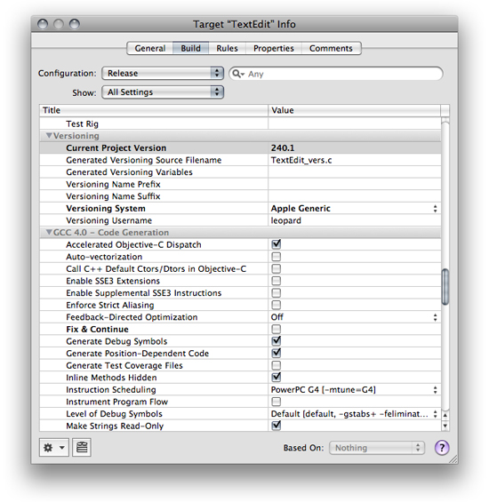
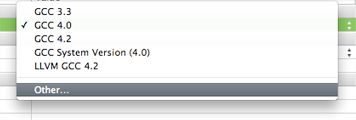
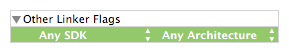
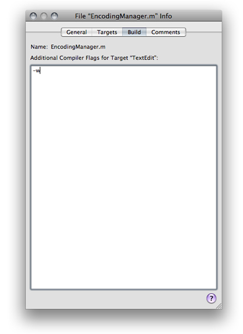
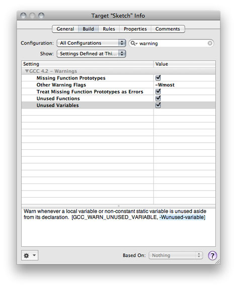
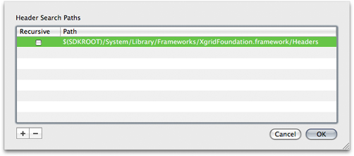
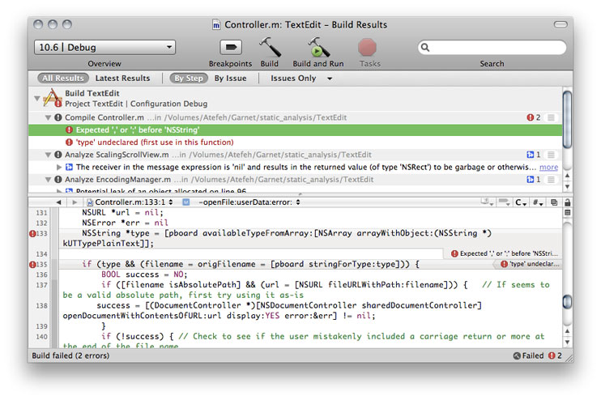
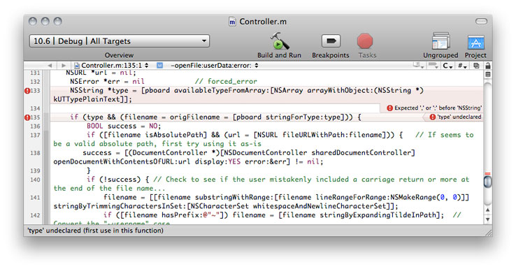

> 导航：[总目录](../../../README.md) · [documentation](../../../_indexes/documentation.md) · [Xcode Project Management Guide](Introduction.md)


[Next](Analyzing%20Code.md)[Previous](Part%20II-%20Product%20Development.md)

# Building Products

To translate the source files and the instructions in a target into a product, you must build that target. You can build from the Xcode application or from the command line, using `xcodebuild`. Building from the application provides detailed feedback about the progress of the build operation and integration with the Xcode user interface. For example, when you build from the Xcode application, you can easily jump from an error message to its location in a source file, make the fix, and try the build again. Building from the command line lets you easily automate builds of a large number of targets across multiple projects.

This chapter:

- Shows how to view and edit build settings and per-file compiler flags
- Describes how to initiate a build from the Xcode application or from the command line
- Describes build locations in Xcode and shows you how to create a shared build directory
- Explains how to build projects with multiple targets efficiently using parallel builds
- Shows how to view build status, errors, and warnings

.

When Xcode builds a target, it generates intermediate files, such as object files, as well as the product described by the target. As you build software with Xcode, you need to know where Xcode places the output of a build. For example, suppose you have an application in one project that depends on a library created by a second project. When building the application, Xcode must be able to locate the library to link it into the application.

There are two build-location settings that you can specify to customize the location of build products and intermediate build files. These are build products directory and intermediate build files directory, respectively.

By default, Xcode places both the build products and the intermediate files that it generates in the `build` directory inside of your project directory. If the software you are developing is contained in a single project, this location is probably fine. However, if you have many interdependent targets—particularly if these targets are divided across multiple projects—you’ll need a shared build directory to ensure that Xcode can automatically find and use the product created by each of those targets.

Xcode also supports the concept of an installation location, using the Deployment Location (`DEPLOYMENT_LOCATION`) and Installation Directory (`INSTALL_PATH`) build settings. If you’re building a product for release, turn on the Deployment Location build setting and supply a path for the Installation Directory build setting. This places the built product at the specified location.

For information about the build settings that specify build locations and how the build products directory and intermediate build files directory settings affect them, see _[Xcode Build System Guide](../Xcode%20Build%20System%20Guide%20%282016%29.md#apple-f4xwc4dqnrsv64tfmyxwi33df52wszbpkridimbqgaztsmzr)_.

When you first start up Xcode, it asks you to specify the directories in which it places the files generated by the build system, both intermediate files and built products. These build locations are used for all new projects.

Each project can specify a value for its build products directory and intermediate build files directory. However, new projects defer to the default values for these settings, specified in Building preferences (see [General Project Attributes](Overview%20of%20an%20Xcode%20Project.md#apple-f4xwc4dqnrsv64tfmyxwi33df52wszbpkridimbqgazdmnrtfvjvomy)). Therefore, setting custom build locations in Building preferences, sets the build locations for new projects. For example, to set shared build locations for all the projects you create, set those locations in Building preferences. And, for projects that don’t need to share those locations, you can customize their build location, as described in [Setting Project-Specific Build Locations](#apple-f4xwc4dqnrsv64tfmyxwi33df52wszbpkridimbqgazdmojtfvjvomjv).

See Building Preferences for details.

Each time you create a project, Xcode sets the build locations for that project to the default build locations specified in the Building pane of Xcode preferences. You can, however, override these default build locations on a per-project basis. By taking advantage of this feature, you can choose default build locations that works best for most of your projects, and specify other default build locations for individual projects as needed.

To override the default location for a project’s build products, use the build locations settings in the Project Info window.

- __Place Build Products In.__ Sets the project’s build products directory.
- __Place Intermediate Build Files In.__ Sets the project’s intermediate build files directory.

To learn how to change the default build location used for projects that you create, see [Setting Default Build Locations](#apple-f4xwc4dqnrsv64tfmyxwi33df52wszbpkridimbqgazdmojtfvjvomq).

Build settings are variables that tell the Xcode build system how to build your product. Build settings provide a powerful and flexible mechanism for customizing the build process.

In the Xcode application, you can define build settings at two levels:

- __Project level:__ The build settings defined at the project level specify build aspects that apply to all the targets contained in the project.
- __Target level:__ A target inherits the build settings specified by the containing project. The target, however, may also override build settings defined by the project. In other words, the build settings at the target level are the ultimate determinant of how a product is built. (When you use the `xcodebuild` command-line tool, you may override target build settings by defining them in the tool invocation.)

To learn more about build settings, see [Build Settings](https://developer.apple.com/library/archive/documentation/DeveloperTools/Conceptual/XcodeBuildSystem/300-Build_Settings/bs_build_settings.html#//apple_ref/doc/uid/TP40002691).

The Xcode application lets you access and edit build settings at the target and project layers. It provides a convenient graphical user interface for changing build setting specifications, the Build pane of Info windows for targets and projects. This section shows how to view and edit build settings using the build settings editor.

You can view and edit build settings at the target and project levels in the Build pane of the Info window for targets and projects. Figure 8-1 shows the Build pane for a target.

__Figure 8-1__  Build settings for a target



These are the components of the Build pane:

- __Configuration menu.__ The Configuration pop-up menu indicates which of the target’s build configurations is currently displayed. Choosing Active from this menu displays the build settings defined for the active build configuration; for more information, see [Build Configuration Overview](../Xcode%20Build%20System%20Guide/Build%20Configurations.md#apple-f4xwc4dqnrsv64tfmyxwi33df52wszbpkridimbqgazdmojsfvjvomi). The build settings defined for the active configuration appear in the build settings table.
- __Search field.__ The search field lets you search the build settings table for a keyword or other text string. As you type, Xcode filters the list to include only those build settings that match the text in the search field. For example, you can find all build settings related to search paths by typing `search`.
- __Show menu.__ The Show pop-up menu lets you filter the list of build settings shown in the build settings table.
- __Build settings table.__ The build settings table contains two columns:

  - __Title.__ The Title column shows build setting titles, which are brief English-language descriptions for the build settings. You can display build setting names instead by Control-clicking anywhere in the table and choosing Show Setting Names from the shortcut menu.

    If you know the title of the build setting you are looking for and keyboard focus is in the build settings table, you can simply start typing the build setting name to select that build setting.
  - __Value.__ The Value column shows build setting values. You can display build setting specifications by Control-clicking anywhere in the table and choosing Show Definitions from the shortcut menu.
- __Action menu.__ The action menu lets you add or remove build setting specifications, including conditional build setting specifications.
- __Research Assistant button.__ The Research Assistant button opens the Research Assistant, which displays information about the build setting selected in the build settings table. To learn more about the Research Assistant, see [Using the Research Assistant](../Xcode%20Workspace%20Guide/Documentation%20Access.md#apple-f4xwc4dqnrsv64tfmyxwi33df52wszbpkridimbqga3dsmrqfvbuqmrwgawvgvzr).
- __Based On menu.__ The Based On menu specifies the build configuration file upon which the active build configuration is based. (When the project contains no configuration files, this pop-up menu is dimmed.) When you base a build configuration on a configuration file, Xcode sets the default specifications of the build settings in the build configuration to the corresponding specifications in the configuration file.

You can modify build settings for multiple configurations of a target at once; to do so, choose All Configurations from the Configuration menu, as described in [Managing Build Configurations](../Xcode%20Build%20System%20Guide/Build%20Configurations.md#apple-f4xwc4dqnrsv64tfmyxwi33df52wszbpkridimbqgazdmojsfvbuuqshivaucry).

You can also modify build settings in multiple targets at once; the build settings table supports multiple selection. To edit build settings for more than one target at a time, select those targets in the project window and open an Info window.

The build settings table supports copy and paste, as well as drag and drop, of build settings. If you have already configured a group of settings for a target, you can reuse them by selecting those build settings and dragging them into a text file, or by copying and pasting them between Info windows.

For a list of the available build settings, see _[Xcode Build System Guide](../Xcode%20Build%20System%20Guide%20%282016%29.md#apple-f4xwc4dqnrsv64tfmyxwi33df52wszbpkridimbqgaztsmzr)_.

The interface for modifying a build setting’s specification in the build settings editor varies according to the possible values for that build setting. Depending on the value, Xcode may display, for example, a text field, a table, a checkbox, or a pop-up menu. This list describes the interface to edit the possible build setting value data types:

- __String.__ If a build setting takes a string as its value, double-click the Value cell to edit it.

  If you are entering a file path, you can simply drag the file or folder from the Finder into the text field.
- __List.__ If a build setting can have a list of items as its value, the Value column displays the value as a space-separated list. You can add or remove items from a lis of values by double-clicking anywhere in the row and using the plus and minus buttons in the dialog that appears.

  If you are entering file paths, you can simply drag the file or folder from the Finder into the list, instead of typing the paths in yourself.
- __Boolean.__ If a build setting can have two states—on or off—the Value cell contains a checkbox. A checkmark indicates that the build setting is turned on.
- __Choice.__ If a build setting has a finite number of possible values, the build setting’s Value cell contains a pop-up menu with the possible values.

  For some build settings, in addition to the standard values shown in the value pop-up menu, you may specify a custom value by choosing Other from the value list.

  

If you do not see the build setting you want to modify, or if you want to define custom build settings, you can add build settings to the build settings table in the Build pane of the Info window for a target or project.

To add a build setting definition to a target or project, choose Add User-Defined Setting from the Action menu in the bottom-left corner of the window.

To remove a build setting from a target or project, select the build setting definition to remove and choose Delete Definition at This Level from the Action menu.

If the build setting definition that you deleted is defined at a lower layer, Xcode continues to display that build setting in the build settings table. However, Xcode displays the build setting in nonbold text, indicating that it’s defined elsewhere.

Conditional build settings let you specify the conditions under which you want particular build setting specifications to apply. For example, when building using a particular SDK or for a particular platform. For details, see [Conditional Build Settings](../Xcode%20Build%20System%20Guide/Build%20Settings.md#apple-f4xwc4dqnrsv64tfmyxwi33df52wszbpkridimbqgazdmojrfvjvomy).

To add a conditional build setting definition:

1. In the build settings table, select the build setting to which you want to add a conditional definition. See [Viewing Build Settings](#apple-f4xwc4dqnrsv64tfmyxwi33df52wszbpkridimbqgazdmojtfvjvomzz) for details on how to find the appropriate build setting.
2. From the Action menu, choose Add Build Setting Condition.

   The build setting conditions appear below the build setting, as shown in Figure 8-2.

   __Figure 8-2__  Build setting conditions

   
3. From the Any SDK and Any Architecture pop-up menus, choose the conditions under which you want the build setting specification to apply.

   For example, if you want the build setting to apply to any architecture and any release of the iOS Device SDK, choose “Any iOS Device” from the Any SDK pop-up menu (Figure 8-3). To specify a particular release of the iOS SDK—for example, the one for iOS 2.2—choose “Simulator - iOS 2.0.”

   __Figure 8-3__  Conditional build setting

   

You cannot configure build information for Jam-based Project Builder targets and external targets in the build settings table. To edit the build settings for Jam-based and external targets in Xcode, select the target in the Groups & Files list. If you have a text editor open in the project window, Xcode displays the Project Builder target editor. To view this target editor in a separate window, double-click the target.

On the left side of the External Target Info window (shown in Figure 8-4), Xcode displays a number of groups of target settings appropriate for the current target. Selecting any of these groups displays its settings in the editor on the right side of the Info window.

__Figure 8-4__  External Target Info window

!!

To view the build settings for an external target, select the Custom Build Settings group. To view the build settings for a legacy Project Builder target, select the Custom Build Settings item in the Settings group. The target editor displays a table of build settings:

- The Name column contains the build setting name.
- The Value column contains the build setting specification.

You can add and delete build settings using the plus (+) and minus (-) buttons below the table. To edit a build setting, double-click in the appropriate column and type the build setting name or specification. The target editor for legacy targets also includes a simpler interface for a number of common build settings in the Simple View.

The build system provides facilities for customizing the build process of source files of particular types. It includes the Other C Flags (`OTHER_CFLAGS`), Other C++ Flags (`OTHER_CPLUSPLUSFLAGS`), Other Warning Flags (`WARNING_CFLAGS`), and Preprocessor Macros (`GCC_PREPROCESSOR_DEFINITIONS`) build settings, among many others, to customize the invocation of the compiler when processing C-based source files. However, sometimes it’s necessary to specify compiler flags for particular files. For example, in a project that treats warnings as errors in general, you may have a set of cross-platform source files whose warnings you want the compiler to ignore.

To view the compiler flags for a file:

1. Select the source file in the Groups & Files list.
2. Choose File > Get Info to open the File Info window.
3. Display the Build pane (Figure 8-5).

__Figure 8-5__  File compiler flags



In the Additional Compiler Flags for Target field, you can enter any compiler flags you want to assign to the file. Use spaces to separate flags.

You can use multiple selection to assign compiler flags to a subset of the files in a target.

For each target that a file belongs to, Xcode maintains a separate list of compiler flags assigned to the file. To specify compiler flags for use with a file when it is built as part of a particular target, select the file from the appropriate build phase in that target and open the File Info window, as described earlier. If you open an Info window for the same file from any other group in the project window, Xcode assumes you want to assign compiler flags to the file in the active target; thus, the Build pane is available only if the file is part of the active target.

When the build system constructs the command-line invocation for the tool that processes the source file, it adds the additional compiler flags assigned to the file to the invocation. The build system doesn’t validate the flags you add; that is, it doesn’t test whether the compiler actually supports the options you add, and it doesn’t investigate whether the options you add conflict with the ones it generates. If you add a group of compiler options for a file that produce build errors or warnings, you should remove all the options you added and add them back one at a time, making sure the file compiles after you add each option, to determine which option is not supported. You should also consult the tool’s documentation to learn about possible conflicts.

The additional compiler options specified for a file are always used when the file is processed as part of a build, and these compiler options cannot be overridden in any of the build setting layers. (Build setting layers are described in [Build Setting Evaluation](../Xcode%20Build%20System%20Guide/Build%20Settings.md#apple-f4xwc4dqnrsv64tfmyxwi33df52wszbpkridimbqgazdmojrfvjvoni).)

You can use file compiler options to negate compiler options generated by the build system. For example, you may have turned on the Unused Variables build setting for your target, but want to deactivate unused-variable warnings for only one of the target’s source files.

To negate the effect of a build setting on a particular file:

1. Clean and build the target to ensure there are no build errors or warnings.
2. Using the build-setting descriptions in the Build pane of the project or target Info window, determine the compiler option that corresponds to the build setting in question.

   
3. Add the negative form of the compiler option, by prepending it with `-Wno-`, to the compiler flags of the file whose build-setting effect you want to suppress. For example, to negate the `-Wunused-variable` compiler option (which the build system generates when Unused Variables is turned on), add `-Wno-unused-variable` to the file’s compiler options.
4. Build the product. If there are build errors, the compiler option just added may not be supported by the compiler.

Xcode defines a number of build settings for specifying general search paths for files and frameworks used by targets in your project. These build settings are:

- Header Search Paths (`HEADER_SEARCH_PATHS`)

  This is a list of paths to folders to be searched by the compiler for included or imported header files when compiling C, Objective-C, C++, or Objective-C++ source files.
- Library Search Paths (`LIBRARY_SEARCH_PATHS`)

  This is a list of paths to folders to be searched by the linker for static and dynamic libraries used by the product.
- Framework Search Paths (`FRAMEWORK_SEARCH_PATHS`)

  This is a list of paths to folders containing frameworks to be searched by the compiler for both included or imported header files when compiling C, Objective-C, C++, or Objective-C++, and by the linker for frameworks used by the product.
- Rez Search Paths (`REZ_SEARCH_PATHS`)

  This is a list of paths to search for files included by Carbon Resource Manager resources and compiled with the Rez tool.

For additional information on these build settings, see _[Xcode Build System Guide](../Xcode%20Build%20System%20Guide%20%282016%29.md#apple-f4xwc4dqnrsv64tfmyxwi33df52wszbpkridimbqgaztsmzr)_.

Xcode supports recursive search paths. For each path that you enter in one of these search path build settings, you can specify that Xcode search the directory at that path, as well as any subdirectories that directory contains.

You can edit search paths in much the same way that you edit other build settings that contain lists of strings, as described in [Editing Build Setting Specifications](#apple-f4xwc4dqnrsv64tfmyxwi33df52wszbpkridimbqgazdmojtfvbuuqscirdeora). However, to specify that Xcode perform a recursive search for items at a particular path, select the checkbox next to that path in the Recursive column of the list editor, shown in Figure 8-6. Xcode appends `**` to the search path. When you build, Xcode searches the directory at the specified location, and all subdirectories in it, for the header, framework, library, or resource.

__Figure 8-6__  Header Search Paths list



Xcode performs a breadth-first search of the directory structure at the search path, following any symbolic links. Xcode searches locations in the order in which they appear in the search paths table, from top to bottom. It stops when it finds the first matching item, so if you have multiple files or libraries of the same name at the locations specified by a set of search paths, Xcode uses the first one it finds.

Note that adding very deep directory structures to a list of recursive search paths can increase your project’s build time. The maximum number of paths that Xcode expands a single recursive search path to is 1024.

Building targets in the Xcode application, you can view build system output, see error and warning messages, and jump to the location of an error or warning in source files, all in a single window.

You can perform a full build of the active target and any targets on which it depends, compile a single file, or view the preprocessor output for a file. You can also remove the build products and intermediate files generated by the build system for a target.

Before you start a build task, you should ensure that the build factors are set appropriately. A _build factor_ is a setting that defines a particular aspect of a build. There are five build factors:

- __Active target.__ Identifies the target (and dependent targets) that’s built when you execute the Build command. See Targets for details.
- __Active SDK.__ Specifies the build environment, which includes the core and additional frameworks and libraries against which the targets’ source code is compiled and the command-line tools used to build the product.
- __Active configuration.__ Specifies the build configuration to use when building the active target and its dependent targets. See Build Configuration Overview.
- __Active architecture.__ Specifies the architecture for which the product is built, such as i386, x86_64, or ArmV6.
- __Active executable.__ Specifies the executable environment to use for running the product after it’s built successfully. See [Setting the Active Executable](Defining%20Executable%20Environments.md#apple-f4xwc4dqnrsv64tfmyxwi33df52wszbpkridimbqgazdmojyfvbecqskijeuery) for details.

You can set a project’s build factors (except the active SDK) using the Project menu or the Overview toolbar menu.

After setting the active target and build configuration, you’re ready to build the target’s product. In a build, the target being built is known as the current target. The first time you build a target, the build system creates all the intermediate files, such as object files, needed to build the product. In subsequent builds of the same target, the build system processes only the files that have changed since the target’s previous build. For example, if the only change to the target since the last time it was built was a minor edit to a single source code file, the build system recompiles that file and relinks the object files to create the finished product. That is, changes to the contents of the file and changes to build settings that affect the way a source file is built cause the build system to rebuild the file.

To build the active target, execute one of the following commands from the Build menu:

- __Build.__ Builds the target.
- __Build and Analyze.__ Builds the target and performs static analysis on the target’s source files. For more information about static analysis, see [Analyzing Code](Analyzing%20Code.md#apple-f4xwc4dqnrsv64tfmyxwi33df52wszbpkridimbqga3dsmjxfvbuqnbnknlte).
- __Build and Run.__ Builds the target and launches the built product.
- __Build and Run – Breakpoints Off.__ Builds the target and launches the built product with its breakpoints turned off. Execution continues through breakpoints.
- __Build and Debug – Breakpoints On.__ Builds the target and launches the built product with its breakpoints turned on. Execution stops when the first active breakpoint is reached.

You may also build targets individually, regardless of which is the active target, by choosing the appropriate build command from the target shortcut menu in the Groups & Files list.

Xcode builds the current target in two major stages:

- __Target dependencies.__ The build system builds the targets on which the current target depends.
- __Build phases.__ The build system processes the current target’s build phases.

Building a target produces build messages, which include errors, warnings, and static-analyzer messages. See [Viewing Build Results](#apple-f4xwc4dqnrsv64tfmyxwi33df52wszbpkridimbqgazdmojtfvjvomjy) for information on how to view build messages, and how to address errors and warnings.

If your product does not build properly and there are no error messages, make sure your files have correct dates. Files with invalid dates (that is, dates before 1970) won’t compile correctly.

You can see the preprocessor output for a C, C++, or Objective-C source files in the active target. To do so, select the files and choose Build > Preprocess.

Preprocessor output can also identify the `#define` directives (including predefined macros) in effect for a target’s source files. To include these directives, add `-dM` to the Other C Flags (`OTHER_CFLAGS`) build setting. For more information on the C preprocessor, see _GNU C 4.0 Preprocessor User Guide_.

A full build can take a long time if you build target with many source files. You can compile a subset of a target’s source files to ensure that they build correctly without having to build the entire target. To compile a set of target files:

1. Select the target files (they must be part of the active target).
2. Choose Build > Compile.

To see the assembly code output by the compiler for a source code file, select that file and choose Build > Show Assembly Code. Xcode compiles the file, and any additional files required to build it, and displays the assembly code generated by the compiler in an editor. You show assembly code for multiple files by selecting them in the project window.

As you learned in [Building a Target](#apple-f4xwc4dqnrsv64tfmyxwi33df52wszbpkridimbqgazdmojtfvjvomjw), after the initial build of a target, the build system performs only those actions required to update changed files during subsequent builds. You can, however, force Xcode to do a full rebuild of the target by cleaning that target and rebuilding.

When you _clean_ a target, the build system removes all the product files, as well as any object files (`.o` files) or other intermediate files created during the build process. The next time you build, every file in every build phase is processed according to the action associated with that phase.

To clean the active target, choose Build > Clean.

The Clean Target dialog appears. It contains two options:

- __Also Clean Dependencies.__ Cleans the targets on which the target depends.
- __Also Remove Precompiled Headers.__ Removes the precompiled header binaries used by the target.

To clean all targets in your project, choose Build > Clean All Targets.

All headers in your project are automatically accessible to your source code. You can also specify additional search paths at which to find headers using the Header Search Paths (`HEADER_SEARCH_PATHS`) build setting, described in [Search Paths](#apple-f4xwc4dqnrsv64tfmyxwi33df52wszbpkridimbqgazdmojtfvjvomrt).

Note that you do not have to add headers to your target to include them in your source code. You should add header files to your target—as part of the Copy Header Files build phase—only if they are embedded in your product, as with a framework.

By default, Xcode searches user paths before system paths. This means that, by default, your project headers have precedence over system headers. Thus, if your project defines a header file named `String.h`, source code in your project that includes `String.h` incorporates your project’s version of the header, not the system version. You can override this behavior by turning off the Always Search User Paths (`ALWAYS_SEARCH_USER_PATHS`) build setting.

When Always Search User Paths is inactive, project headers can be incorporated into translation units only by surrounding the header filename with quotation marks. (A _translation unit_ is a single source file with its imported/included files). (A translation unit is a source file with its imported/included header files.) For example, `#include "String.h"` incorporates the `String.h` header file defined in the project into generated translation unit. Furthermore, system headers can be incorporated into translation units only by surrounding the header filename with angle brackets. For example, `#include <String.h>` incorporates the `String.h` system header file into the generated translation unit.

During a build, you want to see how that build is progressing. Especially for long build processes, it is useful to know the status of that process. Xcode displays the build status in the project window status bar. The status bar message lets you know the operation currently being performed. When the build is complete, Xcode displays the result of the build—namely, whether the build succeeded or failed and whether there were any errors or warnings—on the right side of the status bar.

You can click the build message in the status bar to see more detailed information about the build in the Build Results window. You can also click the progress indicator in the status bar during the course of the build to open the Activity Viewer, as described in [Viewing the Progress of Tasks in Xcode](../Xcode%20Workspace%20Guide/The%20Project%20Window.md#apple-f4xwc4dqnrsv64tfmyxwi33df52wszbpkridimbqgazdmnrvfvjvomjq).

In addition, Xcode displays a progress indicator that shows the status of the build in its Dock icon. If an error or warning occurs, Xcode indicates the number of errors or warnings with a red badge on the Dock icon.

The _Build Results window_ lets you see a more detailed account of the progress of a build. It shows each step of the build process, as well as the full output of the build system, and can take you directly to the source of any errors or warnings.

To open the build results viewer, choose Build > Build Results

Figure 8-7 shows the Build Results window.

__Figure 8-7__  Build Results window



These are the major user-interface elements of the Build Results window:

- __Build results toolbar.__ The build results toolbar lets you specify the results you want to view.
- __All Results button.__ Displays the results generated since the last clean was performed. Xcode remembers the results of multiple builds, which allows you to gauge your progress solving issues across several builds.
- __Latest Results button.__ Displays the build results of the last build.
- __By Step button.__ Displays the results by build operation. For example, each source-file compilation is a build step.
- __By Issue button.__ Displays the results grouped by issue type when there are problems with the build, such as build errors and warnings, or static analyzer messages.
- __Messages menu.__ The pop-up menu in the third section of the toolbar lets you filter the build results. Its options are:

  - __All Messages.__ Displays all build results, which includes status messages, errors, warnings, and static-analyzer messages.
  - __Issues Only.__ Displays errors, warnings, and static-analyzer messages.
  - __Errors & Warnings Only.__ Displays errors and warnings.
  - __Errors Only.__ Displays errors.
  - __Analyzer Results Only.__ Displays static-analyzer messages.
- __Build results.__ The build results pane build messages from the build system.
- __Editor pane.__ The editor pane displays the file corresponding to the selected message in the build results pane.

To navigate through warning and error messages even when the Build Results window is hidden, use these commands:

- Build > Next Build Warning or Error
- Build > Previous Build Warning or Error

These commands select the next/previous error or warning in the Build Results window. They do not, however, bring the Build Results window forward if it is hidden. If you are working in the text editor, using these commands selects the line at which the error or warning occurred and opens the related file if it is not already open.

When viewing build results by step, you can display a step’s transcript by clicking the Show Transcript button (the button containing thin horizontal lines) on the right side of the build step. Figure 8-8 shows the transcript of a build step. To hide the transcript, click the Hide Transcript button (the button containing a triangle pointing up).

__Figure 8-8__  Displaying a build-step transcript in the Build Results window

!!

You can copy build transcripts to text files (such as an email messages) for further analysis:

- To copy a build-step transcript, select the build step and drag it to the desired location. Dragging a build step to the Desktop creates a text clipping.
- To copy the entire build transcript, choose Edit > Select All and drag the selection to the desired location.

Instead of dragging, you can use the Copy and Paste commands in the Edit menu to copy the transcript to the desired location.

If you start a build from a text editor window, Xcode displays errors and warnings for the edited file directly in the editor. The text editor displays build messages as message bubbles (see [Viewing Project Messages](../Xcode%20Workspace%20Guide/The%20Text%20Editor.md#apple-f4xwc4dqnrsv64tfmyxwi33df52wszbpkridimbqgazdmnzzfvjvomry)) next to the source code line that caused the problem, as shown in Figure 8-9.

__Figure 8-9__  Text editor displaying build error messages



To indicate whether to display build messages in the text editor and to specify the type of messages to display, use the View > Message Bubbles menu.

In addition to building your product from the Xcode application, you can use `xcodebuild` to build a target from the command line. Building from the command line gives you additional flexibility compared to building from within the Xcode application that may be useful in certain circumstances. For example, using `xcodebuild`, you can create a script that automatically builds your product at a specific time.

The `xcodebuild` tool reads your `.xcodeproj` project package and uses the target information it finds there to build a product.

To build a target using `xcodebuild`, use the `cd` command to change to your project’s directory and invoke the `xcodebuild` command with the appropriate options. The project’s directory contains your project’s `.xcodeproj` bundle. For example, if your project is in `~me/Projects/MyProj`, enter `cd ~me/Projects/MyProj`.

The project file format, and the extension used for the project bundle, changed for Xcode 2.1. `xcodebuild` can build projects created by Xcode 2.0 or earlier (identified by the `.xcode` project bundle extension), as well as projects that have been upgraded. If the project directory contains both a `.xcodeproj` bundle and a `.xcode` bundle, `xcodebuild` uses the `.xcodeproj` bundle by default (to override this behavior use the `xcodebuild -project` option). If no `.xcodeproj` project package exists, `xcodebuild` opens the `.xcode` project package and creates an upgraded copy of it in memory. It uses this copy to build the project. The upgraded copy is not saved back to the file system.

When you build within Xcode, it uses the active target and build configuration; `xcodebuild` uses the first target in the project’s target list unless you specify a target (`xcodebuild -target`). You can specify which build configuration to use with the `-configuration` option. If you do not specify a build configuration, `xcodebuild` uses the target's default build configuration.

If you run `xcodebuild` as the root user, the preferences you set in Xcode preferences under another computer user are not used. Preferences are stored per user, and there are no preferences stored for the root user (unless you logged in as root and used Xcode at some point).

Normally the build system builds a target’s dependencies sequentially; such builds are called sequential target builds). That is, each dependency’s build process is completed before starting the build process for another dependency.

To shorten the build process, the build system can take advantage of parallel target builds. With parallel target builds, the build system builds target dependencies in parallel instead of one at a time.

The only build phase that the build system carries out in parallel is Compile Sources. All other build phases are performed linearly. This means that before and after the Compile Sources build phase, the build system processes a target’s dependencies sequentially. To learn more about the order in which build phases are processed, see [Build Phase Processing Order](../Xcode%20Build%20System%20Guide/Build%20Phases.md#apple-f4xwc4dqnrsv64tfmyxwi33df52wszbpkridimbqgazdmojqfvbeeq2fjfbemqi).

You can activate parallel target builds for a project in the Project Info window. In the General pane, select “Build independent targets in parallel.”

- Project editor > General > Build independent targets in parallel

A product built for release to customers differs from a product built for debugging and development purposes. For example, you typically want your release product to be more highly optimized and to have unneeded symbols stripped to reduce code size. To build a product suited for deployment and install that product in its final destination path, there are a handful of build settings that you need to set before you build. These build settings are listed in Table 8-1.

__Table 8-1__  Build settings for installation builds

| Build setting | Value |
| Installation Build Products Location (`DSTROOT`) | Identifies the distribution root at which the build system places products built during an installation build. |
| Installation Directory (`INSTALL_PATH`) | Identifies the location under the distribution root at which the build system places products during an installation build. |
| Deployment Postprocessing (`DEPLOYMENT_POSTPROCESSING`) | Specifies whether the build system performs a number of steps designed to prepare the executable for release. These steps are described later in this section. |
| Deployment Location (`DEPLOYMENT_LOCATION`) | Specifies whether the build system places the product in the location specified by the `DSTROOT` and `INSTALL_PATH` build settings. |

To build a release version of a product and install it, you can do either of the following:

- Use `xcodebuild` from the command line with the `install` option.
- In the appropriate build configuration in the Xcode application, turn on the Deployment Location and Deployment Postprocessing build settings, set Installation Build Products Location to `/`, and set Installation Directory to the directory where you want to place the built product.

For example, to install a framework in `/Library/Frameworks`, configure the build settings as shown in Table 8-2.

__Table 8-2__  Build settings for installing a framework in the local domain

| Build setting name | Build setting specification |
| `DSTROOT` | `/` |
| `INSTALL_PATH` | `$(USER_LIBRARY_DIR)/Frameworks` |
| `DEPLOYMENT_LOCATION` | `YES` |

To build and install this framework in its final destination path using `xcodebuild install`, enter the following on the command line:

```
% sudo xcodebuild install -configuration Release DSTROOT=/ INSTALL_PATH=/Library/Frameworks DEPLOYMENT_LOCATION=YES
```

When you use `xcodebuild` with the `install` action, `xcodebuild` automatically sets `DEPLOYMENT_POSTPROCESSING` to `YES`. In the Xcode application, you must turn on Deployment Postprocessing yourself. When Deployment Postprocessing is active, the following operations occur:

- If Strip Linked Product (`STRIP_INSTALLED_PRODUCT`) and Use Separate Strip (`SEPARATE_STRIP`) are turned on, the build system strips the binary using the `strip` tool.

  You can use the Additional Strip Flags (`STRIPFLAGS`) build setting to specify which flags to pass to `strip`. By default, the build system passes the `-S` flag for libraries and frameworks, and the `-s` flag for applications and tools. If, for example, your application loads plugins that access symbols directly from the application, you may want it to be stripped with `-S`. To do so, set Additional Strip Flags in the target to `-S`. Stripping is not done for noninstallation builds.

  To specify whether executable files copied by a Copy File build phase are stripped, use the Strip Debug Symbols From Binary (`COPY_PHASE_STRIP`) build setting. By default, this build setting is turned on.

  For more information on the build settings described here, see _[Xcode Build System Guide](../Xcode%20Build%20System%20Guide%20%282016%29.md#apple-f4xwc4dqnrsv64tfmyxwi33df52wszbpkridimbqgaztsmzr)_. To learn more about controlling exported symbols, see [Reducing the Number of Exported Symbols](../Xcode%20Build%20System%20Guide/Linking.md#apple-f4xwc4dqnrsv64tfmyxwi33df52wszbpkridimbqgazdmojufvjvomy). To learn more about using dead-code stripping in Xcode, see [Dead-Code Stripping](../Xcode%20Build%20System%20Guide/Linking.md#apple-f4xwc4dqnrsv64tfmyxwi33df52wszbpkridimbqgazdmojufvjvona).
- The Copy Files and Run Script build phases that are marked, respectively, “Copy only when installing” and “Run script only when installing,” are run. To learn more about the Copy Files and Run Script build phases, see [Copy Files Build Phase](https://developer.apple.com/library/archive/documentation/DeveloperTools/Conceptual/XcodeBuildSystem/200-Build_Phases/bs_build_phases.html#//apple_ref/doc/uid/TP40002690-SW2) and [Run Script Build Phase](https://developer.apple.com/library/archive/documentation/DeveloperTools/Conceptual/XcodeBuildSystem/200-Build_Phases/bs_build_phases.html#//apple_ref/doc/uid/TP40002690-SW1).
- Permissions are set for the product. The owner, group, and mode of the produced files are set according to the value of the Install Permissions (`INSTALL_MODE_FLAG`) build setting.

Before you can take advantage of the source-level debugger, the compiler must collect information for the debugger. To generate debugging symbols for a product, use the Debug build configuration. This configuration turns on build settings that prepare a product for debugging. For more information about building see [Debugging Preferences](https://developer.apple.com/library/archive/documentation/DeveloperTools/Conceptual/XcodeDebugging/150-Debugging_Preferences/debugging_preferences.html#//apple_ref/doc/uid/TP40007057-CH13).

Xcode can create _universal binaries_, which are executable files that can contain code and data for more than one architecture. You can create a single binary file that runs on both PowerPC-based and Intel-based Macintosh computers. The Architectures (`ARCHS`) build setting lets you specify which architectures Xcode builds for.

Xcode compiles a target’s source files for each architecture individually and creates a single binary file (a universal binary) from these input files. For more information on building universal binaries, see _[Universal Binary Programming Guidelines, Second Edition](../../Mac%20OSX/Universal%20Binary%20Programming%20Guidelines%2C%20Second%20Edition/Introduction.md#apple-f4xwc4dqnrsv64tfmyxwi33df52wszbpkridimbqgazdemjx)_.

To define build settings for particular architectures, you can use conditional build settings. See [Conditional Build Settings](../Xcode%20Build%20System%20Guide/Build%20Settings.md#apple-f4xwc4dqnrsv64tfmyxwi33df52wszbpkridimbqgazdmojrfvjvomy) to learn more about this facility.

You can develop software that can be deployed on, and take advantage of features from, different versions of iOS or Mac OS X, including versions different from the one you are developing for. This capability is known as _cross-development_.

In order to take advantage of cross-development, you must install the Mac OS X SDKs for the OS versions you plan on targeting. Then, in your projects, specify which SDK to use when building your products. You can also specify the earliest Mac OS X release on which the software must run.

In some cases, Apple distributes an SDK for an upcoming version of the operating system as a seed, allowing you to prepare your application to work with future versions of the Mac OS X before they have been released to the general public.

To set up your Xcode project to target multiple Mac OS X releases, take the following steps:

1. __Choose an SDK.__ Select your project in the Groups & Files list and choose File > Get Info. In the General pane of the Project Info window, choose the SDK from the Base SDK for All Configurations pop-up menu. When you choose an SDK, Xcode builds targets in your project against the set of headers corresponding to the specified version of the OS, and links against the stub libraries in that SDK. This allows you to build products on your development computer that can be run on the OS release targeted by the SDK. Your software can use features available in system versions up to and including the one you select.

   You can also specify the Base SDK through the Base SDK (`SDKROOT`) build setting.
2. __Choose a deployment version Mac OS X.__ If your software must run on a range of operating system versions, choose a Mac OS X deployment operating system for each individual target that requires one. The deployment operating system identifies the earliest system version on which the software can run. By default, this is set to the version of the OS corresponding to the SDK version.

   To set the deployment version for a target:

   1. Select the target in the Groups & Files list and open an Info window. Click Build to open the Build pane.
   2. Find the Deployment Target (`MACOSX_DEPLOYMENT_TARGET`) or iOS Deployment Target (`IPHONEOS_DEPLOYMENT_TARGET`) build setting (depending on which platform you’re developing for) and choose a deployment operating system from the pop-up menu in the Value column.
3. __For each target, supply a prefix file that takes into account the selected SDK.__ To use an umbrella framework header from an SDK as your prefix file, add the appropriate `#include <Framework/Framework.h>` directive to your target's prefix file instead of setting a Prefix Header path to the umbrella framework header directly.

There is a lot more to successfully developing software for multiple versions of the Mac OS. For more information see _[SDK Compatibility Guide](../SDK%20Compatibility%20Guide/Introduction.md#apple-f4xwc4dqnrsv64tfmyxwi33df52wszbpgeydambqge3dg2i)_.

The Building pane of Xcode preferences allows you to set default project build locations and the behavior of the Build Results window and the Errors and Warnings smart group. Figure 8-10 shows the Building preferences pane.

__Figure 8-10__  Building preferences pane

!

Here is what the pane contains:

- __Place Build Products In.__ Specifies the location at which Xcode places the output generated when you build a target—such as an application or tool—for all new projects that you create.

  - __Project directory:__ Places the product that is generated in the build folder in your project directory.
  - __Customized location:__ Places build products in the folder specified in the associated text field. Use this option to specify a different folder for build products. You can type the path to that folder in the field or click Choose to locate the folder using the standard navigation dialog.

  You can override this setting for individual projects. See [Build Locations](#apple-f4xwc4dqnrsv64tfmyxwi33df52wszbpkridimbqgazdmojtfvjvomjq) for details.
- __Place Intermediate Files In.__ Specifies the location at which Xcode places the intermediate files generated by the Xcode build system when you build a target—such as object (`.o`) files—for all new projects that you create.

  - __With build products.__ Places the intermediate files that are generated in the location specified for build products. This is the location indicated by the “Place Build Products in” option, described above, either in the Building preferences or at the project level. This is the default value.
  - __Customized location.__ Places intermediate files in the folder specified in the associated text field. You can type the path to that folder in the field or click Choose to locate the folder using the standard navigation dialog.

  You can override this setting for individual projects. See [Build Locations](#apple-f4xwc4dqnrsv64tfmyxwi33df52wszbpkridimbqgazdmojtfvjvomjq) for details.
- __Build Results Window.__ These pop-up menus specify when Xcode opens the Build Results window or pane:

  - __Open during builds.__ Specifies when (or whether) Xcode automatically opens the Build Results window or pane when you build a target.
  - __Close after builds.__ Specifies when (or whether) Xcode automatically closes the Build Results window or pane after a build completes.

  To learn more about the Build Results window, see [Viewing Build Results](#apple-f4xwc4dqnrsv64tfmyxwi33df52wszbpkridimbqgazdmojtfvjvomjy).
- __Build Options.__ These settings let you specify how Xcode reacts to build errors and whether Xcode tries to speed up the build process by using predictive compilation. The options are:

  - __Continue building after errors.__ Controls what Xcode does when it encounters a build error. If this option is selected, Xcode continues trying to build the next file in the target after encountering an error. Otherwise, Xcode stops the build. By default, this option is disabled.
  - __Use Predictive Compilation.__ Activates predictive compilation. Predictive compilation shortens build time by beginning to compile source files in the background, even before you initiate a build. See [Predictive Compilation](../Xcode%20Build%20System%20Guide/Reducing%20Build%20Times.md#apple-f4xwc4dqnrsv64tfmyxwi33df52wszbpkridimbqgazdmojvfvbuesckineusrq) for details.
- __For Unsaved Files.__ This menu determines what Xcode does with files that have unsaved changes when you start a build. You can specify whether to ask before saving, automatically save, never save, or cancel the build.

[Next](Analyzing%20Code.md)[Previous](Part%20II-%20Product%20Development.md)

