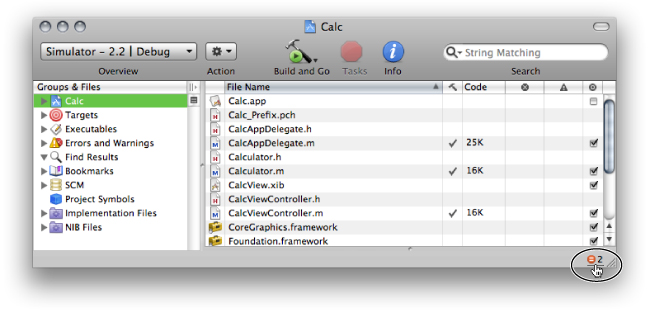
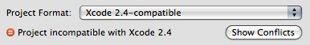
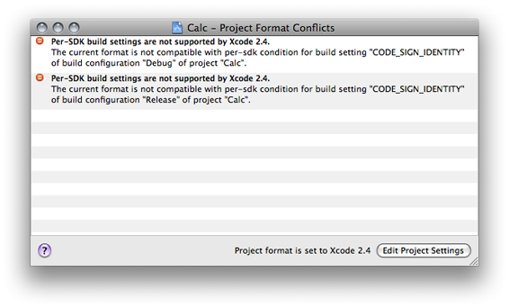

> 导航：[总目录](../../../README.md) · [documentation](../../../_indexes/documentation.md) · [Xcode Project Management Guide](Introduction.md)

[Next](Files%20in%20Projects.md)[Previous](Overview%20of%20an%20Xcode%20Project.md)

# Creating Projects

As soon as you know what product you are working on, you need an Xcode project. If the product is new, you can create an Xcode project from scratch. Xcode provides project templates to help you create a wide variety of products.

If you are working on an existing product, you probably already have a project. If you have an existing Xcode project, you can simply open the project in Xcode, as described in [Opening and Closing Projects](#apple-f4xwc4dqnrsv64tfmyxwi33df52wszbpkridimbqgazdmnrufvkfawcsivddcmbw).

This chapter shows you how to create a project and describes the available project templates.

Fairly early in your design process, you make decisions related to the type of product (application, library, command-line tool, and so on) and language or languages (Objective-C, Objective-C++, or C) you plan to use. You also decide which Apple technologies and frameworks to use.

After you’ve resolved these issues, you’ll find that Xcode provides a wide variety of project templates to support your goals. The New Project dialog groups these templates under several product-type groups, such as applications, frameworks, Automator actions, and so on. Two additional templates create an empty project and a project that uses an external build system.

The project template you choose specifies a default target and also determines the default source files, resources, framework references, and other information that Xcode includes automatically in the project. A project generally contains all the information it needs to build a product for its default target. This includes a minimal set of source files that you can compile into a running product, as well as default build settings.

The project template names and descriptions should give you a good idea of which project template is right for your product. One way to learn more about a project template is to create a project with that template, examine its contents, and see what happens when you build it. Project templates may change, and new templates are added from time to time with releases of Xcode, but by trying out a template, you can easily examine its default contents in that version of Xcode.

The name of your project may consist of uppercase and lowercase letters (a–z), numbers (0–9), dashes (-), and underscores (_). See _[Uniform Type Identifiers Overview](../../File%20Management/Uniform%20Type%20Identifiers%20Overview/Introduction%20to%20Uniform%20Type%20Identifiers%20Overview.md#apple-f4xwc4dqnrsv64tfmyxwi33df52wszbpkridimbqgaytgmjz)_ for more information.

To open any project, choose File > Open, navigate to the project directory, and choose the `.xcodeproj` file package you want to open. To open a project you’ve recently used, choose the project from the Recent Projects submenu in the File menu.

Xcode 3.2 can open projects that use the Xcode 2.4 and later project formats. If the opened project uses features that are not supported in Xcode 3.2, the project window displays an incompatibility notification in the project window status bar, as shown in Figure 2-1. To see details about the incompatibility, click the notification. See [Viewing Project Format Conflicts](#apple-f4xwc4dqnrsv64tfmyxwi33df52wszbpkridimbqgazdmnrufvjvomjq) for more information.

__Figure 2-1__  Status bar notification of project format conflicts

To close a project, close the project window.

You may work in a team in which some team members may need to use an Xcode release different from the one you use; for example, some developers may need to use Xcode 2.4 while you may want to use Xcode 3.2 to take advantage of features that are not available in earlier releases. If you use Xcode 3.2 to work on the same projects that an Xcode 2.4 user also works on, you have to make sure that you don’t use Xcode 3.2 features on those projects; otherwise, your Xcode 2.4–using colleague may have trouble working on or even opening the projects.

To help keep shared projects usable by developers using different Xcode releases, Xcode allows you to specify the release with which a project must remain compatible. This feature is based on project formats. A _project format_ tells Xcode how to store the project configuration into the project file inside the project package (see [The Project Directory](Overview%20of%20an%20Xcode%20Project.md#apple-f4xwc4dqnrsv64tfmyxwi33df52wszbpkridimbqgazdmnrtfvjvomi) for details). A _project configuration_ is the set of development features, project attributes, and project and target build settings used in a project.

Project formats allow you to specify an Xcode release with which a project must be compatible. This feature lets you use a later release of Xcode to work on a project created with an earlier release while ensuring that the project remains compatible with the earlier release.

The rest of this section describes how to choose a project format for a project and how to view and resolve conflicts that arise between the project configuration and the chosen format.

You specify the project format for a project in the General pane of the Project Info window ([Figure 1-3](Overview%20of%20an%20Xcode%20Project.md#apple-f4xwc4dqnrsv64tfmyxwi33df52wszbpkridimbqgazdmnrtfvjvona)). The _Project Format menu_ lists the project formats Xcode supports. When you choose a project format that doesn’t support the project configuration (for example, when a build setting isn’t supported by the chosen format), Xcode notifies you of the incompatibility as shown in Figure 2-2.

__Figure 2-2__  Incompatibility between project format and project configuration

To view the details of the incompatibility, click the Show Conflicts button (this button is available only when there’s at least one conflict). See [Viewing Project Format Conflicts](#apple-f4xwc4dqnrsv64tfmyxwi33df52wszbpkridimbqgazdmnrufvjvomjq) for more information.

When a project uses Xcode features that are not supported by the chosen project format, Xcode displays the unsupported features (or conflicts) in the _Project Format Conflicts window_, shown in Figure 2-3.

__Figure 2-3__  The Project Format Conflicts window

This window appears when you click the Show Conflicts button in the Project Info window or the project-conflict notification in the status bar (see [Choosing the Project Format](#apple-f4xwc4dqnrsv64tfmyxwi33df52wszbpkridimbqgazdmnrufvjvona) for details). You have two options for solving these conflicts:

- Change the project format to one that supports the feature that’s causing the conflict.

  Other developers working on the same project must use a release of Xcode that supports the same project format.
- Change the project configuration so that it doesn’t use the feature that’s causing the conflict.

[Next](Files%20in%20Projects.md)[Previous](Overview%20of%20an%20Xcode%20Project.md)

