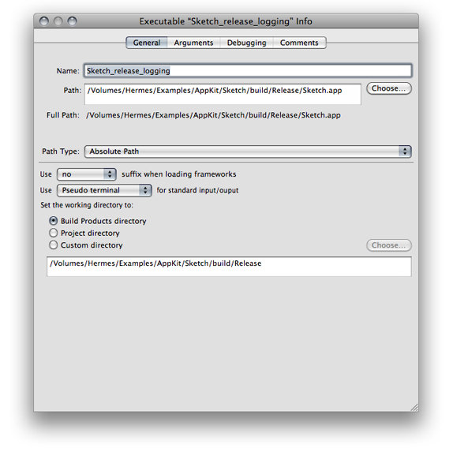
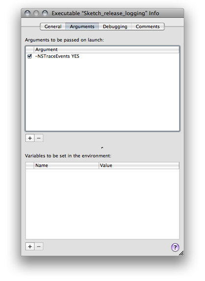

> 导航：[总目录](../../../README.md) · [documentation](../../../_indexes/documentation.md) · [Xcode Project Management Guide](Introduction.md)

[Next](Running%20Programs.md)[Previous](Analyzing%20Code.md)

# Defining Executable Environments

An _executable environment_ defines how a product is executed when you run it from Xcode. The executable environment tells Xcode which program to launch when you run the product, as well as how to launch it. Xcode automatically creates an executable environment for each target that produces a product that can run on its own. You can also create your own executable environments for testing products such as plug-ins or frameworks for which you don’t have the corresponding Xcode projects. You can set up multiple custom executable environments for testing your program under varying sets of circumstances, or use a custom executable environment to debug a program you do not have the source to.

This chapter describes how to view the executables in your project and how to configure an executable environment.

The executable environment defines:

- What executable file is launched
- Command-line arguments to pass to the program upon launch
- Environment variables to set before launching the program
- Debugging options that tell Xcode which debugger to use and how to run the program under the debugger

Generally, you do not have to create executable environments; in most cases, Xcode does this for you. If you are creating a target that produces a product that can be run by itself—such as an application—Xcode automatically knows to use the application when you run the product.

However, if you have a product that can’t be run by itself—such as a plug-in for a third party application—you need to create your own executable environment. This custom executable environment specifies the program to launch when you run the product, such as the application that uses your plug-in.

Even if your target creates a product that can run on its own, you may also want to customize the executable environment associated with it, in order to pass arguments to the executable or test it with environment variables.

Executable environments defined for a project are placed in the Executables group in the Groups & Files list in the project window. Executable environments that you define are stored in your user file for the project—that is, in the `.pbxuser` file in the project package (see [The Project Directory](Overview%20of%20an%20Xcode%20Project.md#apple-f4xwc4dqnrsv64tfmyxwi33df52wszbpkridimbqgazdmnrtfvjvomi) for details). As a result, each developer working on a project defines her or his own executable environments. When you run a product in Xcode, Xcode launches the program specified by the active executable, as described in the [Setting the Active Executable](#apple-f4xwc4dqnrsv64tfmyxwi33df52wszbpkridimbqgazdmojyfvbecqskijeuery).

The _active executable_ is the executable environment that Xcode uses when you run a product. Xcode tries to keep the active target and the active executable in sync; if you set the active target to a target that builds an executable, Xcode makes that target’s executable the active executable. Otherwise, the active executable is unchanged. If you use a custom executable environment to test your product, you have to make sure that the active executable is correct for the target you want to run.

The active executable is indicated by the blue (selected) button in the detail view. To change the active executable, do either of the following:

- Choose the desired executable environment from the Set Active Executable submenu of the Project menu.
- Select Executables in the Groups & Files list and select the desired executable environment in the detail view.

Many targets create a product that can be run by itself, such as an application or command-line tool. When you create such a target, Xcode adds an entry to the Executables group that points to the target’s product, and it knows to use that executable environment when you run the target.

Sometimes, though, you have a product that can’t run by itself: for example, a plug-in or a framework. Even if your product can run by itself, you may want to run the product under different conditions to test it. For example, you may want to test a command-line tool by passing it specific command-line arguments. Or you may have an application that performs differently depending on the value of an environment variable.

In these cases, you need to create a custom executable environment. You may have several executable environments for exercising the product of a single target. For example, you could have several applications that test different aspects of a framework. Or you could have several lists of command-line arguments and environment variables that test different aspects of a command-line tool.

You can also use custom executable environments to debug programs in Xcode, even if you do not have an Xcode project for the program. For example, you may have a program that you did not build in Xcode, or a program that was built by another person, to which you do not have the source. To run this program in the debugger, you simply create an empty project and add one or more custom executable environments that are configured to launch your program.

To create a custom executable environment, choose Project > New Custom Executable.

Xcode displays a dialog in which you can specify characteristics for your executable environment:

- __Executable Name field.__ Enter the name used to identify the executable environment in Xcode.
- __Executable Path field.__ Enter the path to the executable to launch, or click Choose and navigate to the executable file or application bundle.
- __The Add To Project pop-up menu.__ Choose (among the currently opened projects) the project to which Xcode adds the custom executable.

When you click Finish, Xcode adds the new executable environment to the chosen project. You can change the program that Xcode launches when using this executable environment—along with other executable settings—in the Executable Info window, as described in [Configuring Executable Environments](#apple-f4xwc4dqnrsv64tfmyxwi33df52wszbpkridimbqgazdmojyfvbuuqsdijdecri).

Executable environments give you control over how your product is run when you launch it from Xcode.

You configure executable environments using the Executable Info window. To open the Executable Info window:

1. Select the executable environment in the Groups & Files list or in the detail view.
2. Open the Executable Info window by choosing File > Get Info.

The following sections describe the settings you can configure in the Executable Info window.

- View and edit basic information about the executable environment, for example, you can view or edit the executable you are using or the working directory.
- Specify arguments to pass to the executable on launch, as well as any environment variables for Xcode to set before launching the executable.
- Specify which debugger to use when debugging the executable, as well as a number of other debugging options.
- Associate notes or other arbitrary text with the executable.

The General pane of the Executable Info window (Figure 10-1) lets you configure essential aspects of an executable environment.

__Figure 10-1__  General pane of the Executable Info window

These are the executable-environment aspects the General pane allows you to configure:

- __Name field.__ The name of the executable environment.
- __Path field.__ The path to the binary the executable environment runs.
- __Path Type pop-up menu.__ Indicates whether _path_ is an absolute path or a relative path (specifies the directory to which _Path_ is relative).
- __Suffix pop-up menu.__ Specifies whether to load normal, debugging, or profiling builds of the frameworks the product uses.
- __Standard input/output pop-up menu.__ Specifies the device the product uses for standard input and output.
- __Set the working directory to.__ Specifies the product’s working directory when running. See [Build Locations](Building%20Products.md#apple-f4xwc4dqnrsv64tfmyxwi33df52wszbpkridimbqgazdmojtfvjvomjq) for more information.

If your product takes command-line arguments, you can define those arguments in an executable environment. Xcode passes those arguments to the product’s binary when you run the product.

To test your product under different conditions, you can create multiple executable environments, each with different arguments. Changing your test environment becomes as simple as changing the active executable.

You specify arguments to pass to the binary, as well as environment variables that the executable environment sets before launching the binary, in the Arguments pane of the Executable Info window (Figure 10-2).

__Figure 10-2__  Arguments pane of the Executable Info window

These are the executable-environment aspects the Arguments pane allows you to configure:

- __“Arguments to be passed on launch” table.__ Defines command-line arguments. Individual arguments can be active or inactive, facilitating the testing of particular combinations of arguments. To reorder the arguments list, drag the argument line to its new location in the list.
- __“Variables to be set in the environment” table.__ Defines environment variables for the running binary. Individual variables can be active or inactive. You can access the active variables during a run with [getenv](https://developer.apple.com/library/archive/documentation/System/Conceptual/ManPages_iPhoneOS/man3/getenv.3.html#//apple_ref/doc/man/3/getenv).

To learn more about the directories used in the build process, see [Build Locations](Building%20Products.md#apple-f4xwc4dqnrsv64tfmyxwi33df52wszbpkridimbqgazdmojtfvjvomjq). For more information on these build settings, see _[Xcode Build System Guide](../Xcode%20Build%20System%20Guide%20%282016%29.md#apple-f4xwc4dqnrsv64tfmyxwi33df52wszbpkridimbqgaztsmzr)_.

Executable environments specify a set of debugging-specific items that specify which debugger to use, as well as how Xcode communicates with the debugger. (You debug a product when you start it with breakpoints activated.) You configure these items in the Debugging pane of the Executable Info window, shown in Figure 10-3.

__Figure 10-3__  Debugging pane of the Executable Info window

!

These are the executable-environment aspects the Arguments pane allows you to configure:

- __“When using” pop-up menu.__ Specifies the debugger to use when running with breakpoints.
- __“Standard input/output” pop-up menu.__ Specifies the device the product uses for debug input and output.
- __Debug executable remotely via SSH.__ Activates remote debugging using SSH. See [Debugging Programs Remotely](https://developer.apple.com/library/archive/documentation/DeveloperTools/Conceptual/XcodeDebugging/300-Debugging_Programs_Remotely/remote_debugging.html#//apple_ref/doc/uid/TP40007057-CH11) for more information.

  - __Connect to:__ Specifies the host computer on which the binary runs.
- __Start executable after starting debugger.__ Specifies whether the executable environment starts the binary immediately after loading it in the debugger. If so, Xcode loads the binary in the debugger but does not start it until you restart. This feature lets you perform debugging operations—such as setting breakpoints—before the binary runs. You may also use this option to attach to a running program.
- __Wait for next launch/push notification.__ Specifies whether to attach to the binary when it launches. This is particularly useful when debugging push notifications. For more information, see _[Local and Remote Notification Programming Guide](https://developer.apple.com/library/archive/documentation/NetworkingInternet/Conceptual/RemoteNotificationsPG/index.html#//apple_ref/doc/uid/TP40008194)_.
- __Break on Debugger() and DebugStr().__ Tells Xcode to set the `USERBREAK` environment variable, which suspends execution of the binary on calls to the Core Services framework debugging functions `Debugger` and `DebugStr`.
- __Auto-attach debugger on crash.__ Tells Xcode to try to attach to the binary when it crashes.
- __Additional directories to find source files in.__ Lists additional directories containing source files corresponding to the symbol information for the binary.

  If you have the source code to the application, you can make that source code available to the debugger so you can see the source for variables and set breakpoints. This operation makes your source code available to the debugger, but does not give you any of the source code navigation features of Xcode or make the source code available to you to set breakpoints before the debugging sessions starts. For this type of access, you can add the source code directly to your project, as described in [Managing Files and Folders in a Project](Files%20in%20Projects.md#apple-f4xwc4dqnrsv64tfmyxwi33df52wszbpkridimbqgazdmnrwfvbuuqseincuuri).

[Next](Running%20Programs.md)[Previous](Analyzing%20Code.md)

