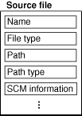
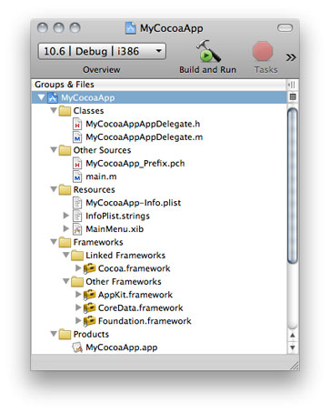
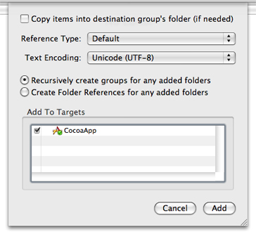
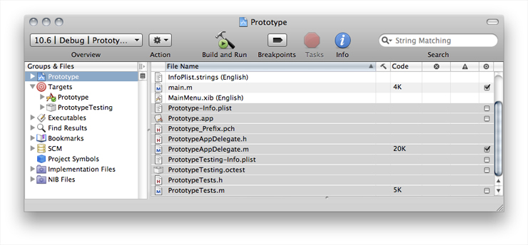
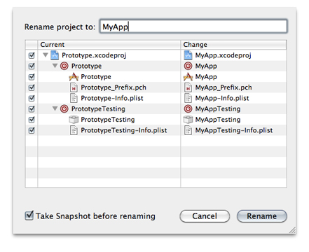
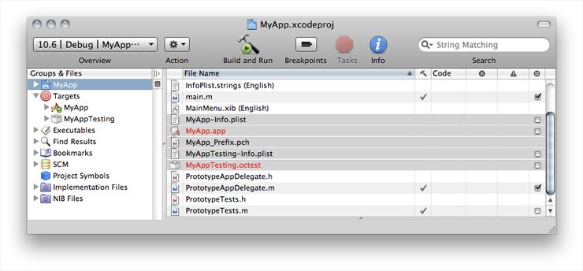
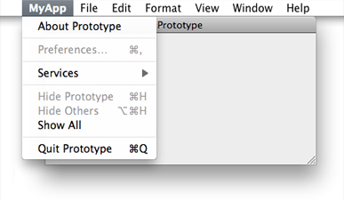
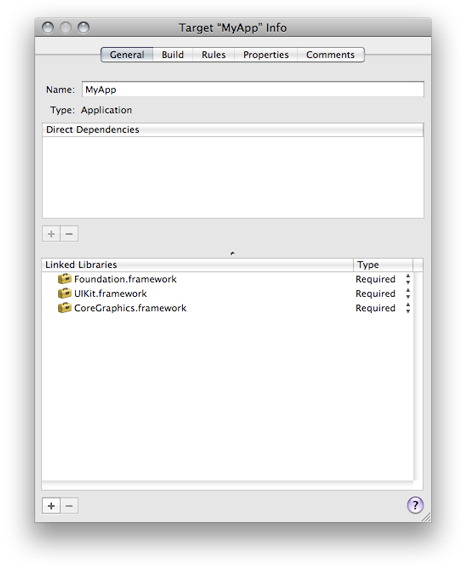
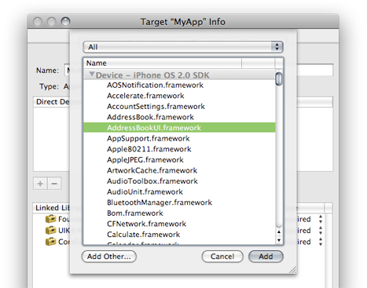

> 导航：[总目录](../../../README.md) · [documentation](../../../_indexes/documentation.md) · [Xcode Project Management Guide](Introduction.md)


[Next](Searching%20Files%20and%20Projects.md)[Previous](Creating%20Projects.md)

# Files in Projects

The files in a project are the fundamental building blocks from which you create your end product. Files contain the source code that you write and serve as the inputs to the build system for creating a product. They can also hold notes, performance metrics, and the like to aid you in the development process.

This chapter discusses the files in a project, describes how Xcode references project files, and shows you how to add files, frameworks, and folders to your project. It also describes how to use source trees to set up alternative access paths for project files and how to use a cross-project reference to access the contents of another project.

For each source file included in a project, Xcode tracks file attributes, such as the name and type, as well as other information. Figure 3-1 shows the information that Xcode tracks for source files.

__Figure 3-1__  A source file



In the illustration, the _name_ is the file-system name for the file. The _file type_ identifies the file as being one of several classifications (source file, image file, text file, and so on.) Depending on the file type, Xcode stores additional information about the file, such as the file encoding, type of line endings, and so forth.

The _path_ to the file specifies the file-system location for the file. The _path type_ —which you can modify—indicates how Xcode stores the path; that is, whether it is absolute or relative to the project directory or another location. [How Files Are Referenced](#apple-f4xwc4dqnrsv64tfmyxwi33df52wszbpkridimbqgazdmnrwfvbeeq2eizcugqq) describes the various ways in which Xcode stores paths.

You can view and edit these file attributes in the File Info window.

The project lets you pull together all of the files and other information required to build a set of related software products. Within a project, you use a target to specify the files needed for an individual product. The files can reside at any location in your file system; they do not need to be placed in your project folder. A project can contain:

- __Source files.__ A source file is any file that Xcode uses in building a target, including source code files, resource files, image files, and others. For files you need direct access to in Xcode—for example, files you want to edit using the Xcode text editor—you should explicitly add a reference to each file to the project. This includes source code files you want Xcode to compile.
- __Folders.__ If you have a folder of files that you manipulate as a whole—such as a folder of help files—you can simply add a reference to the folder to your project. This allows you to manipulate the folder in Xcode instead of touching each file individually. (To access any of the files individually from Xcode, you must also add a reference to the file to your project.)
- __Frameworks.__ You can add a reference to each of the frameworks that your product links against. This gives you easy access to the framework’s headers, directly in the project window.

When you create a project using Xcode project templates, described in [Choosing a Project Template](Creating%20Projects.md#apple-f4xwc4dqnrsv64tfmyxwi33df52wszbpkridimbqgazdmnrufvbuqrcei5becra), Xcode populates the project with a small set of default files required to build the associated product. For example, Figure 3-2 shows the contents of a project created using the Cocoa Application project template. The project contents have been expanded in the Groups & Files list to display its contents in outline view. Keep in mind that the contents of a project vary depending on the project template and the products it creates.

__Figure 3-2__  The project contents in the Groups & Files list



The example project contains the following items:

- The Classes and Other Sources groups contain source-code files.
- The Resources group contains resource files for the application. This includes the `main.nib` file that defines the user interface, the `Info.plist` property list file, and the `InfoPlist.strings` files containing strings used in the interface.
- The Frameworks group contains references to the frameworks that define the system interfaces used by the application’s code. You can view a framework’s header files by disclosing the contents of the framework in the Groups & Files list.
- The Products group contains references to the products created when the project’s targets are built. A special type of file reference, called a _product reference_, refers to the build system output for a particular target. A product reference lets you view your target’s products right in the Groups & Files list. You can use the product reference to refer to the product in the same way you use a file reference to refer to a project file. Note, however, that the product reference does not actually refer to anything until you have built that target.

To learn more about the Groups & Files list, see [Project Window Components](../Xcode%20Workspace%20Guide/The%20Project%20Window.md#apple-f4xwc4dqnrsv64tfmyxwi33df52wszbpkridimbqgazdmnrvfvjvony).

Xcode keeps a reference to each file, folder, and framework you add to your project. Through these references Xcode finds your files directly when it builds a product. Xcode also provides build settings for specifying general search paths for various items, such as headers and libraries. These include the Header Search Paths, Library Search Paths, and Framework Search Paths build settings.

If you created a project using one of the project templates or if you converted an existing project, your project already has a number of groups with files, folders, and product references. At some point you may need to add or remove files or folders from a project. The following sections show how to accomplish these tasks.

There are two ways for you to add files or folders to your project:

- In the project window Groups & Files list, select the group to add the files to, and choose Project > Add to Project.

  Use the resulting dialog to navigate to and choose the file or files to add. If you want to add all of the files in a given folder, you may simply choose the folder. The files or folders you add are placed after the items currently selected in the Groups & Files list, if any.
- Drag the icons for the files or folders from the Finder to the project window Groups & Files list. A line shows you where the files will be added.

As a shortcut, you can add a file that is open in an editor window to the project by choosing Project > Add Current File to Project

The editor window must have focus.

After you have selected the file or files to add to the project, using either of the two methods described earlier, Xcode displays a dialog, shown in Figure 3-3, that allows you to specify how the files are added to the project.

__Figure 3-3__  Specifying how to add files to a project



Here is what the dialog contains:

- The “Copy items into destination group’s folder (if needed)” option controls whether or not the files are copied into your project folder on disk. If you select this option, Xcode copies over any files that are not already present in the project folder. If the project folder contains subfolders for groups, then the files are copied into the appropriate subfolder.
- The Reference Type menu specifies how the location of the file is stored. For a description of the reference styles available to you, see [How Files Are Referenced](#apple-f4xwc4dqnrsv64tfmyxwi33df52wszbpkridimbqgazdmnrwfvbeeq2eizcugqq). Note that this menu does not contain any source paths until you have defined one or more source trees in Source Trees preferences (for source-tree details, see [Source Trees](#apple-f4xwc4dqnrsv64tfmyxwi33df52wszbpkridimbqgazdmnrwfvbuqrceivdemrq)). After you have defined a source path, it appears at the bottom of the Reference Type menu and you can choose it for the files and folders you add.
- The Text Encoding menu specifies the encoding for the file or files. This is the character set that Xcode uses to display and save a file. For more information on file encodings, see [Choosing File Encodings](../Xcode%20Workspace%20Guide/File%20Management.md#apple-f4xwc4dqnrsv64tfmyxwi33df52wszbpkridimbqgazdmnzxfvbecqshjbbuqra).
- The Add To Targets group allows you to add the file to one or more of the targets currently defined in your project. If the checkbox next to a target name is checked, the file is added to that target when it is added to the project. When you add a file to a target, that file is built when the target is built. You can specify which files are included in a target at any time; this option allows you to add the file to your project and to any necessary targets in one step.

The remaining options apply only if the selection of files to add to the project includes one or more folders. Xcode can add folders in two ways, as a group or by folder reference.

- __Group.__ Xcode recursively creates groups for the folder and its subfolders. Each of the files in these folders is added to the project and is placed in the group for the appropriate folder. If you choose to copy the files into the project’s folder, Xcode duplicates the folder hierarchy. If you move a file to the folder outside of Xcode, Xcode does not add the file to the project.

  To add a folder as a group, select “Recursively create groups for any added folders.”
- __Folder Reference.__ Xcode adds the folder itself to the project but not its contents. This is useful if you need to manipulate the folder as a whole but not the individual items within it. One example is a folder of help files that you edit outside of Xcode and that you want Xcode to move into the application’s Resources folder when you build the application.

  To add a folder as a folder reference, select “Create Folder References for any added folders.”

Xcode stores the location, or path, for each file, framework, and folder in a project. Xcode uses this path to locate the item. Xcode can store this as an absolute path or relative to another file-system location. You choose the way that a given file, framework, or folder is referenced when you add it to the project. You can also change the reference type for an item in the File Info window. Xcode supports the following reference styles, each of which is available in the Reference Type menu:

- __Relative to Enclosing Group.__ The path is relative to the folder associated with the file’s group. If the file is not in a group or the group has no associated folder, the path is relative to the project’s folder. This is the default setting for files in your project’s folder.
- __Relative to Project.__ The path is relative to the project’s folder, regardless of whether the file is in a group with an associated folder.
- __Relative to Build Product.__ The path is relative to the folder that contains the project’s build products. This reference style is the default for items that are created by one of the project’s targets.
- __Relative to <source path>.__ The path is relative to a user-defined source path. You can define a source path in the Source Trees pane of Xcode preferences. Note that this reference type is not available to you until you have defined at least one source tree.
- __Absolute Path.__ The path is absolute from the root directory (/). This is useful in a limited set of circumstances, when you want to locate a file at a particular path. In most cases, you should use a relative path; absolute paths are fragile and break easily when you move projects between computers.

If a file is inside your project folder or its build folder (created by Xcode when it creates a new project), use one of the first three reference styles.

If Xcode can’t find a file, folder, or framework at the path stored for it in the project, Xcode displays the item in red in the project window.

You can remove any files or folders from your project by selecting them in the Groups & Files list and pressing Delete. You can also select the files to remove and choose Edit > Delete.

Xcode may display a dialog asking whether you want to move the files to the Trash or just delete the project’s references to them. If you choose Delete References, Xcode deletes only the project’s references to those files; the files remain intact in your file system. If you choose Also Move to Trash, Xcode deletes the references from the project and moves the referenced files to the Trash.

When you create an Xcode project the name you choose for it is replicated in several files within the project directory, including the project package (see [The Project Directory](Overview%20of%20an%20Xcode%20Project.md#apple-f4xwc4dqnrsv64tfmyxwi33df52wszbpkridimbqgazdmnrtfvjvomi) for information about the project package), source files (such as application-delegate source files in Cocoa-application projects), info-plist files, and the built product. Other than having the project name within their names, the files do not have a structural relationship with each other. That is, changing the name of the project package does not result in a change to the name of built product. Therefore, renaming a project in a satisfactory way requires a set of very focused changes. Xcode’s project-rename command changes the name of a project and attempts to effect that change in the appropriate build settings, targets, and files.

To rename a project, choose Project > Rename.

When you rename a project, Xcode renames all targets that contain the old name. As part of renaming a target, Xcode renames prefix, info-plist, and product files.

Figure 3-4 shows a project named Prototype with two targets containing that name. The files that also contain “Prototype” in their name are highlighted in the detail view.

__Figure 3-4__  Project to be renamed



When you execute the project-rename command, Xcode displays the project-rename dialog, shown in Figure 3-5. This dialog lists the items over which the rename operation takes place; you can deselect items you don’t want renamed. The dialog also lets you indicate whether to create a snapshot before renaming the project. You can later examine the snapshot to get a list of the files Xcode modified as part of the operation. For more on snapshots, see [Snapshots](https://developer.apple.com/library/archive/documentation/DeveloperTools/Conceptual/XcodeSourceManagement/40-Snapshots/snapshots.html#//apple_ref/doc/uid/TP40006828-CH1000).

__Figure 3-5__  The project-rename dialog



Figure 3-5 shows the project after Xcode completes the rename operation. Note that not all the files with “Prototype” in their name are renamed.

__Figure 3-6__  Project on which a project-rename operation has been performed



After Xcode completes the project-rename operation, you should review all aspects of your project to ensure that the operation was completed as expected and to complete the task in places that Xcode did not modify but that should be updated, such as user-interface elements.



Keep in mind that project templates use build settings to propagate the value of properties, such as the product name, throughout the project. For example, an application’s info-plist file uses the value of the Product Name build setting to define the application’s bundle-name and bundle-identifier properties. When the info-plist file contains template-based definitions for these properties, changing the value of the Product Name build setting updates the values of those properties accordingly. However, if the properties have been customized by removing `PRODUCT_NAME` from their definitions, renaming a project does not change the value of those properties.

Each of your project’s targets specifies the frameworks and libraries against which its source files are linked. You can link against standard libraries or external libraries. Standard libraries or frameworks are those provided by the active SDK. External libraries or frameworks are those not provided by the active SDK.

To add a library to a target:

1. Open the Info window for the appropriate target and click General.

   The Linked Libraries list in the General pane lists the libraries against which Xcode links the target’s source files.

   
2. Click the Add (+) button below the Linked Libraries list.
3. Choose the library to add.

   To add a standard library, choose the library from the dialog.

   

   To add an external library, click Add Other.

   After choosing an external library, Xcode presents the same options described in [Adding Files and Folders](#apple-f4xwc4dqnrsv64tfmyxwi33df52wszbpkridimbqgazdmnrwfvbegskeifdumsi). The following options apply to external libraries:

   - The Reference Type menu in the dialog specifies how the location of the framework is stored. For a description of the various reference styles available to you, see [How Files Are Referenced](#apple-f4xwc4dqnrsv64tfmyxwi33df52wszbpkridimbqgazdmnrwfvbeeq2eizcugqq).
   - The Add to Targets group box allows you to add the library to one or more of the targets currently defined in your project. If the checkbox next to a target name is checked, the library is also included in that target when it is added to the project.
   - The Text Encoding menu specifies the encoding used for the files in a framework. For more information on file encodings, see [Choosing File Encodings](../Xcode%20Workspace%20Guide/File%20Management.md#apple-f4xwc4dqnrsv64tfmyxwi33df52wszbpkridimbqgazdmnzxfvbecqshjbbuqra).
4. Choose whether the library is required or optional.

   Required libraries must be present on the host computer for the product to load. Optional or weak-linked libraries may or may not be present for the product to load; however, before accessing any of the library’s symbols at runtime, you must ensure that the optional library is present on the host.

In addition to the Target Info window, you can use the detail view to view the libraries your product links against:

1. In the Groups & Files list, reveal the target’s build phases.
2. Select the Link Binary With Libraries build phase.

   The detail view shows the libraries your product uses. The Role column indicates whether the library is required or optional at runtime.

A __source tree__ is a root path that can be used to define a common location for target outputs. A source tree defines a name and a location on the local file system. When you add files and folders to your project, you can specify their location relative to any source tree defined for your computer. Xcode stores the file reference relative to this source tree. Any users who have the same source tree defined are able to work on the same project seamlessly, provided that the file also exists at the source tree location on their computers.

Source trees let you keep common resources in locations other than the project folder of an individual project and still transfer projects back and forth between team members and their various computers without breaking the project’s file references. This is particularly useful if you have a set of common files or resources that are used in a number of projects and therefore cannot live in the project folder. Everyone working on a common project should have the same source trees defined; even though the locations assigned to those source trees may differ, the names must be the same in order for Xcode to locate the necessary files and materials on the developer’s computer.

The source trees that you define are available to all your projects; that is, Xcode supports CodeWarrior-style global source trees. Because source trees are stored for each user, if you have multiple developers using a single computer, you will have to define the source trees for each user, even though the location for those source trees is the same. After you have defined a source tree, it is available to you from the Add Files dialog to use when adding file, folder, and framework references to your project. You can also select the source tree from the Path Type pop-up menu in the File Info window, described in [Viewing File Information](../Xcode%20Workspace%20Guide/File%20Management.md#apple-f4xwc4dqnrsv64tfmyxwi33df52wszbpkridimbqgazdmnzxfvbecqsjincuqsi).

You can edit source trees in Source Trees preferences. To open this pane, choose Xcode > Preferences and click Source Trees. To add a source tree, click the plus (+) button beneath the source tree table. Xcode adds an entry in the table. Add the following information to the entry:

- __Setting Name__ is the name of the source tree. This name must be the same for all users who wish to use this same source tree to refer to common files.
- __Display Name__ is the name that Xcode shows for the source tree in dialogs, Info windows, and anywhere else the source tree is used in the user interface. For example, this is the name used in the Path Type menu of the File Info window.
- __Path__ is the full path to the files and other resources located using this source tree on the user’s system. This path may vary from computer to computer, and from user to user.

To delete a source tree, select the source tree in the table and click the minus (-) button. To edit a source tree, double-click the entry for the source tree in the appropriate table column and type the new text.

In addition to file, framework, and folder references, Xcode projects can contain a cross-project reference; that is, they can refer to another project outside of the current one. It is not always feasible or desirable to keep all related targets and products in a single project. However, you may still need to reference targets or products that reside in a different project. For example, you may have several applications that rely on a common framework that resides in a different project. In this case, you can add a reference to the project containing the framework to the project containing the application. This reference, called a _cross-project reference_, lets you access the targets and products of the referenced project from your current project.

To create a reference to another project, choose Project > Add to Project and select the project package (the `.xcodeproj` file package) of the project you wish to reference. (You may also drag the project group in the Groups & Files list of another project or a project package in the Finder to the current project’s project group.) Xcode adds a reference to the source group for your current project, visible in the Groups & Files list. The project reference is identified by the Xcode project icon. Clicking the disclosure triangle next to the project reference shows the product references that the other project contains. These product references can be added to targets in the current project.

You can relate targets in the current project to targets in the referenced project by creating a target dependency. You can add a dependency on a target in the referenced project in the same way that you would add a dependency to a target within the same project. See [Adding Target Dependencies](../Xcode%20Build%20System%20Guide/Targets.md#apple-f4xwc4dqnrsv64tfmyxwi33df52wszbpkridimbqgazdmobzfvbuuqsji5feqra) to learn more about target dependencies.

For projects that use cross-project references, you should use a common build location; doing so ensures that Xcode can automatically locate products created by targets in those projects. For more on build locations, see [Build Locations](Building%20Products.md#apple-f4xwc4dqnrsv64tfmyxwi33df52wszbpkridimbqgazdmojtfvjvomjq).

Xcode places its persistent caches in a secure location in your file system. You can get to this location using the `getconf` command:

```
> cd `getconf DARWIN_USER_CACHE_DIR`
```

This location is known as `<Xcode_Persistent_Cache>`.

If the Xcode cache grows too much, you can delete it using the Empty Caches command. Keep in mind that the Xcode cache may include precompiled headers for your projects, and building those projects may take longer after the cache has been emptied.

To empty the Xcode persistent cache, choose Xcode > Empty Caches.

[Next](Searching%20Files%20and%20Projects.md)[Previous](Creating%20Projects.md)

