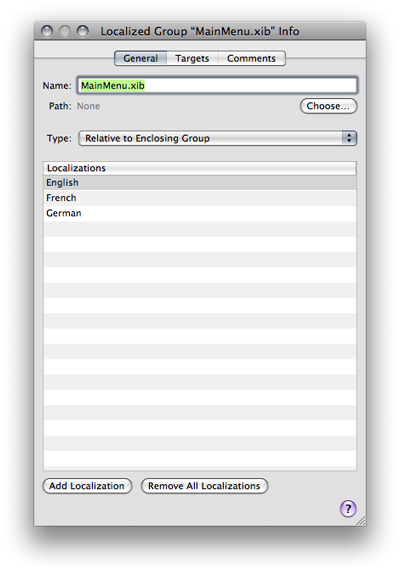
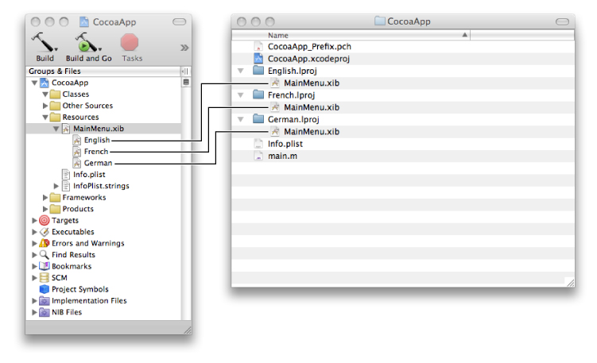

> 导航：[总目录](../../../README.md) · [documentation](../../../_indexes/documentation.md) · [Xcode Project Management Guide](Introduction.md)

[Next](Using%20the%20Organizer.md)[Previous](Viewing%20Project%20Symbols%20and%20Classes.md)

# Localizing Files

Xcode lets you create applications, bundles, and frameworks that are customized for different locales. Generally, you start by creating a variant for one particular locale, called the development locale, and add more variants later.

In the Groups & Files list, a file customized for different locales appears as a localized group, which has a file icon with a disclosure triangle beside it. To see the file’s variants, click the triangle. To add and remove variants, select the localized item, open the Info window, and use the two buttons at the bottom of the General pane, as shown in Figure 6-1.

__Figure 6-1__  The Info window for a localized item

For more information on localizing your product for different regions, see _[Internationalization and Localization Guide](../../Mac%20OSX/Internationalization%20and%20Localization%20Guide/About%20Internationalization%20and%20Localization.md#apple-f4xwc4dqnrsv64tfmyxwi33df52wszbpgeydambqge3tc2i)_.

To mark files for localization, select the files, open the Info window, and click the Make File Localizable button. Xcode moves the files into the locale’s `.lproj` folder. If a file was already in another `.lproj` folder, Xcode copies it to the locale’s `.lproj` folder.

Xcode creates a localized group in the Groups & Files list, with the file’s name and icon. To view the individual locales, click the disclosure triangle next to the localized group icon. Figure 6-2 shows the localized group for an application’s main nib file in the Groups & Files list.

__Figure 6-2__  A localized item in the Groups & Files list and the project directory

You can inspect of any of the localized variants individually or you can inspect the localized group as a whole.

To remove files from localization, select the files, open the File Info window, and click the Remove All Localizations button. Xcode moves the files from the locale’s `.lproj` folder into the folder for nonlocalized resources. Other localized versions of the files are removed from the project but are not deleted from the file system.

To add files for a locale, select the file or localized group for which you want to add another locale, open the File Info window, and click the Add Localization button. Xcode queries you for the name of the locale and copies the development locale’s version of the files to the new locale’s `.lproj` folder.

[Next](Using%20the%20Organizer.md)[Previous](Viewing%20Project%20Symbols%20and%20Classes.md)

