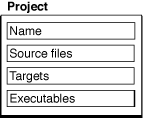
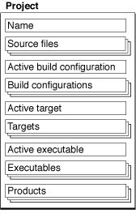
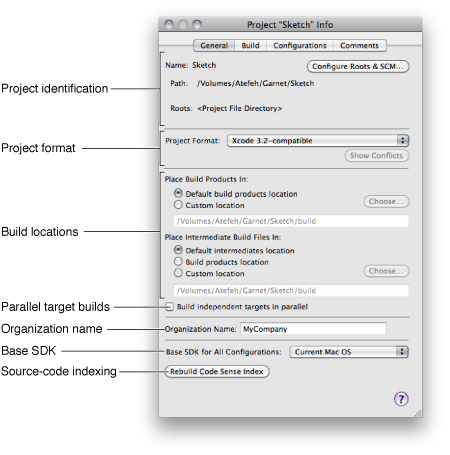

> 导航：[总目录](../../../README.md) · [documentation](../../../_indexes/documentation.md) · [Xcode Project Management Guide](Introduction.md)

[Next](Creating%20Projects.md)[Previous](Part%20I-%20Project%20Organization.md)

# Overview of an Xcode Project

To carry out the development process, Xcode relies on certain key components. It uses projects to organize these components. The project is a repository for all of the information needed to build one or more software products. It is also the primary workspace for your software development. This chapter describes the contents of an Xcode project and gives an overview of the information required to develop software with Xcode.

A project contains and organizes everything you need to create one or more software products. In your Xcode project, you:

- Organize build system inputs for building a product.
- Maintain information on items within it and their relationships, to assist you in the development process.

To develop a product using Xcode, you must understand the key components of your project. Figure 1-1 shows a simplified representation of a project and its essential pieces.

__Figure 1-1__  The key components of a project

_Source files_ are the files used to build a product. These include source code files, resource files, image files, and others.

A project keeps all of the source files you use for a particular product or suite of related products. A project can also contain files that are not directly used by Xcode to build a product, but contain information that you use during the development process, such as notes, test plans, and more.

In the course of developing a product, you edit source files—using Xcode’s built-in text editor or an external editor—and organize files into a target (described next) to define the build system inputs for creating the product.

A project keeps a reference to each file you add to the project. A project can also contain folder references (if you want to manipulate a group of files as a whole), framework references to access the contents of a framework, or references to other projects. [Files in Projects](Files%20in%20Projects.md#apple-f4xwc4dqnrsv64tfmyxwi33df52wszbpkridimbqgazdmnrwfvbecqsgifeeusi) describes how Xcode stores these references and discusses the files in a project in more detail.

When it comes time to actually create, or _build_, a product, you use a target. A _target_ defines a single product; it organizes the inputs into the build system—the source files and instructions for processing those source files—required to build that product. To create a finished product, build its target. Projects can contain one or more targets, each of which produces one product.

Targets, and the products they create, may be related. If a target requires the output of another target in order to build, the first target is said to depend upon the second. Xcode lets you add target dependencies to express this relationship. [Targets](https://developer.apple.com/library/archive/documentation/DeveloperTools/Conceptual/XcodeBuildSystem/100-Targets/bs_targets.html#//apple_ref/doc/uid/TP40002689) describes targets and the instructions they contain in more detail.

For each target in your project, Xcode adds a _product reference_. This is a file reference to the output generated by the target, such as an application. You can use this product reference to refer to the products in your project the same way you use a file reference to refer to a file; however, the product reference does not actually refer to anything in the file system until you build the product.

Executables. After you’ve successfully built a product, you need to test it to make sure that it works. When it comes time to run or debug your product, you use an executable environment to tell Xcode how to do so. An _executable environment_ tells Xcode what program to launch when you run or debug from within Xcode and how to launch the program. The executable environment lets you tell Xcode what command-line arguments to pass, what environment variables to set, what debugger to use, and so forth.

If you are building a product that can be run on its own—an application, command-line tool, and so forth—Xcode automatically sets the default executable to the target’s product. However, if you have a product such as a plug-in or framework, you must create an executable environment to specify a program to run and test your product with.

Even if your product generates an executable that can run on its own, you may want to customize the executable environment to specify command-line arguments for Xcode to pass to the program on launch, environment variables to set, and so forth. [Defining Executable Environments](Defining%20Executable%20Environments.md#apple-f4xwc4dqnrsv64tfmyxwi33df52wszbpkridimbqgazdmojyfvbecqscifduisa) describes executable environments in Xcode in more detail and explains how to modify executable settings.

A project can contain any number of executables. There is not a one-to-one correspondence between targets and executables, although Xcode automatically creates an executable environment for each target that creates a product that can be run on its own. You can, however, define multiple executable environments to use to test the product of a single target under different circumstances.

In addition to the fundamental building blocks of the development process, an Xcode project also maintains a great deal of information about the items in your project and their current state. Figure 1-2 shows a representation of a project with this additional information.

__Figure 1-2__  An Xcode project

An Xcode project tracks:

- Organizational information that Xcode uses to help you do your work. For example, projects can contain groups to help you organize and find files, or bookmarks to your favorite locations. Xcode also maintains a symbolic index for your project; it uses this information to provide assistance such as code completion, projectwide symbol searching, and more. Groups and other features for organizing project contents are described in [Project Organization](https://developer.apple.com/library/archive/documentation/DeveloperTools/Conceptual/XcodeWorkspace/020-Project_Organization/project_organization.html#//apple_ref/doc/uid/TP40002667); projectwide searches and other features for finding information in your project are described in [Searching Files and Projects](Searching%20Files%20and%20Projects.md#apple-f4xwc4dqnrsv64tfmyxwi33df52wszbpkridimbqgazdmnrzfvbecqskinbekry).
- Project-wide settings that affect the build process and other software-development operations for all targets and project items. For example, the project tracks the active target; this is the target that Xcode builds when you click the Build button. It also stores the active architecture, which is the architecture for which all products in the project are built.

The settings that an Xcode project tracks include:

- __Build configurations.__ A build configuration is a named collection of build settings. You can define different build configurations for different circumstances—such as development or release—and switch between them to alter how the products in a project are built. In this way, you can rapidly try variations on a build. The project defines the list of build configurations; each individual target contains its own definition of the build settings used to build the target with that configuration. See [Build Configuration Overview](../Xcode%20Build%20System%20Guide/Build%20Configurations.md#apple-f4xwc4dqnrsv64tfmyxwi33df52wszbpkridimbqgazdmojsfvjvomi) for more information about build configurations.
- __Targets.__ A target serves as the blueprint for building a product. A target mainly identifies the product’s source and the operations to perform on them. It also specifies the SDK (the set of header files, libraries, and frameworks) against which the source files are compiled and linked to produce the product’s binary file.
- __Active target and build configuration.__ The active target is the target that gets built when you initiate a build in Xcode. Xcode uses the active build configuration to select the appropriate configuration of the active target and each target it depends upon, when building. See [Setting Build Factors](Building%20Products.md#apple-f4xwc4dqnrsv64tfmyxwi33df52wszbpkridimbqgazdmojtfvjvoni) for more information.
- __Active executable.__ The active executable is the executable environment that specifies which program is launched, and how, when you run or debug from within Xcode.

A project can have multiple targets and multiple executables. However, there can be only one active target, one active build configuration, one active architecture, and one active executable. So, for example, if a project builds more than one application, only one executable—corresponding to one application—can be active and that’s the only executable you can debug in the debugger. If you want to debug both applications at once with the graphical debugger, you have to build them in separate projects.

When you create a project, Xcode creates a project directory to hold your project’s contents. The project directory contains the _project package_, which holds project metadata—as described in the previous section—and user information. The project package has the same name as the project and carries the extension `.xcodeproj`.

In addition to the project package, the project directory can also contain:

- __Source files.__ Source files can live anywhere on your system, but keeping them in your project directory makes it easy to move the project and its contents around. By default, Xcode interprets most paths relative to the project directory.

  You can organize files into any number of subdirectories within the project directory, including directories for localized resources, as described in [Localizing Files](Localizing%20Files.md#apple-f4xwc4dqnrsv64tfmyxwi33df52wszbpkridimbqgazdmobtfvbumscjizbeosq).

  If you create a project from one of Xcode’s project templates, the project directory already contains a number of example source files. For more on the files in a project, see [Files in Projects](Files%20in%20Projects.md#apple-f4xwc4dqnrsv64tfmyxwi33df52wszbpkridimbqgazdmnrwfvbecqsgifeeusi).
- __Build folder.__ When you build a target, Xcode generates a number of files, including the target’s finished product. By default, Xcode creates the build directory in the project directory to hold the files that it creates. The build directory can, however, reside at any location in the file system. For more information on the build directory, see [Build Locations](Building%20Products.md#apple-f4xwc4dqnrsv64tfmyxwi33df52wszbpkridimbqgazdmojtfvjvomjq).
- __Nonproject files.__ Nonproject files are files that reside in the project directory but that are not used to build your product. If you use SCM, these files are part or source-control operations made on the project directory. See [Managing Files Under Source Control](../Xcode%20Source%20Management%20Guide/Source%20Control.md#apple-f4xwc4dqnrsv64tfmyxwi33df52wszbpkridimbqgazdmobwfvjvomrs) for more information.

Xcode maintains information about a project at several levels, including project, target, and file. Information kept at the project level comprises general information, project build settings, project build configurations, and project comments. You use the _Project Info window_ to view and edit this information.

To open the Project Info window, do one of the following:

- Double-click the project group in the Groups & Files list.
- Select the project in the Groups & Files list and click the Info button.
- Select the project in the Groups & Files list and choose File > Get Info.
- Choose Project > Edit Project Settings.

The Project Info window contains the following panes:

- __General.__ This pane contains general project settings that affect all the project’s files and targets. For details, see [General Project Attributes](#apple-f4xwc4dqnrsv64tfmyxwi33df52wszbpkridimbqgazdmnrtfvjvomy).
- __Build.__ This pane lets you define project build configurations. For more information, see [Build Settings](https://developer.apple.com/library/archive/documentation/DeveloperTools/Conceptual/XcodeBuildSystem/300-Build_Settings/bs_build_settings.html#//apple_ref/doc/uid/TP40002691) and [Build Configuration Overview](../Xcode%20Build%20System%20Guide/Build%20Configurations.md#apple-f4xwc4dqnrsv64tfmyxwi33df52wszbpkridimbqgazdmojsfvjvomi).
- __Configurations.__ This pane contains a list of build configuration names, which may be used by the project and its targets. Build configurations are described further in [Build Configuration Overview](../Xcode%20Build%20System%20Guide/Build%20Configurations.md#apple-f4xwc4dqnrsv64tfmyxwi33df52wszbpkridimbqgazdmojsfvjvomi).
- __Comments.__ This pane lets you add textual notes to the project. See [Adding Comments to Project Items](../Xcode%20Workspace%20Guide/Project%20Organization.md#apple-f4xwc4dqnrsv64tfmyxwi33df52wszbpkridimbqgazdmnrxfvbegskjivcugqy) for more information.

Figure 1-3, shows the General pane of the Project Info window.

__Figure 1-3__  General pane of the Project Info window

The General pane contains the following information:

- __Project identification.__ Specifies the name of the project and its main location. It also identifies the project roots, directories that define the project hierarchy. A _project root_ is a directory containing a project package (see [The Project Directory](#apple-f4xwc4dqnrsv64tfmyxwi33df52wszbpkridimbqgazdmnrtfvjvomi)), source files, and other project files. Simple projects have a single project root. Complex projects, made up of two or more projects that share products or resources, can contain multiple project roots. Each project root has its own SCM configuration, which allows you to work on projects made up of multiple projects with subprojects stored in different SCM repositories.
- __Project format.__ Specifies the Xcode release with which the project must remain compatible. See [Choosing the Project Format](Creating%20Projects.md#apple-f4xwc4dqnrsv64tfmyxwi33df52wszbpkridimbqgazdmnrufvjvona) for details.
- __Build locations.__ The location at which the build products and intermediate files for the project’s targets are placed. The options under the heading “Place Build Products In” specify the location where Xcode places the products created when building the project’s targets. The options listed under “Place Intermediate Build Files In” specify where files generated in the course of building the product, but not included in the final product, are placed. See [Build Locations](Building%20Products.md#apple-f4xwc4dqnrsv64tfmyxwi33df52wszbpkridimbqgazdmojtfvjvomjq) for more information.
- __Parallel target builds.__ Specifies whether to build independent targets in parallel. To learn more, see [Building in Parallel](Building%20Products.md#apple-f4xwc4dqnrsv64tfmyxwi33df52wszbpkridimbqgazdmojtfvjvomjr).
- __Organization name.__ Specifies name of the organization to which copyright is attributed in header files created for the project.
- __Base SDK.__ Identifies the base SDK used to build the project’s targets, which specifies the minimum version of the operating system to build your product for (you can override this setting at the target level). See [Setting Build Factors](Building%20Products.md#apple-f4xwc4dqnrsv64tfmyxwi33df52wszbpkridimbqgazdmojtfvjvoni) and [Building for Multiple Releases of an Operating System](Building%20Products.md#apple-f4xwc4dqnrsv64tfmyxwi33df52wszbpkridimbqgazdmojtfvjvomzy) for more information.
- __Source-code indexing.__ Allows you to rebuild the symbol index. See [Symbol Indexing](Viewing%20Project%20Symbols%20and%20Classes.md#apple-f4xwc4dqnrsv64tfmyxwi33df52wszbpkridimbqga3dsmjxfvbuqmznijbegssjindee) for details.

[Next](Creating%20Projects.md)[Previous](Part%20I-%20Project%20Organization.md)

