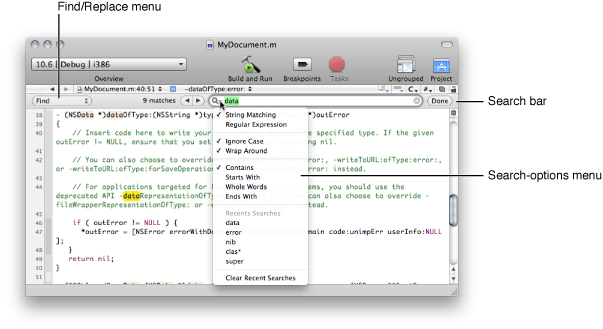
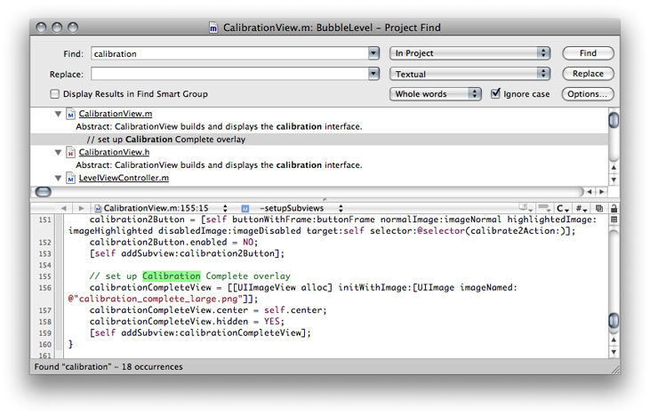
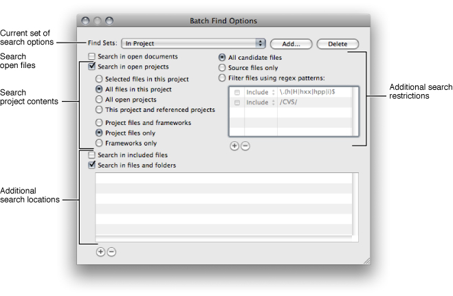
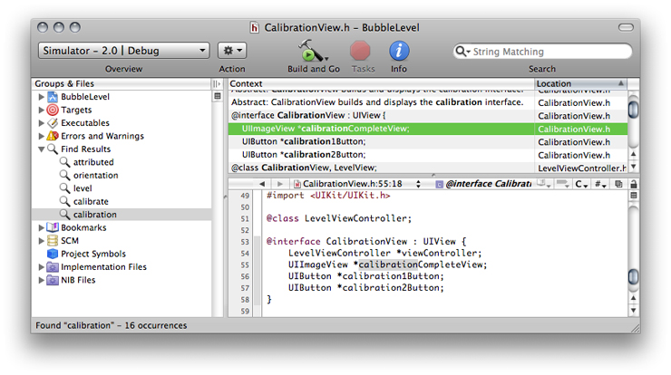

> 导航：[总目录](../../../README.md) · [documentation](../../../_indexes/documentation.md) · [Xcode Project Management Guide](Introduction.md)

[Next](Viewing%20Project%20Symbols%20and%20Classes.md)[Previous](Files%20in%20Projects.md)

# Searching Files and Projects

Being able to find information—knowing how to locate items in a project, as well as knowing how to find information about your project—is critical to working effectively in Xcode.

Xcode gives you many ways to locate project information and items. _[Xcode Workspace Guide](../Xcode%20Workspace%20Guide/Introduction.md#apple-f4xwc4dqnrsv64tfmyxwi33df52wszbpkridimbqga3dsmrq)_ describes the common paradigms of the Xcode user interface that let you find and manage project contents, including the Groups & Files list, which lets you organize and access the items in your project in an outline view, and the detail view, which lets you quickly filter your project contents. In addition, the Activity Viewer lets you see additional information on Xcode operations, while Info windows let you examine and modify items in your project.

[Opening Files by Filename or Symbol Name](../Xcode%20Workspace%20Guide/File%20Management.md#apple-f4xwc4dqnrsv64tfmyxwi33df52wszbpkridimbqgazdmnzxfvjvoni) describes shortcuts you can use to open a file whose name or path appears in an editor. [Searching Documentation](../Xcode%20Workspace%20Guide/Documentation%20Access.md#apple-f4xwc4dqnrsv64tfmyxwi33df52wszbpkridimbqga3dsmrqfvbuqmrwgawvgvzt) describes shortcuts you can use to jump to the documentation for a symbol whose name appears in the editor or search the installed documentation for a word or phrase.

This chapter describes how to perform text-based searches on files and projects, using string match or regular expressions. It also shows how to use the Project Symbols smart group to find information on the symbols in a project.

This section shows how to search text within a file. Xcode uses the same mechanism to let you search and replace text in the text editor and the property-list editor.

To search for text in a file that you have open in the editor, choose Edit > Find > Find.

The search bar appears below the editor toolbar, as shown in Figure 4-1.

__Figure 4-1__  The search bar on a text editor window

The Find/Replace pop-up menu lets you choose between Find and Find & Replace. For more on Find & Replace, see [Replacing Text](#apple-f4xwc4dqnrsv64tfmyxwi33df52wszbpkridimbqgazdmnrzfvjvomjx).

You can search using a text string or a regular expression; choose the appropriate search type from the search-options menu in the search field:

- __String Matching.__ Searches for text matching the string in the search field.
- __Regular Expression.__ Searches for text matching the regular expression in the search field.

  Xcode uses the ICU library for regular expression matching (see [http://icu-project.org/userguide](http://icu-project.org/userguide)).

Type the text string or regular expression pattern to use for the search in the search field. To minimize your typing, Xcode keeps track of search strings; to reuse a previous search string, choose it from the Recent Searches group in the search-options menu. You can clear the recent-searches list by choosing Clear Recent Searches from the search-options menu.

The other options in the search-options menu give you additional control over how the search is performed; these options are:

- __Ignore Case.__ Select this option to ignore whether letters are uppercase or lowercase.
- __Wrap around.__ Select this option to search the whole file; otherwise, Xcode searches from the current location of the insertion point to the end of the file.
- _Contains._ Searches for words that contain matching text in a substring.
- _Starts with._ Searches for words that begin with text matching the search term.
- _Whole words._ Searches for words that contain only text matching the contents of the Find field.
- _Ends with._ Searches for words that end with matching text.

Use the Next and Previous buttons (to the left of the search field) to continue searching for the same text in a file. You can also use menu commands. Choose Edit > Find > Find Next to move to the next match and Edit > Find > Find Previous to move to the previous match.

__Table 4-1__  Search commands

| Command | Action |
| Move to next match | Press Return. |
| Dismiss the search bar | Press Escape. |

You can replace some or all occurrences of text matching the string or regular expression specified in the search field.

To search for text in a file and replace it with other text, do one of the following:

- Choose Edit > Find > Find and Replace.
- In the search bar, choose Find & Replace from the Find/Replace menu.

The search & replace bar appears, as shown in Figure 4-2.

__Figure 4-2__  The search & replace bar on a text editor window

!!

Use the replace buttons to perform the text substitution. The scope of the replacement varies, depending on the button you choose. Here are the buttons available to you:

- __Replace All.__ Searches the entire file or selection and replaces all occurrences of text matching the contents of the Find field with the replacement text.

  Holding down Option changes the search & replace scope to the selected text.
- __Replace.__ Substitutes the replacement text for the current match.
- __Replace & Find.__ Substitutes the replacement text for the current match and then finds and selects the next match.

Each of these buttons also has a menu item equivalent in the Edit > Find menu: Replace, Replace All, Replace and Find Next, and Replace and Find Previous.

__Table 4-2__  Search & replace commands

| Command | Action |
| Replace the current match and move to next match | Press Return. |
| Dismiss the search & replace bar | Press Escape. |

Xcode provides a number of ways to search for information in a project. You can search for text, regular expressions, or symbol definitions in a single file or across multiple files in your project. You can also easily substitute replacement text for one or more instances of matching text or symbols, either within a file or throughout the entire project.

This section describes how to use projectwide search features in Xcode to search through multiple files in your project and its included frameworks for text, regular expressions, and symbol definitions. This section also describes how to view search results. The single-file find and shortcuts for performing searches from an Xcode editor window are discussed further in [Navigating Source Files](../Xcode%20Workspace%20Guide/The%20Text%20Editor.md#apple-f4xwc4dqnrsv64tfmyxwi33df52wszbpkridimbqgazdmnzzfvjvomjz).

For more information on Code Sense, the technology that provides symbol definition searches, see [Symbol Indexing](Viewing%20Project%20Symbols%20and%20Classes.md#apple-f4xwc4dqnrsv64tfmyxwi33df52wszbpkridimbqga3dsmjxfvbuqmznijbegssjindee).

The Project Find window allows you to search for information in some or all of the files included in your project. Using the Project Find window, you can search your project for text, symbol definitions, or regular expressions. To open the Project Find window, choose Edit > Find > Find In Project. A window similar to the one in Figure 4-3appears.

__Figure 4-3__  The Project Find window

Using the fields and menus at the top of the Project Find window, you can control what Xcode searches for.

- The Find field specifies what to find. Xcode interprets this field differently, depending on the value of the pop-up menu to the right of the Replace field.
- The pop-up menu to the right of the Replace field specifies the type of search; it contains the following options:

  - __Textual.__ Finds any text that matches the text in the Find field.
  - __Regular Expression.__ Finds any text that matches the regular expression in the Find field. Xcode uses the ICU library for regular expression matching; for more information, see the [http://icu.sourceforge.net/userguide](http://icu.sourceforge.net/userguide).
  - __Definitions.__ Finds any symbol definition matching the symbol name in the Find field.
  - __Symbol.__ Finds code that uses the symbol identified in the Find field.
- The pop-up menu to the right of the Display Results in Find Smart Group option controls how Xcode determines a match to the contents of the Find field. The available options are:

  - __Contains.__ Choose this option to find text or symbol definitions that contain what is in the Find field.
  - __Starts with.__ Choose this option to find text or symbol definitions that begin with the contents of the Find field.
  - __Whole words.__ Choose this option to find text or symbol definitions that contain only what is in the Find field.
  - __Ends with.__ Choose this option to find text or symbol definitions that end with the contents of the Find field.
- The “Ignore case” option specifies whether or not the search is case sensitive.

As a shortcut, you can also perform a quick search of selected text or regular expressions in an editor window, as described in [Shortcuts for Finding Text and Symbol Definitions](https://developer.apple.com/library/archive/documentation/DeveloperTools/Conceptual/XcodeWorkspace/100-The_Text_Editor/text_editor.html#//apple_ref/doc/uid/TP40002679-SW2).

To control the scope of a search, use the pop-up menu to the right of the Find field in the Project Find window. This menu contains sets of search options that specify which projects and frameworks to search in. Xcode provides the following default sets of search options:

- __In Project.__ Search the files that are directly included in your project.
- __In Project and Frameworks.__ Search the files and the frameworks included in your project.
- __In Frameworks.__ Search files that are in the frameworks included by your project.
- __In All Open Files.__ Search all open files.
- __In Selected Project Items.__ Search only in the currently selected project items.

You can further tailor these default sets of search options or define your own sets with the Batch Find Options window, described in [Creating Sets of Search Options](#apple-f4xwc4dqnrsv64tfmyxwi33df52wszbpkridimbqgazdmnrzfvbecqsejffegqy).

The Batch Find Options window lets you further tailor the scope of the search. You can further narrow which files and projects are searched, filter the list of files to be searched according to a regular expression, and add directories to the list of locations to search.

You can modify default sets of search options or define your own sets. Defining your own set is particularly useful if you find yourself searching the same set of files over and over again. Instead of configuring the set of files to search each time, simply configure it once and save it as a search option set. To reuse the search option set, simply choose it from the pop-up menu next to the Find button in the Project Find window.

To open the Batch Find Options window, click the Options button in the Project Find window. You should see a window similar to the one in Figure 4-4.

__Figure 4-4__  The Batch Find Options window

The Find Sets menu at the top of the Batch Find Options windows lists the available search option sets. To create a new set, click Add. Specify a name for the new set in the dialog that appears. Xcode creates a new set of search options with default values. To delete a set of search options, choose that set from the Find Sets menu and click Delete.

To edit a search option set, choose that set from the Find Sets menu and set the search options you wish to include. The Batch Find Options window provides the following options to control which files Xcode searches:

- “Search in open documents” includes all files that are open in an editor in the search.
- “Search in open projects” includes open projects in the search. You can further control which files in those projects are searched using the radio buttons below the “Search in open projects” option.

  The top set of radio buttons controls which projects are searched and bottom set of radio buttons lets you specify whether to include project or framework files in the search.
- “Search in files and folders” allows you to add specific files or directories to the search. Any files or directories listed in the table below this option are included in the search. To add an entry to this table, click the plus (+) button and choose a file or directory from the dialog that appears, or drag the file or directory from the Finder. You can also click in the table and press Return. To delete a file or directory from this table, select the entry and click the minus (-) button.

You can further restrict the files that are searched by a search option set using the radio buttons on the right side of the Batch Find Options window. You have the following options:

- “All candidate files” does not limit the searched files further. This searches all of the files in the search scope specified by the other options in the Batch Find Options window.
- “Source files only” limits the search to files containing source code.
- “Filter files using regex patterns” lets you filter the files to search using one or more regular expressions. These regular expressions are specified in the table beneath this radio button. To add an expression to this list, click the plus (+) button.

  The first column in the table specifies whether to use the corresponding regular expression. The second column specifies whether to return the files that match a given regular expression or the files that do not match the regular expression.

When you perform a projectwide find, the results of the search are listed below the search criteria; results are organized according to the file in which they appear. You can view a particular search result in the file it was found in by selecting it in the Project Find window; Xcode opens the file to the matching text and displays it in the attached editor. Double-click a search result to open it in a separate editor window.

Each search, and its results, is also collected in the Find Results smart group that appears in the Groups & Files list of the project window, as shown in [Figure 4-3](#apple-f4xwc4dqnrsv64tfmyxwi33df52wszbpkridimbqgazdmnrzfvjvona). If you select the Display Results in Find Smart Group option, Xcode automatically brings the project window to the front and discloses the contents of the Find Results smart group when you perform a search, instead of showing the results in the Project Find window.

You can see all the searches you have performed by clicking the disclosure triangle next to the Find Results smart group in the Groups & Files list. To view the results of a given search, select that search in the Groups & Files list and, if necessary, open a detail view. The detail view shows all of the results for the selected search, as shown in Figure 4-5. You can view the combined results of several searches by selecting those searches in the Groups & Files list. Double-clicking an item in the Find Results group in the Groups & Files list opens a Project Find window with the corresponding search specification as well as a detailed find results list. This allows you to rerun previous searches.

__Figure 4-5__  Search results in the project window

To delete a search result from the Groups & Files list, select the result and press Delete.

The detail view shows the context for each search result and the file in which the match occurs. The context of a search result is the surrounding text in which it appears for text searches, and the type and name of the matching symbol for a symbol definition search. To show or hide either of these two columns, use the View > Detail View Columns menu items or Control-click in any column header and choose the desired column from the contextual menu.

To view the source for a particular result, select the result in the detail view. If the project window or detail view has an attached editor, selecting a search result displays the source in the editor. You can double-click a search result to open the source for the result in a separate window.

You can sort the results of a search according to the file in which they occur. Click the Location column heading to sort the detail view by location. You can also filter the search results using the search field in the project window toolbar. Using the location of the search result as an example again, you can type all or part of a filename to see only those results that occur in the file of that name.

You can use the Project Find window to replace some or all occurrences of the search string specified in the Find field. To replace text in multiple files:

1. Type the substitution text in the Replace field
2. Select one or more entries to replace. To choose which occurrences of the given search string to replace, do either of the following:

   - Select one or more entries to replace in the find results pane of the Project Find window.
   - Choose a search from the Find Results smart group in the project window. In the detail view, select one or more occurrences of the search string to replace.
3. Click the Replace button in the Project Find window.

If the contents of the Project Find window’s find results pane are disclosed, Xcode uses the selection in the Project Find window to determine which occurrences to replace. If the find results group is closed, Xcode uses the selection in the detail view of the project window.

Xcode provides a number of shortcuts for searching that use text or other content that appears in the text editor. You can use these shortcuts to perform single-file and projectwide searches without going through the Single File Find or Project Find windows. When you use these shortcuts, Xcode performs the search using the same options specified the last time you used the Single File Find or Project Find windows. These windows are described in further detail in [Searching in a File](#apple-f4xwc4dqnrsv64tfmyxwi33df52wszbpkridimbqgazdmnrzfvjvomi) and Searching in a Project.

To search the current project for text that appears in the text editor, select the text to search for, and choose Edit > Find > Find Selected Text.

To perform a projectwide search using the current selection in the text editor, use the shortcuts listed in Table 4-3.

__Table 4-3__  Shortcuts for performing a projectwide search using the current selection in the editor

| Search project for | Choose |
| Selected text | Edit > Find > Find Selected Text in Project |
| Selected symbol definition | Editor shortcut menu > Find > Find Selected Definition in Project |

You can also jump directly to the definition for a symbol identifier by doing either of the following:

- Command—double-click the symbol name.
- Select the symbol name and choose Edit > Find > Jump to Definition.

Each of the searches described in [Table 4-3](#apple-f4xwc4dqnrsv64tfmyxwi33df52wszbpkridimbqgazdmnrzfvjvomjy) uses the last set of search options used when searching your project. If you want to perform a projectwide search using the current selection in the text editor, but do not want to use the last set of search options, you can open a Project Find window with the current selection by doing either of the following:

- To use the current selection as the search term, choose Edit > Find > Use Selection for Find.

  Xcode opens a Project Find window and places the contents of the current selection in the Find field.
- To use the current selection as a substitution string, choose Edit > Find > Use Selection for Replace.

  Xcode opens the Project Find window and places the contents of the current selection in the Replace field.

[Next](Viewing%20Project%20Symbols%20and%20Classes.md)[Previous](Files%20in%20Projects.md)

