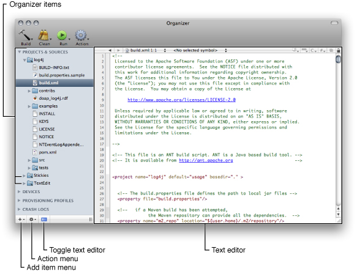
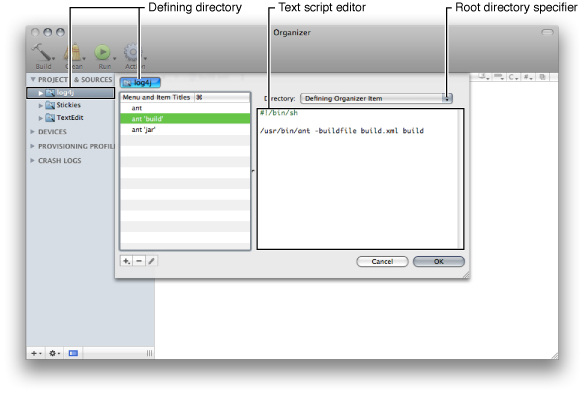

> 导航：[总目录](../../../README.md) · [documentation](../../../_indexes/documentation.md) · [Xcode Project Management Guide](Introduction.md)

[Next](Part%20II-%20Product%20Development.md)[Previous](Localizing%20Files.md)

# Using the Organizer

The Xcode Organizer allows you to access frequently used directories (containing projects or other resources) from a single window, which reduces the amount of Finder-based navigation you need to perform to get to those files. The Organizer also streamlines your development workflow by letting you assign tasks to the directories it displays. To build a product, you don’t have to open the corresponding project in an Xcode project window. And you can manage directories containing Xcode projects as well as directories with projects that use other build systems in the Organizer.

You use the Organizer by adding Organizer items to it. An _Organizer item_ represents a directory in your file system (you can think of these items as symbolic links or folder references). You can perform many of the functions the Finder provides, such as moving or deleting files and directories. However, the real power of the Organizer comes from its support of Organizer actions. An _Organizer action_ is a predefined or custom task that Xcode performs on a directory. See [Using Organizer Actions](#apple-f4xwc4dqnrsv64tfmyxwi33df52wszbpkridimbqga3dsmjxfvbuqmrxhewvgvzr) for details.

To open the Organizer, shown in Figure 7-1, choose Window > Organizer.

__Figure 7-1__  The Organizer

The Organizer can work with projects that use any build system that can be operated through shell scripts, including Xcode projects, and Make-based and Ant-based projects.

To add an item to the Organizer, perform any of these actions:

- Drag a folder from a Finder window into the Organizer.
- From the Add Item menu in the bottom-left corner of the Organizer, choose one of these options:

  - __New File.__ Creates a empty text file.
  - __New Folder.__ Creates an empty directory.
  - __New From Template.__ Creates a directory with predefined content.

To remove an item from the Organizer:

1. Select the item in the Organizer.
2. Choose Remove From Organizer from the Action menu.

To change the directory to which an Organizer item points:

1. Select the item in the Organizer.
2. Choose Assign New Location from the Action menu.

To create a snapshot of an Organizer item:

1. Select the item in the Organizer.
2. Choose Make Snapshot from the Action menu.

In addition to providing a single place from which to access projects and other resources that you use often, the Organizer allows you to assign actions to the directories it displays. For example, to build a product needed by your project, you can create an Organizer item that points to its project directory. When you need a fresh copy of the product, you can build it from the Organizer. This allows you to get what you want, the product, with minimal distractions. That is, for Xcode projects, you don’t have to open the project in a project window and build it; and, for other types of project, you don’t have to use legacy targets in Xcode, or issue commands in a Terminal window to execute build scripts.

The Organizer supports four types of actions: build, clean, run, and general. These actions are accessible through four Organizer-action toolbar items with pop-up menus: Build, Clean, Run, and Action.

- __Build actions__ generate a product.
- __Clean actions__ delete product files and intermediary build files.
- __Run actions__ launch executable files.
- __General actions__ can perform any type of task.

To perform an Organizer action, you select the object on which you want to perform the action (the _action object_) and choose the action from one of the Organizer-action pop-up menus. Although the Organizer provides actions for directories that use build systems it recognizes, you may have to edit those actions or define custom actions to build a product correctly. [Managing Organizer Actions](#apple-f4xwc4dqnrsv64tfmyxwi33df52wszbpkridimbqga3dsmjxfvbuqmrxhewvgvzs) explains how to implement custom actions.

Organizer actions have two main attributes: a defining directory and a root directory specifier. The _defining directory_ is the directory upon which the action is “attached.“ The _root directory specifier_ represents the desired directory for the action.

To define an Organizer action:

1. Select the directory in the Organizer to which you want to attach the action.
2. Choose Edit Actions from the appropriate Organizer-action pop-up menu.

   The Organizer action editor (Figure 7-2) appears.
3. Add and implement the action in the action editor.

   To implement actions, you can use shell scripts, AppleScript scripts, or Automator workflows.

__Figure 7-2__  The Organizer action editor

The Directory pop-up menu in the action editor contains several options for designating the action’s root directory. Table 7-1 lists the available action directory choices and the corresponding action root directory when the action is invoked.

__Table 7-1__  Root-directory-specifier choices and resulting root directories

| Root directory specifier | Root directory |
| Selection | The directory selected in the Organizer. |
| Top Level Organizer Item | The directory pointed to by the enclosing Organizer item. |
| Defining Organizer Item | The directory that defines the action. |
| Home Directory | The user’s home directory. |
| File System Root | The system root (`/`) directory. |

The Organizer allows you to search individual Organizer items. Xcode displays the search results in a window similar to the Project Find window. You can perform textual searches and regular expression searches.

The Organizer lets you edit text files using the Xcode text editor. You can display or hide the editor pane by clicking the text editor toggle button in the bottom-left corner of the Organizer.

[Next](Part%20II-%20Product%20Development.md)[Previous](Localizing%20Files.md)

