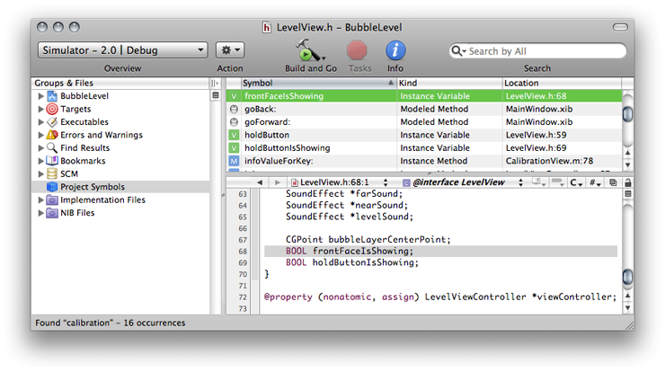
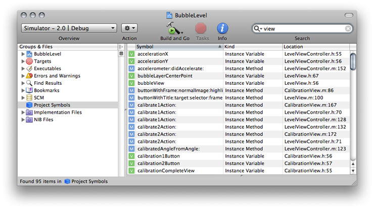
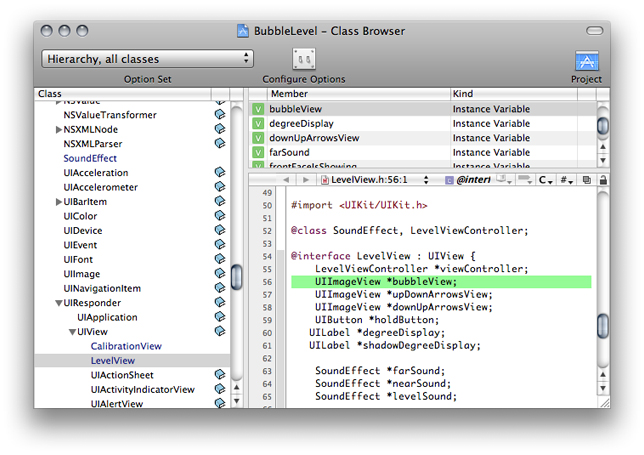
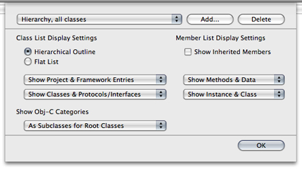

> 导航：[总目录](../../../README.md) · [documentation](../../../_indexes/documentation.md) · [Xcode Project Management Guide](Introduction.md)

[Next](Localizing%20Files.md)[Previous](Searching%20Files%20and%20Projects.md)

# Viewing Project Symbols and Classes

Xcode maintains detailed information about the symbols in and utilized by your project to assist you in the development process. Xcode uses the information in this symbol index, allowing you to browse the symbols and classes in your project, and perform symbol definition searches. It also uses this information to provide completion suggestions when editing source code, as described in [Completing Code](../Xcode%20Workspace%20Guide/The%20Text%20Editor.md#apple-f4xwc4dqnrsv64tfmyxwi33df52wszbpkridimbqgazdmnzzfvjvomrt).

This chapter shows how to use the Project Symbols smart group to view symbols and how to take advantage of the class browser to find information on the classes defined in a project and its included frameworks.

Symbol Indexing makes it simple to find and view information about your code and to gain easy access to project symbols. A project’s symbol index maintains detailed information about the code in your project and in libraries used by your project; this information is stored in a project index. Using this project index, Xcode provides support for features such as the following:

- __Code completion.__ Code completion, described in [Completing Code](../Xcode%20Workspace%20Guide/The%20Text%20Editor.md#apple-f4xwc4dqnrsv64tfmyxwi33df52wszbpkridimbqgazdmnzzfvjvomrt), assists you in writing code by providing completion suggestions from within the editor. Code completion uses the stored information about the symbols, as well as the contextual information from your source code, to offer a list of classes, methods, functions, or other appropriate symbols for the code you are working on.
- __Class browser.__ Using the class browser, you can view the classes in your project and its included frameworks. From the class browser, you can easily access declarations, source code, and documentation for these classes and their members. The class browser is discussed in the section [Viewing Your Class Hierarchy in the Class Browser](#apple-f4xwc4dqnrsv64tfmyxwi33df52wszbpkridimbqga3dsmjxfvbuqmzninfeer2biraue).
- __Project Symbol smart group.__ The Project Symbol smart group allows you to view all of the symbols in your project directly in the project window. You can search these symbols or sort them according to type or name to quickly find the symbols you need. The Project Symbols smart group also gives you easy access to a symbol’s definition. The Project Symbols smart group is described in [Viewing the Symbols in Your Project](#apple-f4xwc4dqnrsv64tfmyxwi33df52wszbpkridimbqga3dsmjxfvbuqmzninfeessdjbfei).
- __Searching.__ Xcode offers numerous ways to search for symbols and other information in your project. For instance, you can perform a projectwide search for symbol definitions, or you can select an identifier in an editor window and jump to its definition. These and other search features are described in [Searching in a Project](Searching%20Files%20and%20Projects.md#apple-f4xwc4dqnrsv64tfmyxwi33df52wszbpkridimbqgazdmnrzfvbecqsgineeisq).

Xcode creates the a project’s symbol index the first time you open a project. Thereafter, the index is updated in the background as you make changes to your project. Indexing occurs on a background thread, to keep it from interfering with other operations in Xcode. The index can be completely rebuilt, if necessary, by opening the General pane in the Project Info window and clicking the Rebuild Code Sense Index button.

Indexing is enabled by default. You can disable indexing for all projects that you open. To do so, choose Xcode > Preferences, click Code Sense, and deselect the “Enable for all projects” option in the Indexing section.

Note that if you turn off indexing, you will be unable to use those features that rely on the project index, such as code completion, the class browser, and the other features mentioned in this section. You can specify whether Xcode includes a particular file in the project index using the “Include in index” checkbox in the File Info window, described in [Viewing File Information](../Xcode%20Workspace%20Guide/File%20Management.md#apple-f4xwc4dqnrsv64tfmyxwi33df52wszbpkridimbqgazdmnzxfvbecqsjincuqsi).

The Project Symbols smart group, one of the built-in smart groups provided by Xcode, allows you to view all of the symbols defined in your project. You can sort symbols by type, name, file, and file path, and you can search for symbols that match a string. To see the symbols defined in your project, select the Project Symbols smart group in the Groups & Files list. The detail view displays the symbols in your project. When you select the Project Symbols group for a project, you get a view like the one shown in Figure 5-1.

__Figure 5-1__  Viewing symbols in your project

The detail view shows the following information for each symbol:

- An icon indicating the symbol type, such as structure, function, or method. The icon is a visual cue that allows you to glance at a group of symbols and easily discern the type. The letter in the icon reflects the symbol type; for example, “M” for method, or “V” for variable. The color of the icon indicates the relative grouping of the symbols. For instance, purple icons indicate top-level elements such as Classes or Categories while orange icons represent basic types like structures, unions, typedefs and others.
- The symbol name.
- The symbol type. While the symbol type icon provides a handy visual cue as to the symbol type, the Kind column states the type explicitly.
- The file containing the symbol definition or declaration, and the line number at which the symbol appears.

To sort the symbols listed in the project window according to any of these categories, simply click the appropriate category heading. In addition, you can use the search field in the project window toolbar to narrow the list of symbols to those matching a string or keyword. You can search the contents of any one of the categories—symbol name, symbol kind, or location—or you can search them all. In the BubbleLevel project, for example, you can search for all symbols declared in files pertaining to views by choosing “Search By Location” from the pop-up menu in the search field and typing `view`. The symbols listed in the detail view are narrowed to include only those symbols defined in files whose names contain the word “view,” as shown in Figure 5-2. By default, the search field searches the content of all categories in the detail view.

__Figure 5-2__  Filtering the symbols in a project

You can configure which information is displayed in the detail view, as described in [The Detail View](../Xcode%20Workspace%20Guide/The%20Project%20Window.md#apple-f4xwc4dqnrsv64tfmyxwi33df52wszbpkridimbqgazdmnrvfvjvomq).

To view the symbol definition, select the symbol in the detail view. If you have an editor open in the project window or detail view, the symbol definition appears there. If you prefer a separate editor window, double-click the symbol to open the file containing the symbol definition in a separate editor.

If you Control-click a symbol in the detail view, Xcode displays the symbol’s shortcut (or contextual) menu, which contains a number of useful commands. The commands available to you are:

- __Reveal in Class Browser.__ If the selected symbol can be displayed in a class browser—for example, a class or a method—choosing this menu item opens the class browser window and selects the symbol in the browser. You can also reveal the selected symbol by choosing View > Reveal in Class Browser.
- __Find Symbol Name in Project.__ When you choose this item, Xcode searches your project for the selected symbol name. It performs a textual search, just as if you had typed the symbol name into the Project Find window and selected Textual from the search type menu. The results of the search are displayed in the Find Results smart group.
- __Copy Declaration for Method/Function.__ This command copies the declaration for the selected symbol to the clipboard; you can then paste this declaration into any text field or editor using Command-V. This command works only for functions and methods.
- __Copy Invocation for Method/Function.__ This command copies the invocation string for the selected symbol to the clipboard, which you can then paste into any text field or editor. The invocation string is the same string that is inserted into your code when you select a code completion option. This command works only for functions and methods.

You can also reveal the file in which the selected symbol is defined in the Groups & Files list by choosing View > Reveal in Group Tree.

If you are programming in an object-oriented language, you can view the class hierarchy of your project using the Xcode class browser. To open the class browser, choose Project > Class Browser. You can also open the class browser by selecting a symbol in the Project Symbols smart group and choosing View > Reveal in Class Browser. Figure 5-3 shows the class browser.

__Figure 5-3__  The class browser

Classes and other top-level symbols—protocols, interfaces, and categories—are listed in the Class pane on the left side of the class browser. When you select a class from this list, Xcode displays the members of that class in the table to the right of the Class pane. When you select a member name from this table, the declaration of that member item is displayed in the editor pane below. To see the item’s definition, Option-click its name.

If the class browser does not list any classes, your project may not be indexed. To rebuild the index, select your project and open the Info window. Open the General pane and click Rebuild Code Sense Index.

A book icon beside a class or member’s name indicates that documentation is available for that member. You can view this documentation by clicking the book icon.

The class browser uses fonts to distinguish between different types of classes and class members:

- Classes defined in your project’s source code are in blue. Classes defined in a framework are in black.
- Members defined in the class are black. Inherited members are gray.

The Option Set pop-up menu and Configure Options button in the toolbar of the class browser window control which classes and class members are displayed in the browser.

To see the file that a class or member in your project is declared in, select the class or member in the class browser and choose View > Reveal in Group Tree. This option is also available in the contextual menu for classes and class members. Xcode reveals the file in the Groups & Files list in the project window.

You can bookmark a class or class member by selecting it in the class browser and choosing Find > Add to Bookmarks or by choosing Add to Bookmarks from the shortcut menu. Xcode creates a bookmark to the class or member’s definition.

You choose which information Xcode displays in the class browser using the Option Set pop-up menu at the top of the browser window. This menu lets you switch between sets of display options. Xcode provides a few sets of predefined display options that allow you to choose:

- Whether to view all classes included in your project or just those defined in your project
- Whether to view classes as a flat list or a hierarchical list

When you view classes as a hierarchical list, you can see the subclasses of a class by clicking the disclosure triangle next to that class.

To create your own set of display options or to make changes to an existing set, click the Configure Options button. Xcode displays a dialog, shown in Figure 5-4, that lets you further refine which information is displayed in the class browser. The Class List Display Settings group, on the left half of the dialog, controls what is displayed in the Class list. The Member List Display Settings group, on the right, controls what is displayed in the members list.

__Figure 5-4__  The class browser options dialog

To choose how to display classes, use the radio buttons under Class List Display Settings:

- Choose Hierarchical Outline to view a hierarchical list of classes, where subclasses are listed under their superclasses.
- Choose Flat List to view an alphabetical list of classes, where all classes are at the same level and sorted alphabetically.

The pop-up menus under the Class List Display Settings options let you choose which items the class browser displays in the Class list. The first pop-up menu determines which classes the class browser shows:

- Show Project Entries Only. Shows only those classes defined in your project.
- Show Framework Entries Only. Shows only those classes defined in the frameworks that your project includes.
- Show Project & Framework Entries. Shows all of the classes defined in your project and in the frameworks that your project includes.

The second pop-up menu determines whether to show only classes, only protocols and interfaces, or classes, protocols and interfaces.

If you are programming in Objective-C, the Show Obj-C Categories menu lets you choose how Xcode displays Objective-C categories in the Class list:

- As Subclasses. The class browser lists categories under the classes that they extend.
- As Subclasses for Root Classes. The class browser lists categories under the root class of the classes that they extend.
- Always Merged into Class. The class browser lists all members of a class and any categories that extend that class together. The category does not appear as a separate entry in the Class list.

The Member List Display Settings let you control which items are included in the class members table in the class browser. You can choose the following:

- Whether to display members inherited from the class’s superclass. To display inherited members, select the Show Inherited Members option.

  The inherited members that the class browser shows are limited by the scope of the selection in the first pop-up menu under Class List Display Settings. For example, if you have Show Project Entries Only selected, the class browser displays only inherited members from inherited classes in the project. To see all inherited members from all classes, choose Show Project & Framework Entries from the first pop-up menu in the Class List Display Settings group.
- Whether to display only methods, only data members, or both methods and data members, using the first pop-up menu in the section.
- Whether to display only instance members, only class members, or both instance and class members, using the second pop-up menu in the section.

You can save and reuse sets of class browser options. To reuse an existing set, choose it from the Options Set pop-up menu above the Class list.

To create a new set of search options, click the Configure Options button, click Add, enter a name for your options set, and configure your options.

To remove a set of search options, click the Configure Options button, choose the options set from the pop-up menu, and click Delete.

[Next](Localizing%20Files.md)[Previous](Searching%20Files%20and%20Projects.md)

