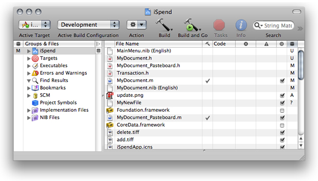
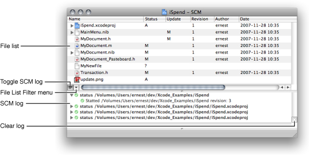
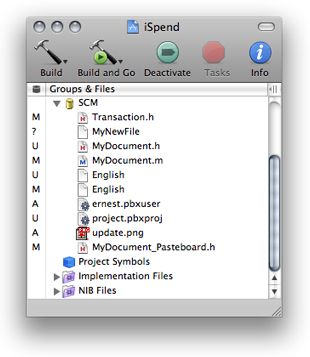
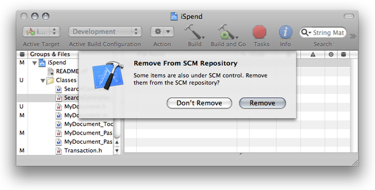
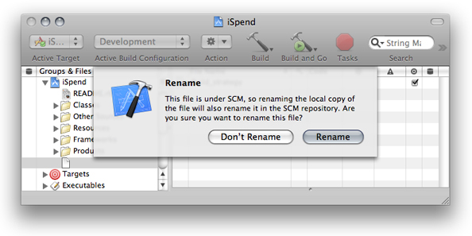
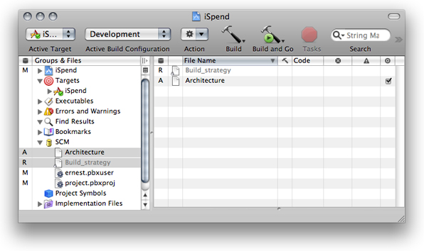
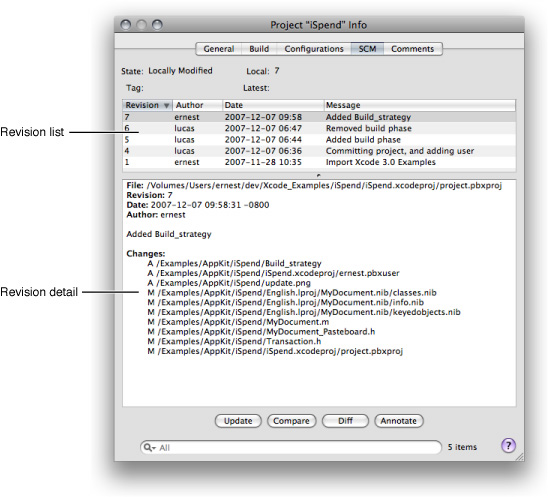
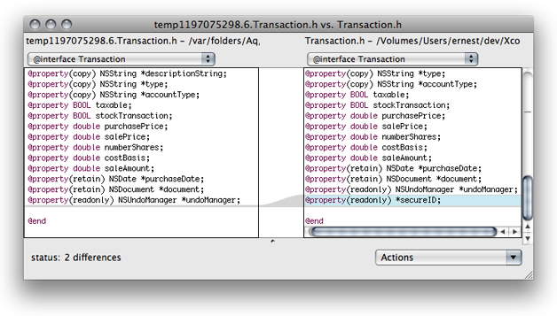
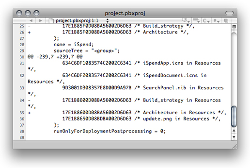

> 导航：[总目录](../../../README.md) · [documentation](../../../_indexes/documentation.md) · [Xcode Source Management Guide](Introduction.md)

[Next](Snapshots.md)[Previous](Source%20Management%20Overview.md)

# Source Control

You can perform the most common source control operations from Xcode instead of your source control client’s command-line interface.

The following sections describe how to connect to source control repositories, how to work with managed files and projects, and how to view, compare, and restore change sets stored in repositories.

Xcode provides an easy-to-use user interface for your source control system. You can perform most source control tasks as you perform normal development tasks, including checking out projects, publishing your changes, and comparing revisions.

This section explains how to create repository configurations, how to use the Repositories window to navigate and modify repositories, and how to configure comparison and differencing operations.

A _repository configuration_ is a set of data that tells Xcode how to use a particular source control client tool to access a specific repository.

This section describes how to create repository configurations and how to browse and modify repositories.

The SCM pane of Xcode preferences is where you create repository configurations that tell Xcode how to access the repositories that store the projects you work on.

The Repositories pane (Figure 2-1) contains the list of repository configurations you have created. Each repository configuration points to a particular path within a repository. Therefore, you may have more than one repository configuration that references the same repository.

__Figure 2-1__  The Repositories pane of SCM preferences

!

To the right of the repository list are the settings that apply to the repository selected in the list. Figure 2-1 shows the settings used for a Subversion repository.

To learn how to create repository configurations, see [Creating Repository Configurations](#apple-f4xwc4dqnrsv64tfmyxwi33df52wszbpkridimbqgazdmobwfvjvomi).

The Options pane (Figure 2-2) contains settings that let you specify how Xcode performs source control and file comparison operations.

__Figure 2-2__  The Options pane of SCM preferences

!

- __Comparison Handling.__ Specifies how Xcode compares files using the Compare command, described in [The Compare Command](#apple-f4xwc4dqnrsv64tfmyxwi33df52wszbpkridimbqgazdmobwfvjvooi). The options are:

  - __View comparisons using.__ Specifies the application used to compare files.
  - __Display local files on.__ Specifies the side of the window on which you want the local version of the file to appear when comparing file revisions.
- __Save files before SCM operations.__ Specifies whether Xcode automatically saves changed files before performing any source control operations.
- __Differencing.__ These options specify how Xcode performs file comparisons using the `diff` command:

  - __Format.__ Specifies the format in which the output from the `diff` command is displayed. For a list of the possible formats, see [Comparison and Differencing Options](#apple-f4xwc4dqnrsv64tfmyxwi33df52wszbpkridimbqgazdmobwfvjvomy).
  - __Lines displayed.__ Specifies the number of lines of context displayed around each difference.
  - __Ignore blank lines.__ Specifies whether blank lines are skipped when differencing files.
  - __Ignore whitespace.__ Specifies whether to ignore whitespace when differencing files.
- __Configure SCM automatically__. Specifies whether Xcode chooses an appropriate SCM repository for a project after checking it out using the Repositories window. See [Checking Out Directories](#apple-f4xwc4dqnrsv64tfmyxwi33df52wszbpkridimbqgazdmobwfvjvomjx) for more information.

The SSH pane contains the list of SSH keys stored in your keychain.

__Figure 2-3__  The SSH pane of SCM Preferences

!

The Status column indicates whether Xcode is able to access a particular SSH key.

To have Xcode ask you for a passphrase when it needs to use a particular SSH key, enter the passphrase in the Passphrase text field.

After you’ve added at least one repository configuration in SCM preferences, you can browse the contents of repositories in the Repositories window (Figure 2-4). To open the Repositories window, choose SCM > Repositories.

__Figure 2-4__  The Repositories window

!!

The Repositories window contains three parts:

- __Repository list.__ Lists the repository configurations you’ve created.
- __Repository browser.__ Allows you to navigate the structure of the repository selected in the repository list.
- __Operation log.__ Lists the source control operations Xcode performs as you navigate or modify a repository.

To create a repository configuration:

1. Open SCM preferences.
2. Click the plus (+) button below the repositories list.
3. In the dialog that appears, enter a name for the repository configuration and choose the source control system you want to use.
4. In the repository settings pane, enter the appropriate information for the source control system you selected. (Consult your SCM system’s documentation to find out the appropriate values for the pane’s fields.)

   If you’re using Subversion, you can enter the repository URL entirely in the URL field or piece by piece in the fields below it (except the Password field).
5. Enter the password (if required) in the Password field.

   When accessing a repository using SSH, Xcode offers to store your SSH key in your keychain. With your SSH keys stored in the keychain, Xcode doesn’t prompt you to authenticate every time it talks to your source control system. See [SSH Keys](#apple-f4xwc4dqnrsv64tfmyxwi33df52wszbpkridimbqgazdmobwfvjvona) for more information.

The Repositories window, described in [The Repositories Window](#apple-f4xwc4dqnrsv64tfmyxwi33df52wszbpkridimbqgazdmobwfvjvony), allows you to navigate the repositories that your repository configurations reference. You can also perform repository management operations, such as importing and exporting projects, creating and deleting directories, and copying, renaming, and moving directories. (Because not all of the supported source control systems provide programming interfaces for each of these operations, some of them may not be executable through the Xcode user interface.)

To import a directory into a repository:

1. If you’re importing a project directory, ensure that the project is not open and that the directory doesn’t contain a `build` directory. For more information, see [Excluding the build Directory from Source Control Operations](#apple-f4xwc4dqnrsv64tfmyxwi33df52wszbpkridimbqgazdmobwfvjvomrr).
2. Open the Repositories window.
3. Select the repository into which you want to import the directory, navigate to the location within the repository at which you want to place the directory, and click Import.
4. Select the directory to import.
5. Enter a comment about the operation, and click Import.

To check out a directory from a repository, do one of the following:

- Drag the directory from the Repositories window to a Finder window.
- Perform these steps:

  1. Open the Repositories window.
  2. Select the repository from which you want to export the directory, navigate to the directory you want to check out, and click Checkout.
  3. Select a location in your file system into which to place the working copy of the directory, and click Checkout.

If checked out a project directory and selected “Configure SCM automatically” in SCM preferences, after checking out the project directory Xcode configures the project package so that you can perform SCM operations immediately.

To create a directory in a repository:

1. Open the Repositories window, and select the repository in which you want to create the directory.
2. Navigate to the location in which you want to create the directory, and click Create Directory.
3. In the dialog, enter the directory name and a comment for the operation, and click Create Directory.

To copy a directory:

1. Open the Repositories window, and select the repository in which you want to create the copy.
2. Select the directory you want to copy, and click Copy.
3. In the dialog:

   1. Enter the name of the copy.
   2. Select the copy’s location.
   3. Enter a comment for the operation, and click Copy.

To move or rename a directory:

1. Open the Repositories window, and select the repository on which you want to operate.
2. Select the directory you want to move or rename, and click Move.
3. In the dialog:

   1. Enter the new name for the directory.
   2. Select the new location for the directory.
   3. Enter a comment for the operation, and click Move.

A project’s `build` directory contains many files generated by the Xcode build system. These files should not go into a source control repository because of their volatility and because they have little need to be tracked by such a system.

In managed projects, you should move the projects’ build directory to a location outside the realm of source control operations—that is, outside the project’s project root.

You can specify a custom location for the `build` directory, in Building preferences.

Version control allows you to maintain a history of a project’s development and lets you share projects with other developers. Xcode, in conjunction with your version control system, allows you to stay up to date with your team’s progress. Through the Xcode user interface, you can perform most of the version control tasks needed to work on a software project successfully.

This section introduces common version control tasks and explains how to accomplish them in Xcode. It also provides the recommended workflow you should follow when working on managed Xcode projects.

There are a few essential concepts you need to understand to fully take advantage of source control in Xcode. A project contains two files that are particularly important, the project file and the user file. They are both in the project package (`.xcodeproj`) in the project directory. These two files keep the project package in sync with the rest of the files in the project, and maintain personal project settings in the repository.

- __The project file.__ The project file, which Xcode maintains in the project package with the name `project.xcodeproj`, stores project-related information, such as the files that are part of the project, the groups in the Groups & Files list, build settings, target definitions. Xcode constantly writes out this file; therefore, most of the time its status is M (for details on file status codes, see Viewing File Status).

  If you make structural changes to the project, such as adding or removing files, you must commit this file along with the other changes (for example, when you commit a file you added to your working copy, you must also commit the project package). Otherwise, the project file may become out of sync with the rest of the project’s files (source code files, resource files, and so on).
- __The user file.__ The user file stores user-related information, such as bookmarks, the active build configuration, and the name of a repository configuration. Xcode maintains this file inside the project package as `<username>.pbxuser`. So, for the user name `clare`, the corresponding user file is called `clare.pbxuser`.

  Xcode adds your user file to a project package when you open the project if there isn’t already a user file for you inside the package. You should include your user file in your commits and updates if you want to safeguard your personal settings for the project in the repository or if you work on the project on more than one computer and want to use the same settings on all of them.

A project can have one or more project roots. A _project root_ is a directory at which source control operations are rooted. By default, a project has only one project root, the project directory. In a software effort that involves only one project, the default project root is usually adequate. However, if you work on an endeavor that comprises more than one project, multiple project roots let you associate independent directories (each containing a component of the endeavor, or a subproject) with the project. These project roots don’t have to be located under the same parent directory. And each project root has its own SCM configuration; this allows different teams in a project to use their preferred SCM systems for their particular components, but still work on the entire endeavor as a group. See Managing Project Information to learn how to set a project’s project root.

Xcode provides commands that operate on the _entire project_. These commands operate on the files in a project root directory (and its subdirectories), even if they’re not referenced in the project file.

As you work on a project, the version control status of its files in relation to the repository change. Xcode tells you which files you have changed in your local copy of the project, which files need to be updated to the latest version in the repository, and so forth.

Xcode uses a one-letter code to represent the status of each file. Here’s what each code means:

- __Blank.__ The file is up to date with the latest version in the repository. You haven’t changed your local copy of it.
- _? (unknown)._ The file is not in the repository. See Adding Files.
- _! (unmanaged)._ The file is not in the repository.
- _- (dash)._ The file is in a directory that’s not in the repository, or this is a directory that’s not in the repository. To add a directory to the repository, you must use your client tool. After that, add the files in the directory using Xcode. If you don’t use Xcode to add the files, Xcode does not add the files to the project file. In turn, when you commit your changes, Xcode does not notify other developers that files have been added to the project.
- _U (update)._ The latest version of the file in the repository is newer than your version. To check for conflicts between your version and the latest revision and then get the latest revision if there are no conflicts, select the file in the detail view and choose SCM > Update To > Latest.
- _C (conflict)._ Your changes may conflict with the changes in the latest version. To see conflicts, select the file in the detail view and choose SCM > Compare With > Latest.
- _M (modified)._ The next time you commit your changes to the file, either by selecting it and choosing SCM > Commit Changes or by choosing SCM > Commit Entire Project, the modified version of this file is added to the repository.
- _A (added)._ The next time you commit your changes, this file is added to the repository.
- _R (removed)._ The next time you commit your changes, this file is removed from the repository.

You can view the source control status of files in several places: the SCM smart group, the detail view, and the SCM results window.

The SCM group in the Groups & Files list in the project window shows the status of all the files that differ from the latest version in the repository or for which you’ve specified a version control operation to be performed later, such as adding a new file to the repository. The SCM group in the Groups & Files list shows the SCM group.

__Figure 2-5__  The SCM group in the Groups & Files list

!

You can also use the SCM column in the Groups & Files list to see the status of your project's files in the outline view.

The detail view lists all the files in a project. When using version control, you can add the SCM column to the detail view by using the shortcut menu of the detail view header. The SCM column shows the status of each file in the project. The SCM column in Xcode’s detail view shows the SCM column (the rightmost column) in the detail view.

__Figure 2-6__  The SCM column in the detail view

The SCM results window provides the same information the SCM group does, plus a log of SCM operations. The window appears when you double-click the SCM group or when you choose SCM > SCM Results.

The SCM Results and editor panes in the SCM Results window shows the SCM Results window.

__Figure 2-7__  The SCM results window

These are the window’s controls:

- __Files list.__ List of files in the project. You can filter this list using the File List Filter pop-up menu.
- __File List Filter menu.__ Specifies which files are displayed in the file list. The options are:

  - __All.__ No filter.
  - __Interesting.__ Hierarchical list of files with nonblank source control status.
  - __Flat.__ Flat list of files with nonblank source control status.
- __Toggle SCM log.__ Shows/hides the SCM log.
- __SCM log.__ Lists the SCM operations Xcode performs.
- __Clear log.__ Clears the SCM log.

After you add a file to your local copy of a managed directory, its status is ? (unknown). This means that the file is not part of the repository. If you want to add the file to the repository the next time you commit your changes, select the file in the project window or the SCM Results window and choose SCM > Add to Repository.

The status of the file changes from ? to A.

When you commit file additions, you must commit the project file (`project.xcodeproj`) at the same time. This lets other developers know there’s a new file in the project as soon as you commit the addition. If you don’t commit the project file when you commit the file addition (that is, if you select a file with a status of A, and commit its changes to the repository without also selecting the project file), other developers will not be able to get the added file into their local copies of the project, because Xcode wouldn’t know that a file was added to the project.

When a file in your local copy of a project becomes outdated, Xcode assigns it a status of U. This means that another developer has submitted changes to that file to the repository and your working copy doesn’t include them.

To update your local copy of a file that needs updating select the file in the project window and choose SCM > Update To > Latest.

To update your local copy all the files in the project root that need updating, choose SCM > Update Entire Project.

When the project package (`project.xcodeproj`) has a status of U, you need to update the project package and reopen the project in Xcode. The SCM group in an Xcode project whose project package needs to be updated shows the SCM group of an Xcode project whose project package needs to be updated.

__Figure 2-8__  The SCM group in an Xcode project whose project package needs to be updated

To update the project package, select `project.xcodeproj` in the SCM group and choose SCM > Update To > Latest.

Alternatively, you can choose SCM > Update Entire Project.

After the update operation is completed, you may get a dialog (Figure 2-9) that tells you that the project package was changed in the file system and asks you whether to keep using the version in memory or reload the project from the file system. To work with the latest version of the project package in the repository, choose to reload the project.

__Figure 2-9__  The Project Package Update dialog

!

If you updated only the project package, when you reopen the project, the SCM group may display files with a status of U using red text. These files were added to the project after your last update. To get the new files into your working copy, perform the Update To Latest command on them. To refresh the status of the files in your working copy after the update operation is complete, choose SCM > Refresh Entire Project.

To remove a file from your local copy of a project and from the repository when you commit the operation, remove the file as you normally would; that is, select the file in the project window and choose Edit > Delete.

If you choose to delete the file, the Remove From SCM Repository dialog, shown in The Remove From SCM Repository dialog, appears.

__Figure 2-10__  The Remove From SCM Repository dialog

To tell Xcode you want the file removed from the repository, click Remove. The file’s status changes to R and the filename appears in gray in the Groups & Files list and the detail view.

When you commit the file-removal operation, you must commit the project file (`project.xcodeproj`) at the same time. Other developers can then keep their project files in sync with the project directory by updating their local copies. If you don’t commit the project file when you commit the file-removal operation (for example, if you select a file with a status of R, and commit it without also selecting the project file), Xcode notifies other developers that the file you removed needs to be updated. When they update their local copy with the repository, the file is removed from their local copy, but their copy of the project file still references the nonpresent file, and the file appears in red in the detail view. This may confuse others, who then have to find out why a file that’s supposed to be in their project directories is missing.

Renaming a file produces two version control operations: the removal of the file under the old name and the addition of the file with the new name. Therefore, Xcode shows the R status next to the old name and the A status next to the new name.

Rename a file in the Groups & Files list. Select the file in the project window and choose File > Rename.

The Rename dialog appears, as shown in Renaming a managed file.

__Figure 2-11__  The SCM Rename dialog

To proceed with the renaming, click Rename. The SCM group in the Groups & Files list, as well as the detail view, show that the file under the old name will be removed and the file with the new name will be added, as shown in Uncommitted rename operation.

__Figure 2-12__  A renamed file in the project window

You can control access to the version control system you are using with the Go Online and Go Offline commands in the SCM menu. These commands allow you to temporarily turn off or reenable access to the version control system if you move to a different network or lose your network connection. For example, if you are going to be somewhere without network access, you can take your project offline to prevent Xcode from attempting to access the version control system.

If version control goes offline due to a network disruption, access automatically goes back online when the network is reconnected.

The four main source-control tasks are:

- __Committing your work to the repository.__ After you have finished making changes in your project to implement a feature or fix a bug, you copy your work to your SCM repository to safeguard it and share it with the rest of the team.
- __Viewing and comparing revisions.__ As you investigate bugs in your code, you may need to compare your working-copy files with current version of the files or with prior versions to find out the change that introduced the bug.
- __Resolving conflicts.__ There are times when two or more people change the same section of a file. SCM systems report this as conflicts when you try to commit your work to the repository. You must resolve the conflicts before you can commit your changes to the affected files.

This section shows how to perform these tasks.

When you’re done making changes to a file and you want to submit your modifications to the repository, you can tell Xcode to commit the file in one of two ways:

- Select the file in the project window and choose SCM > Commit Changes.
- Choose SCM > Commit Entire Project.

  This command commits pending changes in the project root. Files with pending changes that are part of the project are listed in the Groups & Files list with status A, M, or R.

Both actions bring up a dialog with a text field in which you enter a message describing your changes. To execute the command, click Commit.

You can view the revisions for an entire project or the revisions that pertain to a particular file using the Project Info window or the File Info window, respectively. Info window displaying the revisions of a file shows the SCM pane of the file-info editor.

__Figure 2-13__  The SCM pane in the Project Info window

The SCM pane has these controls:

- __Revision list.__ Lists the revisions for the project/file. You can use the search field to narrow the items shown. The information displayed in the list includes the revision number, the author, and a message about the changes made.
- __Revision detail.__ Shows detailed information about the revision selected in the revision list.
- __Update button.__ Updates your copy of the project or file to the selected revision.
- __Compare button.__ Compares either a selected revision and the project or file or two selected revisions against each other.
- __Diff button.__ Differences either a selected revision and the project or file or two selected revisions against each other.
- __Annotate button.__ Lets you add an annotation to the project package (in the Project Info window) or the selected file (in the File Info window).
- __Search field.__ Filters the revisions shown in the revision list.

You can compare different versions of a file in a project to see changes made to a file from version to version. For example, you can compare your locally modified version of a file with the latest revision submitted by another member of your team. Or you can compare the two most recent revisions in the repository to see what has changed.

To compare your version of a file or project with a version in the repository, use the Compare With or the Diff With command in the SCM menu. The Compare With command lets you compare files using a visual tool, such as FileMerge. With the Diff With command you can have Xcode perform the comparison using the differencing facility of your client.

You can also select any two revisions of a file in its File Info window and compare them using the Compare and Diff buttons.

You can specify several comparison and differencing options. See [Comparison and Differencing Options](#apple-f4xwc4dqnrsv64tfmyxwi33df52wszbpkridimbqgazdmobwfvjvomy) for details.

The Compare With command allows you to compare files using a visual tool. Comparing two revisions of a file using FileMerge shows the result of comparing two revisions of a file.

__Figure 2-14__  Comparing two revisions of a file using FileMerge

To compare your version of a file with a revision in the repository:

1. Select the file in the project window.
2. Choose SCM > Compare With, and select the revision to compare against:

   - __Latest.__ Choose this option to compare a file with the latest version in the repository.
   - __Base.__ Choose this option to compare a file with the version you checked out of the repository.
   - __Revision.__ Choose this option to get the revision list for the selected file. This option is useful if you’re not sure of the revision you want to compare against.
   - __Specific Revision.__ When you know the revision you want to compare against, choose this option and enter the revision number in the dialog that appears.
   - __File.__ Choose this option to compare a file in your project with any file in the file system. Choose the other file from the dialog that appears.

You can also compare any two revisions of a file in its File Info window by selecting the revisions you want to compare in the revision list and clicking Compare.

Another way to compare revisions using Xcode is to identify the differences between them by using the differencing facility of your client tool. Xcode displays the output of the `diff` command in a separate editor window. Identifying differences between two revisions of a file compares two revisions of a file using `svn diff`.

__Figure 2-15__  Identifying differences between two revisions of a file

You can specify the format used in the comparison in the SCM pane in Xcode preferences. See [Comparison and Differencing Options](#apple-f4xwc4dqnrsv64tfmyxwi33df52wszbpkridimbqgazdmobwfvjvomy) for details.

To identify the differences between your copy of a file with a revision in the repository, select the file in the project window, choose SCM > Diff With.

and choose a version to compare against. The options you can choose from are:

- __Latest.__ Choose this option to compare a file with the latest revision in the repository.
- __Base.__ Choose this option to compare a file with the revision you checked out of the repository.
- __Revision.__ Choose this option to get the revision list for the selected file. This option is useful if you’re not sure which revision you want to compare against.
- __Specific Revision.__ When you know the revision you want to compare against, choose this option and enter the revision number in the dialog that appears.

You can also identify the differences between any two revisions of a file in its File Info window by selecting the revisions you want to compare in the revision list and clicking Diff.

A file with a status of C contains changes that clash with the latest revision in the repository. For example, you may have removed a method from a class definition that another developer published changes to before you committed your own changes. To view how your version of a file in conflict differs from the latest revision, use the Compare or Diff commands. See [Comparing Revisions](#apple-f4xwc4dqnrsv64tfmyxwi33df52wszbpkridimbqgazdmobwfvjvonbu) for details.

Version control systems cannot resolve conflicts. They can only make you aware of the presence of conflicts. In some cases, you may be able to resolve the conflict yourself. However, in the majority of cases (if you work in a team), you need to communicate with the person who published the changes that conflict with your own before determining the best way to resolve the conflict.

There are two ways of resolving a conflict between your version of a file and the latest revision in the repository:

- Merge the changes published to the repository with your local changes and edit the resulting file as necessary:

  1. In the project window, select the file with the conflict.
  2. Choose SCM > Update To > Latest.
  3. Edit the file to resolve the conflicts.
  4. Save the file. If you’re using Subversion, you must also choose SCM > Resolved.
- Discard your copy of the file in favor of the latest revision in the repository. Select the file in the project window and choose SCM > Discard Changes.

Conflicts in the project package (`project.xcodeproj`) occur when developers add, remove, or rename files from their local copies and commit those files without committing the project file at the same time. You cannot resolve conflicts in the project package. If your copy of the project package gets a status of C, choose SCM > Update Entire Project, or select the project file in the project window and choose SCM > Update To > Latest.

If Xcode displays a dialog asking whether to discard your changes, discard them. You may need to reopen or reread the project (see [Updating Files](#apple-f4xwc4dqnrsv64tfmyxwi33df52wszbpkridimbqgazdmobwfvjvooa) for more information).

If Xcode is unable to open your project because the project package is corrupt, you must use your client tool to update the project file to the latest version in the repository. See your tool’s documentation for details.

[Next](Snapshots.md)[Previous](Source%20Management%20Overview.md)

