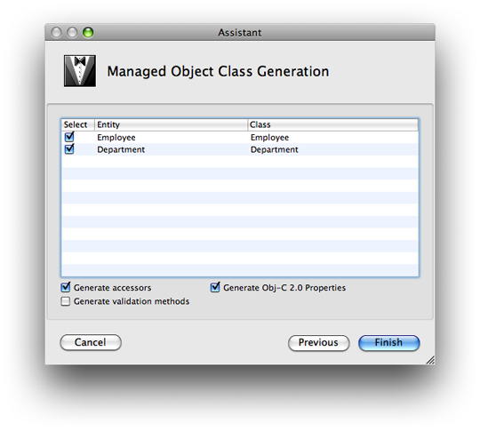

> 导航：[总目录](../../../README.md) · [documentation](../../../_indexes/documentation.md) · [Xcode Tools for Core Data](Xcode%20Entity%20Modeling%20Tools%20for%20Core%20Data.md)

[Next](Model%20Versioning.md)[Previous](The%20Predicate%20Builder.md)

# Code Generation

For each entity in the model, you specify a class that will be used to represent it in your application. By default, the class is set to `NSManagedObject`, which is able to represent any entity. Typically, at the beginning of a project, you use `NSManagedObject` for all your entities. Later, as your project matures, you define custom subclasses of `NSManagedObject` to provide custom functionality.

You can use the New File Assistant to create a default implementation of a managed object class. First, select an entity or a collection of entities in the model, then choose File > New File. In the file type outline view select Design > Managed Object Class and press Next. (If you have not selected any entities, you do not see the entry for Managed Object Class.) In the subsequent pane select the appropriate project and targets, then again press Next. In the following pane (see Figure 1), select the entities for which you want Xcode to generate default class implementations. Check the relevant boxes to specify whether or not the implementations should contain custom accessor, validation methods, or Objective-C properties (see [Declared Properties](https://developer.apple.com/library/archive/documentation/Cocoa/Conceptual/ObjectiveC/Chapters/ocProperties.html#//apple_ref/doc/uid/TP30001163-CH17)). When you press Finish, Xcode creates the files you specified.

__Figure 1__  The Managed Object Class Generation pane

[Next](Model%20Versioning.md)[Previous](The%20Predicate%20Builder.md)

