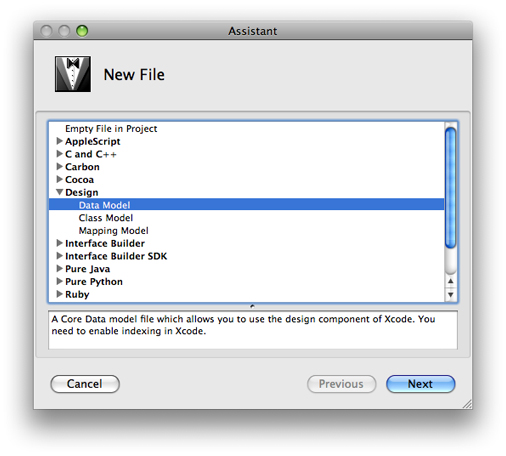

> 导航：[总目录](../../../README.md) · [documentation](../../../_indexes/documentation.md) · [Xcode Tools for Core Data](Xcode%20Entity%20Modeling%20Tools%20for%20Core%20Data.md)

[Next](Workflow.md)[Previous](Xcode%20Entity%20Modeling%20Tools%20for%20Core%20Data.md)

# Creating a Data Model File

This article describes what the data modeling tool is and why you use it, and how you create a new model file.

If you create a Core Data–based project, a data model is automatically created for you and added to the project. If you need to create a new model, choose File > New File and in the the New File assistant—shown in Figure 1—select Design > Data Model and press Next.

__Figure 1__  New File assistant

In the pane that appears (see [The Properties Pane](The%20Browser%20View.md#apple-f4xwc4dqnrsv64tfmyxwi33df52wszbpkridimbqga3dqnjxfvjvomjr)), give the file a suitable name.

__Figure 2__  Creating a Data Model File

!

Press Next, and in the following pane select any groups or files that you want to be parsed for inclusion in the model (if any); then click Finish.

If you have an existing compiled (`.mom`) model file (see [Compiling a Data Model](Compiling%20a%20Data%20Model.md#apple-f4xwc4dqnrsv64tfmyxwi33df52wszbpkridimbqga3dqnzrfvjvomi)), you can import it into a model by choosing Design > Data Model > Import and selecting the `.mom` file in the open panel that is displayed.

Since the data model is a runtime resource (it is compiled, and deployed, as part of the application), you should add new data models not only to the project, but also to the relevant target(s).

[Next](Workflow.md)[Previous](Xcode%20Entity%20Modeling%20Tools%20for%20Core%20Data.md)

