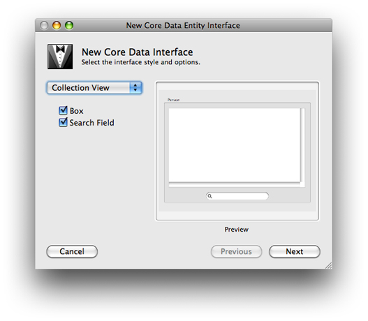

> 导航：[总目录](../../../README.md) · [documentation](../../../_indexes/documentation.md) · [Xcode Tools for Core Data](Xcode%20Entity%20Modeling%20Tools%20for%20Core%20Data.md)

[Next](Document%20Revision%20History.md)[Previous](Compiling%20a%20Data%20Model.md)

# Creating a User Interface From a Data Model

If you are developing a desktop application for Mac OS X, you can use the Xcode modeling tool to quickly create a user interface for managing instances of your entities. This provides a useful strategy for testing a model—with little effort you can create an application to use for testing.

1. Open a nib file (from your project) in Interface Builder, and ensure that you can see the user interface window in which you want the user interface to be created.
2. In Xcode, click an entity node in the diagram view of the data modeling tool.
3. Option-drag the entity node to the user interface window so that a cursor appears showing a “+” symbol.

   You must make sure that Xcode is the foreground application when you start to do this—Option-clicking Xcode while it is not foreground makes it foreground and hides all other applications, including Interface Builder.
4. Release the mouse. You will be presented with an alert asking you to select the interface style and options. From the popup menu, you can select an interface for a single item, a master/detail view, or a collection view. Choose whichever is appropriate.

   

   Each interface style has a different set of options, for example the collection view allows you to add a box and a search field.

Interface Builder automatically creates a user interface appropriate for the selection you made. For example, if you select Master/Detail, the interface contains a table view, a search field, text fields for individual attributes, pop-up menus for to-one relationships, and optionally buttons to add, remove, and fetch instances of the entity. Object controllers are also added to the nib file to manage collections of entities as appropriate. (Recall that object controllers that contain managed objects use the entity name, and not the name of the class. If at a later stage in the development cycle you specify and implement a custom class for an entity, the interface will continue to work.)

[Next](Document%20Revision%20History.md)[Previous](Compiling%20a%20Data%20Model.md)

