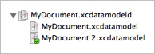

> 导航：[总目录](../../../README.md) · [documentation](../../../_indexes/documentation.md) · [Xcode Tools for Core Data](Xcode%20Entity%20Modeling%20Tools%20for%20Core%20Data.md)

[Next](Compiling%20a%20Data%20Model.md)[Previous](Code%20Generation.md)

# Model Versioning

A managed object model can contain multiple schema versions. (For more about model versioning, see _[Core Data Model Versioning and Data Migration Programming Guide](../../Cocoa/Core%20Data%20Model%20Versioning%20and%20Data%20Migration%20Programming%20Guide/Core%20Data%20Model%20Versioning%20and%20Data%20Migration.md#apple-f4xwc4dqnrsv64tfmyxwi33df52wszbpkridimbqga2dgojz)_.)

To create a versioned model, select a model file and choose Design > Data Model > Add Version. This converts an existing `.xcdatamodel` file into a `.xcdatamodeld` directory containing the original model and a copy of the original model with “ 2” appended to the filename.

You can add more versions using Design > Data Model > Add Version.

The current version of the model is denoted by a green check mark on the file symbol. You can change the current version by selecting a different model and choosing Design > Data Model > Set Current Version.

[Next](Compiling%20a%20Data%20Model.md)[Previous](Code%20Generation.md)

