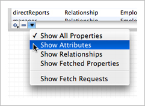
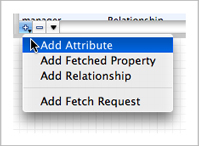
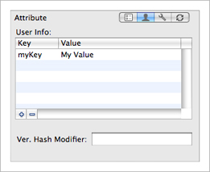

> 导航：[总目录](../../../README.md) · [documentation](../../../_indexes/documentation.md) · [Xcode Tools for Core Data](Xcode%20Entity%20Modeling%20Tools%20for%20Core%20Data.md)


[Next](The%20Diagram%20View.md)[Previous](Workflow.md)

# The Browser View

The browser view gives you a different perspective on the whole of your model. It has three separate parts: two table view panes—the entity pane and the properties pane—and the detail pane. You can resize a pane by dragging the vertical divider. You can also hide a pane by resizing its width to zero—to hide the detail pane you must drag the divider on its left side most of the way to the right, past its minimum size.

The browser view is by default always present in the model’s editor view—you cannot shrink it beyond a minimum height. You can hide it by choosing Design > Hide Model Browser (and show it again by choosing Design > Show Model Browser). The view has three separate parts: the entities pane, the properties or fetch requests pane, and the detail pane. The detail pane itself has four separate views: the General pane, the User Info pane, the Configurations pane, and the Sync pane, as shown in Figure 1.

__Figure 1__  The browser view

!!

The left-most pane displays and allows you to edit information about the entities that are in the model. The middle pane displays and allows you to edit information about the properties of the currently selected entity. If you make a multiple selection in the entity table, the properties table shows the union of all properties of the selection.

As with most table views, you can rearrange and re-sort the columns. You rearrange the columns simply by dragging a header cell; you can change the sort order by clicking in header cells.

You can choose which columns to see by Control clicking table header cells to display a pop-up list that you can use to toggle the display of columns (see Figure 2). If you have a multiple selection, Show All Columns means that only the set of columns common to all members of the selection may be displayed, otherwise you get a specific set (dependent upon what you have selected).

__Figure 2__  Browser column options


You can also choose which properties are shown by viewing the command pop-down menu in the property table. Each command, shown in Figure 3, acts as a toggle to change the visibility of properties and operations in the table view.

__Figure 3__  Property list view options



Finally, you can display the entity list either as a flat list or as an inheritance hierarchy. Select the view option you want in the pop-down menu of the leftmost pane, as shown in Figure 4.

__Figure 4__  Entity view options


The detail pane displays detailed information about whatever was last selected in either the entity or the property table. If you make a multiple selection, the editor shows the best representation it can of the union of the selected items. If you’re using the data modeling tool, you can easily apply changes to a number of entities or properties simultaneously.

The table in the entities pane (the leftmost pane) lists all the entities in the model, either as a flat list or in an inheritance hierarchy. The table has three columns, showing the entity name, the class used to represent the entity, and a checkbox that indicates whether the entity is abstract. You can edit the entity and class names directly in the text field cells—double click the text to make it editable—and toggle the abstract setting of an entity by clicking the checkbox. For more about entities, see [NSEntityDescription](https://developer.apple.com/documentation/coredata/nsentitydescription).

To add a new entity to the model, you click the plus (+) button to the left of the horizontal scroll bar, or choose Design > Data Model > Add Entity. You delete a selected entity or selected entities by clicking the minus (−) button , or by pressing the Delete key.

The table in the properties pane lists the properties or fetch requests associated with the selected entities. You choose what features you want to view by choosing from the command pop-down menu shown in Figure 5.

__Figure 5__  Properties table options

!

Note that the properties table shows the set of all properties of all entities selected in the entities table. Moreover, you can select and edit multiple properties at the same time so if several entities have a similar property you can change them all simultaneously.

The properties table has up to six columns:

1. A text field that shows the name of the property
2. A checkbox that indicates whether the property is optional
3. A checkbox that indicates whether the property is transient
4. A checkbox that indicates whether the property is a sync identity key
5. A text field that shows the kind of property (attribute, relationship, or fetched)—this text field is not editable
6. A popup menu that shows type (for example, date or integer if the property is an attribute) or destination entity (if the property is a relationship) of the property

You can add and remove columns from the properties view by Control-clicking the table header cell—this displays a popup menu, as shown in Figure 6; selecting a menu item toggles the corresponding column’s visibility.

__Figure 6__  Property column display options

!

You can re-order the columns in the view by dragging the table header cells. You can order the contents of the table view by clicking on the column header.

There are several ways to add new properties:

- You can choose Design > Data Model and select the appropriate menu item (such as Add Attribute).
- If you have chosen to view just a single type of property, you click the plus (+) button to the left of the horizontal scroll bar to add a new property of the displayed type.
- If you have chosen to view all properties, you click the plus (+) button to the left of the horizontal scroll bar to display the pop-down menu shown in Figure 7). From the pop-down menu, you choose what sort of property you want to add.

__Figure 7__  Adding a property



You can edit most property values directly in the properties table—the exception is the property type (“Kind”), which you specify when you first add the property.

You typically edit the predicate associated with fetched properties from the detail pane, using the predicate builder (see [Fetched Properties and Fetch Request Templates](The%20Predicate%20Builder.md#apple-f4xwc4dqnrsv64tfmyxwi33df52wszbpkridimbqga3dqnjtfvbegskgijfeuqq)). Note that for a fetched property _you must select a destination entity before you edit the predicate_. If you do not do so, the predicate builder does not display any properties.

The fetch requests view displays the fetch requests associated with an entity as shown in Figure 8. You add fetch requests using the plus sign button. Although you can edit the name of the fetch request and the predicate directly in the table view, you typically construct the predicate graphically using the predicate builder from the detail pane. For more about fetch requests, see [NSFetchRequest](https://developer.apple.com/documentation/coredata/nsfetchrequest), and for details about the predicate syntax, see [Predicate Format String Syntax](https://developer.apple.com/library/archive/documentation/Cocoa/Conceptual/Predicates/Articles/pSyntax.html#//apple_ref/doc/uid/TP40001795) in _[Predicate Programming Guide](../../Cocoa/Predicate%20Programming%20Guide/Introduction.md#apple-f4xwc4dqnrsv64tfmyxwi33df52wszbpkridimbqgaytoobz)_.

__Figure 8__  Fetch request templates for a selected entity

!

When you add a fetch request to an entity, you are specifying that that entity is the one against which the fetch will be performed. For example, if you add a fetch request called “highlyPaidEmployees” to the Employee entity, in code you would retrieve it from the model using:

```
    NSFetchRequest *fetchRequest = [managedObjectModel
            fetchRequestTemplateForName:@"highlyPaidEmployees"];
```

The entity for the returned fetch request is set to Employee. Since fetch requests are nevertheless general to the model, _fetch request names must be unique across all entities_. If you try to set a duplicate name, you get a warning sheet, and you must choose a unique name before you can proceed.

The detail pane itself has four panes: the General pane, the User Info pane, the Configurations pane, and the Synchronization pane. You choose which pane to display by clicking the corresponding element in the segmented control in the upper right of the pane, as shown in Figure 9.

__Figure 9__  The control for choosing a pane in the detail pane

!

The general pane is different for entities, attributes (and for different types of attribute), relationships, and fetch requests. It changes automatically to the appropriate view depending on the last selection. Each view shows, and allows you to edit, details of the selected element.

- For entities, you can edit the entity name, the name of the class used to represent the entity, and the parent entity, and you can specify whether or not the entity is abstract.
- For attributes, you can specify the name and type, and whether or not it is optional, transient, or indexed. When you specify the type, the pane updates to allow you to specify other options for the attribute.

  For example, for numeric and date attributes you can specify maximum, minimum, and default values; for string attributes you can specify maximum and minimum length, a default value, and a regular expression that the string must match; for transformable attributes, you specify the name of the value transformer to use.
- For relationships, you can specify the name, cardinality, and destination of the relationship. You can also specify a delete rule, and—for to-many relationships—maximum and minimum counts.
- For fetched properties, you specify the name, the destination entity, and the predicate to be used for the fetch. To edit the predicate using the predicate builder, click the Edit Predicate button. For more details about the predicate builder, see [The Predicate Builder](The%20Predicate%20Builder.md#apple-f4xwc4dqnrsv64tfmyxwi33df52wszbpkridimbqga3dqnjtfvjvomi).
- For fetch requests, you specify the name and the predicate. As with fetched properties, to edit the predicate using the predicate builder, click the Edit Predicate button—see [Fetched Properties and Fetch Request Templates](The%20Predicate%20Builder.md#apple-f4xwc4dqnrsv64tfmyxwi33df52wszbpkridimbqga3dqnjtfvbegskgijfeuqq).

Entities, attributes, and relationships may have an associated info dictionary that you can retrieve at runtime (see [NSPropertyDescription](https://developer.apple.com/documentation/coredata/nspropertydescription) and [NSEntityDescription](https://developer.apple.com/documentation/coredata/nsentitydescription)). The user info pane shows the info dictionary associated with the currently selected model element. The dictionary comprises key-value pairs. You use the info dictionary pane to specify any custom keys and string values that may be of use to you in your application. You add and remove key-value pairs using the plus (+) and minus (–) buttons respectively; you edit the values directly in the table view.



Using the User Info pane, you can also set a version hash modifier for entities and properties. You use a modifier to mark or denote an entity or property as being a different “version” than another even if all of the values which affect persistence are equal. Such a difference is important in cases where, for example, the structure of an entity is unchanged but the format or content of data has changed. For more details, see Versioning in _[Core Data Model Versioning and Data Migration Programming Guide](../../Cocoa/Core%20Data%20Model%20Versioning%20and%20Data%20Migration%20Programming%20Guide/Core%20Data%20Model%20Versioning%20and%20Data%20Migration.md#apple-f4xwc4dqnrsv64tfmyxwi33df52wszbpkridimbqga2dgojz)_.

A configuration is a named collection of entities in the model. The configuration pane (show in Figure 10) therefore applies only to entities. You use it to add and remove configurations and to associate entities with configurations. For more about configurations and how to use them, see Managed Object Models.

__Figure 10__  Configurations pane of the detail pane

!

A model may have an arbitrary number of configurations. You add configurations using the plus (+) button. Configurations appear in the list for all entities. The checkbox specifies whether the currently-selected entity is associated with the given configuration.

You use the synchronization pane to configure entities and properties for use with Sync Services (see _[Sync Services Programming Guide](../../Cocoa/Sync%20Services%20Programming%20Guide/Introduction%20to%20Sync%20Services%20Programming%20Guide.md#apple-f4xwc4dqnrsv64tfmyxwi33df52wszbpkridimbqgaytcnzy)_). For more about sync schemas, see [Creating a Sync Schema](https://developer.apple.com/library/archive/documentation/Cocoa/Conceptual/SyncServices/Articles/SchemaDesign.html#//apple_ref/doc/uid/TP40001153); see also “Adding Information to Managed Object Models” in [Syncing Core Data Applications](https://developer.apple.com/library/archive/documentation/Cocoa/Conceptual/SyncServices/Articles/UsingCoreData.html#//apple_ref/doc/uid/TP40005232).

[Next](The%20Diagram%20View.md)[Previous](Workflow.md)

