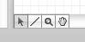
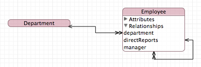
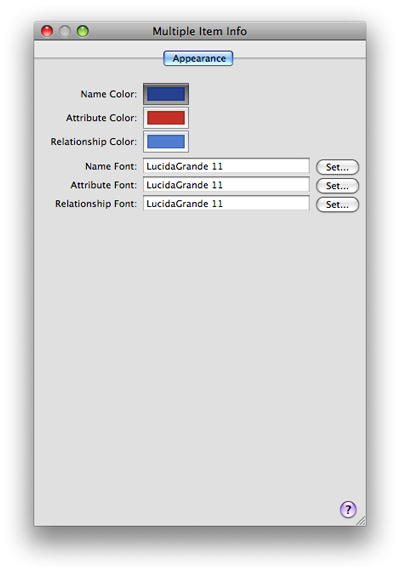

> 导航：[总目录](../../../README.md) · [documentation](../../../_indexes/documentation.md) · [Xcode Tools for Core Data](Xcode%20Entity%20Modeling%20Tools%20for%20Core%20Data.md)

[Next](The%20Predicate%20Builder.md)[Previous](The%20Browser%20View.md)

# The Diagram View

This section describes the diagram view of the model.

The diagram view contains two main elements, rounded rectangles—which represent nodes—and lines, as shown in Figure 1.

__Figure 1__  A diagram view of an entity model

!

Nodes are the base elements in the model—the entities.

A node may be split into two sections: The title bar containing the name of the entity, and a compartment that shows attributes and relationships (see [Figure 4](#apple-f4xwc4dqnrsv64tfmyxwi33df52wszbpkridimbqga3dqnjwfvjvony)).

Lines represent relationships between entities and entity inheritance hierarchies.

A line with one or two open arrow heads represents a relationship. A single arrowhead denotes a to-one relationship; a double arrowhead denotes a to-many relationship. The direction of an arrow indicates the direction of the relationship—the arrow points to the destination entity. Figure 1 shows an example of the diagram view of a simple data model, with all compartments expanded.

A line with a closed arrowhead denotes inheritance.

The diagram view provides several tools, whose function should be familiar from other drawing packages. You select the tools from the palette in the bottom-left corner of the diagram view, shown in Figure 2.

__Figure 2__  Diagram tools

- _Arrow_. You use the arrow tool to make selections and to move and resize graphic elements.
- _Line_. You use the line tool in data model to add a relationship. To connect two elements, select the line tool, then drag from one end of the connection to the element at the other end. You make the connection from the source to the destination of the relationship.
- _Magnifying glass_. You use the magnifying tool to zoom into part of the diagram or, by holding down the Option key, to zoom out. See [Layout](#apple-f4xwc4dqnrsv64tfmyxwi33df52wszbpkridimbqga3dqnjwfvjvomjt) for other ways to zoom. To effect the zoom, you select the tool, then click inside the diagram.
- _Hand_. You use the hand tool to move the diagram if its bounds extend beyond the current view.

You can edit the model directly from the diagram:

- To add a new entity, you Control-click the background of the diagram and select Add Entity from the contextual menu.
- To add properties to an entity, you Control-click within its node and select the appropriate item from the contextual menu.
- To delete entities and properties, you select the item then press the Delete key.
- To establish new relationships, you select the line tool then drag from the source node to the destination node.

  Note that although most relationships are implicitly bidirectional, relationships do not have to be modeled in both directions—although unless you have very good reason not to model a relationship in both directions, you are strongly encouraged to do so. To specify a bidirectional relationship, you must model both sides of the relationship. Moreover, within the model, you must specify which relationships are the inverse of each other. To do this you need to use the model browser.

There are a number of options for moving and resizing elements; you can also constrain the way the elements can be moved and resized, and even prevent them from being moved and resized. Furthermore, you can zoom into and out of the diagram and arrange the page layout as you wish.

- _Moving and resizing shapes_. You can rearrange elements in a diagram to suit your needs—lines that join elements are updated appropriately. Use the arrow tool to select an element, and then simply drag it. You can move all the elements in the current selection (see “Multiple Selection”) in the same way.

  When you select a shape, “handles” appear around its edges (as shown in Figure 3). You can drag the handles to resize the shape.

  __Figure 3__  Diagram view showing element handles

  

  You can also automatically resize elements in several ways, by choosing the Design > Diagram > Size. In the Size submenu, Make Same Width and Make Same Height resize the selected elements appropriately; Size to Fit resizes the selected elements so that they fully enclose their contents with minimal padding.
- _Multiple selection_. You can use multiple selection in the diagram view to move a collection of elements in a flotilla drag, or for roll-up, expand all, and so on. You can make multiple selection in several ways:

  - You can select a single element, then hold down the Shift key and click additional elements. Unselected elements are added to the current selection; selected elements are removed from the current selection.
  - You can drag the background of the diagram to create a selection rectangle. Elements whose boundaries intersect with this rectangle are selected.
  - You can select entities in the browser—the browser selection and diagram selection are kept synchronized.

  Choose Edit > Select All to select all elements in the diagram. Note that for items in the Diagram menu, clicking on the background (rather than on a drawn element) is the equivalent of selecting all but may be faster.
- _Alignment and grid_. You can use a variety of options to automatically align selected elements and to help you keep elements aligned. By choosing Design > Diagram > Alignment menu, you can perform a number of operations—aligning specified edges or centers of a selection and aligning a selection in a row or column.

  You can also use a grid to help keep elements aligned. By default, the diagram view displays a background grid, and move and resize operations are snapped to it. By choosing Design > Diagram, you can turn the grid display on and off; you can also independently turn the snap-to-grid feature on and off.
- _Locking_. You can lock individual graphic elements in place by choosing Design > Diagram > Lock, or the Lock contextual menu. If you subsequently apply automatic layout, locked elements are unaffected. To unlock an item, choose Design > Diagram > Unlock, or use the Unlock contextual menu.
- _Zoom_. You can zoom into and out of the diagram in three different ways:

  - Choose Design > Diagram to zoom in, out, and to fit.
  - Use the pop-up menu to select a percentage zoom.
  - Use the magnifying glass tool (click to zoom in; Option-click to zoom out).
- _Page layout_. If you move diagram elements outside the current diagram bounds (whether directly, or through applying automatic layout, or by unhiding elements), the page area automatically expands. Conversely, if you remove elements such that a page is left blank, the page area automatically contracts.

  To adjust the size of a page, choose File > Page Setup. The page layout adjusts automatically to accommodate a change in page size.

You can display a node and the compartments within it in a variety of ways:

- Rolled up, so that just the name of the entity is showing. This gives the most compact representation, with maximum information density in the diagram. (In Figure 4 the Department node is rolled up.)
- Compartment titles showing. The titles are Attributes and Relationships in the data model. This gives a compact representation but with easy access to detail.
- Compartments expanded. All the information in a compartment is visible but at the cost of screen real estate. (In Figure 4 the Relationships compartment of Employee is expanded, but the Attributes compartment is not.)

__Figure 4__  A rolled-up node and a partially expanded rolled-down node

To roll up or roll down the node, choose, respectively, Design > Roll Up Compartments or Design > Roll Down Compartments. To hide or expose compartment information, you use the disclosure triangle within a compartment or choose Design > Expand Compartments (or Design > Collapse Compartments).

The diagram view provides default coloring for various elements. By default, all text is black, and the title bar and outline of drawing elements are colored. In the data model the color is the same for all entities.

You change the background color of the title bar and color of the outline of elements by dropping a color swatch from the Color panel onto the element. You change the other color settings, and the font used for the title, property, and operations text, using the Appearance pane of the Info window (inspector). You can also select multiple elements and change their color and text settings simultaneously, as shown in Figure 5.

__Figure 5__  Appearance pane showing multiple selection

You can also change the default settings for the entire model using the Appearance pane—see [The Info Window](Workflow.md#apple-f4xwc4dqnrsv64tfmyxwi33df52wszbpkridimbqga3dsmjwfvjvona).

[Next](The%20Predicate%20Builder.md)[Previous](The%20Browser%20View.md)

