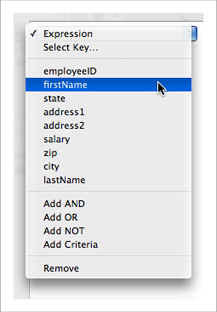
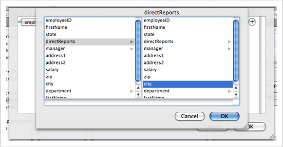
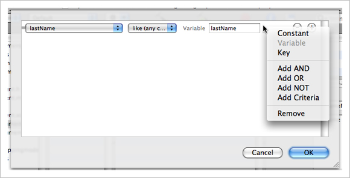
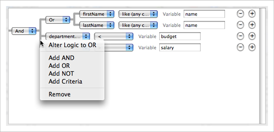
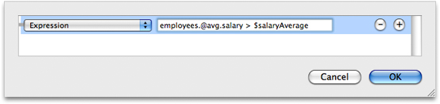

> 导航：[总目录](../../../README.md) · [documentation](../../../_indexes/documentation.md) · [Xcode Tools for Core Data](Xcode%20Entity%20Modeling%20Tools%20for%20Core%20Data.md)


[Next](Code%20Generation.md)[Previous](The%20Diagram%20View.md)

# The Predicate Builder

You use the predicate builder to create predicates for fetched properties and for fetch request templates. As with the rest of the modeling tool, the predicate builder simply provides a graphical means of defining a collection of objects that you could otherwise create programmatically.

Fetched properties are weak, unidirectional relationships from one entity to another, defined by a fetch request. For more about fetched properties, see [NSFetchedPropertyDescription](https://developer.apple.com/documentation/coredata/nsfetchedpropertydescription). Note that fetched property names must begin with a lowercase letter.

Fetch request templates allow you to create predefined instances of `NSFetchRequest` that are stored in the model. You can either define all aspects of a fetch or you can allow for runtime substitution of values for given variables. Fetch templates are associated with the entity against which the fetch will be made, that is, instances of which the fetch will return. For more about fetch request templates, see [Creating Predicates](https://developer.apple.com/library/archive/documentation/Cocoa/Conceptual/Predicates/Articles/pCreating.html#//apple_ref/doc/uid/TP40001793) and the reference documentation for [NSManagedObjectModel](https://developer.apple.com/documentation/coredata/nsmanagedobjectmodel). For more about predicates in general, see _[Predicate Programming Guide](../../Cocoa/Predicate%20Programming%20Guide/Introduction.md#apple-f4xwc4dqnrsv64tfmyxwi33df52wszbpkridimbqgaytoobz)_.

You access the predicate builder by clicking the "Edit Predicate" button that appears in the detail pane for fetched properties and for fetch request templates (see [The Browser View](The%20Browser%20View.md#apple-f4xwc4dqnrsv64tfmyxwi33df52wszbpkridimbqga3dqnjxfvjvomi) and [Figure 1](The%20Browser%20View.md#apple-f4xwc4dqnrsv64tfmyxwi33df52wszbpkridimbqga3dqnjxfvjvomy) respectively).

__Figure 1__  Fetched property detail pane

!

Using the predicate builder, you can build predicates of arbitrary complexity. The initial display shows a simple comparison predicate. The left-hand side is pop-up menu that allows you to choose the key used in a key path expression, the right-hand side is a text field that allows you to specify a constant value, and between them is a pop-up menu that allows you to choose a comparison operator. Note that _for a fetched property you must specify the destination entity before you edit the predicate_, otherwise the predicate builder does not display any properties.

__Figure 2__  The predicate builder

!

The key pop-up menu, shown in Figure 3, displays attributes of the entity with which the predicate is associated. You can choose Expression to replace the pop-up menu-based expression editor with a free-form text field editor—see [Properties table](The%20Browser%20View.md#apple-f4xwc4dqnrsv64tfmyxwi33df52wszbpkridimbqga3dqnjxfvjvomjt).

__Figure 3__  Predicate keys



To use a key path (that is, to follow relationships), choose the Select Key item in the key pop-up menu. This displays a browser, shown in Figure 4, from which you can choose the key or key path you want.

__Figure 4__  Adding a key path



You change the type of the right-hand side expression using the contextual menu shown in Figure 5 (you must Control-click “empty space” in the line of the criteria—for example, at the end of the line or between the pop-up menus). This changes the constant value field into a variable field or a key pop-up menu as appropriate.

__Figure 5__  Right-hand side expression type



In addition to a constant value, you can also define the right-hand side of a comparison predicate to be a variable or another key. You use this if you are creating either a fetch request template that requires substitution variables or defining a fetched property and need to use the `$FETCH_SOURCE` or `$FETCHED_PROPERTY` variables in the predicate.

You can add logical operators (AND, NOT, and OR) to create compound predicates of arbitrary depth and complexity. To add a specific logical operator, use the contextual menu shown in Figure 6.

__Figure 6__  Creating a compound predicate



You can also add peer predicates by either clicking the plus (+) button, or choosing Add Criteria in the contextual menu—these add an AND operator. You can change the logical operator using the pop-up menu.

You can rearrange the predicate hierarchy by dragging a row or part of the predicate hierarchy.

To remove a predicate, click the minus (−) button, or use the contextual menu. The predicate builder will try to rebuild the remaining predicate as it can, removing comparison operators where appropriate.

To replace the pop-up menu-based expression editor with a free-form text field editor, you can choose Expression from the left-hand side key pop-up menu shown in [Figure 3](#apple-f4xwc4dqnrsv64tfmyxwi33df52wszbpkridimbqga3dqnjtfvbecsski5begsa). The text field allows you to create more complex expressions that include, for example, functions such as `sum` and `avg`. [Displaying columns](The%20Browser%20View.md#apple-f4xwc4dqnrsv64tfmyxwi33df52wszbpkridimbqga3dqnjxfvjvomju) shows a simple predicate that you could use for a fetch request template to fetch departments where the sum of the salaries of the employees is greater than a given amount.

__Figure 7__  The expression editor



You would use the template as shown in the following code fragment.

```
NSFetchRequest *fetchRequest = [theManagedObjectModel
        fetchRequestFromTemplateWithName:@"departmentsExceedingSalaryAverage"
        substitutionVariables:[NSDictionary dictionaryWithObject:salaryAverage forKey:@"salaryAverage"]];
```

For more about fetch request templates, see [Creating Predicates](https://developer.apple.com/library/archive/documentation/Cocoa/Conceptual/Predicates/Articles/pCreating.html#//apple_ref/doc/uid/TP40001793) and the reference documentation for [NSManagedObjectModel](https://developer.apple.com/documentation/coredata/nsmanagedobjectmodel). For more about fetched properties, see the reference documentation for [NSFetchedPropertyDescription](https://developer.apple.com/documentation/coredata/nsfetchedpropertydescription).

[Next](Code%20Generation.md)[Previous](The%20Diagram%20View.md)

