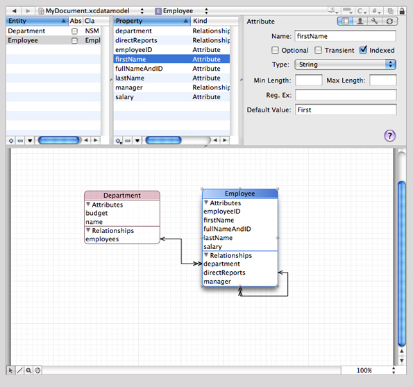
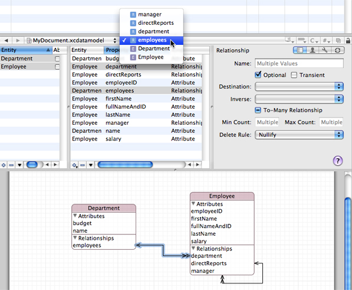
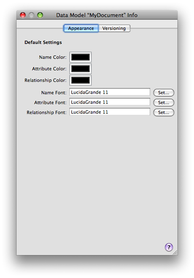

> 导航：[总目录](../../../README.md) · [documentation](../../../_indexes/documentation.md) · [Xcode Tools for Core Data](Xcode%20Entity%20Modeling%20Tools%20for%20Core%20Data.md)

[Next](The%20Browser%20View.md)[Previous](Creating%20a%20Data%20Model%20File.md)

# Workflow

This article describes the basic features of the data modeling tools and how you use them.

The data modeling tool employs a browser that you can use to navigate the entity hierarchy, to view the properties of an individual entity or the properties of a collection of entities, and to inspect attributes of a property; and a diagram view that you can use to visualize their contents. Figure 2 shows the entity browser and the diagram view. They are described in greater detail in [The Browser View](The%20Browser%20View.md#apple-f4xwc4dqnrsv64tfmyxwi33df52wszbpkridimbqga3dqnjxfvjvomi) and [The Diagram View](The%20Diagram%20View.md#apple-f4xwc4dqnrsv64tfmyxwi33df52wszbpkridimbqga3dqnjwfvjvomi).

__Figure 1__  Browser view and diagram view for a data model

The diagram and browser views have different roles. The diagram view is typically best when you need a high-level overview of the schema. The browser view gives you more detailed information, and it can be especially useful when, for example, you want to edit several attributes simultaneously. When you have large collections of entities, you can minimize the information shown in the diagram (for example, view just entity names and relationship lines) and get the detailed information from browser. The diagram view offers a variety of different configurations, so you can tailor your view to any need.

The Xcode design tools offer a wide range of options and features to ease your workflow, from automatic page creation and deletion in the diagram view, to multiple selection editing in the browser. In addition, it is possible to add to the toolbar shortcuts for actions such as Add Entity, and Add Attribute.

You can use the browser and diagram views in conjunction for navigation—the selection in the two views is kept synchronized. As a result, if you make a selection in the browser, the same item is selected in the diagram, and vice versa.

If you want to see a large model in the diagram view, you can maximize the viewable area of a diagram in the main project window by hiding the toolbar, the navigation bar, the status bar, the Favorites bar, and the browser.

If you have a large diagram, there are two strategies you can use to aid navigation. First, you can begin typing the name of the entity you want. As you type characters, Xcode selects the alphabetically “topmost” entity whose name has the prefix you typed. Second, you can use the pop-up menu at the top of the document pane. The pop-up shows a list of elements . When you select an item from the pop-up menu (see Figure 2), the corresponding element is selected and brought into view in the browser and diagram view. This feature may be particularly useful if the browser is hidden.

__Figure 2__  The Elements pop-up menu

The browser view, however, is useful when you have a large schema with all compartments rolled up and you want to see more details about a given entity but don’t want to make the diagram bigger. The browser also shows more information than is available in the diagram (such as the property type).

Most menu-based commands are also available from contextual menus associated with the relevant user interface element. You can Control-click a node for immediate access to operations that apply to it or its context—for example, to expand compartments. You can Control-click the diagram background to perform operations related both to the visual representation and to the model itself. For example, you can hide grid lines, zoom, set the alignment of drawing elements, and add entities.

The Info Window (inspector) contains an Appearance pane and a Versioning pane. You use the Appearance pane to set default colors and fonts for element names and properties. Figure 3 shows an Appearance pane with custom settings. You use the Versioning pane to set the model version identifier—for more about the identifier, see _[Core Data Model Versioning and Data Migration Programming Guide](../../Cocoa/Core%20Data%20Model%20Versioning%20and%20Data%20Migration%20Programming%20Guide/Core%20Data%20Model%20Versioning%20and%20Data%20Migration.md#apple-f4xwc4dqnrsv64tfmyxwi33df52wszbpkridimbqga2dgojz)_.

__Figure 3__  Appearance pane

[Next](The%20Browser%20View.md)[Previous](Creating%20a%20Data%20Model%20File.md)

