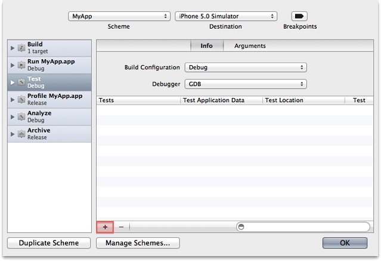
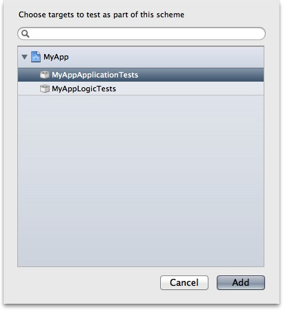
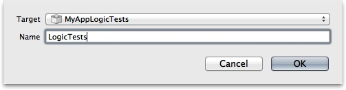

> 导航：[总目录](../../../README.md) · [documentation](../../../_indexes/documentation.md) · [Xcode Unit Testing Guide](About%20Unit%20Testing.md)

[Next](Running%20Unit%20Tests.md)[Previous](Writing%20Test%20Case%20Methods.md)

# Configuring a Scheme to Run Unit Tests

A scheme’s Test action identifies the unit-test targets the scheme uses to run unit tests. In the Test action, you specify which unit-test targets, test suites, and test cases you want the scheme to run.

If Xcode autocreates schemes for you after you add a unit-test target to your project, Xcode creates a scheme configured to run the unit tests in that target. You can also modify other schemes or add new schemes to run your unit tests.

Before you can add a unit-test target to a scheme, ensure your project if properly configured for unit-testing. See [Setting Up Unit-Testing in a Project](Setting%20Up%20Unit-Testing%20in%20a%20Project.md#apple-f4xwc4dqnrsv64tfmyxwi33df52wszbpkridimbqgazdcnbtfvbuqmznknltc) to learn how.

To add a unit-test target to a scheme:

1. From the Scheme toolbar menu, choose the scheme to which you want to add the unit-test target.
2. From the same menu, choose Edit Scheme.
3. Select the Test action.

   
4. In the Test action Info pane, click the Add button.
5. Select the unit-test target you want to add to the Test action, and click Add.

   

To create a scheme that runs the unit tests implemented in a unit-test target:

1. From the Scheme toolbar menu, choose New Scheme.
2. Specify the following information:

   - __Target:__ Choose the unit-test target you want the scheme to use.
   - __Name:__ Enter a name for the scheme.
3. Click OK.

[Next](Running%20Unit%20Tests.md)[Previous](Writing%20Test%20Case%20Methods.md)

