> 导航：[总目录](../../../README.md) · [documentation](../../../_indexes/documentation.md) · [Xcode Unit Testing Guide](About%20Unit%20Testing.md)


[Next](Writing%20Test%20Case%20Methods.md)[Previous](Unit-Testing%20Overview.md)

# Setting Up Unit-Testing in a Project

You use logic unit tests to perform exhaustive, highly tailored testing of your code. With application unit tests you test your code within an app running in a simulator or on a device, with access to the resources available in the Cocoa framework in Mac apps, and the Cocoa Touch framework in iOS apps. A unit-test target can perform either logic unit tests or application unit tests on your code or your app.

The most convenient way of configuring unit tests in a project or target is at the time you create it. If you select the Include Unit Tests option when you create a project or a target, Xcode includes a unit-test target in the scheme that builds the product. For apps, the unit-test target implements application unit tests. For all other product types, the unit-test target implements logic unit tests.

A scheme’s Test action identifies the test suites Xcode performs when you execute the Test command on that scheme. To implement unit-testing in an existing project, you add one or more unit-test targets to the project.

This section describes how to add unit-test targets to a project.

Unit-test targets define one or more test suites.

To add a unit-test target to a project:

1. Open the project to which you want to add a unit-test target.
2. Choose File > New > New Target.
3. Select the unit-testing bundle template for your platform:

   - __iOS:__ In the iOS section, select Other, then select the Cocoa Touch Unit Testing Bundle template.
   - __Mac:__ In the OS X section, select Other, then select the Cocoa Unit Testing Bundle template.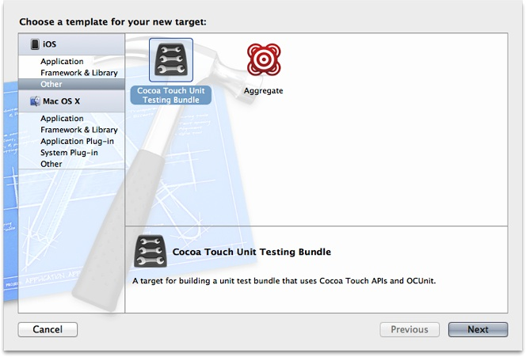
4. Click Next.
5. Specify the following unit-test target options:

   - __Product Name:__ Enter a name for the target’s product that identifies the type of unit testing you want the target to perform and that includes the “Tests” suffix (for example, `MyAppLogicTests`, `MyAppApplicationTests`).

     You can use any name for the target, but it’s helpful to include the type of unit tests you intend the target to run and the fact that the target runs unit tests.
   - __Project:__ Choose the project to which you want to add the unit-test target.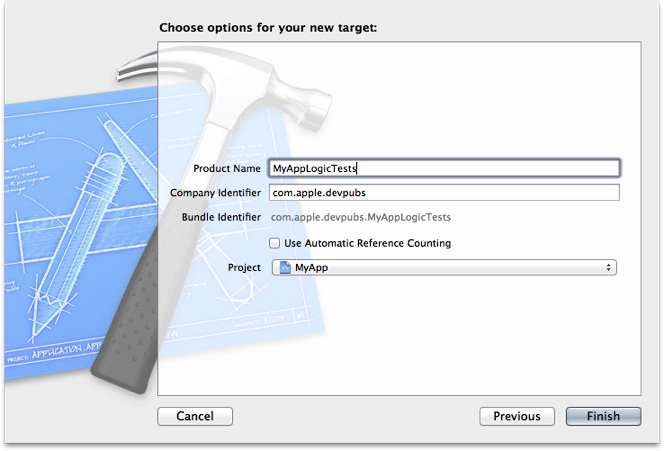
6. Click Finish.

After adding the unit-test target the project navigator shows a new group—with the same name as the target—that contains the source files that implement a temporary test case. The new target is listed in the project’s target list.

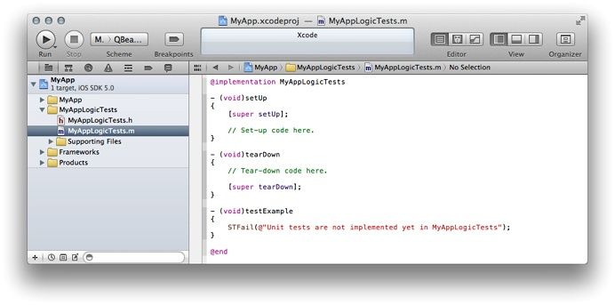

If Xcode autocreates schemes for you, the Scheme toolbar menu contains a new scheme—with the same name as the unit-test target. This is the scheme you use to run the test cases that are part of the unit-test target. The Test action of the new scheme identifies the unit-test target, and lists the test suites and test cases the scheme runs.

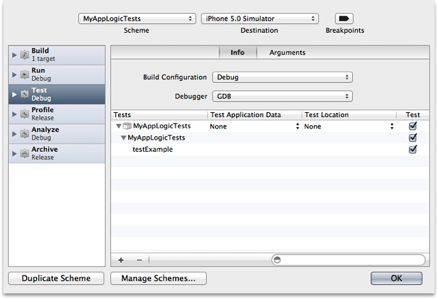

You add additional test suites to a unit-test target by adding an Objective-C test case class to the target.

If you added a unit-test target to your project as described in [Adding a Unit-Test Target to Your Project](#apple-f4xwc4dqnrsv64tfmyxwi33df52wszbpkridimbqgazdcnbtfvbuqmznknltcni), the added target is already configured to perform logic tests.

To set up a unit-test target to perform logic tests:

1. In the project editor, select the unit-test target you want to set up, and display the Build Settings pane.
2. In the Build Settings pane’s scope bar, click All.
3. In the search field, enter `bundle loader`, and press Return.
4. If the Bundle Loader build setting appears in bold, select it, and press Delete.
5. In the search field, enter `test host`, and press Return.
6. If the Test Host build setting appears in bold, select it, and press Delete.

To confirm that the unit-test target is configured correctly to perform logic tests:

1. From the Scheme toolbar menu, choose the unit-tests scheme and a run destination:

   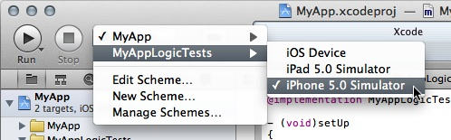
2. Choose Product > Test.
3. Choose View > Navigators > Issue, to display the issue navigator.

   The issue navigator lists the failed temporary test case, indicating that the unit-test target is working correctly.

   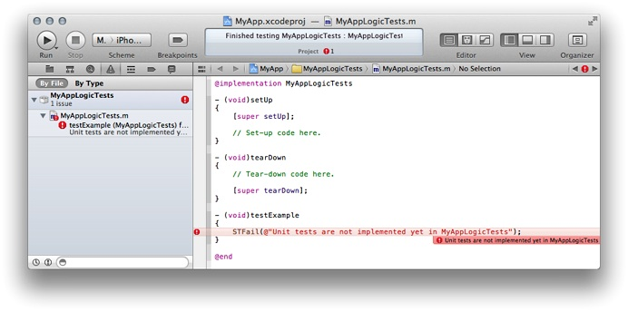
4. Choose View > Navigators > Show Log Navigator to display the log navigator.
5. In the action list in the log navigator (on the left side of the window), select the test run named after the unit-test target.

   The test run log appears in the editor area.

   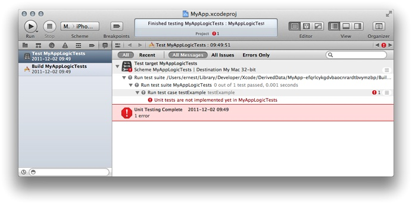

   The test-run transcript should look similar to Listing 2-1. The phrase “All tests” does not appear in the heading of the transcript; this indicates that the unit tests performed are logic unit tests.

   __Listing 2-1__  Transcript of a logic unit-test run

```
Test Suite '/Users/ernest/Library/Developer/Xcode/DerivedData/
  MyApp-efqrlcykgdvbaocnrardtbvymzbp/Build/Products/Debug-iphonesimulator/
  MyAppLogicTests.octest(Tests)' started at 2011-12-02 17:49:51 +0000
Test Suite 'MyAppLogicTests' started at 2011-12-02 17:49:51 +0000
Test Case '-[MyAppLogicTests testExample]' started.
/Users/ernest/Desktop/MyApp/MyAppLogicTests/MyAppLogicTests.m:29:
  error: -[MyAppLogicTests testExample] : Unit tests are not implemented
  yet in MyAppLogicTests
Test Case '-[MyAppLogicTests testExample]' failed (0.000 seconds).
Test Suite 'MyAppLogicTests' finished at 2011-12-02 17:49:51 +0000.
Executed 1 test, with 1 failure (0 unexpected) in 0.000 (0.001) seconds
Test Suite '/Users/ernest/Library/Developer/Xcode/DerivedData/
  MyApp-efqrlcykgdvbaocnrardtbvymzbp/Build/Products/Debug-iphonesimulator/
  MyAppLogicTests.octest(Tests)' finished at 2011-12-02 17:49:51 +0000.
Executed 1 test, with 1 failure (0 unexpected) in 0.000 (0.003) seconds
```

At this point, you have a correctly configured unit-test target that runs logic unit tests. See [Writing Test Case Methods](Writing%20Test%20Case%20Methods.md#apple-f4xwc4dqnrsv64tfmyxwi33df52wszbpkridimbqgazdcnbtfvbuqnbnknltc) to learn how to add test cases to it.

If you created a project including unit-testing, its main unit-test target is already configured to perform application unit tests.

To set up a unit-test target to perform application tests:

1. In the project editor, select the unit-test target, and display the Build Settings pane.
2. In the Build Settings pane’s scope bar, click All.
3. Set the value of the Bundle Loader build setting to:

   - __iOS:__ `$(BUILT_PRODUCTS_DIR)/<app_name>.app/<app_name>`
   - __Mac:__ `$(BUILT_PRODUCTS_DIR)/<app_name>.app/Contents/MacOS/<app_name>`

   where `<app_name>` is the name of your app (the value of the Product Name build setting of the target that builds the app).

   Xcode displays value of the build setting for the project’s build configurations, in this case Debug and Release.

   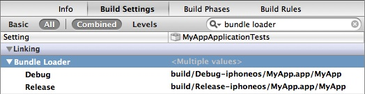
4. Set the value of the Test Host build setting to:

   `$(BUNDLE_LOADER)`

   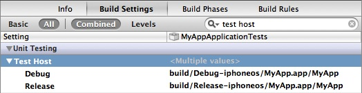
5. Make this target dependent on the target that builds your app.
6. Ensure that this target is in the Test action of the scheme that builds the app to which you want to add the application unit tests.

   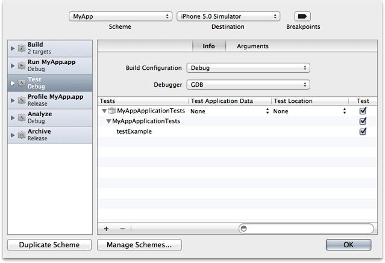

To confirm that the unit-test target is configured correctly to perform application tests:

1. From the Scheme toolbar menu, choose the scheme that builds the app to test and a run destination:
2. Choose Product > Test.
3. Choose View > Navigators > Log to display the log navigator.
4. In the list in the log navigator (on the left side of the window), select the test run named after the application unit-tests target.

   The test run log appears in the editor area.

   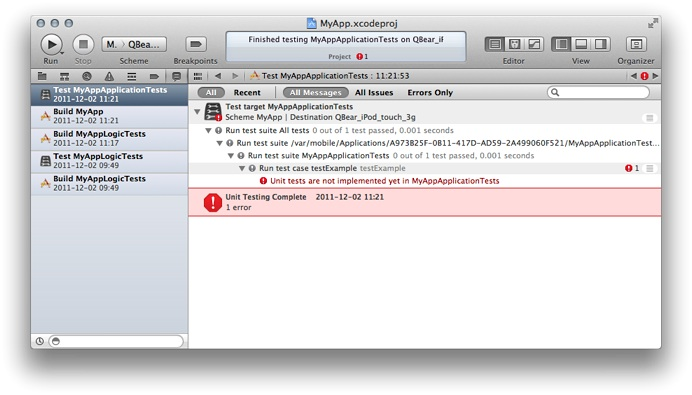

   The test-run log should look similar to Listing 2-2. The phrase “All tests” appears in the heading of the transcript; this indicates that the unit tests performed are application unit tests.

   __Listing 2-2__  Transcript of an iOS Simulator-based application unit-test run

```
Test Suite 'All tests' started at 2011-12-02 19:21:52 +0000 ```  ``` 
Test Suite '/var/mobile/Applications/A973B25F-0B11-417D-AD59-2A499060F521/
  MyAppApplicationTests.octest(Tests)' started at 2011-12-02 19:21:52 +0000
Test Suite 'MyAppApplicationTests' started at 2011-12-02 19:21:52 +0000
Test Case '-[MyAppApplicationTests testExample]' started.
/Users/ernest/Desktop/MyApp/MyAppApplicationTests/MyAppApplicationTests.m:29:
  error: -[MyAppApplicationTests testExample] : Unit tests are not implemented
  yet in MyAppApplicationTests
Test Case '-[MyAppApplicationTests testExample]' failed (0.001 seconds).
Test Suite 'MyAppApplicationTests' finished at 2011-12-02 19:21:52 +0000.
Executed 1 test, with 1 failure (0 unexpected) in 0.001 (0.002) seconds
Test Suite '/var/mobile/Applications/A973B25F-0B11-417D-AD59-2A499060F521/
  MyAppApplicationTests.octest(Tests)' finished at 2011-12-02 19:21:52 +0000.
Executed 1 test, with 1 failure (0 unexpected) in 0.001 (0.003) seconds
Test Suite 'All tests' finished at 2011-12-02 19:21:52 +0000. ```  ``` 
Executed 1 test, with 1 failure (0 unexpected) in 0.001 (0.012) seconds
```

Now that you have a correctly configured unit-test target that runs application unit tests, see [Writing Test Case Methods](Writing%20Test%20Case%20Methods.md#apple-f4xwc4dqnrsv64tfmyxwi33df52wszbpkridimbqgazdcnbtfvbuqnbnknltc) to learn how to add test cases to it.

[Next](Writing%20Test%20Case%20Methods.md)[Previous](Unit-Testing%20Overview.md)

