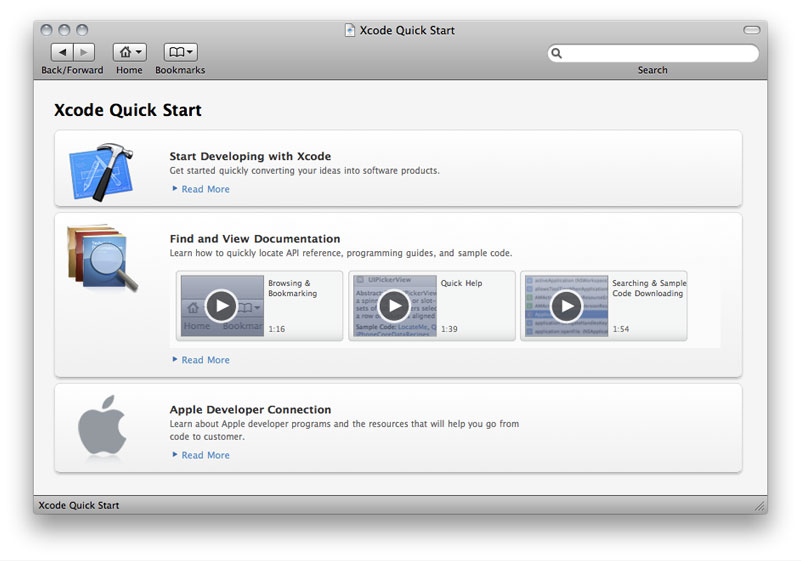
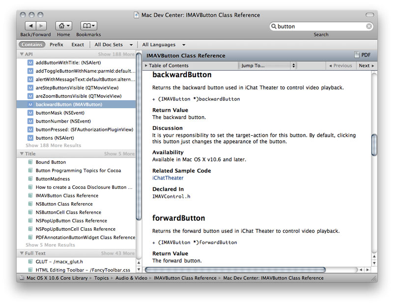
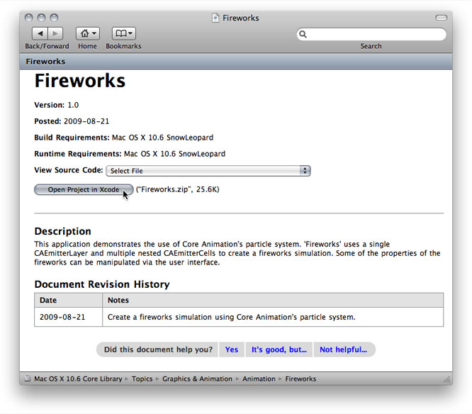

> 导航：[总目录](../../../README.md) · [documentation](../../../_indexes/documentation.md) · [Xcode Workspace Guide](Introduction.md)

[Next](Keyboard%20Shortcuts.md)[Previous](Refactoring%20Code.md)

# Documentation Access

Documentation is an important resource of the software development process. As you develop products with Xcode, you’re likely to use documentation to learn about Apple’s technologies, read about system frameworks, and look up API reference. The ADC Reference Library provides a comprehensive collection of documentation that includes these resource types:

- _Articles._ Introduce key Apple developer technologies, tools, and topics. These short, focused pieces offer a great way to learn what's new and useful on the Apple platforms.
- _Guides._ Provide conceptual and task-oriented information. They include overviews, tutorials, programming guides, server administration guides, and developer-tools user guides.
- _Reference documents._ Describe and define programming interfaces, file formats, scripting language terminology, and schemas.
- _Release notes._ Provide late-breaking news and highlights of new or changed features in the latest release.
- _Sample code._ Projects are buildable and executable source examples of how to accomplish a task for a specific Apple technology.
- _Technical notes._ Provide late breaking information about new Apple technologies and supplementary documentation discussing some of the more complex issues related to programming for the Mac OS.
- _Technical Q&As._ Provide succinct answers to common queries received at Apple Developer Technical Support.

In addition to the ADC Reference Library, you may also need to:

- Consult documentation provided by other vendors, for example, if you use a third-party framework to develop an application.
- Find symbol definitions in header files.
- Look through the man pages for the UNIX commands installed on your file system.

This chapter discusses the documentation-viewing features in Xcode and describes how to use them to access the variety of information available to you. It also provides details on updating and downloading documentation and performing documentation searches.

You can access and view developer documentation by using:

- Quick Help, which is a lightweight window that provides the reference documentation for a single symbol without taking the focus away from the window you are working in. See [Figure 6-1](#apple-f4xwc4dqnrsv64tfmyxwi33df52wszbpkridimbqga3dsmrqfvbuqmrwgawvgvzrgq).
- The Documentation window, which lets you browse and search items that are part of the ADC Reference Library as well as any third-party documentation you have installed. See [Using the Documentation Window](#apple-f4xwc4dqnrsv64tfmyxwi33df52wszbpkridimbqga3dsmrqfvbuqmrwgawvgvzsha).
- The Help menu search field initiates a search whose results you can view in the documentation viewer. The Help menu also provides commands for starting man page searches (see [Viewing Man Pages](#apple-f4xwc4dqnrsv64tfmyxwi33df52wszbpkridimbqga3dsmrqfvbuqmrwgawvgvzrg4)), opening a list of Xcode guides, and opening Quick Help.

In addition to developer documentation, you may find useful information by opening a symbol’s header file directly or examining the header files in a framework. The type of information you can find depends on where you start looking from from. Table 6-1 lists the four places from which you can look for information, the type of information you can find, and the action you need to take to find that kind of information.

__Table 6-1__  Search origins, information type, and instructions

| Search from the . . . | To find . . . | By doing this . . . |
| Documentation window | Apple Developer Reference library resources | Type a term in the Search field or use the browsers |
| Text editor | Reference documentation for a symbol  Symbol reference  Symbol declaration | Command Option double-click  Option double-click  Command double-click |
| Help menu | Apple Developer Reference library resources  Installed man pages | Type a term in the Search field  Choose “Open man pages” |
| Project window | Framework header files | Select the framework in the Groups & Files list |

Have you ever been writing code, or looking at someone else’s code, and you needed to know more about a particular symbol? Quick Help is designed just for this situation. It is a window that opens inline and contains the reference documentation for only one symbol. It provides an unobtrusive way to consult API reference without using the Documentation window. However, when you need to delve deeper into the reference, the Documentation window is just a click away. You can open Quick Help from within the Xcode text editor.

To open Quick Help:

1. Place the cursor in the symbol that you want to learn more about.
2. Press the option button at the same time you double-click the mouse.

You can also open Quick Help by choosing Help > Quick Help.

Figure 6-1 shows Quick Help with information for the `colorWithAlphaComponent:` method of the `NSColor` class.

__Figure 6-1__  Quick Help

!

The top portion always contains the following:

- The close button, which lets you manually close Quick Help.
- The name of the symbol you are looking up.
- Documentation button, which opens the reference document for this symbol in the Documentation window, were you can view additional details about this symbol as well as read about all the other symbols defined for this API.
- A button that opens the header file that defines this symbol.

The middle portion contains information about the symbol. Quick Help can display the following information (what you see depends on the type of symbol).

- A description of what the symbol does.
- The prototype or definition for the symbol.
- The parameter names and a short description for each.
- Related API for functions and methods, which displays other routines that accomplish a similar tasks.(not available for build settings).
- Related documents, which lists programming guides or other documents that describe how to use the symbol.
- Sample-code projects that use this symbol.
- Availability information. You can view per-architecture availability information by hovering the pointer over the availability statement.

Quick Help has two behaviors:

- __Transient.__ The default behavior is for Quick Help to provide information for one symbol and then close. The window appears inline, either just below or above the line that contains the symbol you Option–double-clicked. It stays open until you click or type in the editor, or until you click a button or link in Quick Help.
- __Persistent.__ If you move Quick Help it remains open until you click the close button or Option–double-click a symbol. Whenever you click a symbol, Quick Help displays information about that item. Persistent mode lets you explore a series of symbols without the need to Option–double-click each time.

The Documentation window lets you view HTML-based documents about Apple tools and technologies and search through developer documentation that includes API reference, programming guides, tutorials, technical articles, and sample code. You can also view third-party documentation. The window offers a number of features that help you get the most out of the documentation Apple provides.

To open the Documentation window, choose Help > Developer Documentation. The first time you open the Documentation window, it opens to the Xcode Quick Start page, shown in Figure 6-2.

__Figure 6-2__  The Xcode Quick Start page

The toolbar provides controls for:

- Navigating documents. There are standard controls for the previous and next, and a pop-up menu that lets you choose jump to the top page for each documentation set that’s available to you.
- [Using Bookmarks](#apple-f4xwc4dqnrsv64tfmyxwi33df52wszbpkridimbqga3dsmrqfvbuqmrwgawvgvzrgy)
- [Searching Documentation](#apple-f4xwc4dqnrsv64tfmyxwi33df52wszbpkridimbqga3dsmrqfvbuqmrwgawvgvzt).

The Documentation window is tailored specifically to access and display content from documentation sets. A _documentation set_ is a package of documents that provide information about a specific operating system, software development kit (SDK), technology, or toolset. The documentation sets provided by Xcode are published by Apple, but you can also view documentation sets provided by third parties. See [Subscribing to Documentation Feeds](#apple-f4xwc4dqnrsv64tfmyxwi33df52wszbpkridimbqga3dsmrqfvbuqmrwgawvgvzrha).

Bookmarks provide easy access to documentation that you use frequently. The Bookmarks menu in the toolbar lets you:

- Add a bookmark
- Choose a previously added bookmark
- Manage bookmarks. When you choose this item, a dialog appears that lets you rename, delete, or reorder your bookmarks.

Searching is often the fastest way to find documentation. The Documentation window provides a search field and a search bar for defining a documentation search, as shown in Figure 6-3.

__Figure 6-3__  Documentation-search results

You can control the search results you get by specifying:

- The term to search for. This is the text that must be present in the documents that make up the search results. See [Specifying the Search Term](#apple-f4xwc4dqnrsv64tfmyxwi33df52wszbpkridimbqga3dsmrqfvbuqmrwgawvgvzv).

  To start a search using the symbol selected in the text editor as the search term, Option-Command–double-click the symbol.
- The position of the search term in the result, which can be contains, prefix, or exact. See [Specifying the Position of the Search Term](#apple-f4xwc4dqnrsv64tfmyxwi33df52wszbpkridimbqga3dsmrqfvbuqmrwgawvgvzrge).
- The documentation sets in which Xcode searches for the search term, also called the search scope. The default is to search all documentation sets. See [Choosing Which Documentation Sets to Search](#apple-f4xwc4dqnrsv64tfmyxwi33df52wszbpkridimbqga3dsmrqfvbuqmrwgawvgvzz).
- The languages to search. You can choose any combination of available languages, including C, C++, and Objective-C. See [Choosing Which Languages to Search](#apple-f4xwc4dqnrsv64tfmyxwi33df52wszbpkridimbqga3dsmrqfvbuqmrwgawvgvzrgi).

Xcode always performs three types of searches simultaneously—API reference, title, and full-text. As soon as you start typing text in the search field, Xcode begins a search. The results appear in the search results pane.

You can sort the search results by symbol name, class name, and type using the search results shortcut menu.

A search term can be a word or phrase or may be an elaborate expression using Boolean operators (Table 6-2), required-terms operators ([Table 6-3](#apple-f4xwc4dqnrsv64tfmyxwi33df52wszbpkridimbqga3dsmrqfvbuqmrwgawvgvzrga)), and wildcard characters. The smallest unit at which search results are evaluated is a single HTML file; in Apple's developer documentation, this typically corresponds to a section in a chapter, a group of function descriptions, or a class. If your search term is too restrictive, you may not get any results at all.

__Table 6-2__  Boolean operators listed in order of precedence from highest to lowest

| Operator | Description |
| _()_ | logical grouping |
| _!_ | NOT |
| _&_ | AND |
| _|_ | OR |

For example, to find documents about the Fonts window that deal with underlining or coloring text, you want to find documents that contain the words fonts, window, underline, and color, with “underline” and “color” each grouped with “fonts” and “window.” You can do that with the following search term:

`(fonts window underline) | (fonts window color)`

Simpler than a Boolean search term, a required-terms search lets you search for terms that must or must not appear in documents returned as a search result.

__Table 6-3__  Operators that specify whether or not terms should appear in the results

| Required-terms operator | Description |
| _+_ | Indicates a term that must appear in any document returned |
| _-_ | Indicates a term that must NOT appear in any document returned |

For example, entering `+window` returns all documents containing the word “window,” similar to the behavior you get by simply entering “window” as a search term. However, if you enter `+window -dialog`, you will get all documents containing the word “window” but NOT the word “dialog.”

Using Boolean operators to construct the previous search term, you would write:

`window & (!dialog)`

If you are not sure exactly how a particular term appears in the documentation, you can use a wildcard search to include all variations of a search term in the search results. For example, if you are looking for all documentation about buttons in Mac OS X, you probably really want to see all documentation containing either the word “button” or the word “buttons.” Rather than have to specify each of these as separate terms, you can simply use the wildcard character to construct the following search term, which returns all documents containing the word “button” or any word with the prefix “button.”

`button*`

You can use the wildcard character anywhere within a search string. Using a wildcard character at a location other than at the end of a search term may result in longer search times.

To specify the position of the search term, click one of the following items in the search bar:

- __Contains.__ This is the default. Matches documents that have words that contain the words specified in the search term. For example, the search term `stringWith UTF` returns documents that contain words such as “_stringWith_Format” and “initWith_UTF_8String,” each document containing at least one word that contains the string “stringWith” and one word that contains the string “UTF”.
- __Prefix.__ Matches documents that contain words that begin with the words specified in the search term. For example, with the `NS CF` search term, the search result is made up of documents that contain words such as “_NS_Window” and “_CF_String,” each document containing at least one word that starts with the string “NS” and one word that starts with the string “CF”.
- __Exact.__ Matches documents that contain words that exactly match the words specified in the search term, each document containing all the words specified in the search term.

To specify which documentation sets to search, use the doc sets menu in the search bar. You can specify all doc sets or select one or more doc sets.

To specify which languages to search, select them in the languages menu in the search bar. The available languages are C, C++, JavaScript, and Objective-C.

The ADC Reference Library contains many sample-code projects that you can examine to learn how to use Apple technologies in your products. When you download sample-code projects, Xcode unarchives and opens those projects, getting you to the sample fast.

The Documentation preferences pane (shown in Figure 6-4) provides options for managing your documentation sets, customizing Quick Help, and setting the minimum font size used in the Documentation window.

__Figure 6-4__  Documentation preferences

!!

This pane is described in more detail in the sections that follow.

The Documentation Sets group in Documentation preferences lists, by publisher, the documentation sets that are:

- Installed (black text)
- Available but not installed (gray text)

The options that you can set to manage subscriptions and update documentation sets are listed in Table 6-4.

__Table 6-4__  Options that affect documentation subscriptions and updates

| Option | Description |
| Check for and install updates automatically | Gives Xcode permission to check for updates to the documentation. If Xcode finds an update, it immediately downloads that content for you. Xcode checks for updates daily and each time you launch Xcode. |
| Check and Install Now | Lets you manually check for updates to the documentation. If Xcode finds an update, it immediately downloads that content for you. |
| Add Documentation Set Publisher | Clicking this button opens a window that lets you provide a URL to an RSS documentation set feed. See [Subscribing to Documentation Feeds](#apple-f4xwc4dqnrsv64tfmyxwi33df52wszbpkridimbqga3dsmrqfvbuqmrwgawvgvzrha). |
| Get | This button appears next to documentation sets that are advertised by a published (like Apple), but that are not yet installed. Click Get to install that documentation set. |
| Subscribe | This button appears next to third-party documentation sets that you have installed but for which you have not yet subscribed. Not all third-party publishers offer subscriptions. |

A _documentation feed_ is an RSS-style web feed that Xcode can check periodically to determine when a publisher makes available updates to a documentation set or releases a new one. If you want Xcode to let you know when a publisher whose documentation sets you are interested in releases new content, subscribe to that publisher’s documentation feed.

When you have one or more documentation sets from a publisher already installed, you may see a Subscribe button next to the publisher’s name in the documentation-set list. Click the button if you want to stay updated with that publisher’s content.

When you don’t have any of a publisher’s documentation sets already installed on your computer, create a subscription by clicking the Add Documentation Set Publisher button. In the dialog that appears, enter the feed’s URL, which you obtain from the publisher.

When a new documentation set becomes available, it’s listed under the feed name with a Get button next to it. Click the button to download the documentation set.

You can customize what you see in Quick Help and the order of the content that appears.

To control which fields are displayed in Quick Help:

- Make sure there is a check mark only in the fields you want to see.

To change the order in which content appears in Quick Help:

- Drag the field names to the order you prefer.

To ensure that fonts always use a minimum size

- Select the option "Never use font sizes smaller than."
- Choose a font size from the pop-up menu.

Online manual (or "man") pages provide reference documentation for BSD and POSIX functions and tools, as well as command-line tools such as `xcodebuild`. You can find man pages in Xcode in either of the following ways:

- Type the name of the tool or function into the search field of the documentation window. Xcode includes the man page entries for standard C and C++ system calls in its API reference search results and includes all man page entries in its full-text search. Note that you must have C language searching enabled to find man pages for system calls.
- Choose __Help > Open man page__.

  Use the “man page name” option to display documentation on a command-line tool. You can optionally specify a man page section; for example, `access(5)`. Use the “search string” option to find commands that are related to a keyword.

[Next](Keyboard%20Shortcuts.md)[Previous](Refactoring%20Code.md)

