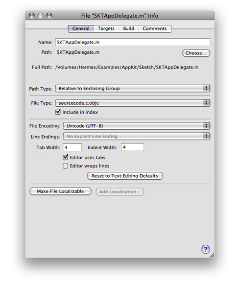

> 导航：[总目录](../../../README.md) · [documentation](../../../_indexes/documentation.md) · [Xcode Workspace Guide](Introduction.md)


[Next](The%20Text%20Editor.md)[Previous](Project%20Organization.md)

# File Management

For each file, framework, and folder added to a project, Xcode stores a number of important details, such as the path to the file and the file’s type. You can view and edit information for file, framework, and folder references in the File Info window.

This chapter describes how to create files and edit file, folder, and framework references in a project. It also describes how to change the way in which Xcode handles a file by changing its type and how to control the way a file is displayed and saved by changing the file encoding and line ending.

As you develop software, you will often need to create files. You can create standalone files or files that are to be part of a project. Xcode provides file templates for several kinds of file, including source files, nib files, and iPhone Settings schema files. If you have projects open when you create a file, Xcode adds the newly created file to the current project, unless you specify a different project.

To create a file and add it to a project:

1. In the Groups & Files list of the project you want to add file to, select the static group into which you want the file to be added. This step is optional (you can move files between static groups by dragging them, as described in [Adding Files to a Group](Project%20Organization.md#apple-f4xwc4dqnrsv64tfmyxwi33df52wszbpkridimbqgazdmnrxfvkfawcsivddcmbw)).
2. Choose File > New File and choose the template from which you want to create the file in the New File dialog.
3. Specify a filename and a location for the file. If you’re adding a C-based source file, you have to option of creating the corresponding header file.
4. Select the targets you want the file to be a member of. To learn more about adding files to targets, see [Targets](https://developer.apple.com/library/archive/documentation/DeveloperTools/Conceptual/XcodeBuildSystem/100-Targets/bs_targets.html#//apple_ref/doc/uid/TP40002689).

To learn more about how Xcode manages files in projects, see [Files in Projects](https://developer.apple.com/library/archive/documentation/DeveloperTools/Conceptual/XcodeProjectManagement/130-Files_in_Projects/project_files.html#//apple_ref/doc/uid/TP40002666).

Xcode offers several ways to open files, depending on your current context. The following sections describe these mechanisms.

If you already have a project window open, you can open a file by selecting it in the Groups & Files list in that window. If you have the text editor pane open inside the project window, clicking the filename opens the file in the editor. Otherwise, double-clicking the file in the Groups & Files list opens the file in a separate editor window.

If a filename is in red, Xcode cannot find the file. Set the correct path to the file in the File Info window.

If you have the text editor open and you have previously opened the file you want to open, you can choose the file from the File History pop-up menu in the navigation bar (see [Navigation Bar](The%20Text%20Editor.md#apple-f4xwc4dqnrsv64tfmyxwi33df52wszbpkridimbqgazdmnzzfvjvomy) for more information).

You can quickly open a header or source file that’s related to the file displayed in the text editor.

To open the related header for an implementation file open in the editor, and vice versa, choose View > Switch to Header/Source File.

For example, if `main.c` is in the editor, this command opens `main.h`; if `main.h` is in the editor, it opens `main.c`.

You can also view the current file’s include group (all the files that the file includes, as well as all the files that include it). To view the list of files that the file in the editor includes and that include this file, use the Included Files pop-up menu, , in the navigation bar of the text editor. The name of the current file is in the middle of the menu. Above it are the names of the files that this file includes. Below it are the names of the files that include this file. To open one of the files, choose it from the menu.

Similar to opening header files, you can open the declarations of superclasses and subclasses in C and Objective-C source files using the Class Hierarchy pop-up menu, , in the navigation bar.

There may be times when you need to open a file whose location you don’t know or want to open the file that defines a particular symbol, such as a variable, method, or class. To assist you in those occasions, Xcode provides the _Open Quickly_ command, which lets you open files by filename or by the symbols they define. Open Quickly searches are case insensitive and limited to the current project and the active SDK (see [Building with Xcode](../Xcode%20Project%20Management%20Guide/Building%20Products.md#apple-f4xwc4dqnrsv64tfmyxwi33df52wszbpkridimbqgazdmojtfvjvomrq) for more information).

To open a file quickly:

1. Choose File > Open Quickly to display the Open Quickly dialog (Figure 3-1).
2. In the search field, type the name of the file or symbol you want to view.

   You can also select a filename or symbol name in the text editor and display the Open Quickly dialog to prefill the dialog’s search field with the selected text. When opening header files referenced in `#include` and `#import` statements, you need only to place the cursor on the referent line and display the Open Quickly dialog to start the header-file search.
3. From the search results list, select the files you want to open and click Open.

__Figure 3-1__  The Open Quickly dialog

!

As you type text in the search field, Xcode updates the search results list. The search field also maintains a list of previously used search terms.

In filename-based searches, Xcode searches for header files, implementation files, model files, nib files, plist files, and project packages. In symbol name–based searches, it searches source-code files only.

You can temporarily change how a file is viewed and edited, or permanently change how files of a certain type are viewed and edited. For example, you can choose to view a particular HTML file as plain text, so you can edit it instead of viewing it as rendered HTML. To specify how a file is viewed, you can do any of the following:

- To have files of a certain type always open in a specific editor, change the preferred editor for that file type to that editor. (See [Specifying the Editor Type for a File Type](#apple-f4xwc4dqnrsv64tfmyxwi33df52wszbpkridimbqgazdmnzxfvjvomjv).)
- To have files of a certain type always open in the application specified for them in the Finder, change the preferred editor for that file type to Open With Finder. (See [Opening Files with Your Preferred Application](#apple-f4xwc4dqnrsv64tfmyxwi33df52wszbpkridimbqgazdmnzxfvjvomjz).)
- To temporarily force Xcode to treat a file as a different file type, and open it with the appropriate editor, use the Open As command in the file’s shortcut menu (Control-click).
- To temporarily force Xcode to open a file with the default application chosen for it in the Finder, use the Open With Finder command in the file’s shortcut menu.

You can permanently change how Xcode edits a particular type of file. In particular, you can specify how files of a certain type are treated, and you can choose which editor Xcode uses to handle those files. For example, you can choose to edit all your source files in BBEdit.

These are the main editor types in Xcode:

- __Source Code File.__ The Xcode text editor lets you view and edit these files.
- __Plain Text File.__ The Xcode text editor lets you view and edit these files.
- __External Editor.__ These files are opened with an external text editor. See [Opening Files with an External Editor](#apple-f4xwc4dqnrsv64tfmyxwi33df52wszbpkridimbqgazdmnzxfvjvomjx) for details.
- __Open With Finder.__ These files are opened with the application the Finder associates with them. See [Opening Files with Your Preferred Application](#apple-f4xwc4dqnrsv64tfmyxwi33df52wszbpkridimbqgazdmnzxfvjvomjz) for details.

File Types preferences lists all the folder and file types that Xcode handles and the editor type for each of those types. These file and folder types are organized into groups, from the most general to the most specific. The Preferred Editor column shows the editor type to which each file type is associated.

To change the editor type for a particular file type, choose the the editor type from the Preferred Editor pop-up menu of the file type. For example, to make Xcode let you edit HTML files—except documentation—in the text editor as source code, choose Source Code File from the Preferred Editor pop-up menu for the `file/text/text.html` file type, as shown in Figure 3-2.

__Figure 3-2__  File Types preferences pane

!

File type entries are organized into groups, from most general to most specific. For example, the `audio.mp3` and `audio.aiff` file types belong to the “audio” group, which belongs to the “file” group. In this way, you can control the default editor used for an entire class of files. To see the file types in a group, click the disclosure triangle next to that group.

You can also specify an external editor to use or have Xcode use the user’s preferred application, as specified by the Finder, when opening files of a given type, as described in [Opening Files with an External Editor](#apple-f4xwc4dqnrsv64tfmyxwi33df52wszbpkridimbqgazdmnzxfvjvomjx) and [Opening Files with Your Preferred Application](#apple-f4xwc4dqnrsv64tfmyxwi33df52wszbpkridimbqgazdmnzxfvjvomjz).

Xcode does not limit you to using its text editor to view and edit your files. You can specify an external editor as the preferred editor for opening files of a given type. To choose an external editor for all files of a particular type:

1. Open Xcode preferences and go to the File Types pane.
2. Find the appropriate file type and click in the Preferred Editor column; a menu appears.
3. Choose an option from the External Editor submenu.

   These are the supported external editors:

   - BBEdit
   - Text Wrangler
   - SubEthaEdit
   - `emacs`
   - `xemacs`
   - `vi`

For example, to edit all your source files with BBEdit, choose External Editor > BBEdit from the Preferred Editor pop-up menu for the `file/text/sourcecode` file type.

There are some restrictions when using an external editor:

- When you build a project, Xcode lists modified files and asks whether you want to save them. Files in BBEdit and Text Wrangler are listed, but files in other editors are not. You need to save those files yourself before starting a build.
- When you double-click a find result or a build error, most editors do not scroll to the line with the find result or error. BBEdit and Text Wrangler can.

To use `emacs` as an external editor, you must add these lines to your `~/.emacs` file:

```
(autoload 'gnuserv-start "gnuserv-compat"
          "Allow this Emacs process to be a server for client processes." t)
(gnuserv-start)
```

Xcode defines the `PBXEmacsPath` and `PBXXEmacsPath` user defaults for specifying paths to the `emacs` and `xemacs` editors, respectively. By default, these paths are set to `/usr/bin/emacs` and `/usr/bin/xemacs`; however, you can change them to use a custom built editor. For more information, see _Xcode User Default Reference_.

You can choose to open a file with the application chosen for it in the Finder. This lets you open files that Xcode cannot handle, or view a file using your preferred file editor. If you edit a file in almost any other application, Xcode cannot save it for you before building a target. Some applications, such as Interface Builder and BBEdit, communicate with Xcode and so can save your files before your project is built. Check the application’s documentation to find out whether it can, too.

To always have Xcode use your preferred application to open files of a certain type, find the appropriate file type in File Types preferences and choose Open With Finder from its Preferred Editor menu.

Note that you can set this preference only for file types that Xcode recognizes. To open files that Xcode cannot handle, or to temporarily override the settings in the File Types preferences pane and open a file using the Finder-specified application: In the Groups & Files list or detail view, choose Open With Finder from the file’s shortcut menu.

If you have the text editor pane of a window (such as the project window) open, selecting a file still loads the file in the editor. But if you configure Xcode to use an external editor to edit the file, you cannot edit the file within Xcode. That is, the file is read-only in the Xcode text editor.

Xcode indicates which files you’ve modified by highlighting their icons in gray in the Groups & Files list, the detail view, and the File History pop-up menu. You can save your changes in a number of ways:

- To save changes to the current file, choose File > Save.
- To save a copy of a file, choose File > Save As. Xcode saves a copy of the file under the name you specify. If the file is part of your project, Xcode also changes the file reference in your project to refer to the copy.
- To make a backup of a file, hold the Option key and choose File > Save a Copy As. Xcode saves a copy of the file under the name you specify, but does not modify the file reference in your project, if one exists.
- To save all open files, hold Option and choose File > Save All.

Xcode can also be configured to automatically save all changed files before beginning a build. To specify whether files are saved automatically when you build a target:

1. Choose Xcode > Preferences and click Building.
2. Use the For Unsaved Files menu, to choose the behavior you want.

If you don’t have write permission for a file, Xcode warns you when you try to edit it. You can choose to edit such files, but you can save your changes only if you have write permission for the containing folder. In this case, you can choose whether Xcode changes the file’s permissions to make it writable.

To have Xcode change the file’s permissions, select the “Save files as writable” option in Text Editing preferences. Otherwise, Xcode preserves the file’s current permissions.

Files in a project remain open until you explicitly close the file or close the project. To close the current file in a text editor, choose File > Close File.

To remove a file from a project and, optionally, to delete it from your file system, select the file in the Groups & Files list or the detail view and choose Edit > Delete.

You can view and edit settings for files, frameworks, and directories using the File Info window. To display the File Info window, select the item to edit and choose File > Get Info.

If you select more than one file, Xcode displays one File Info window that applies to all the selected files. Attributes whose values are not the same for all selected files are dimmed. Changing an attribute’s value applies that change to all selected files.

The File Info window for a file, folder, framework, or static group contains the following panes, shown in Figure 3-3:

- __General.__ Lets you modify a number of main file attributes, such as filename, location, reference style, and character encoding.
- __Targets.__ Lets you view and change which targets include the file.
- __Build.__ Lets you specify additional compiler flags for the file. The Build pane appears only when the file being inspected is a source code file.
- __SCM.__ Lets you view SCM information for the file. This pane is available only for files under source control.
- __Comments.__ Lets you add notes, documentation, or other information about the file. See [Adding Comments to Project Items](Project%20Organization.md#apple-f4xwc4dqnrsv64tfmyxwi33df52wszbpkridimbqgazdmnrxfvbegskjivcugqy) for more information on adding comments.

__Figure 3-3__  The File Info window



Here is what you can see and edit in the General pane of the File Info window:

- __Name field.__ Displays the file’s name. To rename the file, type the new name in this field.
- __Path field.__ Shows the location of the file; that is, it shows the path to the file. To change this location, click the Choose button next to the path. You get a dialog that lets you choose a new path.
- __Path Type pop-up menu.__ Indicates the reference style used for the file. These reference styles are described in How Files Are Referenced. To change the way the file is referenced, choose a style from this menu.
- __File Type pop-up menu.__ Lets you explicitly set the file’s type, overriding the actual file type of the file. How to change a file’s type is described in [Overriding a File’s Type](#apple-f4xwc4dqnrsv64tfmyxwi33df52wszbpkridimbqgazdmnzxfvbuuqsjjjdueqi).
- __“Include in index” checkbox.__ Controls whether Xcode includes the file when it creates the project’s symbolic index. See Source Code Indexing for more information.
- __File Encoding pop-up menu.__ Specifies the character set used to save and display the file. File encodings are discussed further in [Choosing File Encodings](#apple-f4xwc4dqnrsv64tfmyxwi33df52wszbpkridimbqgazdmnzxfvbecqshjbbuqra).
- __Line Endings pop-up menu.__ Specifies the type of line ending used in the file. Line endings are discussed in [Changing Line Endings](#apple-f4xwc4dqnrsv64tfmyxwi33df52wszbpkridimbqgazdmnzxfvbegskfifbegsi).
- The next several options control tab and indent settings for the individual file. The Tab Width and Indent Width fields control the number of spaces that Xcode inserts when it indents your code or when you press the Tab key when you edit the file in the text editor. To change either of these values, type directly in the field.

  __“Editor uses tabs” option.__ Specifies whether pressing the Tab key inserts spaces or a tab when you are editing this file in the text editor. Controlling indentation in the editor is discussed further in [Tab and Indent Layout Options](The%20Text%20Editor.md#apple-f4xwc4dqnrsv64tfmyxwi33df52wszbpkridimbqgazdmnzzfvbegskdi5begsi).

  __“Editor wraps lines” option.__ Specifies whether the text editor wraps lines that are too long to fit in the window.

  __Reset to Text Editing Defaults button.__ Restores the line ending, file encoding, tab and indent settings to the built-in defaults.
- __Make File Localizable and Add Localization buttons.__ Let you customize files for different regions.

The file encoding of a file defines the character set that Xcode uses to display and save a file. If you type a character that isn’t in the file’s encoding, Xcode asks whether you want to change the encoding. Xcode uses the default single-byte string encoding or Unicode if the file contains double-byte characters.

To change the file encoding for one or more files:

1. Select the files and open a File Info window.
2. In the General pane, choose the desired file encoding from the File Encoding pop-up menu.

   Generally Unicode (UTF-8) is best for source files and Unicode (UTF-16) is best for `.strings` files.

When Xcode next saves the file, it uses the new file encoding.

To choose the default file encoding for new files, use the Default File Encoding pop-up menu in Text Editing preferences.

UNIX, Windows, and Mac OS X use different characters to denote the end of a line in a text file. Xcode can open text files that use any of these line endings. By default, it preserves line endings when it saves text files. However, other utilities and text editors may require that a text file use specific line-ending characters. You can change the type of line endings that Xcode uses for a single file, or you can change the default line ending style that Xcode uses for new or existing files.

To change an individual file’s line endings, select the file in the project window and open its File Info window. In the General pane of the info window, use the Line Endings pop-up menu to choose Unix Line Endings (LF), Classic Mac Line Endings (CR), or Windows Line Endings (CRLF).

To choose the default line endings used for all files, display the Text Editing preferences pane, and choose Unix (LF), Mac (CR), or Windows (CRLF) from the Line Encodings pop-up menus:

- __For new files.__ Lets you choose the default line encoding that Xcode uses for all new files.
- __For existing files.__ Specifies the type of line encoding that Xcode uses when saving existing files that you have opened for editing in Xcode. To have Xcode preserve line endings for existing files, choose Preserve from this menu; this is the default value for the menu.

Generally, you don’t need to worry about line endings. If you find that you must change line endings from the defaults assigned by Xcode, keep these guidelines in mind when deciding which line endings to use:

- Most Mac OS X development applications, including CodeWarrior and BBEdit, can handle files that use UNIX, Mac OS, or Windows line endings.
- Many UNIX command-line utilities, such as `grep` and `awk`, can handle only files with UNIX line endings.

By default, Xcode uses the type stored for a file in the file system to determine how to handle that file. A file’s type affects which text editor Xcode opens the file in (the internal editor or an external one), how the file is processed when you build a target that includes the file, and how Xcode formats the file when syntax formatting is turned on. You can change the way that Xcode handles a file by overriding the file’s type.

The File Type pop-up menu in the General pane of the File Info window lets you explicitly set the file’s type, overriding the actual file type of the file. The File Type menu lists all the file types that Xcode is aware of; to set a file’s type, choose it from this menu. Choosing Default For File discards any explicit file type set for the file in Xcode and reverts to using the type stored for the file in the file system.

For more information on how Xcode determines how to process files of a certain type, see Build Rules and Adding Files to a Build Phase. For more information on how Xcode chooses the editor to use for files of a certain type, see [Specifying How Files Are Opened](#apple-f4xwc4dqnrsv64tfmyxwi33df52wszbpkridimbqgazdmnzxfvjvomjt).

[Next](The%20Text%20Editor.md)[Previous](Project%20Organization.md)

