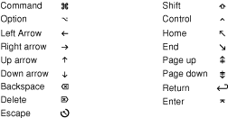

> 导航：[总目录](../../../README.md) · [documentation](../../../_indexes/documentation.md) · [Xcode Workspace Guide](Introduction.md)

[Next](User%20Scripts.md)[Previous](Documentation%20Access.md)

# Keyboard Shortcuts

Xcode lets you change the keyboard shortcuts for actions accessible through menu items or the keyboard, such as paging through a document or moving the cursor. You can choose a predefined set of keyboard shortcuts for menu items and other tasks, or you can create your own set. The predefined sets include sets that mimic BBEdit, Metrowerks, CodeWarrior, and MPW.

This chapter shows how to view and change the keyboard shortcuts for menu items and key-based actions.

The Key Bindings pane in Xcode preferences (Figure 7-1) lets you see and customize the list of Xcode commands and their keyboard shortcuts.

__Figure 7-1__  Key Bindings preferences

!

Here is what the pane contains:

- __Key Bindings Sets menu.__ This menu lets you choose which set of key bindings are in effect. Xcode provides four predefined sets: Xcode Default, BBEdit Compatible, Metrowerks Compatible, and MPW Compatible. You can also add your own custom sets of key bindings.
- __Duplicate button.__ You cannot edit any of the built-in key bindings sets. To create your own set of custom key bindings, click this button to create a copy of the current set and edit that copy.
- __Delete button.__ This button deletes a custom key binding set.
- __Menu Key Bindings pane.__ This pane lists the key bindings for menu items in Xcode. See [Customizing Keyboard Shortcuts for Menu Items](#apple-f4xwc4dqnrsv64tfmyxwi33df52wszbpkridimbqgazdombwfvbeeq2jijeumrq) for details.
- __Text Key Bindings pane.__ This pane lists the key bindings for text editing actions in Xcode’s editor. See [Customizing Keyboard Shortcuts for Other Tasks](#apple-f4xwc4dqnrsv64tfmyxwi33df52wszbpkridimbqgazdombwfvbeeq2fjjcueqy) for details.
- __Action/key list.__ The Menu Key Bindings and the Text Key Bindings pane contain an action/key list, which list the actions available in Xcode and their corresponding keyboard shortcuts. The Action column lists the Xcode action—a menu item or text editing command—and the Key column lists the keyboard shortcut for that action. To edit the key binding for a command, double-click in the Key column and type the key combination. You can assign more than one keyboard shortcut to an action. To add additional key combinations, click the plus (+) button.

The Menu Key Bindings pane in Key Bindings preferences (shown in [Figure 7-1](#apple-f4xwc4dqnrsv64tfmyxwi33df52wszbpkridimbqgazdombwfvjvomi)) provides access to most of the menus and menu items in Xcode.

Xcode lists keyboard shortcuts using the traditional menu glyphs shown in Figure 7-2 (not all glyphs are shown).

__Figure 7-2__  Some of the glyphs that represent keys

The following steps describe how to create a custom set of key bindings, based on the Xcode Default set, and how to add a keyboard shortcut. In this example, the keyboard shortcut performs a full-text documentation search.

1. Open Key Bindings preferences.
2. From the Key Binding Sets menu, choose “Xcode Default.”
3. Click the Duplicate button to create a copy of that set. When prompted for a name for the set, type `My Set`.
4. Click Menu Key Bindings.
5. In the Action list, scroll to Help and open that section.
6. Double-click in the Key column in the Find Selected Text in Documentation row to open an editing field, then press Shift-Command-T (holding the keys down simultaneously). The result is shown in Figure 7-3.

   If you try to assign a keyboard shortcut that is already assigned to another action in the current key binding set, Xcode displays a message indicating which action it is assigned to below the key bindings table.

   Note that Xcode displays the letter “t” in its capitalized form. Whether or not you include the Shift key as part of a menu keyboard shortcut, Xcode shows letters as they appear in menus (that is, as capitals).

   You can use the minus (-) button to clear a menu keyboard shortcut. You can use the plus (+) button to assign multiple shortcuts to a single action (and you can use any of the shortcuts to initiate the action).

   __Figure 7-3__  Editing a keyboard shortcut for a menu item

   !
7. You can repeat the previous step to add or change other menu keyboard shortcuts.
8. Click Apply or OK to apply your changes.
9. You can now press Shift-Command-T to perform a full-text search of the documentation for the selected text.

You can customize keyboard shortcuts for tasks such as editing and formatting text, cursor movement, and project navigation using steps similar to those described for menu items in [Customizing Keyboard Shortcuts for Menu Items](#apple-f4xwc4dqnrsv64tfmyxwi33df52wszbpkridimbqgazdombwfvbeeq2jijeumrq). In addition to its default settings, Xcode provides sets that are compatible with BBEdit, Metrowerks CodeWarrior, and MPW.

The following steps show how to set a shortcut for the Capitalize Word action:

1. Open Key Bindings preferences.
2. From the Key Binding Sets menu, choose My Set.

   If My Set is not available, create it as described [Customizing Keyboard Shortcuts for Menu Items](#apple-f4xwc4dqnrsv64tfmyxwi33df52wszbpkridimbqgazdombwfvbeeq2jijeumrq)).
3. Click Text Key Bindings.
4. Double-click in the Keys column in the Capitalize Word row to open an editing field, then press Shift-Control-C (holding the keys down simultaneously). The result is shown in Figure 7-4.

   __Figure 7-4__  Editing a keyboard shortcut for an editing action

   !

   You can use the minus (-) button to clear a keyboard shortcut. You can use the plus (+) button to assign multiple shortcuts to a single action (and you can use any of the shortcuts to initiate the action).
5. You can repeat step 4 to add or change other keyboard shortcuts for editing actions (or other actions not shown here).
6. Click Apply or OK to apply your changes.

You can now press Shift-Control-C to capitalize the currently selected word in an editable text control.

[Next](User%20Scripts.md)[Previous](Documentation%20Access.md)

