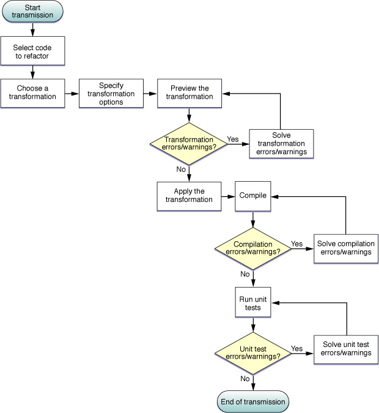

> 导航：[总目录](../../../README.md) · [documentation](../../../_indexes/documentation.md) · [Xcode Workspace Guide](Introduction.md)


[Next](Documentation%20Access.md)[Previous](The%20Text%20Editor.md)

# Refactoring Code

As programmers develop and maintain a software product, despite their best efforts, the changes they make may degrade the quality of the product’s source code. Good-quality source code is easy to understand and allows programmers to get up to date on a project in a short time. In such a project, for example, classes have well-defined responsibilities; they do few things and do them well, Bad-quality source code is hard to understand. The classes in such a project may have several areas of responsibility, making it hard to decide where to add code to implement a new feature.

Projects with good-quality source code tend to lose their quality as they are changed. For example, fixing a set of problems in a product in time to meet a deadline may require making hastily conceived changes that may make the product’s source code harder to understand for people not familiar with the product. New team members, and even the developers who made changes to the source code in the past, may have trouble understanding that same source code as a whole or its individual components at a later date because the purpose of classes and methods is not obvious or clear.

To address this problem, developers use a quality-improvement process called “refactoring.” In short, refactoring makes code easier to understand and maintain without changing the behavior of the product.

This chapter shows how to perform refactoring operations using Xcode. It does not teach you refactoring.

To learn about refactoring, you should consult the books that cover this topic in depth. One such book is _Refactoring: Improving the Design of Existing Code_, by Martin Fowler. This book provides in-depth discussions about the refactoring process and describes refactorings that solve common problems in source code that make it hard to understand

Refactoring allows you to improve the readability of a product’s source code while retaining its functionality and behavior. The refactoring operations that modify source code are called _refactorings_ or _transformations_.

Programmers perform refactoring operations all the time, without thinking about it. Every time you rename a variable so that it reflects its purpose clearly (for example, changing `i` to `item_index` in loop), you are refactoring code. However, more intricate refactoring operations may require many more steps, such as moving the implementation of a feature from a superclass to the subclass that is actually responsible for that aspect of the product.

These changes, while making it easier for programmers to understand a product’s source code, do no change the functionality or behavior of the code. But they make it easier to make functional improvements or to add features because programmers spend less time determining where to make the necessary changes. They can hit the ground running, so to speak.

In Xcode 2, programmers use Search and Replace, and Copy and Paste commands to carry out such refactoring operations. Performing a single operation with these tools requires careful planning. You must:

1. Identify all the files that need to be modified
2. Delineate the changes needed on each file
3. Make the changes
4. Make sure the changes don’t affect the behavior of the product

Xcode performs the mundane, low-level refactoring steps for you, allowing you to focus on the high-level implications of a refactoring operation, such as whether it actually helps to make the code easier to understand.

The refactoring transformations Xcode performs work in C and Objective-C source code, and Cocoa-based projects, which may use key-value coding (KVC), Core Data model files, nib files, and so on. Therefore, in addition to source code files, Xcode can transform nib files, key-value methods, and Core Data properties.

A refactoring is a change in source code. As such, you must ensure that the modified code works as expected before and after a transformation. Using snapshots, Xcode lets you revert one or more refactorings. (A _snapshot_ is a copy of your entire project saved on your file system, so that you can undo changes across several files in a project.) This capability allows you to experiment freely with refactorings; you can make a refactoring and determine whether it really improves the readability of the code. If it doesn’t, you can back-out the changes and try another approach.

As part of your refactoring workflow, you should develop unit tests for code you plan to refactor. Unit tests provide a way to ensure that code behaves as it was designed to behave. Running these tests before and after a refactoring lets you verify that the transformation doesn’t change the behavior of the modified code.

The following sections show how you can use Xcode to perform some of the refactorings described in Fowler’s book and other Xcode-specific transformations.

Figure 5-1 illustrates the refactoring workflow in Xcode.

__Figure 5-1__  Xcode refactoring workflow



These are the steps of a refactoring:

1. Select the code to transform, which identifies the _transformation item_.

   The selected code can be located in any source file that’s part of the current project. The selected codelines, including code fragments, always identify only one transformation item. The _transformation item_ is either the name of a symbol or a code fragment:

   - __Symbol name.__ The transformation affects the header and implementation files that declare and define the item, and other files that directly access the item, including nib and Core Data–model files.
   - __Code fragment.__ The transformation affects the scope containing the codelines (within a single file).
2. Choose a transformation.

   For transformations that operate on a single transformation item, choose Edit > Refactor.

   and choose a transformation from the transformation pop-up menu in the Refactoring window.
3. Define the transformation.

   You define the transformation in the Refactoring window, which contains:

   - The transformation menu
   - Transformation specifiers (vary according to the transformation)
   - Transformation options (vary according to the transformation)
   - Transformation editor pane
4. Preview/modify the transformation.

   In the transformation editor you can choose which changes to include in the transformation. Xcode selects all changes it deems necessary for the transformation.
5. Apply the transformation.

   To ensure that you can revert the transformation if it doesn’t prove beneficial, make sure the Snapshot option is selected before clicking Apply.
6. Compile the source code.

   Some transformations require that you perform additional work outside the transformation editor to complete them. You can use compilation errors and warning to determine the fixes you need to make.
7. Test the code.

   If you created unit tests for the code involved in the transformation, run them to ensure the transformed code behaves as expected.

   If there are problems, you can revert the transformation in the Snapshots window (if the Snapshot option was selected when you applied the transformation).

Xcode performs transformation operations (refactorings) within the current project; it doesn’t perform transformations across project references.

The following sections describe each of the refactorings Xcode helps you perform.

The _Rename transformation_ renames the transformation item throughout the project files.

This transformation contains the following specifiers and options:

- __New Name.__ The new name for the transformation item.
- __Rename related KVC/Core Data Members.__ Specifies whether to change related KVC methods and Core Data properties.
- __Rename Related Files.__ Available when the transformation item is declared in a header file named after the transformation item, and defined in the corresponding implementation file.

The project elements this transformation modifies include:

- The transformation item’s declaration/definition
- Related KVC methods and Core Data properties, when indicated
- The names of the header and implementation files that define the item and the corresponding import/include statements in files that use the item, when indicated
- Code that directly references the transformation item

Listing 5-1 and Listing 5-2 show an example of a rename transformation.

__Listing 5-1__  Renaming an index variable in a `for` loop (before)

```objc
- (int) myMethod {
   int j = 1;
   int i;
   i = 5;
   if (j == 1) {
      int i; ```  ``` 
      for (i = 0; i < 10; i++) { ```  ``` 
         printf("Item index: %i\n", i); ```  ``` 
         ...
      }
   }
   return i;
}
```


__Listing 5-2__  Renaming an index variable in a `for` loop (after)

```objc
- (int) myMethod {
   int j = 1;
   int i;
   i = 5;
   if (j == 1) {
      int item_index; ```  ``` 
      for (item_index = 0; item_index < 10; item_index++) { ```  ``` 
         printf("Item index: %i\n", item_index); ```  ``` 
         ...
      }
   }
   return i;
}
```


The _Extract transformation_ creates a function or method with the selected code as its body.

Xcode analyzes the context of the selected code and the variables it uses to determine the generated routine’s parameters and return value.

This transformation contains the following specifiers:

- __Extracted Routine Name.__ The name of the function or method, including parameter names and types and return-value type, which you can customize according to your preferences.
- __Extract To.__ The type of routine to which the selected code is to be extracted: a method or a function.

The _Encapsulate transformation_ creates accessors for the transformation item, reduces its visibility, and changes code that directly accesses the item to use the accessors instead.

This transformation contains the following specifiers:

- _Getter._ The method to use to get the value of the transformation item.
- _Setter._ The method to use to set the value of the transformation item.

The _Create Superclass transformation_ creates a superclass for the selected class.

This transformation contains the following specifiers:

- __Superclass Name.__ The name of the new superclass for the selected class.
- __Declaration and Definition Location.__ You can choose between placing the new class’s declaration and definition in:

  - The the same header and implementation files where the selected class is declared/defined
  - New header and implementation files

To complete the transformation, you may need to correct the import/include statements of the source files that declare/define the selected class and the new header/implementation files.

The _Move Up transformation_ moves the declaration and definition of the transformation item to the superclass of the class that declares and defines the item.

This transformation contains the following option:

- __Move Up Related Methods.__ Specifies whether to move methods that directly access the transformation item—and are declared/defined in the class that defines the item—to the superclass, too.

The _Move Down transformation_ moves the declaration and definition of the transformation item to one or more of the subclasses of the class that declares/defines the item.

This transformation contains the following specifier:

- __Subclasses to Move the Item To.__ List of classes to which the transformation item is moved.

The _Modernize Loop transformation_ modifies the selected loop to use the less verbose and more efficient Objective-C 2.0 `for` loop.

This transformation operates only on a loop that meets the following requirements:

- The loop iterates over all the elements of a collection: an `NSArray` or `NSSet` object.
- The loop accesses each item in the collection in sequential order, starting at the first item.
- Each of the loop’s iterations processes only one item of the collection at a time; it doesn’t access any preceding or succeeding items.

These are additional restrictions on `for` loops:

- The loop iterates over the elements of an `NSArray` object.
- The loop uses a variable as the index into the collection, and this variable goes from `0` to `[<collection> count] - 1`.
- The loop gets the current element with `[<collection> objectAtIndex:<index>]` and, either saves it once into an element variable that’s accessed in the rest of the loop’s body, or uses this expression to retrieve the current element throughout the loop’s body.

These are additional restrictions on `while` loops:

- The loop uses an NSEnumerator object to iterate over the collection.
- The loop gets the current element with `[<enumerator> nextObject]` and exits when the current element is `nil`.
- The loop does not change the loop control variables.
- The loop’s containing code does not access the loop’s control variables.

Listing 5-3 and Listing 5-4 show a Modernize Loop transformation on a `for` loop.

__Listing 5-3__  Modernizing a `for` loop (before)

```
{  NSArray *array = ...;
   NSObject *object = ...;
   int index;
   int array_count = [array count];
   for (index = 0; index < array_count; index++) { ```  ``` 
      [object someMethod:[array objectAtIndex:index]]; ```  ``` 
      NSLog(@"%@, [array, objectAtIndex:index]); ```  ``` 
   }
}
```


__Listing 5-4__  Modernizing a `for` loop (after)

```
{  NSArray *array = ...;
   NSObject *object = ...;
   for (foo in array) { ```  ``` 
      [object someMethod:foo]; ```  ``` 
      NSLog(@"%@, foo]); ```  ``` 
   }
}
```

Listing 5-5 and Listing 5-6 show a Modernize Loop transformation on a `while` loop.

__Listing 5-5__  Modernizing a `while` loop (before)

```
{ NSSet *set = ...;
   NSEnumerator *enumerator = [set objectEnumerator];
   NSObject *item;
   while ((item = [enumerator nextObject]) != nil) { ```  ``` 
      NSLog(@"%@", item); ```  ``` 
   }
}
```


__Listing 5-6__  Modernizing a `while` loop (after)

```
{  NSArray *set = ...;
   NSObject *item;
   for (item in set) { ```  ``` 
      NSLog(@"%@", item); ```  ``` 
   }
}
```


The _Convert to Objective-C 2.0 transformation_ modifies all the source files of the current project to take advantage of features that Objective-C 2.0 introduces.

This transformation has the following specifiers:

- __Modernize Loops.__ Specifies whether to perform the transformation on all source code files.
- __Use Properties.__ Specifies whether to replace instance variables with Objective-C properties.

[Next](Documentation%20Access.md)[Previous](The%20Text%20Editor.md)

