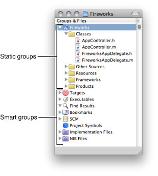
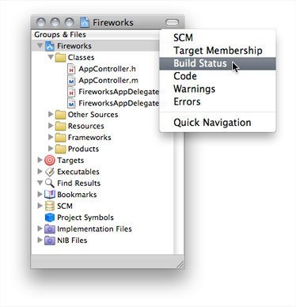

> 导航：[总目录](../../../README.md) · [documentation](../../../_indexes/documentation.md) · [Xcode Workspace Guide](Introduction.md)

[Next](Project%20Organization.md)[Previous](Introduction.md)

# The Project Window

The project window is where you do most of your work in Xcode. The _project window_ displays and organizes your source files, targets, and executables. It allows you to access and edit all the pieces of your project. To work effectively in Xcode, you need to recognize the parts of the project window and understand how to use them to navigate your project’s contents.

Of course, everyone has their own way of organizing their workspace. To help you be as efficient and productive as possible, Xcode provides several project window layouts. A project window layout specifies a particular arrangement for a project window, as well as ancillary task-specific windows.

This chapter introduces project window components and describes the available project window layouts. It also introduces other important Xcode windows and provides tips on using the Xcode interface to locate information on project items.

Figure 1-1 identifies some of the components of the project window using the default layout. You can add, remove, and configure these components to your liking.

__Figure 1-1__  The default project window layout

!

The project window contains the following key areas for navigating your project:

- __Groups & Files list.__ Provides an outline view of your project contents. You can move files and folders around and organize your project contents in this list. The current selection in the Groups & Files list controls the contents displayed in the detail view.
- __Hide Detail View button.__ Double-clicking this button hides and shows the detail view.
- __Detail view.__ Shows the item or items selected in the Groups & Files list. You can browse your project’s contents in the detail view, search them using the search field, or sort them according to column. The detail view helps you rapidly find and access your project’s contents.
- __Toolbar.__ Provides quick access to the most common Xcode commands.
- __Status bar.__ Displays status messages for the project. During an operation—such as building or indexing—Xcode displays a progress indicator in the status bar to show the progress of the current task.
- __Favorites bar.__ Lets you store and quickly return to commonly accessed locations in your project. To display the favorites bar, choose View > Layout menu > Show Favorites Bar. For details about using the favorites bar, see [Adding Items to the Favorites Bar](Project%20Organization.md#apple-f4xwc4dqnrsv64tfmyxwi33df52wszbpkridimbqgazdmnrxfvbecqsejjeuerq).

The project window also contains a text editor pane that lets you edit files directly in the project window. You can navigate through the views in a window, except the text editor pane, by pressing Tab.

For a description of each of the available project window layouts, see [Project Window Layouts](#apple-f4xwc4dqnrsv64tfmyxwi33df52wszbpkridimbqgazdmnrvfvjvoni).

The Groups & Files list provides an outline view of your project’s contents. The contents of your project—files, folders, targets, executables, and other project information—are organized into groups. A _group_ collects related files.

Using the Groups & Files list, you can:

- View your project’s contents, organized hierarchically. You can choose how much of your project’s contents to display at once.
- View the SCM status of files.
- Drag files, folders, groups, and other project items to rearrange and organize them.
- Rename files, folders, and other project items.
- Create additional Groups & Files list views to focus on multiple groups at once.

The Groups & Files list contains two types of groups: _static groups_ and _smart groups_, identified in Figure 1-2.

__Figure 1-2__  Groups & Files list

_Static groups_ organize your project’s source files, including header files, implementation files, frameworks, and other files. (Static groups are themselves grouped under the project group, which is named after the project and is represented by the blue project icon.) A static group, identified by a yellow folder icon, can contain any number of files and other static groups. Static groups help you organize the files in your project into manageable chunks. The project group is a static group that contains all the files, frameworks, libraries, and other resources included in your project.

_Smart groups_ are subdivided into two types: built-in smart groups and custom smart groups.

- Built-in smart groups contain particular classes of components, files, symbols, or items. You cannot customize the contents of these groups. There are several built-in smart groups:

  - __Targets.__ Contains the targets in your project. A _target_ contains the instructions for creating a software component or product. Targets are described in more detail in [Targets](https://developer.apple.com/library/archive/documentation/DeveloperTools/Conceptual/XcodeBuildSystem/100-Targets/bs_targets.html#//apple_ref/doc/uid/TP40002689).
  - __Executables.__ Contains all the executables defined in your project.
  - __Errors and Warnings.__ Lists the errors and warnings generated when you build. This group is described further in Viewing Errors and Warnings.
  - __Find Results.__ Contains the results of any searches you perform in your project. Each search creates an entry in this group. For more information on the Find Results group, see Viewing Search Results.
  - __Bookmarks.__ Lists locations—files or specific locations within a file—to which you can return easily. For more information on the Bookmarks smart group, see [Defining Bookmarks](Project%20Organization.md#apple-f4xwc4dqnrsv64tfmyxwi33df52wszbpkridimbqgazdmnrxfvbeeq2gjbaugsa).
  - __SCM.__ Lists all the files that have source control information. See [Managing Files Under Source Control](../Xcode%20Source%20Management%20Guide/Source%20Control.md#apple-f4xwc4dqnrsv64tfmyxwi33df52wszbpkridimbqgazdmobwfvjvomrs) for details.
  - __Project Symbols.__ Lists the symbols defined in your project. This group is described further in Viewing the Symbols in Your Project.
- Custom smart groups collect files that match a certain rule or pattern. These groups have purple folder icons and you can customize their contents using wildcard patterns or regular expressions. There are two types of smart groups: _simple filter_ or _simple regular expression_. Xcode provides two predefined custom smart groups:

  - __Implementation Files.__ Contains the implementation files in your project, such as those with the extensions `c`, `cpp`, and `m`, to name a few.
  - __NIB Files.__ Contains the nib files used to create your product’s user interface.

For more information on using static groups and smart groups to organize your project items, see [Grouping Files](Project%20Organization.md#apple-f4xwc4dqnrsv64tfmyxwi33df52wszbpkridimbqgazdmnrxfvbegskfifeucsq).

You have a couple of options for viewing the contents of a group in the Groups & Files list. If you prefer the outline view, you can open the group directly in the Groups & Files list. You can also select one or more groups to view their contents in a simple searchable list in the detail view (see [The Detail View](#apple-f4xwc4dqnrsv64tfmyxwi33df52wszbpkridimbqgazdmnrvfvjvomq) for details).

To view or hide the contents of a group in the Groups & Files list, use its disclosure triangle.

To view the contents of a group in the detail view, select the group in the Groups & Files list. In general, the detail view shows more item information than the Groups & Files list.

You can display additional attributes for the items shown in the Groups & Files list using the shortcut menu in the list header (Control-click the header to show the shortcut menu). A column for each attribute appears on the left side of the list.

As described in [Group Types](#apple-f4xwc4dqnrsv64tfmyxwi33df52wszbpkridimbqgazdmnrvfvjvooa), an Xcode project has a number of smart groups that organize particular types of project items. These groups help you find information such as symbols or build errors. However, you may not need to display all the smart groups in the Groups & Files list.

To specify which smart groups the Groups & Files list displays, use the Preferences submenu in the shortcut menu that appears when you Control-click an item in the Groups & Files list.

To rearrange a smart group, drag it to its new position in the Groups & Files list.

To delete a group, select it and choose Edit > Delete. You can restore deleted groups using the Preferences menu described earlier.

In large projects, the Groups & Files list can get long, making it difficult to move items around. You can split the Groups & Files view for a project by clicking the Split button, shown in Figure 1-3.

Each Groups & Files view can display a different area of the Groups & Files list, making it easy to keep frequently accessed groups handy or to move items between groups. You can drag the resize control between the views to redistribute the space between them. To remove a Groups & Files view, click the Close Split button.

By default Xcode splits the view vertically. However, you can also split a view horizontally. To split a view horizontally, hold down the Option key while clicking the Split button.

__Figure 1-3__  Split Groups & Files view

!

As you learned, the Groups & Files view lets you see the contents of your project in an organized outline. In contrast, the detail view shows you items in a flat list. You can quickly search and sort the items in this list, gaining rapid access to important information in your project.

You control the scope of the information shown in the detail view with your selection in the Groups & Files list. If the selected item is a group, the detail view displays information for all the members of that group and of any subgroups that it contains. You can select multiple items in the Groups & Files list; the detail view displays the selected items and their members.

The type of information displayed in the detail view varies, depending on the item selected in the Groups & Files list. For example, if you select a group of source files in the Groups & Files list, the detail view displays each of the files in that group, along with information about those files, such as the file’s build status or code size. However, build status and code size make no sense for errors and warnings, so when you select the Errors and Warnings group, you see a list of error and warning messages and the locations at which they occur.

__Figure 1-4__  Detail view columns

!

This is the information available in the detail view:

- __File kind.__ The first column, with an empty column heading, shows an icon indicating the type of the file. For example, a nib file is marked by the Interface Builder file icon. The icon for a C++ class file displays the characters “C++”.
- __File Name.__ The File Name column displays the names of the files.
- __Build status.__ The column marked by the hammer icon displays the build status of each file. If a file has been changed since the active target was last built, this column displays a checkmark, indicating that the file needs to be built. If the file is up to date, this column is empty.
- __Code.__ The Code column displays the size of the compiled code generated from the file.
- __Build errors.__ The column marked by the error icon displays the number of errors in the file. If this column is empty, the file either contains no errors or has not yet been built.
- __Warnings.__ The column marked by the warning icon displays the number of warnings for the file. If this column is empty, the file either has no warnings or has not yet been built.
- __Target membership.__ The column marked by the target icon indicates whether the file is included in the active target. If the checkbox next to a file is checked, then the active target includes that file.
- __SCM.__ The SCM column shows the SCM status of the file.
- __Path.__ The Path column shows the file system path to the item.
- __Comments.__ The Comments column displays any note or other information that you have associated with the file in the Comments pane of the File Info window.

Not all of these columns are visible by default. You can choose which columns are shown in the detail view by using the shortcut menu that appears when you Control-click anywhere in the header. You can display many of these same columns in the Groups & Files list, using the same mechanism. For more information, see [The Groups & Files List](#apple-f4xwc4dqnrsv64tfmyxwi33df52wszbpkridimbqgazdmnrvfvjvomjs) and [The Detail View](#apple-f4xwc4dqnrsv64tfmyxwi33df52wszbpkridimbqgazdmnrvfvjvomq).

You can display the columns of the detail view in any order. To reorder the columns, drag the heading of any column to its new position.

You can also reveal the selected item in the detail view in the Groups & Files list. For example, if the current selection in the detail view is an individual source file, Xcode selects that file in the Groups & Files list, disclosing the contents of any static groups that the file belongs to, as necessary. To reveal the detail view selection in the Groups & Files list, choose View > Reveal in Group Tree.

With the detail view you have a couple of ways to find and view information. You can sort the contents of the detail view according to the information in any of the visible categories simply by clicking the column heading for that category. For example, to sort by filename, click the File Name heading.

Using the search field in the toolbar, you can quickly search the contents of the detail view. As you type, Xcode filters the contents of the detail view, displaying only those items that have matching text in at least one of the columns.

The search field supports several types of search; you can choose the search type from the pop-up menu in the search field. Xcode supports the following searches:

- __String Matching.__ Xcode determines a match using simple string comparison, filtering out items that do not match the string in the search field. This is the default type of search for the search field. It is also the fastest.
- __Wildcard Pattern.__ Xcode uses the wildcard pattern in the search field to find items that contain the specified characters anywhere in any of the visible columns. For example, enter `*View*.h` to find all header files with “View” in their name.
- __Regular Expression.__ Xcode uses the regular expression in the search field to find matching items. For example, to find all C implementation and header files in a static group, enter `\.(c|h)$`

Figure 1-5 shows an example of a sting matching search.

__Figure 1-5__  Searching for files with “delegate” in their name

!!

As you type, the status bar displays the scope of the search—the current selection in the Groups & Files list—and the number of items found. Pressing the Home key or choosing the project item (indicated by the project icon) from the search field’s pop-up menu changes the focus of the search field to the whole project.

The project window toolbar gives you quick access to the most common Xcode commands. Figure 1-6 shows the project window toolbar in the default layout (for more on project window layouts, see [Project Window Layouts](#apple-f4xwc4dqnrsv64tfmyxwi33df52wszbpkridimbqgazdmnrvfvjvoni)).

__Figure 1-6__  Project window toolbar

!!

- __Overview pop-up menu.__ The Overview menu provides a set of build factors that specify how to perform the next build process. This menu lets you specify the active configuration, active executable, and active architecture. For detailed information about these factors, see [Setting Build Factors](../Xcode%20Project%20Management%20Guide/Building%20Products.md#apple-f4xwc4dqnrsv64tfmyxwi33df52wszbpkridimbqgazdmojtfvjvoni).
- __Action pop-up menu.__ The Action button lets you perform common operations on the currently selected item in the project window. The actions available from this menu are those appropriate for the selected item; they are the same actions available in the shortcut menu that appears when you Control-click the selected item. For example, when the current selection is a file, available operations include opening the file in a separate editor, performing source control operations, and grouping files.
- __Build and Run button.__ The Build and Run button builds your product and runs it (breakpoints off) or debugs it (breakpoints on). Whether Xcode runs or debugs your product depends on the state of the Breakpoints button (holding down Option also toggles the button’s action). When breakpoints are off, the button’s label is Build and Debug.
- __Breakpoints button.__ The Breakpoints buttons toggles breakpoints on and off.
- __Tasks button.__ The Tasks button allows you to stop any Xcode operation currently in progress. The badge in the bottom-right corner of the Tasks button indicates the operation that is stopped when you click the button. If more than one operation is in progress, the Tasks button lets you select the one to stop from its pop-up menu. For example, if you have both a build and a search running, you can stop either operation by choosing it from the pop-up menu.
- __Info button.__ The Info button brings up an Info window for the selected item or items. Info windows let you view and set various details of the selected item. See [The Inspector and Info Windows](#apple-f4xwc4dqnrsv64tfmyxwi33df52wszbpkridimbqgazdmnrvfvjvomzy) for more information.
- __Search field.__ The search field allows you to search the items currently displayed in the detail view. As you type, Xcode filters the list of items in the detail view to include only those items with matching content in one of the visible columns. See [The Detail View](#apple-f4xwc4dqnrsv64tfmyxwi33df52wszbpkridimbqgazdmnrvfvjvomq) for more information on using the search field to find items in the detail view.

You can customize the project window toolbar by choosing View > Customize Toolbar and dragging toolbar items into or out of the toolbar to get the set that is most useful to you.

The project window _status bar_ shows the progress of the current operation in Xcode. It gives you feedback during potentially lengthy tasks, such as building, and also displays the results of those tasks. In particular, the status bar lets you quickly access important information about project operations. From the status bar, you can:

- Click the progress indicator during an operation to open a more detailed account of the currently running operations in the Activity Viewer window, described in [Viewing the Progress of Tasks in Xcode](#apple-f4xwc4dqnrsv64tfmyxwi33df52wszbpkridimbqgazdmnrvfvjvomjq).
- Click the build result message, or error or warning icon, to open the Build Results window and view build system commands and output. For more information on the ways in which Xcode displays the status of build operations, see Viewing Build Status.

There are many factors affecting the optimal workspace arrangement for you. Ask yourself questions such as the following: How much screen real estate do I have? What do I spend most of my time working on? How many projects do I normally have open at once?

Configuring your working environment to allow you to be as productive as possible is critical. Whatever your preferred workflow, Xcode provides several project window layouts for you to choose from. Xcode defines the following layouts:

- __Default.__ This configuration provides the traditional Xcode project window arrangement, shown in [Figure 1-1](#apple-f4xwc4dqnrsv64tfmyxwi33df52wszbpkridimbqgazdmnrvfvjvomrs). The default layout combines outline and detail views to let you quickly navigate your project.
- __Condensed.__ This layout provides a smaller, simpler project window with an outline view of your project contents and separate windows for common tasks, such as debugging and building.
- __All-in-one.__ This layout provides a single project window that lets you perform all the tasks typical of software development—such as debugging, viewing build results, searching, and so forth—within a single window.

You set the window layout for your environment in the General pane in Xcode preferences. From the Layout menu, choose the Default, Condensed, or All-In-One layouts. Selecting a layout from this menu shows a brief description of the layout below the menu. Note that you cannot change the project window layout when any projects are open; you must first close all open projects. The project window layout is a user-specific setting; it applies to all projects that you open on your computer.

This section describes each project window layout and the differences between them.

The default project window layout, shown in [Figure 1-1](#apple-f4xwc4dqnrsv64tfmyxwi33df52wszbpkridimbqgazdmnrvfvjvomrs), contains three main views:

- _Groups & Files view._ Contains a list your project contents, as described in [The Groups & Files List](#apple-f4xwc4dqnrsv64tfmyxwi33df52wszbpkridimbqgazdmnrvfvjvomjs).
- __Detail view.__ Shows a flat list of the items selected in the Groups & Files list, as described in [The Detail View](#apple-f4xwc4dqnrsv64tfmyxwi33df52wszbpkridimbqgazdmnrvfvjvomq). In the default layout, you can hide the detail view by collapsing the project window. To hide the detail view, double-click the  button in the Groups & Files view. Double-clicking the button a second time shows the detail view again.

  In addition, you can customize the project window toolbar shown in each of these states. To do so, collapse or expand the project window to the appropriate state and customize the toolbar in the usual way, described in [The Project Window Toolbar](#apple-f4xwc4dqnrsv64tfmyxwi33df52wszbpkridimbqgazdmnrvfvjvomjt). Xcode stores the contents of the toolbar for each state separately.
- __Text editor pane.__ In the default layout, you can choose to view and edit all files within the project window, using the text editor pane. Or, you can choose to have Xcode use a separate editor window and use only the Groups & Files list and the detail view in the project window.

Although you can accomplish most of your daily development tasks in the project window, Xcode also provides a number of other task-specific windows that let you focus on a particular part of the development process. Table 1-1 shows the separate windows available in the default layout.

__Table 1-1__  Additional windows available with the default project window layout

| Window | Use to |
| Build Results | View the build system output generated when you build a target. |
| Debugger | Debug your program; you can control execution of your code; view threads, stack frames and variables; and so forth. |
| SCM | View the status of files under source control. |
| Project Find | Search for text, symbol definitions, and regular expressions in your project. |
| Console | View information or messages logged by your program when running in Xcode and interact with the debugger on the command line and see debugger commands and output. |
| Class Browser | View the class hierarchy of your project and browse classes and class members. |
| Breakpoints | View and edit all breakpoints set in your project. |
| Bookmarks | View your project’s bookmarked locations in a dedicated window. |

The condensed layout provides a smaller, more compact version of the project window, shown in Figure 1-7. In this layout, the project window contains several panes, each showing a subset of the items in your project in the Groups & Files list. You can switch between these panes using the buttons below the toolbar.

__Figure 1-7__  The condensed project window

!!

The condensed project window layout contains three panes:

- __Files__ shows your project and all the static groups in your project.
- __Targets__ shows the targets and executables defined in your project.
- __Other__ shows the remaining smart groups. This includes the standard smart groups defined by Xcode, as well as any smart groups you have added to the project.

You can jump to any of the built-in smart groups, opening the appropriate pane if necessary, by choosing an item from the Smart Groups submenu of the View menu.

The condensed layout provides the same additional windows as the Default layout, listed in [Table 1-1](#apple-f4xwc4dqnrsv64tfmyxwi33df52wszbpkridimbqgazdmnrvfvjvomju). The condensed layout also includes the additional windows shown in Table 1-2.

__Table 1-2__  Additional windows available with the condensed project window layout

| Window | Use to |
| Editor | Edit project files. Although each of the available layouts let you open files in a separate editor window, the condensed project window is the only one that does not include an attached editor; when you open a file from the project window, Xcode opens a new editor window. |
| Detail | View and search your project’s contents in a simple list. The condensed layout does not include a detail view in the project window; however, by choosing View > Detail, you can open a separate Detail window that includes a Groups & Files list on the left side of the window and a detail view on the right side. |

The all-in-one project window layout provides a single project window in which you can perform all the tasks necessary for software development. In this layout, you can edit files, view project items in an outline view or detail view, view build system output, run and debug your executable, search, and more. The all-in-one layout provides two views, or _pages_. To switch between pages, use the Page toolbar item, shown in [Figure 1-8](#apple-f4xwc4dqnrsv64tfmyxwi33df52wszbpkridimbqgazdmnrvfvjvomjw). The available pages are:

- __Project.__ This page lets you perform general project management tasks, such as searching, sorting and viewing SCM status. To display the project page, click the Project Page button.
- __Debug.__ This page includes an integrated debugger view, similar to the standalone debugger window available with the other layouts. To display the debug page, click the debug-page button.

In the all-in-one layout the project window has a page-specific toolbar, which contains items specific to the development tasks performed in that page.

The project page, shown in Figure 1-8, lets you perform typical project management tasks. You can view the contents of your project in outline view, search for project items in the detail view, perform a projectwide find, and view status for the files under source control in your project.

__Figure 1-8__  The all-in-one project window

!!

The project page contains the Groups & Files list, which shows the contents of your project in outline view; a text editor pane, which lets you edit source files right in the project window; and a tabbed view, which lets you switch between several panes, each of which provides an interface for a common project management task. These panes are:

- __Detail.__ This pane includes the detail view, which lets you view additional information about project items selected in the Group & Files list or quickly filter project items. The detail view is described in [The Detail View](#apple-f4xwc4dqnrsv64tfmyxwi33df52wszbpkridimbqgazdmnrvfvjvomq).
- __Project Find.__ This pane lets you perform projectwide searches and view search results. The interface is the same as that provided by the Project Find window in other layouts.
- __SCM Results.__ This pane opens a dedicated view displaying only those project items under source control and their status. It is similar to what you see in the SCM window with other layouts.
- __Build.__ This pane provides an interface for common build tasks. It lets you see the progress of your build, view errors and warnings, and see the console log.

The all-in-one layout is designed to let you perform project management tasks in the project window; it does, however, include a few additional windows, listed in Table 1-3. These windows let you view content already available from the project window in a separate window, should you choose to do so.

__Table 1-3__  Additional windows available with the all-in-one layout

| Window | Use to |
| Class Browser | View the class hierarchy of your project and browse classes and class members. |
| Breakpoints | View and edit all breakpoints set in your project. |
| Bookmarks | View your project’s bookmarked locations in a dedicated window. |
| Project Find | Perform a projectwide search and view search results in a separate window. This window shows the same information as the Project Find pane of the project page. |
| SCM | View the status of files under source control in your project. This window contains the same information as the SCM pane of the project page. |

The project window layouts give you the flexibility to choose the arrangement that best suits your preferred workflow. You can further customize your work environment by saving the changes that you make to the windows in an open project and applying them to all projects using that layout.

For example, in the condensed layout the project window has three panes, each of them focused on a particular subset of a project’s groups. The Files pane shows only the project group, which contains all files and folders in the project. The Other pane shows all smart groups. If you want access to both your project files and your bookmarked locations in the same pane, you could add the Bookmarks smart group to the Files pane by dragging it from the Other pane to the Files button and then the Files pane.

To save this change, and have the Bookmarks smart group appear in the Files pane for all projects using the condensed layout, choose Window > Defaults.

In the dialog that Xcode displays, click Make Layout Default to save your changes to the current layout. Clicking Restore To Factory Default discards all of your changes—both current changes and those you’ve previously saved—to the current layout. Xcode restores the original configuration settings for the layout.

You can save changes to:

- Window size and position
- Visibility of views—whether they are hidden or revealed—in a window
- Contents and visibility of Groups & Files panes (condensed layout)
- The default set of toolbar items

The “Save window state” option in General preferences saves the state of the open windows for each project when you close that project. However, when you choose Window > Defaults, you save layout details that apply to all projects when you open them using the modified layout.

Knowing how to use Xcode’s user interface to find and view project items and information is essential to working efficiently in Xcode. Xcode gives you a number of ways to find and access project contents. In previous sections, you learned how to use the Groups & Files list to see an organized outline view of your project and how to use the detail view to quickly filter project contents. Using these tools, you can view as wide or as narrow a cross-section of your project as you choose.

These tools, however, aren’t as useful when you wish to view or modify individual items in your project. For this, Xcode provides inspector and Info windows. These windows are for managing the selected item’s essential details. For any particular item in your project, its Info window and the inspector display the same information. However, the two windows behave differently.

The amount of information visible in the status bar is limited and it reflects only operations in the current project. To let you view a more detailed account of all operations in Xcode, Xcode provides the Activity Viewer window (see [Viewing the Progress of Tasks in Xcode](#apple-f4xwc4dqnrsv64tfmyxwi33df52wszbpkridimbqgazdmnrvfvjvomjq)).

The inspector tracks the current selection in the project window. As you select different files, targets, and groups in the project window, the inspector changes to show information about that item.

The Info window continues to display information about the items that were selected in the project window when you opened it, regardless of the current selection. You can have multiple Info windows open at a time, each describing a different set of items of your project.

The Info button in the project window toolbar displays an Info window for the currently selected item. You can add an Inspector button to the toolbar.

You can also use menu commands (or their keyboard shortcuts) to display Info windows or the inspector window. Choose File > Get Info to display an Info window. Hold down the Option key and choose File > Show Inspector to display the inspector.

Xcode provides Info windows and inspectors for the following project items:

- File and folder references
- User-defined smart groups
- Localized file variants
- Targets
- Executable environments
- Build phases
- The project itself

The type of information displayed depends on the type of item you are editing. Specific Info windows are described in more detail where the items that they modify—files, targets, projects, groups, and so forth—are discussed. In general, however, if you are at a loss as to how to make a change to a basic project item, try displaying its Info window. Throughout this document, wherever the inspector window is used, remember that you can also use an Info window, and vice versa.

The Activity Viewer window lets you watch the tasks currently in progress in Xcode. While the Tasks button in the project window toolbar lets you control the progress of tasks in the current project (such as a program launched by Xcode in order to debug it), the Activity Viewer lets you see the progress of all Xcode tasks across all open projects. The Activity Viewer provides a single, persistent window that you can leave open to monitor the progress of all running tasks. To open the Activity Window, shown in Figure 1-9, choose Window > Activity Viewer.

You can also click the progress indicator in the project window status bar.

__Figure 1-9__  Activity Viewer window

!

The operations in the Activity Viewer are grouped by project; you can show or hide the operations specific to any project using the disclosure triangle next to the project name. To stop any of the tasks shown in the Activity Viewer, simply click the stop sign icon next to that task. You can cancel the most recently initiated operation in the active project by pressing Command–period.

[Next](Project%20Organization.md)[Previous](Introduction.md)

